# KooshaPari Ecosystem Map

> Generated: 2026-05-30 | Repos audited: 111 | Workers: 3 parallel manifest-fetch agents (A: pheno\*, B: \*Kit+helios\*+agents, C: infra+apps+routing+forks+landing)

---

## Index Authority & Staleness

This file (`ECOSYSTEM_MAP.md`) is the **canonical live ecosystem index** — the authoritative answer to *what repos exist and how they connect*. When another index disagrees with this one about repo roles or dependencies, this file wins.

Role split for the spec/governance spine (so indexes stop competing):

| Repo | Role |
|------|------|
| **phenotype-registry** (this repo) | **INDEX** — canonical ecosystem map + dependency graph |
| **PhenoSpecs** | ADRs, API contracts, specs |
| **PhenoHandbook** | conventions / patterns |
| **phenotype-org-governance** | enforcement (reusable policy workflows + deny.toml baseline) |

**Known stale sibling index:** `PhenoSpecs/registry.yaml` is a spec↔implementation traceability index, **last updated 2026-04-04**, and still uses an older `PhenoKit/AuthKit/DataKit` workspace taxonomy that no longer matches the role classification below. Treat it as the traceability map only, not the ecosystem index, and refresh it against this file.

**Regeneration:** this map is regenerated by manifest-fetch agents (see the generation header above). Re-run that pass when repo roles/dependencies shift materially, and bump the `Generated:` date.

---

## 1. Role Classification (111 repos)

| Role | Count | Repos |
|------|-------|-------|
| **shared-lib** | 22 | pheno, HexaKit, phenoShared, phenoUtils, phenoXddLib, Authvault, Stashly, Settly, Tasken, Traceon, Metron, Apisync, PhenoObservability, PhenoPlugins, phenoForge, FocalPoint, PhenoVCS, Benchora, phenotype-auth-ts, phenotype-journeys, phenotype-voxel, Compound-Spheres-3D |
| **SDK** | 9 | AuthKit, DataKit, McpKit, ObservabilityKit, ResilienceKit, TestingKit, PlatformKit, PhenoKits, HexaKit |
| **tooling** | 14 | AgilePlus, phenotype-dep-guard, phenotype-tooling, phenotype-infra, PhenoDevOps, BytePort, FocalPoint, Conft, phenoForge, worktree-manager, agent-devops-setups, PolicyStack, nanovms, helioscope |
| **product / app** | 10 | Agentora, thegent, Tracera, AgilePlus, PlayCua, Dino, eyetracker, hwLedger, phenoRouterMonitor, slickport |
| **plugin** | 5 | PhenoPlugins, dinoforge-packs, argis-extensions, phenotype-postfx, Tokn |
| **docs** | 8 | PhenoSpecs, phenotype-registry, PhenoHandbook, phenodocs, phenoXdd, PhenoDesign, phenotype-hub (scaffold), LIBRARY_RESEARCH_REGISTRY |
| **landing** | 9 | agileplus-landing, byteport-landing, hwledger-landing, odin-landing\*, phenokits-landing, projects-landing, thegent-landing, AppGen (template) |
| **fork** | 15 | agentapi-plusplus, bifrost, cliproxyapi-plusplus, DINOForge-UnityDoorstop, forgecode, helios-cli, HeliosLab, MCPForge, OmniRoute, phenotype-omlx, phenotype-ops-mcp, Planify, portage, vibeproxy, WorldSphereMod |
| **stub / scaffold** | 6 | phenotype-hub, vibeproxy-monitoring-unified, PhenoProject, PhenoProc, phenoStandards (deprecated), Zerokit |
| **superseded / archived** | 8 | .github, odin-landing, Profila, Project-Spyn, RIP-Fitness-App, sharecli, tehgent, thegent-sharecli |
| **monorepo (multi-domain)** | 7 | pheno, phenoAI, phenoData, PhenoDevOps, BytePort, HexaKit, phenoShared |
| **agent-runtime** | 4 | Agentora, thegent, PhenoAgent, PhenoProc |
| **research / lab** | 2 | HeliosLab, portage |

\* archived

---

## 2. Dependency Edges (Adjacency List)

Notation: `A -> B` means A depends on B. Only cross-repo edges to other KooshaPari repos are shown. Internal workspace path-deps are listed as `(workspace crate)`.

```text
phenotype-infra           -> (standalone IaC/spec, no code deps)
phenotype-registry        -> PhenoSpecs, HexaKit, PhenoHandbook  [doc links]
PhenoObservability        -> pheno (phenotype-errors), [phenotype-bus: local path]
PhenoProc (infrakit)      -> pheno (phenotype-error-core, phenotype-core, phenotype-contracts,
                              phenotype-config-core, phenotype-event-bus,
                              phenotype-http-client-core, phenotype-policy-engine,
                              phenotype-port-traits, phenotype-time, phenotype-validation,
                              phenotype-state-machine, phenotype-cache-adapter,
                              phenotype-string, phenotype-async-traits, phenotype-retry,
                              phenotype-health, phenotype-telemetry)
HexaKit                   -> (self-contained: all phenotype-* crates are internal workspace members)
phenoShared               -> (workspace; exposes @phenotype/shared-utils npm + Rust crates)
phenodocs                 -> @phenotype/docs (phenoShared)
phenoDesign               -> @phenotype/docs (phenoShared)
cliproxyapi-plusplus      -> phenotype-go-auth (vendored ./third_party)
phenotype-journeys        -> (standalone: phenotype-journey-core, phenotype-journey bin)
helios-cli (fork)         -> codex-monorepo [upstream origin]
helioscope                -> codex-monorepo [upstream origin], helios-router-ui (Python)
HeliosLab                 -> pheno-core, pheno-db, pheno-crypto, pheno-cli (internal ws)
phenoRouterMonitor        -> pheno (phenotype-error-core, phenotype-errors,
                              phenotype-port-traits, phenotype-state-machine,
                              phenotype-config-core, phenotype-cache-adapter,
                              phenotype-event-sourcing, phenotype-contracts,
                              phenotype-core, phenotype-health, phenotype-async-traits,
                              phenotype-validation)
Agentora                  -> (self-contained Rust workspace: agentkit)
thegent                   -> (Python; no KooshaPari cross-deps detected)
PhenoAgent                -> (empty/stub manifest; extracted from phenotype-infra)
Dino                      -> DINOForge-UnityDoorstop (Unity doorstop), dinoforge-packs
AgilePlus                 -> (workspace: agileplus-config, agileplus-proto)
PhenoMCP                  -> (Rust bin + Go module; go: github.com/KooshaPari/PhenoMCP/go)
phenoAI                   -> (workspace: llm-router, mcp-server, pheno-embedding)
phenoData                 -> (workspace: surreal-bridge, pg-bridge, pheno-query)
Tokn                      -> (workspace: pareto-rs, tokenledger)
```

### Mermaid Dependency Graph

```mermaid
graph TD
    pheno["pheno (shared crates monorepo)"]
    HexaKit["HexaKit (infra toolkit)"]
    PhenoProc["PhenoProc (infrakit)"]
    PhenoObservability["PhenoObservability"]
    phenoRouterMonitor["phenoRouterMonitor"]
    phenoShared["phenoShared"]
    phenodocs["phenodocs"]
    phenoDesign["phenoDesign"]
    cliproxyapi["cliproxyapi-plusplus"]
    PhenoMCP["PhenoMCP"]
    phenotype_registry["phenotype-registry"]
    PhenoSpecs["PhenoSpecs"]
    PhenoHandbook["PhenoHandbook"]
    HeliosLab["HeliosLab"]
    phenoAI["phenoAI"]
    phenoData["phenoData"]
    Dino["Dino"]
    DINOForge_ud["DINOForge-UnityDoorstop"]
    dinoforge_packs["dinoforge-packs"]
    Agentora["Agentora"]
    thegent["thegent"]
    AgilePlus["AgilePlus"]
    Tokn["Tokn"]

    PhenoProc --> pheno
    PhenoObservability --> pheno
    phenoRouterMonitor --> pheno
    pheno -.-> HexaKit
    phenodocs --> phenoShared
    phenoDesign --> phenoShared
    phenotype_registry --> PhenoSpecs
    phenotype_registry --> HexaKit
    phenotype_registry --> PhenoHandbook
    Dino --> DINOForge_ud
    Dino --> dinoforge_packs
    cliproxyapi -.-> phenoShared
```



---

## 3. Duplication Clusters

### Cluster A — LLM Routing (6 repos)

| Repo | Status | Verdict |
|------|--------|---------|
| **phenoAI** (llm-router crate) | Active, Rust workspace | **CANONICAL** — keep, mature workspace |
| phenoRouterMonitor | Active, Rust + Streamlit | Merge routing logic into phenoAI; keep dashboard UI as phenoAI/monitoring |
| OmniRoute | Fork (upstream), TS | Archive — upstream-maintained; phenoAI supersedes |
| bifrost | Fork (upstream), Go | Archive — upstream-maintained; use as vendored gateway only |
| cliproxyapi-plusplus | Fork, Go | Superseded by phenoAI/bifrost; archive when vibeproxy retired |
| helioscope / helios-cli | Forks of codex-monorepo | Keep as tooling entry-point; deduplicate into single helios repo |

### Cluster B — Agent Runtimes (5 repos)

| Repo | Status | Verdict |
|------|--------|---------|
| **Agentora** | Active, Rust, hexagonal-arch | **CANONICAL** — full skill/tool/memory/event system |
| thegent | Active, Python | Keep as Python runtime facade (separate language target) |
| PhenoAgent | Stub (empty manifest) | Merge stub into Agentora; retire repo |
| tehgent | Archived | Already retired |
| thegent-sharecli | Archived | Already retired |

### Cluster C — Resilience / Circuit-Breakers (4 repos)

| Repo | Status | Verdict |
|------|--------|---------|
| **pheno** (phenotype-retry crate) | Active workspace crate | **CANONICAL** — already inside HexaKit/pheno |
| ResilienceKit | Active, Python SDK | Keep as Python wrapper over canonical Rust core |
| Stashly | Active, Rust | Keep as standalone caching lib (different domain: cache ≠ resilience) |
| phenotype-dep-guard | Active, Python | Different domain (supply chain), not resilience — reclassify as tooling |

### Cluster D — Observability / Metrics (5 repos)

| Repo | Status | Verdict |
|------|--------|---------|
| **PhenoObservability** | Active, Rust workspace | **CANONICAL** |
| ObservabilityKit | Active, Python SDK | Keep as Python facade |
| Metron | Active, Rust (metrickit) | Merge into PhenoObservability as metrics crate |
| Traceon | Active, Rust (tracingkit) | Merge into PhenoObservability as tracing crate |
| Profila | Archived | Already retired |

### Cluster E — Auth (3 repos)

| Repo | Status | Verdict |
|------|--------|---------|
| **Authvault** | Active, Rust (OAuth2/JWT/RBAC) | **CANONICAL** |
| AuthKit | Active, Python SDK | Keep as Python facade |
| phenotype-auth-ts | Active, TS (OAuth2/OIDC) | Keep as TS facade; merge into phenoShared's TS layer |

### Cluster F — Shared Crate Monorepos (CRITICAL: 5 competing homes)

| Repo | Crates contained | Verdict |
|------|-----------------|---------|
| **HexaKit** | 30+ phenotype-* crates (canonical infra toolkit per description) | **CANONICAL HOME** |
| pheno | 21 workspace members, overlapping crate names with HexaKit | **DUPLICATE** — merge into HexaKit, retire pheno |
| phenoShared | Rust crates + @phenotype/shared-utils npm | Merge Rust side into HexaKit; keep npm package as phenoShared/npm |
| PhenoProc | 20 path-deps to phenotype-* crates (local copies!) | **DUPLICATE** — remove local copies, depend on HexaKit |
| phenoRouterMonitor | 15 path-deps to phenotype-* crates (local copies!) | **DUPLICATE** — remove local copies, depend on HexaKit |

### Cluster G — Spec / Docs Registries (4 repos)

| Repo | Verdict |
|------|---------|
| **phenotype-registry** | CANONICAL master index (links PhenoSpecs + HexaKit + PhenoHandbook) |
| PhenoSpecs | Keep (spec content); surface via phenotype-registry index |
| PhenoHandbook | Keep (pattern docs); surface via phenotype-registry index |
| phenoStandards | **DEPRECATED** (self-marked); already pointing to HexaKit/governance — retire |

### Cluster H — Config / Settings (3 repos)

| Repo | Verdict |
|------|---------|
| **Settly** | CANONICAL (Rust, layered configs, validation) |
| Conft | TypeScript config workspace — keep as TS facade |
| pheno/phenotype-config-core crate | Merge into Settly as Rust workspace crate |

### Cluster I — *Kit SDKs (8 repos: too many thin wrappers)

All thin Python/Go wrappers around Rust canonical cores. Target: consolidate Python SDKs into `phenotype-python-sdk`; Go SDKs into `phenotype-go-sdk`.

| Repo | Status | Verdict |
|------|--------|---------|
| AuthKit | Active, Python SDK | Merge into phenotype-python-sdk/auth |
| DataKit | Active, Python SDK | Merge into phenotype-python-sdk/data |
| McpKit | Active, Python SDK | Merge into phenotype-python-sdk/mcp |
| ObservabilityKit | Active, Python SDK | Merge into phenotype-python-sdk/observability |
| ResilienceKit | Active, Python SDK | Merge into phenotype-python-sdk/resilience |
| TestingKit | Active, Python SDK | Merge into phenotype-python-sdk/testing |
| PlatformKit | Active, Go tooling | Merge into phenotype-go-sdk/platform |
| PhenoKits | Active, Python collection | Merge into phenotype-python-sdk as package index |

### Cluster J — Helios* (5 repos)

All either forks of codex-monorepo or helios-specific tooling.

| Repo | Status | Verdict |
|------|--------|---------|
| **helios-cli** | Active, Rust fork of codex-monorepo | **CANONICAL** — keep as single codex-fork entry point |
| helioscope | Active, Rust fork of codex-monorepo | Retire — overlaps helios-cli; same upstream |
| heliosApp | Active, TypeScript | Merge into phenotype-tooling dashboard subdir |
| heliosBench | Active, Python benchmarks | Merge into phenotype-tooling benchmarks |
| HeliosLab | Active, Rust/TS research fork | Keep as research lab (distinct from helios-cli) |

### Cluster K — Landing Pages (8 repos)

All Astro static sites with near-identical structure. Target: consolidate into single `phenotype-landing` Astro monorepo.

| Repo | Status | Verdict |
|------|--------|---------|
| agileplus-landing | Active, Astro | Merge into phenotype-landing/packages/agileplus |
| byteport-landing | Active, Astro | Merge into phenotype-landing/packages/byteport |
| hwledger-landing | Active, Astro | Merge into phenotype-landing/packages/hwledger |
| odin-landing | Archived | Skip (archived) |
| phenokits-landing | Active, Astro | Merge into phenotype-landing/packages/phenokits |
| projects-landing | Active, Astro | Merge into phenotype-landing/packages/projects (auto-gen portfolio) |
| thegent-landing | Active, Astro | Merge into phenotype-landing/packages/thegent |
| AppGen | Active, template | Extract as phenotype-landing scaffold template |

---

## 4. Component / Plugin Extraction Candidates

These sub-projects live INSIDE repos but are reusable enough to extract or merge into a shared home:

| # | Sub-project | Currently in | Extract to |
|---|-------------|-------------|------------|
| 1 | `phenotype-retry` + `phenotype-cache-adapter` crates | pheno / HexaKit (duplicate) | HexaKit only |
| 2 | `llm-router` crate | phenoAI | phenoAI/crates/llm-router (already there) — expose as standalone crate publish |
| 3 | `pareto-rs` crate | Tokn | phenotype-tooling (analytics util; unrelated to token-ledger) |
| 4 | `focus-policy` + `phenotype-casbin-wrapper` | FocalPoint / HexaKit (duplicate) | HexaKit/policy module |
| 5 | `phenotype-bdd` crate | HexaKit | phenoXddLib (xDD test utilities is its home) |
| 6 | `forge_*` crates (forgecode fork) | forgecode | Consider upstreaming or extracting forge_embed as standalone |
| 7 | Monitoring dashboard (Streamlit) | phenoRouterMonitor | phenoAI/dashboard |
| 8 | `phenotype-mcp` crate | HexaKit | PhenoMCP (already has both Rust + Go; unify there) |

---

## 5. Rationalization Proposal

### Current state: 111 repos → Target shape: ~45 canonical repos

#### Retirements / Merges (saves ~40 repos)

| Action | Repos affected | Notes |
|--------|---------------|-------|
| **Archive forks with no local modifications** | OmniRoute, Planify, portage, phenotype-omlx, phenotype-ops-mcp, agentapi-plusplus | All upstream-maintained; no meaningful local changes |
| **Merge pheno → HexaKit** | pheno | 21 crates overlap; HexaKit is the canonical infrakit; retire pheno |
| **Merge PhenoAgent stub → Agentora** | PhenoAgent | Empty manifest; description says "extracted from phenotype-infra" |
| **Merge Metron + Traceon → PhenoObservability** | Metron, Traceon | Both thin Rust wrappers; PhenoObservability is the workspace home |
| **Consolidate 8 *Kit Python SDKs → phenotype-python-sdk** | AuthKit, DataKit, McpKit, ObservabilityKit, ResilienceKit, TestingKit + PlatformKit (Go) | One publish target per language |
| **Merge phenoRouterMonitor Rust core → phenoAI** | phenoRouterMonitor | Keep Streamlit dashboard as phenoAI/monitoring subdir |
| **Retire phenoStandards** | phenoStandards | Self-marked deprecated; content moved to HexaKit/governance |
| **Merge worktree-manager → phenotype-tooling** | worktree-manager | Topic: deprecated; 1 binary fits in tooling workspace |
| **Merge heliosBench, heliosApp → phenotype-tooling** | heliosBench, heliosApp | Benchmarking and dashboard tooling |
| **Retire helioscope** | helioscope | Overlaps helios-cli (both are codex-monorepo forks) |
| **Consolidate 8 landing pages → phenotype-landing** | all *-landing repos | Astro monorepo with sub-packages |
| **Retire vibeproxy-monitoring-unified** | vibeproxy-monitoring-unified | Pure governance stub; no implementation; vibeproxy itself deprecated |
| **Merge phenotype-hub → phenotype-infra** | phenotype-hub | "Scaffolding only" — governance docs belong in infra |
| **Consolidate phenoShared npm → phenodocs** | phenoShared (npm layer) | Already depended upon via @phenotype/docs |

#### Canonical Target Repo Set (~45)

```text
GOVERNANCE / SPEC / DOCS (5)
  phenotype-infra          — IaC, ADRs, runbooks, governance
  phenotype-registry       — master index
  PhenoSpecs               — spec content
  PhenoHandbook            — patterns
  phenodocs                — VitePress docs system

SHARED CRATES (3)
  HexaKit                  — canonical Rust phenotype-* crates (~30+ members)
  phenotype-python-sdk     — consolidated Python SDK (was 6+ *Kit repos)
  phenotype-go-sdk         — consolidated Go SDK (PlatformKit + McpKit Go)

LANGUAGE-SPECIFIC FACADES (3)
  phenotype-auth-ts        — TS OAuth2/OIDC
  phenoDesign              — design tokens + VitePress theme
  Conft                    — TS config layer

INFRASTRUCTURE / TOOLING (5)
  phenotype-tooling        — internal ops: usage-poll, agent-forecast, benchmarks, worktree-manager
  AgilePlus                — spec-driven dev, polyrepo governance
  FocalPoint               — dependency guard + audit
  BytePort                 — infrastructure CLI
  nanovms                  — VM isolation for agents

AGENT PLATFORM (4)
  Agentora                 — Rust agent framework (canonical)
  thegent                  — Python agent runtime
  phenoAI                  — LLM routing + MCP server + embeddings + router dashboard
  PhenoMCP                 — MCP server (Rust + Go)

DATA / STORAGE (3)
  phenoData                — SurrealDB + Postgres + query planner
  Stashly                  — caching abstraction
  Settly                   — configuration management

SECURITY / AUTH (2)
  Authvault                — Rust OAuth2/JWT/RBAC
  PolicyStack              — policy federation CLI

OBSERVABILITY (2)
  PhenoObservability       — metrics + tracing (absorbs Metron, Traceon)
  Tokn                     — LLM cost/usage tracking

TESTING / QA (3)
  phenotype-journeys       — e2e journey harness
  phenoXddLib              — xDD utilities (BDD, property, mutation)
  phenotype-dep-guard      — supply chain audit

GAME / 3D (4)
  phenotype-voxel          — voxel substrate
  phenotype-postfx         — Unity BRP post-FX
  Dino                     — DINOForge mod platform
  WorldSphereMod           — active 3D worldbox fork

APPS / PRODUCTS (6)
  Tracera                  — requirements traceability
  AgilePlus                (also tooling; dual role)
  hwLedger                 — hardware ledger
  eyetracker               — eye tracking
  PlayCua                  — computer-use agent
  slickport                — (undocumented; keep for now)

LANDING (1)
  phenotype-landing        — consolidated Astro monorepo (was 8 *-landing repos)

ACTIVE FORKS (4)
  forgecode                — AI pair-programmer fork (active local use)
  helios-cli               — codex-monorepo fork (active)
  bifrost                  — AI gateway fork (vendor-only use)
  DINOForge-UnityDoorstop  — Unity doorstop (Dino dependency)
```

### ROI-Ranked Actions

| Priority | Action | Complexity | Repos Retired |
|----------|--------|-----------|---------------|
| P0 | Merge pheno → HexaKit (remove 21 duplicate crate copies) | Medium | 1 |
| P1 | Consolidate *Kit Python SDKs → phenotype-python-sdk | Low | 5-6 |
| P2 | Archive 6 unused upstream forks | Trivial | 6 |
| P3 | Merge Metron + Traceon → PhenoObservability | Low | 2 |
| P4 | Consolidate 8 landing pages → phenotype-landing | Low | 7 |
| P5 | Merge PhenoAgent stub → Agentora | Trivial | 1 |
| P6 | Merge helioscope/heliosBench/heliosApp → phenotype-tooling / helios-cli | Low | 2-3 |
| P7 | Remove duplicate phenotype-* path copies in PhenoProc + phenoRouterMonitor | Medium | 0 (cleanup) |
| P8 | Merge phenotype-hub → phenotype-infra | Trivial | 1 |
| P9 | Retire vibeproxy-monitoring-unified | Trivial | 1 |

**Net: 111 → ~45 canonical repos (-66), of which ~26 are cleanly retired/archived and ~8 are merged into canonical homes.**

---

## 6. Worker Split Summary

| Worker | Repos covered | Manifests fetched |
|--------|-------------|------------------|
| Worker A (Bash/gh api) | 34 phenotype-\* + pheno\* repos | Cargo.toml, package.json, go.mod |
| Worker B (Bash/gh api) | 22 \*Kit + helios\* + agent repos | Cargo.toml, pyproject.toml, package.json |
| Worker C (Bash/gh api) | 55 infra + apps + routing + forks + landing | Cargo.toml, go.mod, pyproject.toml |

---

*This document is the living ecosystem map for KooshaPari/phenotype-registry. Update on each major rationalization action.*
