# KooshaPari Ecosystem Map

> Generated: 2026-06-18 | Repos audited: 13 canonical (live, GitHub-reachable) | Validator: `task validate` → `scripts/validate-ecosystem.sh`
> Absorption traceability: `.kilo/audits/kooshapari-absorption-2026-06-18.md` is the authoritative absorption traceability matrix for this update.
> Last SSOT run: see `scripts/validate-ecosystem.sh --json` (re-run on every map edit)

---

## Index Authority & Staleness

This file (`ECOSYSTEM_MAP.md`) is the **canonical live ecosystem index** — the authoritative answer to *what repos exist and how they connect*. When another index disagrees with this one about repo roles or dependencies, this file wins.

Role split for the spec/governance spine (so indexes stop competing):

| Repo | Role |
|------|------|
| **phenotype-registry** (this repo) | **INDEX** — canonical ecosystem map + dependency graph |
| **PhenoSpecs** | ADRs, API contracts, specs |
| **PhenoHandbook** | conventions / patterns |
| **phenotype-org-governance** | enforcement (reusable policy workflows + deny.toml baseline) |

**Known stale sibling index:** `PhenoSpecs/registry.yaml` is a spec↔implementation traceability index, **last updated 2026-04-04**, and still uses an older `PhenoKit/AuthKit/DataKit` workspace taxonomy that no longer matches the role classification below. Treat it as the traceability map only, not the ecosystem index, and refresh it against this file.

**Regeneration:** this map is regenerated by manifest-fetch agents (see the generation header above). Re-run that pass when repo roles/dependencies shift materially, and bump the `Generated:` date.

**Boundary ownership (capability SSOT):** `BOUNDARY_OWNERS.md` — which repo owns each cross-cutting boundary (scaffold vs SDK vs domain workspace), delete/archive gates, and supersessions to absorption-wave docs. Use it when retiring archived repos; file parity alone is insufficient.

---

## 1. Role Classification (111 repos)

| Role | Count | Repos |
|------|-------|-------|
<<<<<<< HEAD
| **shared-lib** | 20 | pheno, HexaKit, phenoShared, phenoUtils, phenoXddLib, Authvault, Stashly, Settly, Tasken, Traceon, Metron, Apisync, phenoObservability, PhenoPlugins, FocalPoint, PhenoVCS, Benchora, phenotype-journeys, phenotype-voxel, Compound-Spheres-3D |
=======
| **shared-lib** | 21 | pheno, HexaKit, phenoShared, phenoUtils, Authvault, Tasken, Apisync, phenoObservability, PhenoPlugins, FocalPoint, PhenoVCS, Benchora, phenotype-auth-ts, phenotype-journeys, phenotype-voxel, Compound-Spheres-3D |

> **Note 2026-06-18**: `phenotype-auth-ts` was archived in this wave and absorbed into [AuthKit](https://github.com/KooshaPari/AuthKit) `typescript/packages/auth-ts/` (PR #120). The row above is stale pending the next rationalization update.|
>>>>>>> origin/main
| **SDK** | 8 | AuthKit, DataKit, ObservabilityKit, ResilienceKit, TestingKit, PlatformKit, PhenoKits, HexaKit |
| **tooling** | 11 | AgilePlus, phenotype-dep-guard, phenotype-tooling, phenotype-infra, PhenoDevOps, Conft, agent-devops-setups, helioscope, Benchora, agileplus-spec-harmonizer, PhenoCompose |
| **product / app** | 10 | Agentora, thegent, Tracera, AgilePlus, PlayCua, Dino, eyetracker, hwLedger, phenoRouterMonitor, slickport |
| **plugin** | 4 | PhenoPlugins, argis-extensions, phenotype-postfx, Tokn |
| **docs** | 8 | PhenoSpecs, phenotype-registry, PhenoHandbook, phenodocs, phenoXdd, PhenoDesign, phenotype-hub (scaffold), LIBRARY_RESEARCH_REGISTRY |
| **landing** | 9 | agileplus-landing, byteport-landing, hwledger-landing, odin-landing\*, phenokits-landing, projects-landing, thegent-landing, AppGen (template) |
| **fork** | 15 | agentapi-plusplus, bifrost, cliproxyapi-plusplus, DINOForge-UnityDoorstop, forgecode, helios-cli, HeliosLab, MCPForge, OmniRoute, phenotype-omlx, phenotype-ops-mcp, Planify, portage, vibeproxy, WorldSphereMod |
<<<<<<< HEAD
| **stub / scaffold** | 5 | phenotype-hub, vibeproxy-monitoring-unified, PhenoProject, phenoStandards (deprecated), Zerokit |
| **superseded / archived** | 40 | .github, odin-landing, Profila, Project-Spyn, RIP-Fitness-App, sharecli, tehgent, thegent-sharecli, worktree-manager, phenoVessel, phenoTypes, phenoPatch, Diffuse, Servion, Guardrail, Cryptora, forge, phenoForge, router-docs, cheap-llm-mcp, dispatch-mcp, thegent-dispatch, McpKit, PhenoMCP, PhenoProc, Metron, PhenoKits, Stashly, Settly, AuthKit, Traceon, ResilienceKit, TestingKit, BytePort, heliosBench, heliosApp, PolicyStack, nanovms, portage, phenoDesign, phenoXddLib, dagctl, kwality, dinoforge-packs, phenotype-auth-ts |
| **monorepo (multi-domain)** | 7 | pheno, phenoAI, phenoData, PhenoDevOps, BytePort, HexaKit, phenoShared |
=======
| **stub / scaffold** | 6 | phenotype-hub, vibeproxy-monitoring-unified, PhenoProject, phenoStandards (deprecated), Zerokit, Paginary |
| **superseded / archived** | 40 | .github, odin-landing, Profila, Project-Spyn, RIP-Fitness-App, sharecli, tehgent, thegent-sharecli, worktree-manager, phenoVessel, phenoTypes, phenoPatch, Diffuse, Servion, Guardrail, Cryptora, forge, phenoForge, router-docs, cheap-llm-mcp, dispatch-mcp, thegent-dispatch, McpKit, PhenoMCP, PhenoProc, Metron, PhenoKits, Stashly, Settly, AuthKit, Traceon, ResilienceKit, TestingKit, BytePort, heliosBench, heliosApp, PolicyStack, nanovms, portage, phenoDesign, phenoXddLib, dagctl, kwality, dinoforge-packs, phenotype-auth-ts |
| **monorepo (multi-domain)** | 6 | pheno, phenoAI, phenoData, PhenoDevOps, HexaKit, phenoShared |

> **Note 2026-06-18** (post-merge, kilo audit #144 + 4-repo retirement): **dagctl**, **kwality**, **dinoforge-packs**, **phenotype-auth-ts** were all archived in the 4-repo retirement wave (findings/2026-06-18-L5-109). dagctl was absorbed into phenodag, dinoforge-packs into Dino/community-packs/, kwality retired into phenotype-tooling/docs/absorbed-from-kwality/, and phenotype-auth-ts into AuthKit/typescript/packages/auth-ts/. All source content preserved at target repos.|
>>>>>>> origin/main
| **agent-runtime** | 3 | Agentora, thegent, PhenoAgent |
| **research / lab** | 2 | HeliosLab, portage |

\* Rationalization wave archives (2026-06-17): **PhenoProc**, **Metron**, **PhenoKits**, **Stashly**, **Settly**, **AuthKit**, **Traceon**, **ResilienceKit**, **TestingKit**, **McpKit**, **BytePort**, **heliosBench**, **heliosApp**, **PolicyStack**, **nanovms**, **portage**, **phenoDesign**, **phenoXddLib** — see `RATIONALIZATION_EXECUTION.md` and `docs/sessions/20260617-ecosystem-gap-port-retro/`.

\* archived / deleted (2026-06-16 archive migration): worktree-manager → PhenoVCS; phenoVessel → PhenoPlugins/pheno-plugin-vessel; phenoTypes → phenotype-types; phenoPatch + Diffuse → phenotype-tooling/phenotype-diff; Servion → phenotype-tooling/phenotype-service-registry; Guardrail → phenotype-tooling/phenotype-resilience; Cryptora → phenoUtils/pheno-crypto; forge + phenoForge → Tasken; router-docs → OmniRoute/docs/research/archive/router-docs/

\* MCP runtime absorption (2026-06-17, ADR-017/019): **cheap-llm-mcp**, **dispatch-mcp**, **thegent-dispatch** deleted — capabilities in [substrate](https://github.com/KooshaPari/substrate) (`driver-argv`, `driver-mcp/dispatch_mcp`, `substrate argv`). Deployable MCP servers live in [PhenoMCPServers](https://github.com/KooshaPari/PhenoMCPServers) `servers/substrate/`.

\* MCP boundary rationalization (2026-06-17, ADR-017): **McpKit**, **PhenoMCP** archived — superseded by [PhenoFastMCP](https://github.com/KooshaPari/PhenoFastMCP)* (framework), [PhenoMCPServers](https://github.com/KooshaPari/PhenoMCPServers) (implementations), and [substrate](https://github.com/KooshaPari/substrate) (runtime). Py edge: `phenotype-python-sdk` `[connect]` extras; Go edge: PhenoFastMCP-go / MCPForge.

\* Absorption outcomes (2026-06-18): **dagctl** → absorbed into [phenodag](https://github.com/KooshaPari/phenodag) (archived, see `docs/adr/ADR-dag-superset-merge.md`); **kwality** → archived (preserved for historical reference; ADR/SBOM/SLSA patterns extracted to `phenotype-tooling`); **phenotype-auth-ts** → replaced by `libs/auth-ts` (TypeScript auth library) + `AuthKit` (Rust auth SDK); **dinoforge-packs** → absorbed into `Dino/community-packs/`; **Configra** → phantom (404; config responsibility owned by `Conft` + `phenoShared`); **Logify** → phantom (404; out of scope). See `.kilo/audits/kooshapari-absorption-2026-06-18.md` for the authoritative absorption traceability matrix.

---

## 2. Dependency Edges (Adjacency List)

Notation: `A -> B` means A depends on B. Only cross-repo edges to other KooshaPari repos are shown. Internal workspace path-deps are listed as `(workspace crate)`.

```text
phenotype-infra           -> (standalone IaC/spec, no code deps)
phenotype-registry        -> PhenoSpecs, HexaKit, PhenoHandbook  [doc links]
phenoObservability        -> pheno (phenotype-errors), [phenotype-bus: local path]
PhenoProc (infrakit)      -> pheno (phenotype-error-core, phenotype-core, phenotype-contracts,
                              phenotype-config-core, phenotype-event-bus,
                              phenotype-http-client-core, phenotype-policy-engine,
                              phenotype-port-traits, phenotype-time, phenotype-validation,
                              phenotype-state-machine, phenotype-cache-adapter,
                              phenotype-string, phenotype-async-traits, phenotype-retry,
                              phenotype-health, phenotype-telemetry)
HexaKit                   -> (self-contained: all phenotype-* crates are internal workspace members)
phenoShared               -> (workspace; exposes @phenotype/shared-utils npm + Rust crates)
phenodocs                 -> @phenotype/docs (phenoShared)
phenoDesign               -> @phenotype/docs (phenoShared)
cliproxyapi-plusplus      -> phenotype-go-auth (vendored ./third_party)
phenotype-journeys        -> (standalone: phenotype-journey-core, phenotype-journey bin)
helios-cli (fork)         -> codex-monorepo [upstream origin]
helioscope                -> codex-monorepo [upstream origin], helios-router-ui (Python)
HeliosLab                 -> pheno-core, pheno-db, pheno-crypto, pheno-cli (internal ws)
phenoRouterMonitor        -> pheno (phenotype-error-core, phenotype-errors,
                              phenotype-port-traits, phenotype-state-machine,
                              phenotype-config-core, phenotype-cache-adapter,
                              phenotype-event-sourcing, phenotype-contracts,
                              phenotype-core, phenotype-health, phenotype-async-traits,
                              phenotype-validation)
Agentora                  -> (self-contained Rust workspace: agentkit)
thegent                   -> (Python; no KooshaPari cross-deps detected)
PhenoAgent                -> (empty/stub manifest; extracted from phenotype-infra)
Dino                      -> DINOForge-UnityDoorstop (Unity doorstop), [community-packs] (archived; formerly dinoforge-packs)
AgilePlus                 -> (workspace: agileplus-config, agileplus-proto)
PhenoMCP (archived)       -> superseded by PhenoMCPServers + PhenoFastMCP* + substrate [ADR-017; library repo retired 2026-06-17]
McpKit (archived)         -> superseded by PhenoFastMCP + PhenoMCPServers [ADR-017; Py SDK retired 2026-06-17]
PhenoMCPServers           -> PhenoFastMCP (py framework), substrate (HTTP runtime for fleet tools)
substrate                 -> (Rust runtime: driver-http, driver-argv, engine-*; MCP dev copy in driver-mcp/)
PhenoFastMCP-rust         -> Dicklesworthstone/fastmcp_rust [upstream fork]
PhenoRMCP                 -> modelcontextprotocol/rust-sdk [upstream fork; spec SDK — not fastmcp]
phenoAI                   -> (workspace: llm-router, mcp-server, pheno-embedding)
phenoData                 -> (workspace: surreal-bridge, pg-bridge, pheno-query)
Tokn                      -> (workspace: pareto-rs, tokenledger)
```

### Mermaid Dependency Graph

```mermaid
graph TD
    pheno["pheno (shared crates monorepo)"]
    HexaKit["HexaKit (infra toolkit)"]
    PhenoProc["PhenoProc (infrakit)"]
    phenoObservability["phenoObservability"]
    phenoRouterMonitor["phenoRouterMonitor"]
    phenoShared["phenoShared"]
    phenodocs["phenodocs"]
    phenoDesign["phenoDesign"]
    cliproxyapi["cliproxyapi-plusplus"]
    PhenoMCPServers["PhenoMCPServers"]
    PhenoFastMCP["PhenoFastMCP*"]
    substrate["substrate"]
    phenotype_registry["phenotype-registry"]
    PhenoSpecs["PhenoSpecs"]
    PhenoHandbook["PhenoHandbook"]
    HeliosLab["HeliosLab"]
    phenoAI["phenoAI"]
    phenoData["phenoData"]
    Dino["Dino"]
    DINOForge_ud["DINOForge-UnityDoorstop"]
    Agentora["Agentora"]
    thegent["thegent"]
    AgilePlus["AgilePlus"]
    Tokn["Tokn"]

    PhenoProc --> pheno
    phenoObservability --> pheno
    phenoRouterMonitor --> pheno
    pheno -.-> HexaKit
    phenodocs --> phenoShared
    phenoDesign --> phenoShared
    phenotype_registry --> PhenoSpecs
    phenotype_registry --> HexaKit
    phenotype_registry --> PhenoHandbook
    Dino --> DINOForge_ud
    cliproxyapi -.-> phenoShared
```



---

## 3. Duplication Clusters

### Cluster A — LLM Routing (6 repos)

> **Reconciled 2026-06-02** to the dom-services-routing convergence ruling (apex-approved) + OmniRoute `docs/ADR-001-canonical-routing.md`. The earlier "phenoAI canonical / archive OmniRoute" claim was STALE and is corrected below.

> **Superseded 2026-06-17 (ADR-ECO-014 gateway charter):** OmniRoute is **app/shell layer** per [ADR-ECO-015](docs/adrs/ADR-ECO-015-hybrid-gateway-app-layer.md); long-term Go planes → **phenotype-gateway**. Tokn remains Rust routing substrate. agentapi-plusplus / cliproxyapi-plusplus / bifrost / argis-extensions merge via Wave H branch supersets.

| Repo | Status | Verdict |
|------|--------|---------|
| **phenotype-gateway** | Planned | **CANONICAL** domain owner — agent API + LLM proxy + enterprise gateway + router revamp |
| **OmniRoute** (TS) | Active | **App/shell layer** — router UI + desktop client convergence (ADR-ECO-015); router logic may revamp in `packages/router` |
| **Tokn** — `tokenledger::routing` | Active, Rust | **CANONICAL Rust routing substrate** (hexagonal: `pareto_router`/ports/adapters). Resolve "Rust routing" here, not the dead bifrost-routing stub. |
| phenoAI (llm-router crate) | Active, Rust workspace | **Consumer / skeleton** — 64-file skeleton, empty README; NOT the canonical router. May consume OmniRoute / Tokn routing. |
| phenoRouterMonitor | Active, Rust + Streamlit | Monitoring dashboard; **remove its 15 local phenotype-* path-copies, depend on HexaKit** (see dup table). |
| bifrost | Fork (upstream maxim hq), Go | **Non-peer vendored fork; gateway use only — NOT the routing referent.** |
| bifrost-routing (crate) | — | **Dead stub** (no Cargo.toml; superseded). Not the Rust routing referent — Tokn is. |
| helios-router | — | Archived / superseded by OmniRoute. |
| router-docs | Retired (2026-06-16) | Research docs relocated to `OmniRoute/docs/research/archive/router-docs/`; source repo deleted. |
| **agentapi-plusplus** | Active fork (coder/agentapi) | **CANONICAL** agent terminal API plane → phenotype-gateway `packages/agentapi`; branch superset merge (Wave 15) |
| cliproxyapi-plusplus | Fork, Go | **CANONICAL** CLI subscription proxy plane → phenotype-gateway (ADR-ECO-007 Option B peer/submodule) |
| helioscope / helios-cli | Forks of codex-monorepo | Keep as tooling entry-point; deduplicate into single helios repo |

### Cluster H — Gateway superset (Wave H, 2026-06-17)

See [ADR-ECO-014](docs/adrs/ADR-ECO-014-phenotype-gateway-charter.md) and [GATEWAY_FEATURE_PARITY.md](docs/rationalization/GATEWAY_FEATURE_PARITY.md).

| Repo | Verdict |
|------|---------|
| agentapi-plusplus | Canonical fork; absorb agentapi + branch superset |
| cliproxyapi-plusplus + vibeproxy | Proxy plane merge |
| bifrost | Vendor-pinned; local-delta only |
| argis-extensions | Plugin plane |
| OmniRoute | Interim MVP → router revamp spike |

### Cluster B — Agent Runtimes (5 repos)

| Repo | Status | Verdict |
|------|--------|---------|
| **Agentora** | Active, Rust, hexagonal-arch | **CANONICAL** — full skill/tool/memory/event system |
| thegent | Active, Python | Keep as Python runtime facade (separate language target) |
| PhenoAgent | Stub (empty manifest) | Merge stub into Agentora; retire repo |
| tehgent | Archived | Already retired |
| thegent-sharecli | Archived | Already retired |

### Cluster C — Resilience / Circuit-Breakers (5 repos)

| Repo | Status | Verdict |
|------|--------|---------|
| **pheno** (phenotype-retry crate) | Active workspace crate | **CANONICAL** — already inside HexaKit/pheno |
| **phenotype-resilience** | New, Rust sub-crate (HexaKit-twin role) | **NEW CANONICAL HOME** — `ResilienceKit/rust/phenotype-resilience/`, new home for rate-limiter / circuit-breaker / bulkhead (formerly `tracely-sentinel`). Per `plans/2026-06-09-sentinel-resilience-relocation-plan-v1.md`. |
| ResilienceKit | Active, Python SDK | Keep as Python wrapper over canonical Rust core |
| Stashly | Active, Rust | Keep as standalone caching lib (different domain: cache ≠ resilience) |
| phenotype-dep-guard | Active, Python | Different domain (supply chain), not resilience — reclassify as tooling |

### Cluster D — Observability / Metrics (6 repos)

| Repo | Status | Verdict |
|------|--------|---------|
| **phenoObservability** | Active, Rust workspace | **CANONICAL** |
| **phenotype-observability** | New, Rust sub-crate (HexaKit-twin role) | **NEW CANONICAL HOME** — `HexaKit/crates/phenotype-observability/`, lifts the working OTel init shape out of `phenotype-logging/src/otel.rs` into a dedicated crate. Per `plans/2026-06-09-hexakit-phenotype-observability-plan-v1.md`. |
| ObservabilityKit | Active, Python SDK | Keep as Python facade |
| Metron | Active, Rust (metrickit) | Merge into phenoObservability as metrics crate |
| Traceon | Active, Rust (tracingkit) | Merge into phenoObservability as tracing crate |
| Profila | Archived | Already retired |

### Cluster E — Auth (3 repos)

| Repo | Status | Verdict |
|------|--------|---------|
| **Authvault** | Active, Rust (OAuth2/JWT/RBAC) | **CANONICAL** |
| AuthKit | Active, Python SDK | Keep as Python facade |
| phenotype-auth-ts | **Superseded** (2026-06-18) | Replaced by `libs/auth-ts` (TS auth library) + `AuthKit` (Rust auth SDK); see ADR/SBOM/SLSA extraction notes |

### Cluster F — Shared Crate Monorepos (CRITICAL: 5 competing homes)

| Repo | Crates contained | Verdict |
|------|-----------------|---------|
| **HexaKit** | 30+ phenotype-* crates (canonical infra toolkit per description) | **CANONICAL HOME** |
| pheno | 21 workspace members, overlapping crate names with HexaKit | **DUPLICATE** — merge into HexaKit, retire pheno |
| phenoShared | Rust crates + @phenotype/shared-utils npm | **DECOMPOSE** (ADR-ECO-014) — interim staging; route crates to role owners; delete repo |
| **PhenoProc** | 20 path-deps to phenotype-* crates (local copies!) | **ARCHIVED** 2026-06-17 — absorbed into Agentora (#79) |
| **phenoRouterMonitor** | 15 path-deps to phenotype-* crates (local copies!) | Repointed → phenoShared / phenotype-types (#632) |

### Cluster G — Spec / Docs Registries (4 repos)

| Repo | Verdict |
|------|---------|
| **phenotype-registry** | CANONICAL master index (links PhenoSpecs + HexaKit + PhenoHandbook) |
| PhenoSpecs | Keep (spec content); surface via phenotype-registry index |
| PhenoHandbook | Keep (pattern docs); surface via phenotype-registry index |
| phenoStandards | **RETIRED** (2026-06-16) — absorbed into HexaKit root (`GOVERNANCE.md`, `.github/`, `.template.*`, `docs/reference/*STANDARDS*`) |

### Cluster H — Config / Settings (3 repos)

| Repo | Verdict |
|------|---------|
| **Settly** (archived) | **phenotype-config** (`settly` crate) per DOMAIN_ROLES — canonical config owner |
| Conft | TypeScript config workspace — keep as TS facade |
| pheno/phenotype-config-core crate | Merge into Settly as Rust workspace crate |

### Cluster I — *Kit SDKs (8 repos: too many thin wrappers)

All thin Python/Go wrappers around Rust canonical cores. Target: consolidate Python SDKs into `phenotype-python-sdk`; Go SDKs into `phenotype-go-sdk`.

| Repo | Status | Verdict |
|------|--------|---------|
| AuthKit | Active, Python SDK | Merge into phenotype-python-sdk/auth |
| DataKit | Active, Python SDK | Merge into phenotype-python-sdk/data |
| McpKit | **Archived** (2026-06-17) | **SUPERSEDED** — [PhenoFastMCP](https://github.com/KooshaPari/PhenoFastMCP) + [PhenoMCPServers](https://github.com/KooshaPari/PhenoMCPServers); Py edge → `phenotype-python-sdk` `[connect]` |
| ObservabilityKit | No standalone repo | Canonical: phenotype-python-sdk/observability + PO crates |
| ResilienceKit | **Archived** (2026-06-17) | Python facade → phenotype-python-sdk/resilience |
| TestingKit | **Archived** (2026-06-17) | Python facade → phenotype-python-sdk/testing |
| PlatformKit | **Archived** | Go tooling → phenotype-go-sdk/platform |
| PhenoKits | **Archived** (pre-wave) | Python collection → phenotype-python-sdk index |

### Cluster J — Helios* (5 repos)

All either forks of codex-monorepo or helios-specific tooling.

| Repo | Status | Verdict |
|------|--------|---------|
| **helios-cli** | Active, Rust fork of codex-monorepo | **CANONICAL** — keep as single codex-fork entry point |
| helioscope | Active, Rust fork of codex-monorepo | Retire — overlaps helios-cli; same upstream |
| **heliosApp** | **Archived** (2026-06-17) | Absorbed → phenotype-tooling dashboard |
| **heliosBench** | **Archived** (2026-06-17) | Absorbed → phenotype-tooling/crates/heliosbench |
| HeliosLab | Active, Rust/TS research fork | Keep as research lab (distinct from helios-cli) |

### Cluster K — Landing Pages (8 repos)

All Astro static sites with near-identical structure. Target: consolidate into single `phenotype-landing` Astro monorepo.

| Repo | Status | Verdict |
|------|--------|---------|
| agileplus-landing | Active, Astro | Merge into phenotype-landing/packages/agileplus |
| byteport-landing | Active, Astro | Merge into phenotype-landing/packages/byteport |
| hwledger-landing | Active, Astro | Merge into phenotype-landing/packages/hwledger |
| odin-landing | Archived | Skip (archived) |
| phenokits-landing | Active, Astro | Merge into phenotype-landing/packages/phenokits |
| projects-landing | Active, Astro | Merge into phenotype-landing/packages/projects (auto-gen portfolio) |
| thegent-landing | Active, Astro | Merge into phenotype-landing/packages/thegent |
| AppGen | Active, template | Extract as phenotype-landing scaffold template |

### Cluster L — MCP Ecosystem (ADR-017 three layers)

| Layer | Repo | Role | Notes |
|-------|------|------|-------|
| **Framework** | [PhenoFastMCP](https://github.com/KooshaPari/PhenoFastMCP) (py), [PhenoFastMCP-go](https://github.com/KooshaPari/PhenoFastMCP-go), [PhenoFastMCP-rust](https://github.com/KooshaPari/PhenoFastMCP-rust) | fastmcp-equivalent forks | Rust parent: `Dicklesworthstone/fastmcp_rust`; Go parent: `mark3labs/mcp-go` |
| **Spec SDK** | [PhenoRMCP](https://github.com/KooshaPari/PhenoRMCP) | official rmcp fork | Parent: `modelcontextprotocol/rust-sdk` — not PhenoFastMCP branding |
| **Implementations** | [PhenoMCPServers](https://github.com/KooshaPari/PhenoMCPServers) | servers, skills, plugins, agents, catalog | `catalog/registry.yaml` SSOT; HexaKit `mcp-server` template target |
| **Runtime** | [substrate](https://github.com/KooshaPari/substrate) | driver-http, driver-argv, fleet dispatch | No standalone cheap-llm MCP repo; MCP tools call HTTP/argv edges |
| **Edge (Go tier-1)** | MCPForge, phenotype-ops-mcp | HTTP/SSE MCP gateways | Submodule refs in PhenoMCPServers `servers/external/` |

**Legacy repos (retired 2026-06-17; absorption audit merged 2026-06-18 per registry#156):** McpKit (Py SDK), PhenoMCP (Rust/Go library), cheap-llm-mcp (runtime CLI) — all superseded per ADR-017/019; do not add new dependents. McpKit absorption: Rust framework → PhenoFastMCP-rust, Py framework → PhenoFastMCP, implementations → PhenoMCPServers, runtime → substrate, AgentMCP patterns → Agentora. Go/TypeScript SDKs = NO_MERIT (scaffold placeholders, never implemented).

**Anti-patterns (retired):** `phenotype-rust-sdk`, `phenotype-go-sdk` language buckets — see PhenoMCPServers `retired_anti_patterns` and ADR-017.

### Cluster M — Gateway / Agent Control Plane (wave 15)

> **Corrected 2026-06-17** — prior §6 "archive forks with no local modifications" wrongly included agentapi-plusplus. See [11_GATEWAY_FORK_AUDIT](docs/sessions/20260617-ecosystem-gap-port-retro/11_GATEWAY_FORK_AUDIT.md).

| Repo | Layer | Status | Verdict |
|------|-------|--------|---------|
| **OmniRoute** | Platform `route` | Active, 26 branches | **CANONICAL** LLM router (TS) — never archive |
| **Tokn** `tokenledger::routing` | Platform `route` | Active | **CANONICAL** Rust routing substrate |
| **agentapi-plusplus** | Platform `cli_proxy` | Active, 35 branches | **UNIFY** — superset merge (G15); fork of coder/agentapi |
| **cliproxyapi-plusplus** | Platform `cli_proxy` | Active, 16 branches | **UNIFY** — peer gateway (G16); vendored in go-sdk |
| **substrate** | Platform `connect` | Active, 24 branches | **AFFIRM** — `engine-agentapi` integrates agentapi++ |
| **agentapi** | — | Archived, 2 branches | **KEEP_ARCHIVED** tombstone; docs-only unique commits |
| **bifrost** | Engine vendor | Active, 339 branches | **VENDOR-KEEP** — pin `phenotype/vendor-2026-06`; not routing referent |
| **phenotype-omlx** | Platform `inference` | Archived, 27 branches | **SPLIT** platform/engine (ADR-ECO-008); unarchive gate |
| **agileplus-spec-harmonizer** | Tooling | Active, 1 branch | **AFFIRM** — spec ingress for AgilePlus merges |
| **Paginary** | Stub | Archived (private), 11 branches | **TRIAGE** — pagination lib → phenoShared or out-of-fleet |

**Layer doctrine:** Platform repos (agentapi++, cliproxy++, OmniRoute, substrate) undergo **superset merge**. Engine forks (bifrost, upstream omlx) get **vendor pin + branch hygiene** — never merge into OmniRoute.

---

## 4. Component / Plugin Extraction Candidates

These sub-projects live INSIDE repos but are reusable enough to extract or merge into a shared home:

| # | Sub-project | Currently in | Extract to |
|---|-------------|-------------|------------|
| 1 | `phenotype-retry` + `phenotype-cache-adapter` crates | pheno / HexaKit (duplicate) | HexaKit only |
| 2 | `llm-router` crate | phenoAI | phenoAI/crates/llm-router (already there) — expose as standalone crate publish |
| 3 | `pareto-rs` crate | Tokn | phenotype-tooling (analytics util; unrelated to token-ledger) |
| 4 | `focus-policy` + `phenotype-casbin-wrapper` | FocalPoint / HexaKit (duplicate) | HexaKit/policy module |
| 5 | `phenotype-bdd` crate | HexaKit | phenoXddLib (xDD test utilities is its home) |
| 6 | `forge_*` crates (forgecode fork) | forgecode | Consider upstreaming or extracting forge_embed as standalone |
| 7 | Monitoring dashboard (Streamlit) | phenoRouterMonitor | phenoAI/dashboard |
| 8 | `phenotype-mcp` crate | HexaKit | PhenoMCPServers + PhenoFastMCP* (PhenoMCP archived per ADR-017) |

---

## 5. Cross-Cutting Architectural Features

These are **traits / interfaces** that span multiple repos in the ecosystem. They are not themselves a cluster (they are not a set of competing impls) — they are a **shared shape** that consumers can hold an `Arc<dyn Trait>` against and dispatch uniformly across heterogeneous impls.

| Feature | Source / Home | Trait / Surface | Notes |
|---------|---------------|-----------------|-------|
| **Eidolon `VirtualStage`** | `Eidolon/crates/eidolon-core/src/virtual_stage.rs:35-72` | `pub trait VirtualStage: Send + Sync` — five required async methods: `get_viewport`, `screenshot`, `pointer`, `text`, `record_event`. Sub-traits: `MobileStage` (tap / swipe / input_text) and `SandboxStage` (get_metadata / start / stop / exec / resource_usage), both with default no-op impls. | Unified automation surface that absorbs the three historical automator traits (`DesktopAutomator`, `MobileAutomator`, `SandboxAutomator`) behind a single async handle. Consumers can hold `Arc<dyn VirtualStage>` and apply the same code across macOS / Windows / Linux / iOS / Android / Docker / nanoVMs / KVM impls. Per `Eidolon/docs/ADR-001-trait-based-core.md` and the trait's own module docstring at `Eidolon/crates/eidolon-core/src/virtual_stage.rs:1-31`. Historical traits remain in `Eidolon/crates/eidolon-core/src/traits/` for backward compatibility. |

---

## 6. Rationalization Proposal

### Current state: 111 repos → Target shape: ~45 canonical repos

#### Retirements / Merges (saves ~40 repos)

| Action | Repos affected | Notes |
|--------|---------------|-------|
| **Archive forks with no local modifications** | Planify, portage, phenotype-ops-mcp | Upstream-maintained only. **agentapi-plusplus REMOVED** — Wave H canonical fork. **OmniRoute** interim MVP, not archive. **cliproxyapi-plusplus REMOVED** — affirm peer/gateway plane. **phenotype-omlx** → ADR-ECO-008 split, not blind archive. |
| **Gateway fork superset merge (G15–G16)** | agentapi-plusplus, cliproxyapi-plusplus | Multi-branch hygiene + upstream sync → `main`; phenotype-gateway submodule pins |
| **Merge pheno → HexaKit** | pheno | 21 crates overlap; HexaKit is the canonical infrakit; retire pheno |
| **Merge PhenoAgent stub → Agentora** | PhenoAgent | Empty manifest; description says "extracted from phenotype-infra" |
| **Merge Metron + Traceon → phenoObservability** | Metron, Traceon | Both thin Rust wrappers; phenoObservability is the workspace home |
| **Consolidate 8 *Kit Python SDKs → phenotype-python-sdk** | AuthKit, DataKit, McpKit, ObservabilityKit, ResilienceKit, TestingKit + PlatformKit (Go) | One publish target per language |
| **Merge phenoRouterMonitor Rust core → phenoAI** | phenoRouterMonitor | Keep Streamlit dashboard as phenoAI/monitoring subdir |
| **Retire phenoStandards** | phenoStandards | Self-marked deprecated; content moved to HexaKit/governance |
| **Retire worktree-manager → PhenoVCS** | worktree-manager | 100% absorbed into PhenoVCS (`worktree-manager` crate); repo deleted 2026-06-16 |
| **Archive migration absorptions (2026-06-16)** | phenoVessel, phenoTypes, phenoPatch, Diffuse, Servion, Guardrail, Cryptora, forge, phenoForge, router-docs | See footnote under §1 role table; entries in `projects/*.json` |
| **Merge heliosBench, heliosApp → phenotype-tooling** | heliosBench, heliosApp | Benchmarking and dashboard tooling |
| **Retire helioscope** | helioscope | Overlaps helios-cli (both are codex-monorepo forks) |
| **Consolidate 8 landing pages → phenotype-landing** | all *-landing repos | Astro monorepo with sub-packages |
| **MCP runtime absorption (2026-06-17)** | cheap-llm-mcp, dispatch-mcp, thegent-dispatch | Deleted; absorbed into substrate per ADR-019 |
| **MCP boundary rationalization (2026-06-17)** | McpKit, PhenoMCP | Archived; superseded by PhenoMCPServers + PhenoFastMCP* per ADR-017 |
| **Merge phenotype-hub → phenotype-infra** | phenotype-hub | "Scaffolding only" — governance docs belong in infra; registry keeps `scaffold/phenotype-hub/` redirect |
| **Retire vibeproxy-monitoring-unified** | vibeproxy-monitoring-unified | Pure governance stub; merge AGENTS/FR into phenotype-infra (G19) |
| **Register agileplus-spec-harmonizer** | agileplus-spec-harmonizer | Spec ingress harmonizer for AgilePlus; 12/12 tests; single branch |
| **Triage Paginary** | Paginary | 11 branches private archive — pagination-only → phenoShared else out-of-fleet |
| **Consolidate phenoShared npm → phenodocs** | phenoShared (npm layer) | Already depended upon via @phenotype/docs |

#### Canonical Target Repo Set (~45)

```text
GOVERNANCE / SPEC / DOCS (5)
  phenotype-infra          — IaC, ADRs, runbooks, governance
  phenotype-registry       — master index
  PhenoSpecs               — spec content
  PhenoHandbook            — patterns
  phenodocs                — VitePress docs system

SHARED CRATES (3)
  HexaKit                  — canonical Rust phenotype-* crates (~30+ members)
  phenotype-python-sdk     — consolidated Python SDK (was 6+ *Kit repos)
  phenotype-go-sdk         — consolidated Go SDK (PlatformKit + McpKit Go)

LANGUAGE-SPECIFIC FACADES (3)
  libs/auth-ts             — TS OAuth2/OIDC (replaces phenotype-auth-ts)
  phenoDesign              — design tokens + VitePress theme
  Conft                    — TS config layer

INFRASTRUCTURE / TOOLING (5)
  phenotype-tooling        — internal ops: usage-poll, agent-forecast, benchmarks, byteport, nanovms
  AgilePlus                — spec-driven dev, polyrepo governance
  FocalPoint               — dependency guard + audit
  PhenoCompose             — NVMS + process-compose engine/isolation (platform role)

AGENT PLATFORM (7)
  Agentora                 — Rust agent framework (canonical)
  thegent                  — Python agent runtime
  OmniRoute                — CANONICAL LLM router (TS); Tokn tokenledger::routing = canonical Rust routing substrate
  phenoAI                  — embeddings + router-dashboard skeleton (consumes routing; NOT the canonical router)
  substrate                — fleet dispatch runtime (driver-http, driver-argv, cheap-llm CLI routing)
  PhenoMCPServers          — MCP server implementations + catalog (servers/skills/plugins/agents)
  PhenoFastMCP* + PhenoRMCP — MCP framework + spec SDK forks (py/go/rust/rmcp)

DATA / STORAGE (3)
  phenoData                — SurrealDB + Postgres + query planner
  Stashly                  — caching abstraction (archived → phenotype-resilience)
  phenotype-config         — configuration management (`settly` crate; was Settly)

SECURITY / AUTH (2)
  Authvault                — Rust OAuth2/JWT/RBAC
  PolicyStack              — policy federation CLI

OBSERVABILITY (2)
  phenoObservability       — metrics + tracing (absorbs Metron, Traceon)
  Tokn                     — LLM cost/usage tracking

TESTING / QA (3)
  phenotype-journeys       — e2e journey harness (absorbs phenotype-e2e-base)
  phenoXdd + journeys      — xDD utilities (BDD, property, mutation; phenoXddLib archived)
  phenotype-dep-guard      — supply chain audit

GAME / 3D (4)
  phenotype-voxel          — voxel substrate
  phenotype-postfx         — Unity BRP post-FX
  Dino                     — DINOForge mod platform
  WorldSphereMod           — active 3D worldbox fork

APPS / PRODUCTS (6)
  Tracera                  — requirements traceability
  AgilePlus                (also tooling; dual role)
  hwLedger                 — hardware ledger
  eyetracker               — eye tracking
  PlayCua                  — computer-use agent
  slickport                — (undocumented; keep for now)

LANDING (1)
  phenotype-landing        — consolidated Astro monorepo (was 8 *-landing repos)

ACTIVE FORKS (5)
  agentapi-plusplus        — CANONICAL cli_proxy (merge superset)
  forgecode                — AI pair-programmer fork (active local use)
  helios-cli               — codex-monorepo fork (active)
  bifrost                  — AI gateway fork (vendor-only use)
  cliproxyapi-plusplus     — CLI OAuth proxy peer (Plus fork)
  DINOForge-UnityDoorstop  — Unity doorstop (Dino dependency)
```

### ROI-Ranked Actions

| Priority | Action | Complexity | Repos Retired |
|----------|--------|-----------|---------------|
| P0 | Merge pheno → HexaKit (remove 21 duplicate crate copies) | Medium | 1 |
| P1 | Consolidate *Kit Python SDKs → phenotype-python-sdk | Low | 5-6 |
| P2 | Archive 6 unused upstream forks | Trivial | 6 |
| P3 | Merge Metron + Traceon → phenoObservability | Low | 2 |
| P4 | Consolidate 8 landing pages → phenotype-landing | Low | 7 |
| P5 | Merge PhenoAgent stub → Agentora | Trivial | 1 |
| P6 | Merge helioscope/heliosBench/heliosApp → phenotype-tooling / helios-cli | Low | 2-3 |
| P7 | Remove duplicate phenotype-* path copies in PhenoProc + phenoRouterMonitor | Medium | 0 (cleanup) |
| P8 | Merge phenotype-hub → phenotype-infra | Trivial | 1 |
| P9 | Retire vibeproxy-monitoring-unified | Trivial | 1 |

**Net: 111 → ~45 canonical repos (-66), of which ~26 are cleanly retired/archived and ~8 are merged into canonical homes.**

---

## 7. Worker Split Summary

| Worker | Repos covered | Manifests fetched |
|--------|-------------|------------------|
| Worker A (Bash/gh api) | 34 phenotype-\* + pheno\* repos | Cargo.toml, package.json, go.mod |
| Worker B (Bash/gh api) | 22 \*Kit + helios\* + agent repos | Cargo.toml, pyproject.toml, package.json |
| Worker C (Bash/gh api) | 55 infra + apps + routing + forks + landing | Cargo.toml, go.mod, pyproject.toml |

---

*This document is the living ecosystem map for KooshaPari/phenotype-registry. Update on each major rationalization action.*
