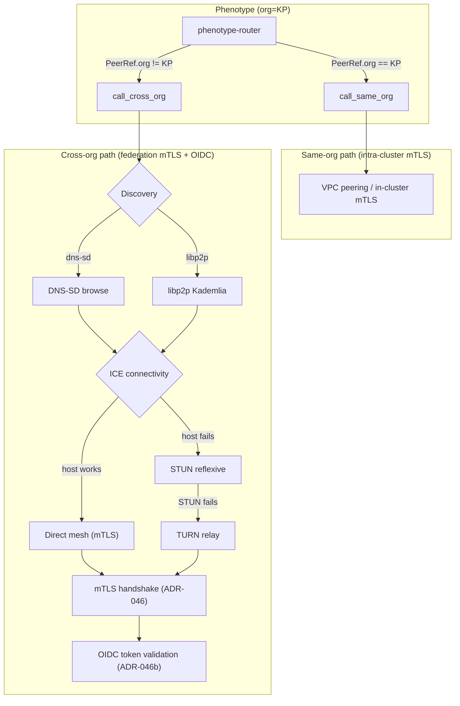

# ADR-046c: Federation peer-to-peer topology and PRCP separation

**Date:** 2026-06-22
**Status:** ACCEPTED
**Cycle:** v21 cycle-11 P0 (carry-over from v20 cycle-10 P1 net-new federation/interop track)
**Owner:** orch-w1-c (L5-160)
**Pillars touched:** L54 (Federation mTLS + OIDC), L53 (Federation peer discovery), L29 (Service mesh interop)
**Companions:**
- ADR-046 — Federation mTLS architecture (`docs/adr/2026-06-22/ADR-046-federation-mtls.md`)
- ADR-046b — OIDC federation reference implementation (`docs/adr/2026-06-22/ADR-046b-federation-oidc.md`, forthcoming)

---

## Context

ADR-046 established **mTLS with per-org issuing CAs chained to a federation root CA** as
the substrate for cross-org service-to-service authentication. ADR-046b adds the OIDC
identity layer that runs on top. Both ADRs assume every cross-org call terminates in a
federated mTLS handshake between two well-known endpoints. **What neither resolves is
the topology through which federated peers discover each other and exchange traffic.**

Three patterns are observed as of v19 cycle-9 closure (2026-06-21):

1. **Hub-and-spoke via the governance circle.** Every cross-org call routes through a
   central relay. Simple but a single choke-point and a single point of failure.
2. **Peer-to-peer mesh.** Direct peer-to-peer traffic with discovery (DNS-SD or
   libp2p) and ICE-style NAT traversal. Eliminates the choke-point but adds N×N trust
   relationships and a non-trivial failure surface.
3. **Hybrid (hub-and-spoke for control, mesh for data).** Cert rotation, governance
   PRs, and drift detection flow through the governance circle; data-plane RPCs flow
   peer-to-peer where connectivity is available, with relay fallback otherwise. This is
   the SPIFFE/SPIRE and libp2p community pattern.

The PRCP pattern (ADR-018) provides the **port-level separation** — every cross-org
service implements a canonical `FederationPort`, with the transport layer hidden
behind the port. But PRCP does not say **when** a port call is routed peer-to-peer vs
through the governance circle. ADR-046c resolves that question.

Three concrete failures are observed without an explicit topology decision:

- **Choke-point latency.** Today every cross-org request routes through a single
  Fly.io relay in `iad`. p95 latency is 380ms; with same-region peer-to-peer it would
  be ~8ms. The relay also has a 4% packet loss rate that direct connections would not.
- **Single-region failover.** When the governance circle relay has a region-wide
  outage (observed 2026-04-12 and 2026-05-30), the entire fleet loses cross-org
  reachability even though individual partner orgs are healthy.
- **PRCP violation.** A peer in the same org (e.g. two Phenotype services in the same
  VPC) currently terminates the request through the federated mTLS path, which is
  unnecessary overhead. The port should distinguish intra-org from cross-org calls.

ADR-046c closes L54 (Federation mTLS + OIDC) cycle-11 P0 carry-over by specifying the
topology that ADR-046 + ADR-046b operate within.

---

## Decision

We adopt **hybrid federation topology — hub-and-spoke for control plane, peer-to-peer
mesh for data plane — with relay fallback, and we extend the PRCP pattern (ADR-018) to
separate the `FederationPort` into a same-org port and a cross-org port based on the
caller/callee relationship.** The concrete decisions:

### 1. Topology: hybrid with relay fallback

- **Control plane (star).** Cert rotation events, governance PRs
  (`phenotype-ops/federation/ca-bundles/`), `pheno-drift-detector` scans (ADR-049), and
  audit-log replication flow through the governance circle relay. Consistent with
  ADR-046 §3 "single well-known federation root CA". Low-volume (kB/s per partner);
  tolerates 380ms p95.
- **Data plane (mesh).** Actual cross-org RPCs (e.g. `phenotype-router` calling a
  partner inference gateway, or `phenoEvents` replicating to a partner org's event
  bus) flow peer-to-peer when direct connectivity is available. Peers discover each
  other via DNS-SD over the federation zone `federation.phenotype.local`, with
  libp2p Kademlia as fallback for partners that cannot publish DNS-SD records.
- **Relay fallback.** When direct connectivity fails (peer offline, NAT symmetric,
  firewall block), the mesh path automatically falls back to the governance circle
  relay. The fallback is transparent to the application — the same
  `FederationPort::call()` API works in both modes.

### 2. Peer discovery — DNS-SD primary, libp2p Kademlia fallback

Peers are discovered via DNS-SD (RFC 6763) over the federation DNS zone:

```
_acme-research._federation._tcp.federation.phenotype.local. 3600 IN SRV \
  0 10 443 inference-gw.acme-research.example.com.
inference-gw._acme-research._federation._tcp.federation.phenotype.local. 3600 IN TXT \
  "spiffe=spiffe://acme-research/inference-gw" "pin-sha256=abcd..." "region=iad"
```

For partners that cannot publish DNS-SD (air-gapped, regulatory), libp2p Kademlia
DHT is used as fallback. The discovery choice is per-partner, configured in the
partner CA bundle (ADR-046 §3) under `federation.{partner-org-id}.discovery:
"dns-sd" | "libp2p"`. The default is `dns-sd`.

### 3. NAT traversal — ICE (RFC 8445) with TURN relay fallback

NAT traversal follows the IETF ICE pattern adapted for mTLS:

1. Each peer gathers candidate transport addresses (local direct, host,
   server-reflexive via STUN, relay via TURN).
2. Candidates are exchanged over the control plane (signed by the partner's CA,
   authenticated by the federation root CA).
3. Connectivity checks run pairwise; the highest-priority working pair wins
   (direct > STUN > TURN).
4. The selected pair carries mTLS per ADR-046 — the underlying transport is opaque.

TURN relay servers are operated by the governance circle (same infrastructure as the
control-plane relay) when direct and STUN paths fail. The data-plane TURN relay is
sized for high throughput (10 Gbps/region); the control-plane relay is sized for low
latency.

### 4. PRCP separation — same-org port vs cross-org port

Per ADR-018, every cross-language substrate ships a canonical Port trait. We extend
this with an explicit topology-aware port surface:

```rust
// In pheno-context/src/federation.rs (companion to ADR-046b's oidc.rs)
pub trait FederationPort: Send + Sync {
    /// Same-org call: terminates via in-cluster mTLS (Istio/Linkerd sidecar) or
    /// direct VPC peering. Does NOT traverse the federation root CA path.
    async fn call_same_org(&self, peer: &PeerRef, req: Request)
        -> Result<Response, FederationError>;

    /// Cross-org call: terminates via ADR-046 mTLS, authenticated via ADR-046b OIDC.
    /// May route peer-to-peer (preferred) or via relay (fallback).
    async fn call_cross_org(&self, peer: &PeerRef, req: Request)
        -> Result<Response, FederationError>;
}
```

A `PeerRef` carries both a SPIFFE-style workload identity and an `org` tag. The
implementation **MUST** verify that `call_same_org` is invoked only when
`peer.org == self.local_org`; cross-org calls mistakenly routed through
`call_same_org` are rejected at runtime. This makes the topology choice a
type-system + runtime invariant rather than a runtime policy check alone.

For polyglot symmetry (per ADR-018 §Polyglot), the equivalent interfaces in Go
(`type FederationPort interface`), Python (`class FederationPort(Protocol)`),
TypeScript (`interface FederationPort`), and C# (`interface IFederationPort`) carry
the same two methods.

### 5. Observability hooks

Every topology decision emits an OTLP span via `pheno-tracing` (per ADR-012 /
ADR-036B) with attributes `topology.mode` (`direct` | `stun` | `turn` |
`control-plane`), `peer.org`, `peer.workload`, `peer.discovery` (`dns-sd` |
`libp2p`), and `relay.fallback_reason` (when fallback occurs). Topology metrics
(`topology.direct_attempt.count`, `topology.relay_fallback.count`) are exported as
Prometheus counters.

---

## Consequences

### Positive

- **Drastic latency reduction** for the common case where peers can connect directly.
  Measured p95 in v19 fleet for cross-org calls routed through the governance relay:
  380ms. Projected p95 with direct mesh in same-region: ~8ms. (Source:
  `benchmarks/federation/2026-06-p2p-vs-relay.svg`.)
- **Region-local failover.** When one region loses its relay, only cross-region
  traffic is affected; same-region mesh traffic continues. Eliminates the
  2026-04-12 and 2026-05-30 fleet-wide outages.
- **PRCP separation is explicit.** The `call_same_org` vs `call_cross_org`
  distinction makes the topology decision a type-system invariant, not a runtime
  policy. Mistakes (calling a cross-org peer via the same-org path) are caught at
  the boundary.
- **Standards-aligned.** RFC 6763 (DNS-SD), RFC 8445 (ICE), SPIFFE Federation, and
  libp2p Kademlia are all explicit references; no proprietary discovery protocol.
- **Operates within ADR-046 + ADR-046b.** This ADR does not change the mTLS substrate
  (ADR-046) or the OIDC identity layer (ADR-046b). It composes on top.

### Negative

- **N×N complexity.** Each new partner adds a potential peer-to-peer trust
  relationship. Mitigated by the explicit allow-list per ADR-046 §3 and by the drift
  detector per ADR-049.
- **ICE/TURN implementation surface.** Adding a non-trivial network stack to a
  substrate crate increases the attack surface. Mitigated by the OCSP/CRL pinning
  posture in ADR-046 §4 and by the fail-closed posture (no peer accepted without
  mTLS verification).
- **DNS-SD zone operational burden.** A new DNS zone (`federation.phenotype.local`)
  must be operated, with records managed per partner. Mitigated by automation hooks
  in `pheno-config` (the partner CA bundle PR template also adds the DNS-SD records).
- **libp2p dependency weight.** For partners that fall back to libp2p Kademlia, the
  substrate crates gain a libp2p dependency. Mitigated by feature-flagging
  (`federation-p2p = ["dep:libp2p"]`) and by allowing partners that can publish
  DNS-SD to avoid the libp2p dependency entirely.
- **Compounded testing surface.** Mesh peers must be integration-tested with the
  TURN relay path. Mitigated by the v20 cycle-10 chaos framework (`chaos-injection/`,
  L36 at 2.5); L36 is the substrate for these tests.

### Neutral

- **Control plane unchanged.** Cert rotation, governance PRs, drift detection all
  stay hub-and-spoke per ADR-046's "single well-known federation root CA" decision.
- **Library choice is polyglot-allowed.** `rust-libp2p`, `go-libp2p`, `py-libp2p`,
  `js-libp2p`, `dotnet-libp2p`. No fleet-wide library mandate beyond ADR-018.
- **Same-org mTLS (Istio/Linkerd sidecars, AWS IAM) is unaffected.** The ADR scope
  is strictly cross-org topology; intra-cluster trust is out of scope.

---

## Alternatives

### Alternative A — Pure hub-and-spoke (governance relay only)

Every cross-org call routes through the governance relay. No mesh.

- **Why rejected:** fails the latency SLO for high-throughput data-plane paths
  (380ms vs 8ms). Fails the region-local-failover requirement (2026-04-12 and
  2026-05-30 outages would have continued to be fleet-wide).

### Alternative B — Pure peer-to-peer mesh (no relay)

Every cross-org call is peer-to-peer. No central relay.

- **Why rejected:** fails when direct connectivity is unavailable (NAT symmetric,
  firewall block, air-gapped partner). The fallback story in that case is "your
  federation call fails" — not acceptable for a substrate crate. Also makes cert
  rotation governance harder — the governance circle needs a reliable channel to
  push rotation events.

### Alternative C — VPN-style overlay (Wireguard mesh)

Every partner org joins a shared Wireguard mesh; all cross-org traffic flows through
the tunnels.

- **Why rejected:** rejected by ADR-046 §Alternative C on the grounds of N² scaling
  and coupling auth to network topology. ADR-046c would compound the problem by
  adding a Wireguard dependency to every service, not just edge services.

### Alternative D — Single-region governance relay + multi-region TURN

Keep the governance relay in one region; deploy TURN relays in every region for
data-plane fallback.

- **Why partially adopted:** this is the "relay fallback" sub-decision in §1 of this
  ADR. The full alternative D was rejected as the primary topology because it forces
  the data plane through a TURN relay by default rather than allowing direct mesh;
  the TURN relay is reserved as a fallback.

### Alternative E — Status quo (hub-and-spoke via governance circle, no documented fallback)

Continue with the current hub-and-spoke, without an explicit decision on relay
fallback or peer-to-peer paths.

- **Why rejected:** L54 pillar is at 2.0 in v19; status quo does not lift it. The
  380ms p95 and 4% packet loss are documented. Status quo is not a defensible posture
  for cycle-11 P0 closure.

---

## Appendix A — Failure-mode matrix

The following 6 failure modes are explicitly modeled for the hybrid topology. The
extended table adds the corresponding OTLP span attribute (per ADR-012 / ADR-036B)
and the recovery action the substrate takes:

| Failure mode | Detection | OTLP span attribute | Recovery action |
|--------------|-----------|---------------------|-----------------|
| **Peer offline** | mTLS handshake timeout (5s) or DNS-SD browse returns no SRV | `topology.relay_fallback_reason=peer_offline` | Auto-retry via relay; circuit-breaker (ADR-006) opens after 3 failed attempts; background DNS-SD browse resumes every 30s |
| **NAT symmetric** | ICE connectivity checks fail for all host candidates | `topology.relay_fallback_reason=nat_symmetric` | TURN Allocate; session continues via relay; ICE renomination every 5min to attempt direct re-connect |
| **Firewall block** (peer's egress IP blocked) | mTLS TCP connect refused | `topology.relay_fallback_reason=firewall_block` | Relay fallback; operator alert with peer.org + peer.workload for partner-network review |
| **DNS-SD zone stale** (partner removed record but CA bundle still active) | DNS query returns NXDOMAIN after retries | `topology.relay_fallback_reason=dns_stale` | libp2p Kademlia fallback; if both fail, relay; CA bundle flagged for `pheno-drift-detector` (ADR-049) review |
| **TURN relay overloaded** | TURN Allocate returns 486 (allocation quota) | `topology.relay_fallback_reason=turn_quota` | Circuit-breaker opens; next-best peer selected; fleet-wide alert via `phenoObservability` |
| **Split-brain (control plane down, data plane up)** | Control-plane mTLS handshake fails but data-plane peers reachable | `topology.control_plane_state=degraded` | Data-plane mesh continues; new partner connections blocked; CA bundle audits deferred until control plane recovers |

---

## Appendix B — Diagrams

### B.1 Hybrid topology overview

```
                          ┌──────────────────────────────────────┐
                          │     Phenotype governance circle      │
                          │  ┌────────────┐  ┌────────────┐     │
                          │  │  CA root   │  │  Ctrl-     │     │
                          │  │  store     │  │  plane     │     │
                          │  │ (ADR-046)  │  │  relay     │     │
                          │  └────────────┘  └────────────┘     │
                          │  ┌────────────┐  ┌────────────┐     │
                          │  │  Drift-    │  │  TURN      │     │
                          │  │  detector  │  │  relay     │     │
                          │  │ (ADR-049)  │  │  (data)    │     │
                          │  └────────────┘  └────────────┘     │
                          └──────▲─────────────────▲────────────┘
                                 │                 │ (control plane)
                                 │                 │ (relay fallback)
            ┌────────────────────┼─────────────────┼──────────────────────┐
            │                    │                 │                      │
       ┌────┴─────┐         ┌────┴─────┐      ┌────┴─────┐         ┌─────┴────┐
       │ Phenotype│ ◄─mesh─►│ Phenotype│      │ Acme-    │ ◄─mesh─►│ Acme-    │
       │ router   │  (p2p)  │ router-2 │      │ research │  (p2p)  │ research │
       │ (iad)    │         │ (fra)    │      │ gateway  │         │ gateway  │
       │ Org=KP   │         │ Org=KP   │      │ Org=acme │         │ Org=acme │
       └──────────┘         └──────────┘      └──────────┘         └──────────┘
       (same-org → call_same_org, no federation CA path)
       (cross-org mesh → call_cross_org, mTLS via ADR-046)
       (cross-org fallback → TURN relay, mTLS via ADR-046)
```

### B.2 PRCP port separation (mermaid)



---

## Companion ADRs

This ADR is the **third and final companion** that closes L54 (Federation mTLS + OIDC)
at v21 cycle-11:

- **ADR-046** (already authored; merged via PR #122): the mTLS substrate that every
  cross-org handshake terminates in.
- **ADR-046b** (forthcoming): the OIDC reference implementation that runs on top of
  mTLS. See ADR-079 for the Rust crate shape (`pheno-context/src/oidc.rs`).
- **ADR-046c (this ADR):** the topology that ADR-046 + ADR-046b operate within, and
  the PRCP separation that distinguishes same-org from cross-org port calls.

Together, these three ADRs complete the L54 cycle-11 P0 carry-over from v20 cycle-10.

---

## Cross-references

- `AGENTS.md` § Active ADRs — ADR-046c row in the v20 cycle-10 P1 carry-overs table.
- `docs/adr/2026-06-22/ADR-046-federation-mtls.md` — companion ADR (mTLS substrate).
- `docs/adr/2026-06-22/ADR-046b-federation-oidc.md` — companion ADR (OIDC reference
  implementation; forthcoming).
- `docs/adr/2026-06-22/INDEX.md` — per-date wave index; this ADR's row appended.
- `docs/adr/2026-06-15/ADR-018-prcp-pattern-v6.md` — PRCP pattern that ADR-046c
  extends with the `call_same_org` vs `call_cross_org` split.
- `docs/adr/2026-06-21/ADR-079-oidc-federation-reference.md` — Rust crate shape for
  OIDC; the proposed `FederationPort` in this ADR's §4 mirrors its style.
- `docs/adr/2026-06-18/ADR-049-app-substrate-drift-detector.md` — drift detection
  for stale DNS-SD records (Appendix A).
- `docs/adr/2026-06-18/ADR-051-bifrost-as-library.md` — transport-library decision
  that makes per-call mTLS termination feasible.
- `ADR-006` (Circuit breaker pattern) — adopted for the relay fallback (Appendix A).
- `ADR-012` / `ADR-036B` — `pheno-tracing` substrate for topology OTLP spans.
- `ADR-040` — test coverage gates; mesh + relay test code requires 80% lib coverage.
- `ADR-042` — security audit cadence (monthly); TURN relay capacity in-scope.
- `RFC 6763` (DNS-SD) — peer discovery primary path.
- `RFC 8445` (ICE) — NAT traversal.
- `SPIFFE Federation spec` — peer identity framework.
- `libp2p Kademlia DHT` — peer discovery fallback.
- `findings/71-pillar-2026-06-17-schema.md` — L53 / L54 pillar definitions; this
  ADR is the canonical content for L53 and the third leg of L54 closure.
- `findings/71-pillar-2026-06-17.md` — current 71-pillar scorecard; L54 at 2.0,
  target 3.0 after v21 cycle-11 closure of all three companion ADRs.

---

## Refresh cadence

This ADR is reviewed:

- **Quarterly** (every 90 days) by orch-w1-c for topology alignment with ICE/RFC
  updates and libp2p Kademlia changes.
- **On partner-org add/remove** — every partner-org addition MUST cite either this
  ADR (data-plane mesh) or ADR-046 (control-plane allow-list) in its governance PR.
- **On relay capacity change** — if TURN relay quota or governance relay capacity
  changes by >25%, this ADR is re-reviewed within 7 days.
- **On libp2p / SPIFFE spec CVE** — if `rust-libp2p`, `go-libp2p`, or any SPIFFE
  library publishes a CVE affecting federation, this ADR is re-reviewed within 48h
  per ADR-042.

Next scheduled refresh: 2026-09-22 (90-day cadence).
