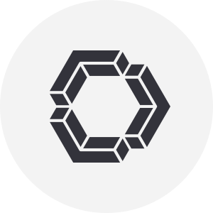

<div align="center">


<br/>

# 🚀 OmniRoute — Darmowa bramka AI


</div>

<div align="center">

# 💰 ~1,4 mld darmowych tokenów / miesiąc

</div>

> Ręczne łączenie darmowych pakietów jest uciążliwe — dziesiątki SDK, dziesiątki limitów zapytań (rate limits) i brak wiedzy, ile tak naprawdę Ci pozostało. OmniRoute agreguje **udokumentowane** darmowe pakiety z **39 pul dostawców / ponad 460 modeli** w jedną rzetelną liczbę i wyświetla ją na żywo w panelu (`/dashboard/free-tiers`).


> Animowane podsumowanie strony `/dashboard/free-tiers` na żywo. Pełna metodologia (deduplikacja pul, pakiety kredytów, warunki dostawców): **[docs/reference/FREE_TIERS.md](../../../docs/reference/FREE_TIERS.md)**.
>
> <sub>Liczby te są ponownie weryfikowane co dwa tygodnie na podstawie aktualnego katalogu i **mogą się zmieniać w obie strony** — gdy dostawca kończy darmowy pakiet, liczba spada; gdy pojawia się nowy, rośnie. Publikujemy to, co faktycznie oblicza katalog, nigdy zaokrąglony w górę, optymistyczny wariant. Bramka CI (`check:docs-counts`) powoduje błąd budowania projektu, jeśli nagłówek rozbiega się z kodem.</sub>

<div align="center">

<h3>

⭐ Dodaj gwiazdkę do repozytorium, jeśli OMNIROUTE pomógł Ci zaoszczędzić pieniądze i ułatwił pracę.

</h3>

[](https://github.com/diegosouzapw/OmniRoute)
<a href="https://trendshift.io/repositories/23589" target="_blank"></a>
[](https://www.star-history.com/diegosouzapw/omniroute)

<br/>

### 💬 Dołącz do społeczności

[](https://discord.gg/U47eFqAXCn)
[](https://t.me/omnirouteOficial)
[](https://chat.whatsapp.com/JI7cDQ1GyaiDHhVBpLxf8b?mode=gi_t)
[](https://chat.whatsapp.com/LTSpdFhXTxjH4R6CCNiKWz)
[](https://omniroute.online)

**Pytania, wskazówki dotyczące dostawców, plany rozwoju (roadmap) i wsparcie → [Discord](https://discord.gg/U47eFqAXCn) · [Telegram](https://t.me/omnirouteOficial) · WhatsApp [🌍 Global](https://chat.whatsapp.com/JI7cDQ1GyaiDHhVBpLxf8b?mode=gi_t) / [🇧🇷 Brasil](https://chat.whatsapp.com/LTSpdFhXTxjH4R6CCNiKWz)**

<br/>

### 🧩 Dostępne

[](https://www.npmjs.com/package/omniroute)

[](https://hub.docker.com/r/diegosouzapw/omniroute)
[](../../../LICENSE)


[**🚀 Szybki start**](#-szybki-start) • [**🎯 Komba**](#-komba-combos--flagowa-funkcja) • [**🌐 Dostawcy**](#-268-dostawc%C3%B3w-ai--ponad-90-darmowych) • [**🔌 CLI & MCP**](#-pe%C5%82ne-cli--a2a-i-mcp) • [**🗜️ Kompresja**](#%EF%B8%8F-oszcz%C4%99dzaj-1595-token%C3%B3w--automatycznie) • [**🌍 Strona WWW**](https://omniroute.online)

[💥 Obietnica](#-obietnica) • [🤔 Dlaczego](#-dlaczego-omniroute) • [🏆 Co wyróżnia OmniRoute](#-co-wyr%C3%B3%C5%BCnia-omniroute) • [🤖 Zgodne CLI](#-zgodne-cli-i-agenci-koduj%C4%85cy) • [🖥️ Gdzie to działa](#%EF%B8%8F-gdzie-dzia%C5%82a-omniroute--wsz%C4%99dzie) • [🔒 Prywatność](#-prywatno%C5%9B%C4%87-i-lokalne-dzia%C5%82anie-local-first) • [🎬 W akcji](#-omniroute-w-akcji) • [📸 Zrzuty ekranu](#-zrzuty-ekranu-z-panelu) • [📧 Wsparcie](#-wsparcie-i-spo%C5%82eczno%C5%9B%C4%87)

</div>

<div align="center">
 <b>🌐 W 43 językach</b>
 <table>
  <tr>
    <td align="center"><a href="../../../README.md">🇺🇸</a></td>
    <td align="center"><a href="../pt-BR/README.md">🇧🇷</a></td>
    <td align="center"><a href="../pt/README.md">🇵🇹</a></td>
    <td align="center"><a href="../es/README.md">🇪🇸</a></td>
    <td align="center"><a href="../fr/README.md">🇫🇷</a></td>
    <td align="center"><a href="../it/README.md">🇮🇹</a></td>
    <td align="center"><a href="../de/README.md">🇩🇪</a></td>
    <td align="center"><a href="../nl/README.md">🇳🇱</a></td>
    <td align="center"><a href="../ru/README.md">🇷🇺</a></td>
    <td align="center"><a href="../uk-UA/README.md">🇺🇦</a></td>
    <td align="center"><a href="README.md">🇵🇱</a></td>
    <td align="center"><a href="../cs/README.md">🇨🇿</a></td>
    <td align="center"><a href="../sk/README.md">🇸🇰</a></td>
    <td align="center"><a href="../ro/README.md">🇷🇴</a></td>
    <td align="center"><a href="../hu/README.md">🇭🇺</a></td>
  </tr>
  <tr>
    <td align="center"><a href="../bg/README.md">🇧🇬</a></td>
    <td align="center"><a href="../da/README.md">🇩🇰</a></td>
    <td align="center"><a href="../fi/README.md">🇫🇮</a></td>
    <td align="center"><a href="../no/README.md">🇳🇴</a></td>
    <td align="center"><a href="../sv/README.md">🇸🇪</a></td>
    <td align="center"><a href="../zh-CN/README.md">🇨🇳</a></td>
    <td align="center"><a href="../zh-TW/README.md">🇹🇼</a></td>
    <td align="center"><a href="../ja/README.md">🇯🇵</a></td>
    <td align="center"><a href="../ko/README.md">🇰🇷</a></td>
    <td align="center"><a href="../th/README.md">🇹🇭</a></td>
    <td align="center"><a href="../vi/README.md">🇻🇳</a></td>
    <td align="center"><a href="../id/README.md">🇮🇩</a></td>
    <td align="center"><a href="../ms/README.md">🇲🇾</a></td>
    <td align="center"><a href="../phi/README.md">🇵🇭</a></td>
  </tr>
  <tr>
    <td align="center"><a href="../in/README.md">🇮🇳</a></td>
    <td align="center"><a href="../hi/README.md">🇮🇳</a></td>
    <td align="center"><a href="../gu/README.md">🇮🇳</a></td>
    <td align="center"><a href="../mr/README.md">🇮🇳</a></td>
    <td align="center"><a href="../ta/README.md">🇮🇳</a></td>
    <td align="center"><a href="../te/README.md">🇮🇳</a></td>
    <td align="center"><a href="../bn/README.md">🇧🇩</a></td>
    <td align="center"><a href="../ur/README.md">🇵🇰</a></td>
    <td align="center"><a href="../fa/README.md">🇮🇷</a></td>
    <td align="center"><a href="../ar/README.md">🇸🇦</a></td>
    <td align="center"><a href="../he/README.md">🇮🇱</a></td>
    <td align="center"><a href="../tr/README.md">🇹🇷</a></td>
    <td align="center"><a href="../az/README.md">🇦🇿</a></td>
    <td align="center"><a href="../sw/README.md">🇹🇿</a></td>
  </tr>
</table>
</div>

<div align="center">

# 💥 Obietnica

</div>


<br/>
<br/>

<div align="center">

# 🤔 Dlaczego OmniRoute?

</div>


<div align="center">


</div>

<br/>

<div align="center">

# 🎯 Komba (Combos) — Flagowa funkcja

</div>

> **Kombo** to łańcuch modeli, po których OmniRoute nawiguje **automatycznie**. Wybucha limit, dostawca ulega awarii lub koszty gwałtownie rosną — kombo bezgłośnie przełącza się na kolejny model. **To właśnie sprawia, że OmniRoute jest niezawodny.** 🛡️

### ⚡ Zero konfiguracji — po prostu użyj `auto`

Nie musisz tworzyć żadnego komba. Ustaw swój model na `auto` (lub jego wariant), a OmniRoute zbuduje wirtualne kombo z Twoich połączonych dostawców, oceniane na żywo:

| Identyfikator modelu | Pod kątem czego optymalizuje                                                                                                                         |
| -------------------- | ---------------------------------------------------------------------------------------------------------------------------------------------------- |
| `auto`               | 🎯 Zbalansowana wartość domyślna (LKGP — trzyma się ostatniego dobrego dostawcy)                                                                     |
| `auto/coding`        | 🧑‍💻 Wagi zorientowane na jakość przy generowaniu kodu                                                                                               |
| `auto/fast`          | ⚡ W pierwszej kolejności najniższe opóźnienia                                                                                                       |
| `auto/cheap`         | 💰 W pierwszej kolejności najtańsze za token                                                                                                         |
| `auto/offline`       | 🔋 W pierwszej kolejności największy zapas limitu (quota / rate-limit)                                                                               |
| `auto/smart`         | 🔭 Najpierw jakość + 10% eksploracji w celu odkrycia lepszych modeli                                                                                 |


### 🔀 Albo zbuduj własne — 18 strategii routingu

Wszystkie **18** strategii — łącz i dopasowuj na każdym kroku komba:

| #   | Strategia           | Co robi                                                                                                                  |
| --- | ------------------- | ------------------------------------------------------------------------------------------------------------------------ |
| 1   | `priority`          | Uporządkowana lista według priorytetu — zużyj każdy cel przed przejściem do kolejnego 🥇                                 |
| 2   | `fill-first`        | Wypełnij całkowicie limit każdego celu przed pójściem dalej                                                              |
| 3   | `weighted`          | Wybór losowy ważony według wagi przypisanej do celu                                                                      |
| 4   | `round-robin`       | Przechodzenie przez cele po kolei (Round-Robin)                                                                          |
| 5   | `p2c`               | Losowe równoważenie obciążenia metodą "wybierz dwa, weź lepszy" (P2C)                                                    |
| 6   | `least-used`        | Wybierz cel o najniższym aktualnym obciążeniu                                                                            |
| 7   | `random`            | Jednolity losowy wybór (ze skreśleniem powtórzeń)                                                                        |
| 8   | `strict-random`     | Losowo bez usuwania duplikatów 🎲                                                                                        |
| 9   | `cost-optimized`    | Minimalizuj koszt w USD za zapytanie na podstawie cennika w katalogu na żywo 💸                                           |
| 10  | `headroom`          | Wybierz cel z największym pozostałym limitem                                                                             |
| 11  | `reset-window`      | Preferuj cel, którego okno limitu resetuje się najszybciej                                                               |
| 12  | `reset-aware`       | Klasyfikuj według czasu resetu limitu — najpierw krótkie okna 📊                                                         |
| 13  | `context-relay`     | Przekazuj kontekst między celami przy długich rozmowach 🧠                                                               |
| 14  | `context-optimized` | Wybierz cel najlepiej dopasowany do bieżącego rozmiaru kontekstu                                                         |
| 15  | `lkgp`              | Ostatnia znana dobra ścieżka (LKGP) — trzyma się ostatniego udanego celu                                                 |
| 16  | `auto`              | Ocenianie na żywo na podstawie 12 czynników dla każdego połączenia 🤖                                                   |
| 17  | `fusion`            | Rozesłanie zapytania do panelu modeli + sędzia syntetyzuje jedną odpowiedź (Fusion) 🧬                                   |
| 18  | `pipeline`          | Łączenie kroków — wyjście każdego celu zasila kolejny 🔗                                                                 |


<sub>Silnik Auto-Combo ocenia każdego kandydata na podstawie **12 czynników** (stan techniczny, limit, koszt, opóźnienie, wskaźnik sukcesu, aktualność…) — zobacz [`docs/routing/AUTO-COMBO.md`](docs/routing/AUTO-COMBO.md).</sub>


### ⚖️ Quota-Share — podziel jedną subskrypcję w zespole ✨ NOWOŚĆ

> Uruchamiasz kilka kluczy na tym **samym koncie nadrzędnym** (jeden plan Codex Pro, jeden klucz Kimi, jedno stanowisko GLM Coding)? Nagły skok zużycia na jednym kluczu może wyczerpać cały 5-godzinny / godzinny limit i zablokować wszystkich innych. **Quota-Share** rozdziela limit czasowy dostawcy **sprawiedliwie** pomiędzy klucze w puli — a dzięki zasadzie _oszczędzania pracy (work-conserving)_, nieużywana część limitu bezczynnego członka jest wypożyczana innym, zamiast się marnować.

| Suwak / Opcja | Co kontroluje |
| ------------------------ | ----------------------------------------------------------------------------------------------------------------------------------------------------------------------------- |
| ⚖️ **Waga alokacji** | udział każdego klucza w puli — np. `50 / 30 / 20`                                                                                                                            |
| 📐 **Wymiary** | śledzenie `%` · zapytań · tokenów · `$`, w oknie **5h / 7d / na model**                                                                                                       |
| 🚦 **Polityka** | `hard` (blokuj po przekroczeniu) · `soft` (obniż priorytet) · `burst` (użyj wolnego zapasu)                                                                                               |
| 🧱 **Limit max (Cap)** | bezwzględny limit na klucz, niezależny od trybu                                                                                                                                 |



<sub>Wymuszane na "gorącej ścieżce" **zanim** żądanie opuści OmniRoute, z limitami na parę (klucz, model) + zachowaniem sesyjności (session stickiness) dla spójności pamięci podręcznej promptów (teraz z przełącznikiem wyłączania dla komba / globalnie). 📖 [Silnik Quota Sharing](../../../docs/routing/QUOTA_SHARE.md)</sub>


### 🧱 Odporność jest wbudowana (3 niezależne warstwy)


<sub>📖 [Silnik Auto-Combo](docs/routing/AUTO-COMBO.md) · [Podręcznik odporności](../../../docs/architecture/RESILIENCE_GUIDE.md)</sub>

<br/>

<div align="center">

# 🏆 Co wyróżnia OmniRoute

</div>

| Funkcja | OmniRoute | Inne routery |
| -------------------------------------- | ------------------------------------------------------------------- | ------------- |
| 🌐 Dostawcy | **268** | 20–100 |
| 🆓 Darmowi dostawcy | **90+ (40+ darmowych na zawsze)** | 1–5 |
| 🔀 Strategie routingu | **18** (priorytetowa, ważona, zoptymalizowana pod kątem kosztów, przekazywanie kontekstu, fusion…) | 1–3 |
| 🗜️ Kompresja tokenów | **Kaskadowa RTK + Caveman (15–95%)** | Brak / 20–40% |
| 🧰 Wbudowany serwer MCP | **104 narzędzia, 3 protokoły transportowe, 31 zakresów** | Rzadkość |
| 🤝 Protokół agenta A2A | **6 umiejętności, JSON-RPC 2.0** | Brak |
| 🧠 Pamięć (FTS5 + wektorowa) | **Tak** | Rzadkość |
| 🛡️ Barierki ochronne (PII, wstrzykiwanie promptów, wizja) | **Tak** | Rzadkość |
| ☁️ Agenci chmurowi | **Codex, Cursor, Devin, Jules** | Brak |
| 🥷 Maskowanie sygnatury TLS | **JA3/JA4 przez wreq-js** | Brak |
| 🖥️ Wieloplatformowość | **Web · Desktop · Termux · PWA** | Tylko Web |
| 🌍 i18n (lokalizacja) | **43 języki** | 0–4 |

<sub>📊 Szczegółowe porównanie z LiteLLM, OpenRouter i Portkey → [`docs/comparison/OMNIROUTE_VS_ALTERNATIVES.md`](../../../docs/comparison/OMNIROUTE_VS_ALTERNATIVES.md)</sub>

<br/>

<div align="center">

# ✨ Co nowego

</div>

> Najważniejsze nowości z wersji **v3.8.20 → v3.8.49**. Pełna historia w [`CHANGELOG.md`](CHANGELOG.md).

- **🗜️ Wzmocnienie kompresji** — domyślnie włączone zabezpieczenie przed nadmiernym rozrostem (inflation guard), pakiety Caveman dla DE / FR / JA + chińskiego (wényán), filtry RTK dla Gradle i .NET. → [Kompresja](../../../docs/compression/COMPRESSION_ENGINES.md)
- **💸 Rzetelny koszt ryczałtowy** — dostawcy subskrypcyjni / planów kodowania wykazują koszt **0 USD** w analityce; budżet, limit i routing nadal działają szacunkowo. → [Referencja API](docs/reference/API_REFERENCE.md)
- **⚖️ Routing Quota-Share** — podział obciążenia kont według _dostępnego limitu_: harmonogramowanie DRR, współbieżność na połączenie, wielookienkowe pule, zachowanie sesyjności (session stickiness). → [Podręcznik odporności](../../../docs/architecture/RESILIENCE_GUIDE.md)
- **🤖 Konfiguracja CLI/agenta jednym poleceniem** — `setup-*` konfiguruje ponad 12 narzędzi programistycznych; `omniroute launch` / `launch-codex` działają bez konfiguracji. → [Integracje CLI](../../../docs/guides/CLI-INTEGRATIONS.md)
- **🛰️ Tryb zdalny** — steruj zdalną instancją OmniRoute za pomocą tokenów o ograniczonym zakresie (`connect` / `contexts` / `tokens`) + pomocnika OAuth `antigravity` dla instalacji na VPS. → [Tryb zdalny](../../../docs/guides/REMOTE-MODE.md)
- **🧭 Inteligentniejszy auto-routing** — komba `auto/<kategoria>:<poziom>`, **Fusion** (panel modeli + sędzia), routing uwzględniający specyfikę zadania, nadpisywanie modelu / trybu / budżetu USD per żądanie. → [Auto-Combo](docs/routing/AUTO-COMBO.md)
- **🗜️ Wtyczkowa kompresja** — 11 modułowych silników + Studia Kompresji: LLMLingua-2, dwupoziomowy Ultra, omniglyph, weryfikacja dokładności (fidelity gate) na każdym kroku, GCF v3.2, edytor z przeciąganiem elementów. → [Kompresja](../../../docs/compression/COMPRESSION_ENGINES.md)
- **🕵️ Przezroczyste dekodowanie MITM (TPROXY)** — przechwytywanie CLI ignorujących zmienne środowiskowe proxy, z instalatorem CA per-SNI i bazy zaufanych certyfikatów. → [MITM/TPROXY](../../../docs/security/MITM-TPROXY-DECRYPT.md)
- **💸 Telemetria kosztów wszędzie** — nagłówki kosztu/użycia `X-OmniRoute-*` w każdym punkcie końcowym, nagłówek oszczędności z trafień w cache (cache-HIT), limity wydatków USD na klucz. → [Referencja API](docs/reference/API_REFERENCE.md)
- **🧠 Pamięć pod Twoją kontrolą** — domyślnie wyłączona, opcjonalna kwantyzacja wektorowa int8 + stopniowe wygaszanie (typed decay), nagłówek `x-omniroute-no-memory` na żądanie. → [Pamięć](../../../docs/frameworks/MEMORY.md)
- **🛡️ Bezpieczeństwo** — ochrona przed wstrzykiwaniem promptów (prompt-injection guard) na każdej trasie LLM (zestaw testów red-team) + darmowe wyszukiwanie w sieci DuckDuckGo jako ostatnia deska ratunku. → [Barierki ochronne](../../../docs/security/GUARDRAILS.md)
- **🖼️ Nowe punkty końcowe** — `/v1/ocr` (Mistral OCR) i `/v1/audio/translations` (w stylu Whisper) uzupełniają obsługę multimediów. → [Referencja API](docs/reference/API_REFERENCE.md)
- **🌍 Wdrożenie i administracja** — `basePath` dla reverse-proxy, automatyczne wykrywanie języka przeglądarki, śledzenie urządzeń na klucz, zaufanie MITM bez uprawnień roota, lokalizacja zh-TW. → [Środowisko](docs/reference/ENVIRONMENT.md)
- **🤝 Więcej dostawców i agentów** — Cursor Cloud Agent, Grok Build (xAI), pełnoprawna karta Ollama, Claude Sonnet 5, Zed, Requesty, SenseNova, Yuanbao… oraz odświeżony katalog 250 dostawców. → [Dostawcy](../../../docs/reference/PROVIDER_REFERENCE.md)
- **⚡ Lokalna wydajność i infrastruktura** — uruchamianie lokalnego Redis jednym kliknięciem, instalatory przekaźników dla Cloudflare Workers / Deno Deploy, Bifrost i Mux jako nadzorowane usługi wbudowane. → [Usługi wbudowane](../../../docs/frameworks/EMBEDDED-SERVICES.md)

<br/>

<div align="center">

# 🤖 Zgodne CLI i agenci kodujący

> Jedna konfiguracja — `http://localhost:20128/v1` — i **każde** IDE lub CLI AI działa na darmowych i tanich modelach.

<div align="center">
<table>
  <tr>
    <td align="center" width="76"><a href="https://github.com/anthropics/claude-code"><br/><sub><b>Claude Code</b></sub><br/><sub>                           </sub></a></td>
    <td align="center" width="76"><a href="https://github.com/openai/codex"><br/><sub><b>Codex CLI</b></sub><br/><sub>                           </sub></a></td>
    <td align="center" width="76"><picture><source media="(prefers-color-scheme:dark)" srcset="https://cdn.jsdelivr.net/npm/@lobehub/icons-static-png@1.91.0/dark/cline.png"/></picture><br/><sub><b>Cline</b></sub><br/><sub>                           </sub></td>
    <td align="center" width="76"><a href="https://github.com/Kilo-Org/kilocode"><br/><sub><b>Kilo Code</b></sub><br/><sub>                           </sub></a></td>
    <td align="center" width="76"><br/><sub><b>Roo Code</b></sub><br/><sub>                           </sub></td>
    <td align="center" width="76"><br/><sub><b>Continue</b></sub><br/><sub>                           </sub></td>
    <td align="center" width="76"><br/><sub><b>Qwen Code</b></sub><br/><sub>                           </sub></td>
    <td align="center" width="76"><br/><sub><b>Aider</b></sub><br/><sub>                           </sub></td>
    <td align="center" width="76"><br/><sub><b>ForgeCode</b></sub><br/><sub>                           </sub></td>
  </tr>
  <tr>
    <td align="center" width="76"><br/><sub><b>jcode</b></sub><br/><sub>                           </sub></td>
    <td align="center" width="76"><br/><sub><b>DeepSeek TUI</b></sub><br/><sub>                           </sub></td>
    <td align="center" width="76"><br/><sub><b>CodeWhale</b></sub><br/><sub>                           </sub></td>
    <td align="center" width="76"><a href="https://github.com/anomalyco/opencode"><picture><source media="(prefers-color-scheme:dark)" srcset="https://cdn.jsdelivr.net/npm/@lobehub/icons-static-png@1.91.0/dark/opencode.png"/></picture><br/><sub><b>OpenCode</b></sub><br/><sub>                           </sub></a></td>
    <td align="center" width="76"><br/><sub><b>Factory Droid</b></sub><br/><sub>                           </sub></td>
    <td align="center" width="76"><br/><sub><b>Copilot CLI</b></sub><br/><sub>                           </sub></td>
    <td align="center" width="76"><br/><sub><b>Cursor CLI</b></sub><br/><sub>                           </sub></td>
    <td align="center" width="76"><br/><sub><b>Smelt</b></sub><br/><sub>                           </sub></td>
  </tr>
  <tr>
    <td align="center" width="76"><br/><sub><b>Pi</b></sub><br/><sub>                           </sub></td>
    <td align="center" width="76"><br/><sub><b>Grok Build</b></sub><br/><sub>                           </sub></td>
    <td align="center" width="76"><picture><source media="(prefers-color-scheme:dark)" srcset="https://cdn.jsdelivr.net/npm/@lobehub/icons-static-png@1.91.0/dark/nousresearch.png"/></picture><br/><sub><b>Hermes Agent</b></sub><br/><sub>                           </sub></td>
    <td align="center" width="76"><br/><sub><b>OpenClaw</b></sub><br/><sub>                           </sub></td>
    <td align="center" width="76"><picture><source media="(prefers-color-scheme:dark)" srcset="https://cdn.jsdelivr.net/npm/@lobehub/icons-static-png@1.91.0/dark/goose.png"/></picture><br/><sub><b>Goose</b></sub><br/><sub>                           </sub></td>
    <td align="center" width="76"><br/><sub><b>Open Interpreter</b></sub><br/><sub>                           </sub></td>
    <td align="center" width="76"><br/><sub><b>Warp AI</b></sub><br/><sub>                           </sub></td>
    <td align="center" width="76"><br/><sub><b>Agent Deck</b></sub><br/><sub>                           </sub></td>
  </tr>
</table>
</div>

<div align="center">
<b>＋ działa również z</b> · Kiro · Command Code · Antigravity · Windsurf · AMP · <b>dowolnym narzędziem kompatybilnym z OpenAI</b>
</div>

<sub>📖 Konfiguracja per narzędzie dla wszystkich 33 narzędzi (25 z CLI Code + 8 z CLI Agents) → [`docs/reference/CLI-TOOLS.md`](docs/reference/CLI-TOOLS.md) · 🧩 Wtyczka OpenCode → [`@omniroute/opencode-provider`](https://www.npmjs.com/package/@omniroute/opencode-provider)</sub>

</div>

<br/>

<div align="center">

# 🌐 268 dostawców AI — ponad 90 darmowych

</div>

> Najbardziej kompletny katalog spośród wszystkich routerów open-source: **268 dostawców**, **ponad 90 z darmowym pakietem**, **ponad 40 darmowych na zawsze**.

<div align="center">

### 🏢 Każde główne laboratorium — przez jeden punkt końcowy

<table>
  <tr>
    <td align="center" width="98"><picture><source media="(prefers-color-scheme:dark)" srcset="https://cdn.jsdelivr.net/npm/@lobehub/icons-static-png@1.91.0/dark/openai.png"/></picture><br/><sub>OpenAI</sub><br/><sub>                           </sub></td>
    <td align="center" width="98"><br/><sub>Anthropic</sub><br/><sub>                           </sub></td>
    <td align="center" width="98"><br/><sub>Gemini</sub><br/><sub>                           </sub></td>
    <td align="center" width="98"><picture><source media="(prefers-color-scheme:dark)" srcset="https://cdn.jsdelivr.net/npm/@lobehub/icons-static-png@1.91.0/dark/grok.png"/></picture><br/><sub>xAI Grok</sub><br/><sub>                           </sub></td>
    <td align="center" width="98"><br/><sub>DeepSeek</sub><br/><sub>                           </sub></td>
    <td align="center" width="98"><br/><sub>Mistral</sub><br/><sub>                           </sub></td>
    <td align="center" width="98"><br/><sub>Qwen</sub><br/><sub>                           </sub></td>
    <td align="center" width="98"><br/><sub>Meta Llama</sub><br/><sub>                           </sub></td>
    <td align="center" width="98"><picture><source media="(prefers-color-scheme:dark)" srcset="https://cdn.jsdelivr.net/npm/@lobehub/icons-static-png@1.91.0/dark/groq.png"/></picture><br/><sub>Groq</sub><br/><sub>                           </sub></td>
  </tr>
  <tr>
    <td align="center" width="98"><br/><sub>NVIDIA</sub><br/><sub>                           </sub></td>
    <td align="center" width="98"><br/><sub>MiniMax</sub><br/><sub>                           </sub></td>
    <td align="center" width="98"><br/><sub>Cohere</sub><br/><sub>                           </sub></td>
    <td align="center" width="98"><br/><sub>Perplexity</sub><br/><sub>                           </sub></td>
    <td align="center" width="98"><br/><sub>HuggingFace</sub><br/><sub>                           </sub></td>
    <td align="center" width="98"><br/><sub>Together</sub><br/><sub>                           </sub></td>
    <td align="center" width="98"><br/><sub>Fireworks</sub><br/><sub>                           </sub></td>
    <td align="center" width="98"><br/><sub>Cloudflare</sub><br/><sub>                           </sub></td>
    <td align="center" width="98"><br/><sub>Baidu</sub><br/><sub>                           </sub></td>
  </tr>
</table>

<sub>…oraz ponad 220 innych — każda ikona ładuje się na żywo z katalogu dostawców w panelu. 📖 [Referencja dostawców](../../../docs/reference/PROVIDER_REFERENCE.md)</sub>

<br/>

### 🆓 Darmowe na zawsze — 0 USD, bez karty

<table>
  <tr>
    <td align="center" width="127"><br/><b>AgentRouter</b><br/><sub>GPT-5, Claude, Gemini<br/>100 USD darmowych kredytów</sub><br/><sub>                                     </sub></td>
    <td align="center" width="127"><br/><b>Qoder AI</b><br/><sub>Kimi-K2, DeepSeek-R1<br/>Nielimitowane DARMOWE</sub><br/><sub>                                     </sub></td>
    <td align="center" width="127"><picture><source media="(prefers-color-scheme:dark)" srcset="https://cdn.jsdelivr.net/npm/@lobehub/icons-static-png@1.91.0/dark/pollinations.png"/></picture><br/><b>Pollinations</b><br/><sub>GPT-5, Claude, Llama 4<br/>Klucz nie jest wymagany</sub><br/><sub>                                     </sub></td>
    <td align="center" width="127"><br/><b>LongCat</b><br/><sub>LongCat-2.0<br/>10M tokenów jednorazowo (KYC) 🔑</sub><br/><sub>                                     </sub></td>
    <td align="center" width="127"><br/><b>Cloudflare AI</b><br/><sub>Ponad 50 modeli<br/>10K neuronów/dzień</sub><br/><sub>                                     </sub></td>
    <td align="center" width="127"><br/><b>NVIDIA NIM</b><br/><sub>129 modeli<br/>~40 RPM darmowo</sub><br/><sub>                                     </sub></td>
    <td align="center" width="127"><br/><b>Cerebras</b><br/><sub>Qwen3 235B<br/>1M tokenów/dzień</sub><br/><sub>                                     </sub></td>
  </tr>
</table>

📖 Pełny katalog w formacie czytelnym dla maszyn → [`docs/reference/PROVIDER_REFERENCE.md`](../../../docs/reference/PROVIDER_REFERENCE.md)

<br/>
</div>

<div align="center">

# 🖥️ Gdzie działa OmniRoute — wszędzie

</div>

> Ta sama aplikacja, Twoja maszyna, Twoje zasady. Od globalnej instalacji przez npm po Twój telefon za pomocą Termux.

| Platforma | Instalacja | Najważniejsze cechy |
| ------------------------- | ---------------------------------------- | --------------------------------------------------------- |
| 📦 **npm (globalnie)** | `npm install -g omniroute` | Jedno polecenie, dowolny system operacyjny |
| 🐳 **Docker** | `docker run … diegosouzapw/omniroute` | Wielonatywność architektur **AMD64 + ARM64** |
| 🖥️ **Desktop (Electron)** | `npm run electron:build` | Natywne okno + zasobnik systemowy (system tray) — **Windows / macOS / Linux** |
| 💪 **ARM** | natywnie `arm64` | Raspberry Pi, serwery ARM, Apple Silicon |
| 📱 **Android (Termux)** | `pkg install nodejs && npx -y omniroute` | Działa **na Twoim telefonie**, 24/7, bez roota |
| 📲 **PWA** | "Dodaj do ekranu głównego" | Pełny ekran, offline, instalacja z poziomu przeglądarki |
| 🧩 **Wtyczka OpenCode** | `@omniroute/opencode-provider` | Natywna integracja z OpenCode |
| 🛠️ **Ze źródeł** | `npm install && npm run dev` | Modyfikuj kod, współtwórz projekt |

<sub>📖 [Podręcznik Docker](../../../docs/guides/DOCKER_GUIDE.md) · [Desktop](../../../electron/README.md) · [Termux](../../../docs/guides/TERMUX_GUIDE.md) · [PWA](../../../docs/guides/PWA_GUIDE.md) · [OpenCode](../../../docs/frameworks/OPENCODE.md)</sub>

<br/>

<div align="center">

# 🔒 Prywatność i lokalne działanie (Local-First)

</div>


<sub>📖 [Autoryzacja](../../../docs/architecture/AUTHZ_GUIDE.md) · [Barierki ochronne](../../../docs/security/GUARDRAILS.md) · [Zgodność](../../../docs/security/COMPLIANCE.md)</sub>

<br/>

<div align="center">

# 🔌 Pełne CLI + A2A i MCP

</div>

> OmniRoute to nie tylko serwer — to **kompletny kokpit w wierszu poleceń** z **ponad 80 poleceniami**, plus otwarte protokoły agentów, dzięki którym agent AI może samodzielnie sterować OmniRoute.

### ⌨️ Prawdziwe CLI (nie tylko `start`)

```bash
omniroute               # uruchom bramkę + panel (port 20128)
omniroute chat          # interaktywny klient czatu TUI (polecenia ukośnika: /model /combo /skill /memory)
omniroute setup         # kreator pierwszej konfiguracji
omniroute doctor        # diagnozuj dostawców, porty, natywne zależności
```

### 🛰️ Tryb zdalny — uruchom CLI lokalnie, OmniRoute na VPS

OmniRoute na serwerze? Steruj nim ze swojego laptopa za pomocą **tego samego CLI**. Zaloguj się raz
za pomocą tokenu dostępu o ograniczonym zakresie; każde kolejne polecenie będzie skierowane do zdalnej maszyny.

```bash
omniroute connect 192.168.0.15            # hasło → token o ograniczonym zakresie, zapisany jako kontekst
omniroute models list                     # ← działa na ZDALNYM serwerze
omniroute configure codex                 # ← wybiera zdalny model, zapisuje lokalny profil Codex
omniroute tokens create --name ci --scope read   # generuj węższe tokeny dla innych maszyn
omniroute contexts use default            # ← przełącz z powrotem na serwer lokalny
```

Tokeny mają zakresy `read` / `write` / `admin`; trasy uruchamiające procesy pozostają ograniczone do pętli zwrotnej (loopback-only).
<sub>📖 [Tryb zdalny](../../../docs/guides/REMOTE-MODE.md)</sub>

<div align="center">



</div>

### 🤝 Połącz agenta — i pozwól mu kontrolować samo OmniRoute

Udostępnij OmniRoute przez **MCP** lub **A2A**, a każdy zdolny do tego agent autonomicznie otrzyma klucze do całej bramki — routingu, dostawców, kombinacji (combos), pamięci podręcznej, kompresji i pamięci.

| Protokół | Punkt końcowy | Zastosowanie |
| ------------------ | ----------------------------------------------- | ------------------------------------------------------- |
| 🧰 **MCP (stdio)** | `omniroute --mcp`                               | Podłącz do Claude Desktop, Cursor, dowolnego klienta MCP |
| 🌊 **MCP (HTTP)** | `http://localhost:20128/api/mcp/stream`         | Zdalny MCP — **104 narzędzia**, 31 zakresów, pełna ścieżka audytu |
| 📡 **MCP (SSE)** | `http://localhost:20128/api/mcp/sse`            | Strumieniowy transport MCP |
| 🤝 **A2A** | `http://localhost:20128/.well-known/agent.json` | Komunikacja agent-do-agenta, **JSON-RPC 2.0** + SSE, 6 umiejętności |

```bash
# Daj Claude Code pełny zestaw narzędzi OmniRoute przez MCP:
claude mcp add-server omniroute --type http --url http://localhost:20128/api/mcp/stream
```

<sub>📖 [Serwer MCP](docs/frameworks/MCP-SERVER.md) · [Serwer A2A](docs/frameworks/A2A-SERVER.md) · [Protokoły agentów](../../../docs/frameworks/AGENT_PROTOCOLS_GUIDE.md)</sub>

<br/>

<div align="center">

# 🗜️ Oszczędzaj 15–95% tokenów — automatycznie

</div>

> **Po co używać wielu tokenów, skoro kilka wystarczy?** Każde żądanie przechodzi przez potok kompresji OmniRoute w sposób **przezroczysty** — bez zmian po stronie klienta. Jest to teraz **stos 11 modułowych silników**, które działają po kolei i mogą być dowolnie łączone w ramach każdego komba routingu — bazując na pomysłach z [RTK](https://github.com/rtk-ai/rtk), [Caveman](https://github.com/JuliusBrussee/caveman) (⭐ 90k+), [LLMLingua-2](https://github.com/microsoft/LLMLingua) i [Troglodita](https://github.com/leninejunior/troglodita) (PT-BR).

### 🧱 Stos 11 silników

Silniki działają w kolejności potoku; każdy z nich można niezależnie włączać i konfigurować dla poszczególnych komb:

| #   | Silnik | Co robi |
| --- | ----------------- | ----------------------------------------------------------------------------------------------------------------------- |
| 1   | **Session-Dedup** | Odrzuca treści powtarzające się między kolejnymi turami (adresowane treścią, międzyturowe) |
| 2   | **CCR** | Archiwizuje duże bloki pod znacznikami pobierania, pobieranymi na żądanie |
| 3   | **RTK** | Inteligentne filtrowanie, deduplikacja i skracanie wyników narzędzi (z uwzględnieniem poleceń) |
| 4   | **Headroom** | Bezstratne upakowanie tabelaryczne jednorodnych tablic JSON, płaskich lub zagnieżdżonych (~30%), poprzez wbudowany kodek **GCF** (specyfikacja v3.2) |
| 5   | **Relevance** | Ekstrakcyjne ocenianie zdań pod kątem dopasowania do ostatniego zapytania użytkownika |
| 6   | **Caveman** | Kompresja prozy oparta na regułach (~65–75% na wyjściu) |
| 7   | **LLMLingua-2** | Semantyczne przycinanie oparte na uczeniu maszynowym przez MobileBERT ONNX — bezpieczne dla kodu, asynchroniczne |
| 8   | **Lite** | Usuwanie białych znaków i skracanie adresów URL obrazów (lekki pod kątem opóżeń punkt odniesienia) |
| 9   | **Aggressive** | Streszczanie + stopniowe "starzenie" starych tur |
| 10  | **Ultra** | Heurystyczne przycinanie tokenów z opcjonalnym poziomem małego modelu (SLM) |

Bloki kodu, adresy URL i dane strukturyzowane są **zawsze zachowywane** z dokładnością co do bajtu. Presety uruchamiane jednym kliknięciem łączą te silniki:

| Tryb | Oszczędności | Najlepszy do |
| ------------------------------ | ---------- | ----------------------------------------------------------------------------------------------------------------------------------------------- |
| 🪶 **Lite** | ~15% | Zawsze włączona bezpieczna opcja domyślna |
| 🪨 **Standard (Caveman)** | ~30% | Codzienne kodowanie |
| ⚡ **Aggressive** | ~50% | Długie sesje z intensywnym użyciem narzędzi |
| 🔥 **Ultra** | ~75% | Maksymalne oszczędności |
| 🧰 **RTK** | 60–90% | Dane wyjściowe z terminala/testów/budowania/git |
| 🔗 **Kaskadowa (RTK → Caveman)** | **78–95%** | Mieszane prompty + logi z narzędzi |

**Rzeczywisty przykład — tryb Standard:**

> **Przed (69 tokenów):** _"The reason your React component is re-rendering is likely because you're creating a new object reference on each render cycle. When you pass an inline object as a prop, React's shallow comparison sees it as a different object every time, which triggers a re-render. I would recommend using useMemo to memoize the object."_
>
> **Po (19 tokenów):** _"New object ref each render. Inline object prop = new ref = re-render. Wrap in useMemo."_
>
> **Ta sama odpowiedź. 72% mniej tokenów. Zero utraty dokładności. ✅**

**Przykład w PT-BR — tryb [Troglodita](https://github.com/leninejunior/troglodita):**

> **Antes (42 tokens):** _"O problema é que o componente está re-renderizando porque uma nova referência de objeto está sendo criada em cada ciclo de renderização. Eu recomendaria usar useMemo."_
>
> **Depois (12 tokens):** _"Re-render: ref nova cada ciclo (objeto inline recriado). Usar `useMemo`."_
>
> **Ta sama odpowiedź. ~70% mniej tokenów. Dokładność techniczna nienaruszona. ✅**

<br/>

### 📖 Jak to działa — potok, architektura i matematyka oszczędności



- **API Key Management** — Generation, rotation, and scoping per provider with a dedicated `/dashboard/api-manager` page
- **Model-Level Permissions** — Restrict API keys to specific models (`openai/*`, wildcard patterns), with Allow All/Restrict toggle
- **API Endpoint Protection** — Require a key for `/v1/models` and block specific providers from the listing
- **Auth Guard + CSRF Protection** — All dashboard routes protected with `withAuth` middleware + CSRF tokens
- **Rate Limiter** — Per-IP rate limiting with configurable windows
- **IP Filtering** — Allowlist/blocklist for access control
- **Prompt Injection Guard** — Sanitization against malicious prompt patterns
- **AES-256-GCM Encryption** — Credentials encrypted at rest

</details>

<details>
<summary><b>🛑 6. "My provider went down and I lost my coding flow"</b></summary>

AI providers can become unstable, return 5xx errors, or hit temporary rate limits. If a dev depends on a single provider, they're interrupted. Without circuit breakers, repeated retries can crash the application.

**How OmniRoute solves it:**

- **Request Queue & Pacing** — Per-connection request buckets smooth bursts before they hit upstream rate caps
- **Connection Cooldown** — A single connection cools down after retryable failures with optional upstream `Retry-After` hints and exponential backoff
- **Provider Circuit Breaker** — The provider only trips after fallback is exhausted and the provider request still fails with provider-wide transient errors; connection-scoped `429` rate limits stay in Connection Cooldown
- **Wait For Cooldown** — The server can wait for the earliest connection cooldown to expire and retry the same client request automatically
- **Anti-Thundering Herd** — Mutex + semaphore protection against concurrent retry storms
- **Combo Fallback Chains** — If the primary provider fails, automatically falls through the chain with no intervention
- **Health Dashboard** — Uptime monitoring, provider circuit breaker states, cooldowns, cache stats, p50/p95/p99 latency

</details>

<details>
<summary><b>🔧 7. "Configuring each AI tool is tedious and repetitive"</b></summary>

**How OmniRoute solves it:**

- **CLI Tools Dashboard** — Dedicated page with one-click setup for Claude Code, Codex CLI, OpenClaw, Kilo Code, Antigravity, Cline
- **GitHub Copilot Config Generator** — Generates `chatLanguageModels.json` for VS Code with bulk model selection
- **Onboarding Wizard** — Guided 4-step setup for first-time users
- **One endpoint, all models** — Configure `http://localhost:20128/v1` once, access 100+ providers

</details>

<details>
<summary><b>🔑 8. "Managing OAuth tokens from multiple providers is hell"</b></summary>

Claude Code, Codex, Copilot — all use OAuth 2.0 with expiring tokens. Developers need to re-authenticate constantly, deal with `client_secret is missing`, `redirect_uri_mismatch`, and failures on remote servers. OAuth on LAN/VPS is particularly problematic.

**How OmniRoute solves it:**

- **Auto Token Refresh** — OAuth tokens refresh in background before expiration
- **OAuth 2.0 (PKCE) Built-in** — Automatic flow for Claude Code, Codex, Copilot, Kiro, Qwen, Qoder
- **Multi-Account OAuth** — Multiple accounts per provider via JWT/ID token extraction
- **OAuth LAN/Remote Fix** — Private IP detection for `redirect_uri` + manual URL mode for remote servers
- **OAuth Behind Nginx** — Uses `window.location.origin` for reverse proxy compatibility
- **Remote OAuth Guide** — Step-by-step guide for Google Cloud credentials on VPS/Docker

</details>

<details>
<summary><b>📊 9. "I don't know how much I'm spending or where"</b></summary>

Developers use multiple paid providers but have no unified view of spending. Each provider has its own billing dashboard, but there's no consolidated view. Unexpected costs can pile up.

**How OmniRoute solves it:**

- **Cost Analytics Dashboard** — Per-token cost tracking and budget management per provider
- **Budget Limits per Tier** — Spending ceiling per tier that triggers automatic fallback
- **Per-Model Pricing Configuration** — Configurable prices per model
- **Usage Statistics Per API Key** — Request count and last-used timestamp per key
- **Analytics Dashboard** — Stat cards, model usage chart, provider table with success rates and latency

</details>

<details>
<summary><b>🐛 10. "I can't diagnose errors and problems in AI calls"</b></summary>

When a call fails, the dev doesn't know if it was a rate limit, expired token, wrong format, or provider error. Fragmented logs across different terminals. Without observability, debugging is trial-and-error.

**How OmniRoute solves it:**

- **Unified Logs Dashboard** — 4 tabs: Request Logs, Proxy Logs, Audit Logs, Console
- **Console Log Viewer** — Real-time terminal-style viewer with color-coded levels, auto-scroll, search, filter
- **SQLite Summary Logs** — Request and proxy log indexes stay queryable across restarts without loading large payload blobs into SQLite
- **Translator Playground** — 4 debugging modes: Playground (format translation), Chat Tester (round-trip), Test Bench (batch), Live Monitor (real-time)
- **Request Telemetry** — p50/p95/p99 latency + X-Request-Id tracing
- **File-Based Detail Artifacts** — App logs rotate by size, retention days, and archive count; detailed request/response payloads live in `DATA_DIR/call_logs/` and rotate independently of SQLite summaries
- **System Info Report** — `npm run system-info` generates `system-info.txt` with your full environment (Node version, OmniRoute version, OS, CLI tools, Docker/PM2 status). Attach it when reporting issues for instant triage.

</details>

<details>
<summary><b>🏗️ 11. "Deploying and maintaining the gateway is complex"</b></summary>

Installing, configuring, and maintaining an AI proxy across different environments (local, VPS, Docker, cloud) is labor-intensive. Problems like hardcoded paths, `EACCES` on directories, port conflicts, and cross-platform builds add friction.

**How OmniRoute solves it:**

- **npm global install** — `npm install -g omniroute && omniroute` — done
- **Docker Multi-Platform** — AMD64 + ARM64 native (Apple Silicon, AWS Graviton, Raspberry Pi)
- **Docker Compose Profiles** — `base` (no CLI tools) and `cli` (with Claude Code, Codex, OpenClaw)
- **Electron Desktop App** — Native app for Windows/macOS/Linux with system tray, auto-start, offline mode
- **Split-Port Mode** — API and Dashboard on separate ports for advanced scenarios (reverse proxy, container networking)
- **Cloud Sync** — Config synchronization across devices via Cloudflare Workers
- **DB Backups** — Automatic backup, restore, export and import of all settings, with `DISABLE_SQLITE_AUTO_BACKUP` for externally managed backups

</details>

<details>
<summary><b>🌍 12. "The interface is English-only and my team doesn't speak English"</b></summary>

Teams in non-English-speaking countries, especially in Latin America, Asia, and Europe, struggle with English-only interfaces. Language barriers reduce adoption and increase configuration errors.

**How OmniRoute solves it:**

- **Dashboard i18n — 30 Languages** — All 500+ keys translated including Arabic, Bulgarian, Danish, German, Spanish, Finnish, French, Hebrew, Hindi, Hungarian, Indonesian, Italian, Japanese, Korean, Malay, Dutch, Norwegian, Polish, Portuguese (PT/BR), Romanian, Russian, Slovak, Swedish, Thai, Ukrainian, Vietnamese, Chinese, Filipino, English
- **RTL Support** — Right-to-left support for Arabic and Hebrew
- **Multi-Language READMEs** — 30 complete documentation translations
- **Language Selector** — Globe icon in header for real-time switching

</details>

<details>
<summary><b>🔄 13. "I need more than chat — I need embeddings, images, audio"</b></summary>

AI isn't just chat completion. Devs need to generate images, transcribe audio, create embeddings for RAG, rerank documents, and moderate content. Each API has a different endpoint and format.

**How OmniRoute solves it:**

- **Embeddings** — `/v1/embeddings` with 6 providers and 9+ models
- **Image Generation** — `/v1/images/generations` with 10 providers and 20+ models (OpenAI, xAI, Together, Fireworks, Nebius, Hyperbolic, NanoBanana, Antigravity, SD WebUI, ComfyUI)
- **Text-to-Video** — `/v1/videos/generations` — ComfyUI (AnimateDiff, SVD) and SD WebUI
- **Text-to-Music** — `/v1/music/generations` — ComfyUI (Stable Audio Open, MusicGen)
- **Audio Transcription** — `/v1/audio/transcriptions` — Whisper + Nvidia NIM, HuggingFace, Qwen3
- **Text-to-Speech** — `/v1/audio/speech` — ElevenLabs, Nvidia NIM, HuggingFace, Coqui, Tortoise, Qwen3, **Inworld**, **Cartesia**, **PlayHT**, + existing providers
- **Moderations** — `/v1/moderations` — Content safety checks
- **Reranking** — `/v1/rerank` — Document relevance reranking
- **Responses API** — Full `/v1/responses` support for Codex

</details>

<details>
<summary><b>🧪 14. "I have no way to test and compare quality across models"</b></summary>

Developers want to know which model is best for their use case — code, translation, reasoning — but comparing manually is slow. No integrated eval tools exist.

**How OmniRoute solves it:**

- **LLM Evaluations** — Golden set testing with 10 pre-loaded cases covering greetings, math, geography, code generation, JSON compliance, translation, markdown, safety refusal
- **4 Match Strategies** — `exact`, `contains`, `regex`, `custom` (JS function)
- **Translator Playground Test Bench** — Batch testing with multiple inputs and expected outputs, cross-provider comparison
- **Chat Tester** — Full round-trip with visual response rendering
- **Live Monitor** — Real-time stream of all requests flowing through the proxy

</details>

<details>
<summary><b>📈 15. "I need to scale without losing performance"</b></summary>

As request volume grows, without caching the same questions generate duplicate costs. Without idempotency, duplicate requests waste processing. Per-provider rate limits must be respected.

**How OmniRoute solves it:**

- **Semantic Cache** — Two-tier cache (signature + semantic) reduces cost and latency
- **Request Idempotency** — 5s deduplication window for identical requests
- **Rate Limit Detection** — Per-provider RPM, min gap, and max concurrent tracking
- **Request Queue & Pacing** — Configurable queue, pacing, and concurrency defaults in Settings → Resilience
- **API Key Validation Cache** — 3-tier cache for production performance
- **Health Dashboard with Telemetry** — p50/p95/p99 latency, cache stats, uptime

</details>

<details>
<summary><b>🤖 16. "I want to control model behavior globally"</b></summary>

Developers who want all responses in a specific language, with a specific tone, or want to limit reasoning tokens. Configuring this in every tool/request is impractical.

**How OmniRoute solves it:**

- **System Prompt Injection** — Global prompt applied to all requests
- **Thinking Budget Validation** — Reasoning token allocation control per request (passthrough, auto, custom, adaptive)
- **9 Routing Strategies** — Global strategies that determine how requests are distributed
- **Wildcard Router** — `provider/*` patterns route dynamically to any provider
- **Combo Enable/Disable Toggle** — Toggle combos directly from the dashboard
- **Manual Combo Ordering** — Drag combo cards by handle and persist the order in SQLite
- **Provider Toggle** — Enable/disable all connections for a provider with one click
- **Blocked Providers** — Exclude specific providers from `/v1/models` listing

</details>

<details>
<summary><b>🧰 17. "I need MCP tools as first-class product capabilities"</b></summary>

Many AI gateways expose MCP only as a hidden implementation detail. Teams need a visible, manageable operation layer.

**How OmniRoute solves it:**

- MCP appears in the dashboard navigation and endpoint protocol tab
- Dedicated MCP management page with process, tools, scopes, and audit
- Built-in quick-start for `omniroute --mcp` and client onboarding

</details>

<details>
<summary><b>🧠 18. "I need A2A orchestration with sync + stream task paths"</b></summary>

Agent workflows need both direct replies and long-running streamed execution with lifecycle control.

**How OmniRoute solves it:**

- A2A JSON-RPC endpoint (`POST /a2a`) with `message/send` and `message/stream`
- SSE streaming with terminal state propagation
- Task lifecycle APIs for `tasks/get` and `tasks/cancel`

</details>

<details>
<summary><b>🛰️ 19. "I need real MCP process health, not guessed status"</b></summary>

Operational teams need to know if MCP is actually alive, not just whether an API is reachable.

**How OmniRoute solves it:**

- Runtime heartbeat file with PID, timestamps, transport, tool count, and scope mode
- MCP status API combining heartbeat + recent activity
- UI status cards for process/uptime/heartbeat freshness

</details>

<details>
<summary><b>📋 20. "I need auditable MCP tool execution"</b></summary>

When tools mutate config or trigger ops actions, teams need forensic traceability.

**How OmniRoute solves it:**

- SQLite-backed audit logging for MCP tool calls
- Filters by tool, success/failure, API key, and pagination
- Dashboard audit table + stats endpoints for automation

</details>

<details>
<summary><b>🔐 21. "I need scoped MCP permissions per integration"</b></summary>

Different clients should have least-privilege access to tool categories.

**How OmniRoute solves it:**

- 10 granular MCP scopes for controlled tool access
- Scope enforcement and visibility in MCP management UI
- Safe default posture for operational tooling

</details>

<details>
<summary><b>⚙️ 22. "I need operational controls without redeploying"</b></summary>

Teams need quick runtime changes during incidents or cost events.

**How OmniRoute solves it:**

- Switch combo activation directly from MCP dashboard
- Tune queue, cooldown, breaker, and wait settings from the dedicated Resilience page
- Review live provider breaker state from the Health dashboard

</details>

<details>
<summary><b>🔄 23. "I need live A2A task lifecycle visibility and cancellation"</b></summary>

Without lifecycle visibility, task incidents become hard to triage.

**How OmniRoute solves it:**

- Task listing/filtering by state/skill with pagination
- Drill-down on task metadata, events, and artifacts
- Task cancellation endpoint and UI action with confirmation

</details>

<details>
<summary><b>🌊 24. "I need active stream metrics for A2A load"</b></summary>

Streaming workflows require operational insight into concurrency and live connections.

**How OmniRoute solves it:**

- Active stream counters integrated into A2A status
- Last task timestamp and per-state counts
- A2A dashboard cards for real-time ops monitoring

</details>

<details>
<summary><b>🪪 25. "I need standard agent discovery for clients"</b></summary>

External clients and orchestrators need machine-readable metadata for onboarding.

**How OmniRoute solves it:**

- Agent Card exposed at `/.well-known/agent.json`
- Capabilities and skills shown in management UI
- A2A status API includes discovery metadata for automation

</details>

<details>
<summary><b>🧭 26. "I need protocol discoverability in the product UX"</b></summary>

If users cannot discover protocol surfaces, adoption and support quality drop.

**How OmniRoute solves it:**

- Consolidated **Endpoints** page with tabs for Proxy, MCP, A2A, and API Endpoints
- Inline service status toggles (Online/Offline) for MCP and A2A
- Links from overview to dedicated management tabs

</details>

<details>
<summary><b>🧪 27. "I need end-to-end protocol validation with real clients"</b></summary>

Mock tests are not enough to validate protocol compatibility before release.

**How OmniRoute solves it:**

- E2E suite that boots app and uses real MCP SDK client transport
- A2A client tests for discovery, send, stream, get, and cancel flows
- Cross-check assertions against MCP audit and A2A tasks APIs

</details>

<details>
<summary><b>📡 28. "I need unified observability across all interfaces"</b></summary>

Splitting observability by protocol creates blind spots and longer MTTR.

**How OmniRoute solves it:**

- Unified dashboards/logs/analytics in one product
- Health + audit + request telemetry across OpenAI, MCP, and A2A layers
- Operational APIs for status and automation

</details>

<details>
<summary><b>💼 29. "I need one runtime for proxy + tools + agent orchestration"</b></summary>

Running many separate services increases operational cost and failure modes.

**How OmniRoute solves it:**

- OpenAI-compatible proxy, MCP server, and A2A server in one stack
- Shared auth, resilience, data store, and observability
- Consistent policy model across all interaction surfaces

</details>

<details>
<summary><b>🚀 30. "I need to ship agentic workflows without glue-code sprawl"</b></summary>

Teams lose velocity when stitching multiple ad-hoc services and scripts.

**How OmniRoute solves it:**

- Unified endpoint strategy for clients and agents
- Built-in protocol management UIs and smoke validation paths
- Production-ready foundations (security, logging, resilience, backup)

</details>

<details>
<summary><b>📚 31. "My long sessions crash with 'context_length_exceeded' limits"</b></summary>

During deep debugging, long histories with tool results quickly exceed provider token windows, causing failed requests and orphaned context.

**How OmniRoute solves it:**

- **Proactive Context Compression** — Evaluates token budgets before the request hits upstream and proactively prunes old conversation history with a smart binary-search mechanism.
- **Structural Integrity Guards** — Automatically tracks explicit `tool_use` definitions and ensures that if a tool input is truncated, its corresponding `tool_result` is also safely removed, preventing API validation errors.
- **Multi-Layer Dropping** — Progressively drops system messages, regular messages, and finally enforces strict length limits without breaking conversational logic.

</details>

### Example Playbooks (Integrated Use Cases)

**Playbook A: Maximize paid subscription + cheap backup**

```txt
combined = 1 − (1 − RTK) × (1 − Caveman_input)
average  = 1 − (1 − 0.80) × (1 − 0.46) = 89.2%
range    = 78.4 – 94.6%
```

Bloki kodu, adresy URL, JSON i dane strukturyzowane są **zawsze chronione** przez silnik zachowania integralności.

### 🎚️ Poza silnikami — style wyjściowe, pokrętło adaptacyjne i kontrola per żądanie

Opisane wyżej silniki zmniejszają dane wejściowe. Trzy dodatkowe warstwy kształtują jak, kiedy i co trafia na wyjście:

- **🪄 Style wyjściowe** (sterowanie osią wyjściową) — wstrzykiwanie deterministycznych, bezpiecznych dla cache instrukcji kształtowania odpowiedzi; można je łączyć, każda o intensywności `lite` / `full` / `ultra`. Dodanie stylu to jednolinijkowy wpis w rejestrze:
  - **Zwiezła proza** — odrzucanie wypełniaczy / przedimków / asekuracyjnych sformułowań; zachowanie dokładnej treści technicznej.
  - **Mniej kodu** — podejście "leniwego seniora" (YAGNI): najmniejsza działająca zmiana, bez nieproszonych struktur kodu.
  - **Zwięzły CJK (文言)** — klasyczny, ultra-zwięzły styl chiński (ograniczony lokalizacyjnie do języka `zh`).
- **🎯 Adaptacyjny budżet kontekstu** (pokrętło) — zamiast jednego sztywnego progu włączenia/wyłączenia, uruchamia najtańsze i najbardziej bezstratne silniki tylko w takim stopniu, w jakim jest to konieczne, aby zmieścić się w oknie kontekstowym modelu. Polityka: `reserve-output` (domyślna, dopasowana do modelu) · `percentage` · `absolute`. Tryb: `floor` (gwarantowane dopasowanie) · `replace-autotrigger` (wygrywa Twój wyraźny wybór) · `off` (stary próg).
- **🛞 Miejsce decyzji o kompresji** (priorytet od najwyższego do najniższego) — nagłówek `x-omniroute-compression` w żądaniu › nadpisanie w kombie routingu › aktywny profil nazwany › adaptacyjny / automatyczny wyzwalacz › domyślne ustawienie panelu › wyłączone. Zastosowany plan jest zwracany w nagłówku odpowiedzi `X-OmniRoute-Compression: <tryb>; source=<źródło>`.

Wyzwalaj automatycznie według progu tokenów, włącz pokrętło adaptacyjne, przypnij nazwany profil, ustaw jednorazowo dla żądania lub przypisz potok do komba routingu — cokolwiek pasuje do Twojego obciążenia pracy. Opcjonalne środowisko testowe offline (`npm run eval:compression`) ocenia wierność vs oszczędności na przypisanym korpusie przed wdrożeniem zmian.

📖 [`COMPRESSION_GUIDE.md`](../../../docs/compression/COMPRESSION_GUIDE.md) · [`RTK_COMPRESSION.md`](../../../docs/compression/RTK_COMPRESSION.md) · [`COMPRESSION_ENGINES.md`](../../../docs/compression/COMPRESSION_ENGINES.md)

<br/>

<div align="center">

# ⚡ Szybki start

</div>

**1) Zainstaluj i uruchom**

```bash
npm install -g omniroute
omniroute
```

> **pnpm users:** Pass `--allow-build` at install time to enable native build scripts required by `better-sqlite3` and `@swc/core` (the `approve-builds -g` command is not supported for global installs on pnpm v11):
>
> ```bash
> pnpm add -g omniroute@latest --allow-build=better-sqlite3 --allow-build=@swc/core
> omniroute
> ```

**2) Podłącz DARMOWEGO dostawcę (bez rejestracji)**

Panel → **Dostawcy** (Providers) → połącz **Kiro AI** (darmowy Claude, ~50 kredytów/miesiąc na konto) lub **OpenCode Free** (bez autoryzacji) → gotowe.

**3) Skieruj swoje narzędzie do kodowania**

```txt
Base URL: http://localhost:20128/v1
API Key:  [skopiuj z Panel → Endpoints]
Model:    auto            (inteligentny routing bez konfiguracji — lub dowolny dostawca/model)
```

### 4) Enable and validate protocols (v2.0)

**MCP (for tool-driven operations):**

```bash
curl http://localhost:20128/v1/models -H "Authorization: Bearer TWÓJ_KLUCZ"
```

Powinieneś zobaczyć listę połączonych modeli. 🎉 To wszystko — zacznij kodować, a OmniRoute automatycznie zajmie się routingiem i przełączaniem awaryjnym.

- `omniroute_get_health`
- `omniroute_list_combos`

**A2A (for agent-to-agent workflows):**

```bash
curl http://localhost:20128/.well-known/agent.json
```

```bash
curl -X POST http://localhost:20128/a2a \
  -H 'content-type: application/json' \
  -d '{"jsonrpc":"2.0","id":"quickstart","method":"message/send","params":{"skill":"quota-management","messages":[{"role":"user","content":"Give me a short quota summary."}]}}'
```

### 5) Validate everything end-to-end (recommended)

```bash
npm run test:protocols:e2e
```

This suite validates real MCP and A2A client flows against a running app.

### Alternative: run from source

```bash
cp .env.example .env
npm install
PORT=20128 DASHBOARD_PORT=20129 NEXT_PUBLIC_BASE_URL=http://localhost:20129 npm run dev
```

<details>
<summary><b>Void Linux (`xbps-src` template)</b></summary>

For Void Linux users, you can build a native package using `xbps-src`. Save this block as `srcpkgs/omniroute/template`:

```bash
# Template file for 'omniroute'
pkgname=omniroute
version=3.4.1
revision=1
hostmakedepends="nodejs python3 make"
depends="openssl"
short_desc="Universal AI gateway with smart routing for multiple LLM providers"
maintainer="zenobit <zenobit@disroot.org>"
license="MIT"
homepage="https://github.com/diegosouzapw/OmniRoute"
distfiles="https://github.com/diegosouzapw/OmniRoute/archive/refs/tags/v${version}.tar.gz"
checksum=009400afee90a9f32599d8fe734145cfd84098140b7287990183dde45ae2245b
system_accounts="_omniroute"
omniroute_homedir="/var/lib/omniroute"
export NODE_ENV=production
export npm_config_engine_strict=false
export npm_config_loglevel=error
export npm_config_fund=false
export npm_config_audit=false

do_build() {
	# Determine target CPU arch for node-gyp
	local _gyp_arch
	case "$XBPS_TARGET_MACHINE" in
		aarch64*) _gyp_arch=arm64 ;;
		armv7*|armv6*) _gyp_arch=arm ;;
		i686*) _gyp_arch=ia32 ;;
		*) _gyp_arch=x64 ;;
	esac

	# 1) Install all deps – skip scripts (no network in do_build, native modules
	#    compiled separately below; better-sqlite3 is serverExternalPackage so
	#    Next.js does not execute it during next build)
	NODE_ENV=development npm ci --ignore-scripts

	# 2) Build the Next.js standalone bundle
	npm run build

	# 3) Copy static assets into standalone
	cp -r .next/static .next/standalone/.next/static
	[ -d public ] && cp -r public .next/standalone/public || true

	# 4) Compile better-sqlite3 native binding for the target architecture.
	#    Use node-gyp directly so CC/CXX from xbps-src cross-toolchain are used
	#    without npm altering them.
	local _node_gyp=/usr/lib/node_modules/npm/node_modules/node-gyp/bin/node-gyp.js
	(cd node_modules/better-sqlite3 && node "$_node_gyp" rebuild --arch="$_gyp_arch")

	# 5) Place the compiled binding into the standalone bundle
	local _bs3_release=.next/standalone/node_modules/better-sqlite3/build/Release
	mkdir -p "$_bs3_release"
	cp node_modules/better-sqlite3/build/Release/better_sqlite3.node "$_bs3_release/"

	# 6) Remove arch-specific sharp bundles – upstream sets images.unoptimized=true
	#    so sharp is not used at runtime; x64 .so files would break aarch64 strip
	rm -rf .next/standalone/node_modules/@img

	# 7) Copy pino runtime deps omitted by Next.js static analysis:
	#    pino-abstract-transport – required by pino's worker thread
	#    split2 – dep of pino-abstract-transport
	#    process-warning – dep of pino itself
	for _mod in pino-abstract-transport split2 process-warning; do
		cp -r "node_modules/$_mod" .next/standalone/node_modules/
	done
}

do_check() {
	npm run test:unit
}

do_install() {
	vmkdir usr/lib/omniroute/.next

	vcopy .next/standalone/. usr/lib/omniroute/.next/standalone

	# Prevent removal of empty Next.js app router dirs by the post-install hook
	for _d in \
		.next/standalone/.next/server/app/dashboard \
		.next/standalone/.next/server/app/dashboard/settings \
		.next/standalone/.next/server/app/dashboard/providers; do
		touch "${DESTDIR}/usr/lib/omniroute/${_d}/.keep"
	done

	cat > "${WRKDIR}/omniroute" <<'EOF'
#!/bin/sh
export PORT="${PORT:-20128}"
export DATA_DIR="${DATA_DIR:-${XDG_DATA_HOME:-${HOME}/.local/share}/omniroute}"
export APP_LOG_TO_FILE="${APP_LOG_TO_FILE:-false}"
mkdir -p "${DATA_DIR}"
exec node /usr/lib/omniroute/.next/standalone/server.js "$@"
EOF
	vbin "${WRKDIR}/omniroute"
}

post_install() {
	vlicense LICENSE
}
```

</details>

---

## 🐳 Docker

OmniRoute is available as a public Docker image on [Docker Hub](https://hub.docker.com/r/diegosouzapw/omniroute).

**Quick run:**

```bash
docker run -d \
  --name omniroute \
  --restart unless-stopped \
  --stop-timeout 40 \
  -p 20128:20128 \
  -v omniroute-data:/app/data \
  diegosouzapw/omniroute:latest
```

**With environment file:**

```bash
# Copy and edit .env first
cp .env.example .env

docker run -d \
  --name omniroute \
  --restart unless-stopped \
  --stop-timeout 40 \
  --env-file .env \
  -p 20128:20128 \
  -v omniroute-data:/app/data \
  diegosouzapw/omniroute:latest
```

**Using Docker Compose:**

```bash
# Base profile (no CLI tools)
docker compose --profile base up -d

# CLI profile (Claude Code, Codex, OpenClaw built-in)
docker compose --profile cli up -d
```

Dashboard support for Docker deployments now includes a one-click **Cloudflare Quick Tunnel** on `Dashboard → Endpoints`. The first enable downloads `cloudflared` only when needed, starts a temporary tunnel to your current `/v1` endpoint, and shows the generated `https://*.trycloudflare.com/v1` URL directly below your normal public URL.

Notes:

- Quick Tunnel URLs are temporary and change after every restart.
- Quick Tunnels are not auto-restored after an OmniRoute or container restart. Re-enable them from the dashboard when needed.
- Managed install currently supports Linux, macOS, and Windows on `x64` / `arm64`.
- Managed Quick Tunnels default to HTTP/2 transport to avoid noisy QUIC UDP buffer warnings in constrained container environments. Set `CLOUDFLARED_PROTOCOL=quic` or `auto` if you want a different transport.
- Docker images bundle system CA roots and pass them to managed `cloudflared`, which avoids TLS trust failures when the tunnel bootstraps inside the container.
- SQLite runs in WAL mode. `docker stop` should be allowed to finish so OmniRoute can checkpoint the latest changes back into `storage.sqlite`.
- The bundled Compose files already set a 40s stop grace period. If you run the image directly, keep `--stop-timeout 40` (or similar) so manual stops do not cut off shutdown cleanup.
- Set `CLOUDFLARED_BIN=/absolute/path/to/cloudflared` if you want OmniRoute to use an existing binary instead of downloading one.

**Using Docker Compose with Caddy (HTTPS Auto-TLS):**

OmniRoute can be securely exposed using Caddy's automatic SSL provisioning. Ensure your domain's DNS A record points to your server's IP.

```yaml
services:
  omniroute:
    image: diegosouzapw/omniroute:latest
    container_name: omniroute
    restart: unless-stopped
    volumes:
      - omniroute-data:/app/data
    environment:
      - PORT=20128
      - NEXT_PUBLIC_BASE_URL=https://your-domain.com

  caddy:
    image: caddy:latest
    container_name: caddy
    restart: unless-stopped
    ports:
      - "80:80"
      - "443:443"
    command: caddy reverse-proxy --from https://your-domain.com --to http://omniroute:20128

volumes:
  omniroute-data:
```

| Image                    | Tag      | Size   | Description           |
| ------------------------ | -------- | ------ | --------------------- |
| `diegosouzapw/omniroute` | `latest` | ~250MB | Latest stable release |
| `diegosouzapw/omniroute` | `3.6.2`  | ~250MB | Current version       |

---

## 🖥️ Desktop App — Offline & Always-On

> 🆕 **NEW!** OmniRoute is now available as a **native desktop application** for Windows, macOS, and Linux.

Run OmniRoute as a standalone desktop app — no terminal, no browser, no internet required for local models. The Electron-based app includes:

- 🖥️ **Native Window** — Dedicated app window with system tray integration
- 🔄 **Auto-Start** — Launch OmniRoute on system login
- 🔔 **Native Notifications** — Get alerts for quota exhaustion or provider issues
- ⚡ **One-Click Install** — NSIS (Windows), DMG (macOS), AppImage (Linux)
- 🌐 **Offline Mode** — Works fully offline with bundled server

### Szybki start

```bash
# Development mode
npm run electron:dev

# Build for your platform
npm run electron:build         # Current platform
npm run electron:build:win     # Windows (.exe)
npm run electron:build:mac     # macOS (.dmg) — x64 & arm64
npm run electron:build:linux   # Linux (.AppImage)
```

### System Tray

When minimized, OmniRoute lives in your system tray with quick actions:

- Open dashboard
- Change server port
- Quit application

📖 Full documentation: [`electron/README.md`](electron/README.md)

---

## 💰 Pricing at a Glance

| Tier                | Provider                    | Cost                      | Quota Reset      | Best For                          |
| ------------------- | --------------------------- | ------------------------- | ---------------- | --------------------------------- |
| **💳 SUBSCRIPTION** | Claude Code (Pro)           | $20/mo                    | 5h + weekly      | Already subscribed                |
|                     | Codex (Plus/Pro)            | $20-200/mo                | 5h + weekly      | OpenAI users                      |
|                     | GitHub Copilot              | $10-19/mo                 | Monthly          | GitHub users                      |
| **🔑 API KEY**      | NVIDIA NIM                  | **FREE** (dev forever)    | ~40 RPM          | 70+ open models                   |
|                     | Cerebras                    | **FREE** (1M tok/day)     | 60K TPM / 30 RPM | World's fastest                   |
|                     | Groq                        | **FREE** (30 RPM)         | 14.4K RPD        | Ultra-fast Llama/Gemma            |
|                     | DeepSeek V3.2               | $0.27/$1.10 per 1M        | None             | Best price/quality reasoning      |
|                     | xAI Grok-4 Fast             | **$0.20/$0.50 per 1M** 🆕 | None             | Fastest + tool calling, ultralow  |
|                     | xAI Grok-4 (standard)       | $0.20/$1.50 per 1M 🆕     | None             | Reasoning flagship from xAI       |
|                     | Mistral                     | Free trial + paid         | Rate limited     | European AI                       |
|                     | OpenRouter                  | Pay-per-use               | None             | 100+ models aggr.                 |
| **💰 CHEAP**        | GLM-5 (via Z.AI) 🆕         | $0.5/1M                   | Daily 10AM       | 128K output, newest flagship      |
|                     | GLM-4.7                     | $0.6/1M                   | Daily 10AM       | Budget backup                     |
|                     | MiniMax M2.5 🆕             | $0.3/1M input             | 5-hour rolling   | Reasoning + agentic tasks         |
|                     | MiniMax M2.1                | $0.2/1M                   | 5-hour rolling   | Cheapest option                   |
|                     | Kimi K2.5 (Moonshot API) 🆕 | Pay-per-use               | None             | Direct Moonshot API access        |
|                     | Kimi K2                     | $9/mo flat                | 10M tokens/mo    | Predictable cost                  |
| **🆓 FREE**         | Qoder                       | **$0**                    | Unlimited        | 5 models unlimited                |
|                     | Qwen                        | **$0**                    | Unlimited        | 4 models unlimited                |
|                     | Kiro                        | **$0**                    | Unlimited        | Claude Sonnet/Haiku (AWS Builder) |
|                     | LongCat Flash-Lite 🆕       | **$0** (50M tok/day 🔥)   | 1 RPS            | Largest free quota on Earth       |
|                     | Pollinations AI 🆕          | **$0** (no key needed)    | 1 req/15s        | GPT-5, Claude, DeepSeek, Llama 4  |
|                     | Cloudflare Workers AI 🆕    | **$0** (10K Neurons/day)  | ~150 resp/day    | 50+ models, global edge           |
|                     | Scaleway AI 🆕              | **$0** (1M tokens total)  | Rate limited     | EU/GDPR, Qwen3 235B, Llama 70B    |

> 🆕 **New models added (Mar 2026):** Grok-4 Fast family at $0.20/$0.50/M (benchmarked at 1143ms — 30% faster than Gemini 2.5 Flash), GLM-5 via Z.AI with 128K output, MiniMax M2.5 reasoning, DeepSeek V3.2 updated pricing, Kimi K2.5 via Moonshot direct API.

**💡 $0 Combo Stack — The Complete Free Setup:**

```
# 🆓 Ultimate Free Stack 2026 — 11 Providers, $0 Forever
Kiro (kr/)             → Claude Sonnet/Haiku UNLIMITED
Qoder (if/)            → kimi-k2-thinking, qwen3-coder-plus, deepseek-r1 UNLIMITED
LongCat Lite (lc/)     → LongCat-Flash-Lite — 50M tokens/day 🔥
Pollinations (pol/)    → GPT-5, Claude, DeepSeek, Llama 4 — no key needed
Qwen (qw/)             → qwen3-coder-plus, qwen3-coder-flash, qwen3-coder-next UNLIMITED
Gemini (gemini/)       → Gemini 2.5 Flash — 1,500 req/day free API key
Cloudflare AI (cf/)    → Llama 70B, Gemma 3, Mistral — 10K Neurons/day
Scaleway (scw/)        → Qwen3 235B, Llama 70B — 1M free tokens (EU)
Groq (groq/)           → Llama/Gemma ultra-fast — 14.4K req/day
NVIDIA NIM (nvidia/)   → 70+ open models — 40 RPM forever
Cerebras (cerebras/)   → Llama/Qwen world-fastest — 1M tok/day
```

**Zero cost. Never stops coding.** Configure this as one OmniRoute combo and all fallbacks happen automatically — no manual switching ever.

---

---

## 🆓 Free Models — What You Actually Get

> All models below are **100% free with zero credit card required**. OmniRoute auto-routes between them when one quota runs out — combine them all for an unbreakable $0 combo.

### 🔵 CLAUDE MODELS (via Kiro — AWS Builder ID)

| Model               | Prefix | Limit         | Rate Limit            |
| ------------------- | ------ | ------------- | --------------------- |
| `claude-sonnet-4.5` | `kr/`  | **Unlimited** | No reported daily cap |
| `claude-haiku-4.5`  | `kr/`  | **Unlimited** | No reported daily cap |
| `claude-opus-4.6`   | `kr/`  | **Unlimited** | Latest Opus via Kiro  |

### 🟢 QODER MODELS (Free PAT via qodercli)

| Model              | Prefix | Limit         | Rate Limit      |
| ------------------ | ------ | ------------- | --------------- |
| `kimi-k2-thinking` | `if/`  | **Unlimited** | No reported cap |
| `qwen3-coder-plus` | `if/`  | **Unlimited** | No reported cap |
| `deepseek-r1`      | `if/`  | **Unlimited** | No reported cap |
| `minimax-m2.1`     | `if/`  | **Unlimited** | No reported cap |
| `kimi-k2`          | `if/`  | **Unlimited** | No reported cap |

> Recommended connection method: **Personal Access Token + `qodercli`**. Browser OAuth is
> experimental and disabled by default unless `QODER_OAUTH_*` environment variables are configured.

### 🟡 QWEN MODELS (Device Code Auth)

| Model               | Prefix | Limit         | Rate Limit          |
| ------------------- | ------ | ------------- | ------------------- |
| `qwen3-coder-plus`  | `qw/`  | **Unlimited** | No reported cap     |
| `qwen3-coder-flash` | `qw/`  | **Unlimited** | No reported cap     |
| `qwen3-coder-next`  | `qw/`  | **Unlimited** | No reported cap     |
| `vision-model`      | `qw/`  | **Unlimited** | Multimodal (images) |

### ⚫ NVIDIA NIM (Free API Key — build.nvidia.com)

| Tier       | Daily Limit  | Rate Limit  | Notes                                                  |
| ---------- | ------------ | ----------- | ------------------------------------------------------ |
| Free (Dev) | No token cap | **~40 RPM** | 70+ models; transitioning to pure rate limits mid-2025 |

Popular free models: `moonshotai/kimi-k2.5` (Kimi K2.5), `z-ai/glm4.7` (GLM 4.7), `deepseek-ai/deepseek-v3.2` (DeepSeek V3.2), `nvidia/llama-3.3-70b-instruct`, `deepseek/deepseek-r1`

### ⚪ CEREBRAS (Free API Key — inference.cerebras.ai)

| Tier | Daily Limit       | Rate Limit       | Notes                                       |
| ---- | ----------------- | ---------------- | ------------------------------------------- |
| Free | **1M tokens/day** | 60K TPM / 30 RPM | World's fastest LLM inference; resets daily |

Available free: `llama-3.3-70b`, `llama-3.1-8b`, `deepseek-r1-distill-llama-70b`

### 🔴 GROQ (Free API Key — console.groq.com)

| Tier | Daily Limit   | Rate Limit       | Notes                                     |
| ---- | ------------- | ---------------- | ----------------------------------------- |
| Free | **14.4K RPD** | 30 RPM per model | No credit card; 429 on limit, not charged |

Available free: `llama-3.3-70b-versatile`, `gemma2-9b-it`, `mixtral-8x7b`, `whisper-large-v3`

### 🔴 LONGCAT AI (Free API Key — longcat.chat) 🆕

| Model                         | Prefix | Daily Free Quota  | Notes                   |
| ----------------------------- | ------ | ----------------- | ----------------------- |
| `LongCat-Flash-Lite`          | `lc/`  | **50M tokens** 💥 | Largest free quota ever |
| `LongCat-Flash-Chat`          | `lc/`  | 500K tokens       | Multi-turn chat         |
| `LongCat-Flash-Thinking`      | `lc/`  | 500K tokens       | Reasoning / CoT         |
| `LongCat-Flash-Thinking-2601` | `lc/`  | 500K tokens       | Jan 2026 version        |
| `LongCat-Flash-Omni-2603`     | `lc/`  | 500K tokens       | Multimodal              |

> 100% free while in public beta. Sign up at [longcat.chat](https://longcat.chat) with email or phone. Resets daily 00:00 UTC.

### 🟢 POLLINATIONS AI (No API Key Required) 🆕

| Model      | Prefix | Rate Limit | Provider Behind    |
| ---------- | ------ | ---------- | ------------------ |
| `openai`   | `pol/` | 1 req/15s  | GPT-5              |
| `claude`   | `pol/` | 1 req/15s  | Anthropic Claude   |
| `gemini`   | `pol/` | 1 req/15s  | Google Gemini      |
| `deepseek` | `pol/` | 1 req/15s  | DeepSeek V3        |
| `llama`    | `pol/` | 1 req/15s  | Meta Llama 4 Scout |
| `mistral`  | `pol/` | 1 req/15s  | Mistral AI         |

> ✨ **Zero friction:** No signup, no API key. Add the Pollinations provider with an empty key field and it works immediately.

### 🟠 CLOUDFLARE WORKERS AI (Free API Key — cloudflare.com) 🆕

| Tier | Daily Neurons | Equivalent Usage                        | Notes                   |
| ---- | ------------- | --------------------------------------- | ----------------------- |
| Free | **10,000**    | ~150 LLM resp / 500s audio / 15K embeds | Global edge, 50+ models |

Popular free models: `@cf/meta/llama-3.3-70b-instruct`, `@cf/google/gemma-3-12b-it`, `@cf/openai/whisper-large-v3-turbo` (free audio!), `@cf/qwen/qwen2.5-coder-15b-instruct`

> Requires API Token + Account ID from [dash.cloudflare.com](https://dash.cloudflare.com). Store Account ID in provider settings.

### 🟣 SCALEWAY AI (1M Free Tokens — scaleway.com) 🆕

| Tier | Free Quota    | Location     | Notes                               |
| ---- | ------------- | ------------ | ----------------------------------- |
| Free | **1M tokens** | 🇫🇷 Paris, EU | No credit card needed within limits |

Available free: `qwen3-235b-a22b-instruct-2507` (Qwen3 235B!), `llama-3.1-70b-instruct`, `mistral-small-3.2-24b-instruct-2506`, `deepseek-v3-0324`

> EU/GDPR compliant. Get API key at [console.scaleway.com](https://console.scaleway.com).

> **💡 The Ultimate Free Stack (11 Providers, $0 Forever):**
>
> ```
> Kiro (kr/)             → Claude Sonnet/Haiku UNLIMITED
> Qoder (if/)            → kimi-k2-thinking, qwen3-coder-plus, deepseek-r1 UNLIMITED
> LongCat Lite (lc/)     → LongCat-Flash-Lite — 50M tokens/day 🔥
> Pollinations (pol/)    → GPT-5, Claude, DeepSeek, Llama 4 — no key needed
> Qwen (qw/)             → qwen3-coder models UNLIMITED
> Gemini (gemini/)       → Gemini 2.5 Flash — 1,500 req/day free
> Cloudflare AI (cf/)    → 50+ models — 10K Neurons/day
> Scaleway (scw/)        → Qwen3 235B, Llama 70B — 1M free tokens (EU)
> Groq (groq/)           → Llama/Gemma — 14.4K req/day ultra-fast
> NVIDIA NIM (nvidia/)   → 70+ open models — 40 RPM forever
> Cerebras (cerebras/)   → Llama/Qwen world-fastest — 1M tok/day
> ```

## 🎙️ Free Transcription Combo

> Transcribe any audio/video for **$0** — Deepgram leads with $200 free, AssemblyAI $50 fallback, Groq Whisper as unlimited emergency backup.

| Provider          | Free Credits           | Best Model                                   | Rate Limit                   |
| ----------------- | ---------------------- | -------------------------------------------- | ---------------------------- |
| 🟢 **Deepgram**   | **$200 free** (signup) | `nova-3` — best accuracy, 30+ languages      | No RPM limit on free credits |
| 🔵 **AssemblyAI** | **$50 free** (signup)  | `universal-3-pro` — chapters, sentiment, PII | No RPM limit on free credits |
| 🔴 **Groq**       | **Free forever**       | `whisper-large-v3` — OpenAI Whisper          | 30 RPM (rate limited)        |

**Suggested combo in `/dashboard/combos`:**

```
Name: free-transcription
Strategy: Priority
Nodes:
  [1] deepgram/nova-3          → uses $200 free first
  [2] assemblyai/universal-3-pro → fallback when Deepgram credits run out
  [3] groq/whisper-large-v3    → free forever, emergency fallback
```

Then in `/dashboard/media` → **Transcription** tab: upload any audio or video file → select your combo endpoint → get transcription in supported formats.

## 💡 Key Features

OmniRoute v3.6 is built as an operational platform, not just a relay proxy.

### 🆕 New — v3.6.x Highlights (Apr 2026)

| Feature                            | What It Does                                                                                                                                      |
| ---------------------------------- | ------------------------------------------------------------------------------------------------------------------------------------------------- |
| 🌐 **V1 WebSocket Bridge**         | OpenAI-compatible WebSocket traffic upgraded and proxied via `/v1/ws` — full streaming over WS with session auth (API key or session cookie)      |
| 🔑 **Sync Tokens & Config Bundle** | Issue/revoke sync tokens for config sync endpoints. Config bundles versioned with ETag for bandwidth-efficient polling                            |
| 🧠 **GLM Thinking (glmt) Preset**  | GLM Thinking registered first-class: 65 536 max tokens, 24 576 thinking budget, 900s timeout, usage sync & pricing — Claude-compatible API        |
| 🔢 **Hybrid Token Counting**       | Uses provider-side `/messages/count_tokens` when available; falls back to estimation — accurate usage tracking without guessing                   |
| 🌱 **Model Alias Auto-Seed**       | 30+ cross-proxy dialect aliases normalised at startup — no more routing mismatches                                                                |
| 🛡️ **Safe Outbound Fetch**         | All provider validation and model discovery go through a guarded fetch layer blocking private/local URLs with retry, timeout, and SSRF protection |
| ⏳ **Wait For Cooldown**           | Server-side chat retries when every candidate connection is cooling down; configurable `enabled`, `maxRetries`, and `maxRetryWaitSec`             |
| 🔍 **Runtime Env Validation**      | Startup validates all env vars with Zod schemas — clear errors for missing secrets, invalid URLs, or wrong types                                  |
| 📋 **Compliance Audit Expansion**  | Structured audit logs with pagination, request context, auth events, provider CRUD events, and SSRF-blocked validation logging                    |
| 🔐 **TPS Log Metric**              | Log details modal shows Tokens Per Second (TPS) — quick performance at-a-glance for every request                                                 |
| 🗑️ **Uninstall / Full Uninstall**  | `npm run uninstall` keeps data, `npm run uninstall:full` removes everything — clean removal for all install methods                               |
| 🔧 **OAuth Env Repair**            | One-click "Repair env" action for OAuth providers restores missing env vars and fixes broken auth state                                           |
| 🔒 **Graceful Electron Shutdown**  | Electron `before-quit` shuts down Next.js gracefully, preventing SQLite WAL database locks on desktop close                                       |
| 👁️ **Model Visibility Toggle**     | Per-model visibility toggle (👁 icon) with search filter and active-count badge (`N/M active`) on provider pages                                   |
| 📧 **Email Privacy Masking**       | OAuth account emails masked (`di*****@g****.com`), full address visible on hover                                                                  |
| 🔗 **Context Relay Strategy**      | Combo strategy preserving session continuity via structured handoff summaries when accounts rotate mid-conversation                               |
| 🛡️ **Proxy Hardening**             | Token health check, API key validation, and undici dispatcher all honor proxy config                                                              |
| ⚠️ **Node.js 24 Login Warning**    | Login page proactively detects incompatible Node.js versions and shows a clear warning banner                                                     |
| 📎 **Gemini PDF Attachments**      | PDF attachments correctly routed to Gemini via `inline_data` and generic base64 detection                                                         |
| 🔒 **CodeQL Security Hardening**   | Resolved SSRF, insecure randomness, polynomial ReDoS, and incomplete URL sanitization alerts                                                      |

### 🆕 New — ClawRouter-Inspired Improvements (Mar 2026)

| Feature                              | What It Does                                                                                |
| ------------------------------------ | ------------------------------------------------------------------------------------------- |
| ⚡ **Grok-4 Fast Family**            | xAI models at $0.20/$0.50/M — benchmarked 1143ms (30% faster than Gemini 2.5 Flash)         |
| 🧠 **GLM-5 via Z.AI**                | 128K output context, $0.5/1M — newest flagship from the GLM family                          |
| 🔮 **MiniMax M2.5**                  | Reasoning + agentic tasks at $0.30/1M — significant upgrade from M2.1                       |
| 🎯 **toolCalling Flag per Model**    | Per-model `toolCalling: true/false` in registry — AutoCombo skips non-tool-capable models   |
| 🌍 **Multilingual Intent Detection** | PT/ZH/ES/AR keywords in AutoCombo scoring — better model selection for non-English content  |
| 📊 **Benchmark-Driven Fallbacks**    | Real p95 latency from live requests feeds combo scoring — AutoCombo learns from actual data |
| 🔁 **Request Deduplication**         | Content-hash based dedup window — multi-agent safe, prevents duplicate charges              |
| 🔌 **Pluggable RouterStrategy**      | Extensible `RouterStrategy` interface — add custom routing logic as plugins                 |

### 🚀 Previous v2.0.9+ — Playground, CLI Fingerprints & ACP

| Feature                                 | What It Does                                                                                                                                                                                                                            |
| --------------------------------------- | --------------------------------------------------------------------------------------------------------------------------------------------------------------------------------------------------------------------------------------- |
| 🎮 **Model Playground**                 | Dashboard page to test any model directly — provider/model/endpoint selectors, Monaco Editor, streaming, abort, timing                                                                                                                  |
| 🔏 **CLI Fingerprint Matching**         | Per-provider header/body ordering to match native CLI signatures — toggle per provider in Settings > Security. **Your proxy IP is preserved**                                                                                           |
| 🤖 **ACP Agents Dashboard**             | Debug › Agents page — grid of 14 agents with install status, version, custom agent form for any CLI tool. **OpenCode** users get a "Download opencode.json" button that auto-generates a ready-to-use config with all available models. |
| 🔧 **Custom Model `apiFormat` Routing** | Custom models with `apiFormat: "responses"` now correctly route to the Responses API translator                                                                                                                                         |
| 🏢 **Codex Workspace Isolation**        | Multiple Codex workspaces per email — OAuth correctly separates connections by workspace ID                                                                                                                                             |
| 🔄 **Electron Auto-Update**             | Desktop app checks for updates + auto-install on restart                                                                                                                                                                                |

### 🤖 Agent & Protocol Operations (v2.0)

| Feature                               | What It Does                                                                                                                           |
| ------------------------------------- | -------------------------------------------------------------------------------------------------------------------------------------- |
| 🔧 **MCP Server (25 tools)**          | IDE/agent tools via 3 transports: stdio, SSE (`/api/mcp/sse`), Streamable HTTP (`/api/mcp/stream`). 18 core + 3 memory + 4 skill tools |
| 🤝 **A2A Server (JSON-RPC + SSE)**    | Agent-to-agent task execution with sync and streaming flows                                                                            |
| 🧭 **Consolidated Endpoints Page**    | Tabbed management page with Endpoint Proxy, MCP, A2A, and API Endpoints tabs                                                           |
| 🎚️ **Service Enable/Disable Toggles** | ON/OFF switches for MCP and A2A with settings persistence (default: OFF)                                                               |
| 🛰️ **MCP Runtime Heartbeat**          | Real process status (pid, uptime, heartbeat age, transport, scope mode)                                                                |
| 📋 **MCP Audit Trail**                | Filterable audit logs with success/failure and key attribution                                                                         |
| 🔐 **MCP Scope Enforcement**          | 10 granular scope permissions for controlled tool access                                                                               |
| 📡 **A2A Task Lifecycle Management**  | List/filter tasks, inspect events/artifacts, cancel running tasks                                                                      |
| 📋 **Agent Card Discovery**           | `/.well-known/agent.json` for client auto-discovery                                                                                    |
| 🧪 **Protocol E2E Test Harness**      | Real MCP SDK + A2A client flows in `test:protocols:e2e`                                                                                |
| ⚙️ **Operational Controls**           | Switch combos, tune resilience settings, and review breaker state from dedicated Health and Settings surfaces                          |

### 🧠 Routing & Intelligence

| Feature                            | What It Does                                                             |
| ---------------------------------- | ------------------------------------------------------------------------ |
| 🎯 **Smart 4-Tier Fallback**       | Auto-route: Subscription → API Key → Cheap → Free                        |
| 📊 **Real-Time Quota Tracking**    | Live token count + reset countdown per provider                          |
| 🔄 **Format Translation**          | OpenAI ↔ Claude ↔ Gemini ↔ Responses with schema-safe conversions        |
| 👥 **Multi-Account Support**       | Multiple accounts per provider with intelligent selection                |
| 🔄 **Auto Token Refresh**          | OAuth tokens refresh automatically with retry                            |
| 🎨 **Custom Combos**               | 13 balancing strategies + fallback chain control                         |
| 🔗 **Context Relay**               | Session continuity handoffs when account rotation happens mid-session    |
| 🌐 **Wildcard Router**             | `provider/*` dynamic routing                                             |
| 🧠 **Thinking Budget Controls**    | Passthrough, auto, custom, and adaptive reasoning limits                 |
| 🔀 **Model Aliases**               | Built-in + custom model aliasing and migration safety                    |
| ⚡ **Background Degradation**      | Route low-priority background tasks to cheaper models                    |
| 🧪 **Task-Aware Smart Routing**    | Auto-select model by content type (coding/vision/analysis/summarization) |
| 🔄 **A2A Agent Workflows**         | Deterministic FSM orchestrator for stateful multi-step agent executions  |
| 🔀 **Adaptive Routing**            | Dynamic strategy override based on token volume and prompt complexity    |
| 🎲 **Provider Diversity**          | Shannon entropy scoring balancing auto-combo traffic distribution        |
| 💬 **System Prompt Injection**     | Global behavior controls applied consistently                            |
| 📄 **Responses API Compatibility** | Full `/v1/responses` support for Codex and advanced agentic workflows    |

### 🎵 Multi-Modal APIs

| Feature                    | What It Does                                                                                                                                                               |
| -------------------------- | -------------------------------------------------------------------------------------------------------------------------------------------------------------------------- |
| 🖼️ **Image Generation**    | `/v1/images/generations` with cloud and local backends                                                                                                                     |
| 📐 **Embeddings**          | `/v1/embeddings` for search and RAG pipelines                                                                                                                              |
| 🎤 **Audio Transcription** | `/v1/audio/transcriptions` — 7 providers (Deepgram Nova 3, AssemblyAI, Groq Whisper, HuggingFace, ElevenLabs, OpenAI, Azure), auto-language detection, MP4/MP3/WAV support |
| 🔊 **Text-to-Speech**      | `/v1/audio/speech` — 10 providers (ElevenLabs, OpenAI, Deepgram, Cartesia, PlayHT, HuggingFace, Nvidia NIM, Inworld, Coqui, Tortoise) with correct error messages          |
| 🎬 **Video Generation**    | `/v1/videos/generations` (ComfyUI + SD WebUI workflows)                                                                                                                    |
| 🎵 **Music Generation**    | `/v1/music/generations` (ComfyUI workflows)                                                                                                                                |
| 🛡️ **Moderations**         | `/v1/moderations` safety checks                                                                                                                                            |
| 🔀 **Reranking**           | `/v1/rerank` for relevance scoring                                                                                                                                         |
| 🔍 **Web Search** 🆕       | `/v1/search` — 5 providers (Serper, Brave, Perplexity, Exa, Tavily), 6,500+ free/month, auto-failover, cache                                                               |

### 🛡️ Resilience, Security & Governance

| Feature                             | What It Does                                                                                            |
| ----------------------------------- | ------------------------------------------------------------------------------------------------------- |
| 🔌 **Provider Circuit Breakers**    | Provider-wide trip/recover after fallback exhaustion with configurable thresholds                       |
| 🔒 **Daily Quota Lock** 🆕          | Detects exhaustion signals and locks routing for the specific model until midnight                      |
| 🎯 **Endpoint-Aware Models**        | Custom models declare supported endpoints + API format                                                  |
| 🛡️ **Anti-Thundering Herd**         | Mutex + semaphore protections on retry/rate events                                                      |
| 🧠 **Semantic + Signature Cache**   | Cost/latency reduction with two cache layers                                                            |
| ⚡ **Request Idempotency**          | Duplicate protection window                                                                             |
| 🔒 **TLS Fingerprint Spoofing**     | Browser-like TLS fingerprint — **reduces bot detection and account flagging**                           |
| 🔏 **CLI Fingerprint Matching**     | Matches native CLI request signatures — **reduces ban risk while preserving proxy IP**                  |
| 🌐 **IP Filtering**                 | Allowlist/blocklist control for exposed deployments                                                     |
| 🚦 **Request Queue & Pacing**       | Configurable per-connection request buckets for RPM, spacing, concurrency, and max wait                 |
| 📉 **Graceful Degradation**         | Multi-layer capability fallbacks protecting core gateway operations                                     |
| 📜 **Config Audit Trail**           | Diff-based change tracking preventing operational drift with simple rollbacks                           |
| ⏳ **Provider Health Sync**         | Proactive token expiration monitoring triggering alerts before authorization failures                   |
| ❄️ **Connection Cooldown**          | Retryable 408/429/5xx failures cool down a single connection with optional upstream hints               |
| 🚪 **Auto-Disable Banned Accounts** | Permanently blocked token accounts can be disabled automatically                                        |
| 🔑 **API Key Management + Scoping** | Secure key issuance/rotation and model/provider controls                                                |
| 👁️ **Scoped API Key Reveal** 🆕     | Opt-in recovery of API keys via `ALLOW_API_KEY_REVEAL`                                                  |
| 🛡️ **Protected `/models`**          | Optional auth gating and provider hiding for model catalog                                              |
| 🛡️ **Safe Outbound Fetch** 🆕       | Guarded fetch for provider calls — blocks private/local URLs, retries, SSRF protection                  |
| ⏳ **Wait For Cooldown** 🆕         | Auto-retry chat after connection cooldowns; configurable `enabled`, `maxRetries`, and `maxRetryWaitSec` |
| 🔍 **Runtime Env Validation** 🆕    | Zod-based env schema validation at startup with actionable error messages                               |
| 📋 **Compliance Audit v2** 🆕       | Pagination, request context, auth events, provider CRUD, and SSRF-blocked logging                       |

### 📊 Observability & Analytics

| Feature                          | What It Does                                          |
| -------------------------------- | ----------------------------------------------------- |
| 📝 **Request + Proxy Logging**   | Full request/response and proxy logging               |
| 📉 **Streamed Detailed Logs**    | Reconstructs SSE payload streams cleanly into the UI  |
| 🏷️ **Real-Time Model Badges** 🆕 | Live model status and daily quota countdown timers    |
| 📋 **Unified Logs Dashboard**    | Request, proxy, audit, and console views in one page  |
| 🔍 **Request Telemetry**         | p50/p95/p99 latency and request tracing               |
| 🏥 **Health Dashboard**          | Uptime, breaker states, lockouts, cache stats         |
| 💰 **Cost Tracking**             | Budget controls and per-model pricing visibility      |
| 📈 **Analytics Visualizations**  | Model/provider usage insights and trend views         |
| 🧪 **Evaluation Framework**      | Golden set testing with configurable match strategies |
| 📡 **Live Diagnostics** 🆕       | Semantic cache bypass for accurate combo live testing |
| 🔐 **TPS Log Metric** 🆕         | Tokens Per Second badge in log details modal          |

### ☁️ Deployment & Platform

| Feature                        | What It Does                                                          |
| ------------------------------ | --------------------------------------------------------------------- |
| 🌐 **Deploy Anywhere**         | Localhost, VPS, Docker, Cloud environments                            |
| 🚇 **Cloudflare Tunnel** 🆕    | One-click Quick Tunnel integration from the dashboard                 |
| 🔑 **API Key Model Filtering** | Native /v1/models response filtered via assigned Bearer context roles |
| ⚡ **Smart Cache Bypass**      | Configurable TTL heuristics and forced refetch controls               |
| 🔄 **Backup/Restore**          | Export/import and disaster recovery flows                             |
| 🧙 **Onboarding Wizard**       | First-run guided setup                                                |
| 🔧 **CLI Tools Dashboard**     | One-click setup for popular coding tools                              |
| 🎮 **Model Playground**        | Test any provider/model/endpoint from the dashboard                   |
| 🔏 **CLI Fingerprint Toggle**  | Per-provider fingerprint matching in Settings > Security              |
| 🌐 **i18n (30 languages)**     | Full dashboard + docs language support with RTL coverage              |
| 🧹 **Clear All Models**        | One-click model list clearing in provider details                     |
| 👁️ **Sidebar Controls** 🆕     | Hide components and integrations from Appearance Settings             |
| 📋 **Issue Templates**         | Standardized GitHub templates for bugs and features                   |
| 📂 **Custom Data Directory**   | `DATA_DIR` override for storage location                              |
| 🌐 **V1 WebSocket Bridge** 🆕  | OpenAI-compatible WebSocket traffic proxied via `/v1/ws`              |
| 🔑 **Sync Tokens & Bundle** 🆕 | Config sync tokens + versioned bundle endpoint with ETag support      |

### Feature Deep Dive

#### Smart fallback with practical cost control

```txt
OpenAI catalog:   http://localhost:20128/vscode/TWÓJ_KLUCZ/
OpenAI models:    http://localhost:20128/vscode/TWÓJ_KLUCZ/models
OpenAI chat:      http://localhost:20128/vscode/TWÓJ_KLUCZ/chat/completions
OpenAI responses: http://localhost:20128/vscode/TWÓJ_KLUCZ/responses
Ollama chat:      http://localhost:20128/vscode/TWÓJ_KLUCZ/api/chat
Ollama tags:      http://localhost:20128/vscode/TWÓJ_KLUCZ/api/tags
```

Używaj ich tylko w przypadku klientów, którzy nie mogą dołączyć nagłówka `Authorization: Bearer ...`. Autoryzacja przez nagłówek pozostaje preferowanym trybem.

<br/>

## 📦 Więcej metod instalacji — Docker, źródła, pnpm, Arch

**🐳 Docker**

```bash
docker run -d --name omniroute --restart unless-stopped --stop-timeout 40 \
  -p 20128:20128 -v omniroute-data:/app/data diegosouzapw/omniroute:latest
```

**🛠️ Ze źródeł**

```bash
cp .env.example .env && npm install
PORT=20128 npm run dev
```

**📦 pnpm**

```bash
pnpm add -g omniroute@latest --allow-build=better-sqlite3 --allow-build=@swc/core && omniroute
```

**🐧 Arch Linux (AUR)**

```bash
yay -S omniroute-bin && systemctl --user enable --now omniroute.service
```

**🔧 Nix (Flake)**

```bash
Dashboard → Providers → Connect Claude Code
→ OAuth login → Auto token refresh
→ 5-hour + weekly quota tracking

Models:
  cc/claude-opus-4-7
  cc/claude-sonnet-4-5-20250929
  cc/claude-haiku-4-5-20251001
```

**Pro Tip:** Use Opus for complex tasks, Sonnet for speed. OmniRoute tracks quota per model!

### OpenAI Codex (Plus/Pro)

```bash
Dashboard → Providers → Connect Codex
→ OAuth login (port 1455)
→ 5-hour + weekly reset

Models:
  cx/gpt-5.2-codex
  cx/gpt-5.1-codex-max
```

#### Codex Account Limit Management (5h + Weekly)

Each Codex account now has policy toggles in `Dashboard -> Providers`:

- `5h` (ON/OFF): enforce the 5-hour window threshold policy.
- `Weekly` (ON/OFF): enforce the weekly window threshold policy.
- Threshold behavior: when an enabled window reaches >=90% usage, that account is skipped.
- Rotation behavior: OmniRoute routes to the next eligible Codex account automatically.
- Reset behavior: when the provider `resetAt` time passes, the account becomes eligible again automatically.

Scenarios:

- `5h ON` + `Weekly ON`: account is skipped when either window reaches threshold.
- `5h OFF` + `Weekly ON`: only weekly usage can block the account.
- `5h ON` + `Weekly OFF`: only 5-hour usage can block the account.
- `resetAt` passed: account re-enters rotation automatically (no manual re-enable).

### GitHub Copilot

```bash
Dashboard → Providers → Connect GitHub
→ OAuth via GitHub
→ Monthly reset (1st of month)

Models:
  gh/gpt-5
  gh/claude-4.5-sonnet
  gh/gemini-3.1-pro-preview
```

</details>

<details>
<summary><b>🔑 API Key Providers</b></summary>

### NVIDIA NIM (FREE developer access — 70+ models)

1. Sign up: [build.nvidia.com](https://build.nvidia.com)
2. Get free API key (1000 inference credits included)
3. Dashboard → Add Provider → NVIDIA NIM:
   - API Key: `nvapi-your-key`

**Models:** `nvidia/llama-3.3-70b-instruct`, `nvidia/mistral-7b-instruct`, and 50+ more

**Pro Tip:** OpenAI-compatible API — works seamlessly with OmniRoute's format translation!

### DeepSeek

1. Sign up: [platform.deepseek.com](https://platform.deepseek.com)
2. Get API key
3. Dashboard → Add Provider → DeepSeek

**Models:** `deepseek/deepseek-chat`, `deepseek/deepseek-coder`

### Groq (Free Tier Available!)

1. Sign up: [console.groq.com](https://console.groq.com)
2. Get API key (free tier included)
3. Dashboard → Add Provider → Groq

**Models:** `groq/llama-3.3-70b`, `groq/mixtral-8x7b`

**Pro Tip:** Ultra-fast inference — best for real-time coding!

### OpenRouter (100+ Models)

1. Sign up: [openrouter.ai](https://openrouter.ai)
2. Get API key
3. Dashboard → Add Provider → OpenRouter

**Models:** Access 100+ models from all major providers through a single API key.

**Dashboard behavior:** OpenRouter models are managed from **Available Models**. Manual add, import, and auto-sync all update the same list.

</details>

<details>
<summary><b>💰 Cheap Providers (Backup)</b></summary>

### GLM-4.7 (Daily reset, $0.6/1M)

1. Sign up: [Zhipu AI](https://open.bigmodel.cn/)
2. Get API key from Coding Plan
3. Dashboard → Add API Key:
   - Provider: `glm`
   - API Key: `your-key`

**Use:** `glm/glm-4.7`

**Pro Tip:** Coding Plan offers 3× quota at 1/7 cost! Reset daily 10:00 AM.

### MiniMax M2.1 (5h reset, $0.20/1M)

1. Sign up: [MiniMax](https://www.minimax.io/)
2. Get API key
3. Dashboard → Add API Key

**Use:** `minimax/MiniMax-M2.1`

**Pro Tip:** Cheapest option for long context (1M tokens)!

### Kimi K2 ($9/month flat)

1. Subscribe: [Moonshot AI](https://platform.moonshot.ai/)
2. Get API key
3. Dashboard → Add API Key

**Use:** `kimi/kimi-latest`

**Pro Tip:** Fixed $9/month for 10M tokens = $0.90/1M effective cost!

</details>

<details>
<summary><b>🆓 FREE Providers (Emergency Backup)</b></summary>

### Qoder (5 FREE models via OAuth)

```bash
Dashboard → Connect Qoder
→ Qoder OAuth login
→ Unlimited usage

Models:
  if/kimi-k2-thinking
  if/qwen3-coder-plus
  if/glm-4.7
  if/minimax-m2
  if/deepseek-r1
```

### Qwen (4 FREE models via Device Code)

```bash
Dashboard → Connect Qwen
→ Device code authorization
→ Unlimited usage

Models:
  qw/qwen3-coder-plus
  qw/qwen3-coder-flash
```

### Kiro (Claude FREE)

```bash
Dashboard → Connect Kiro
→ AWS Builder ID or Google/GitHub
→ Unlimited usage

Models:
  kr/claude-sonnet-4.5
  kr/claude-haiku-4.5
```

</details>

<details>
<summary><b>🎨 Create Combos</b></summary>

### Example 1: Maximize Subscription → Cheap Backup

```
Dashboard → Combos → Create New

Name: premium-coding
Models:
  1. cc/claude-opus-4-7 (Subscription primary)
  2. glm/glm-4.7 (Cheap backup, $0.6/1M)
  3. minimax/MiniMax-M2.1 (Cheapest fallback, $0.20/1M)

Use in CLI: premium-coding
```

### Example 2: Free-Only (Zero Cost)

```
Name: free-combo
Models:
  1. if/kimi-k2-thinking (unlimited)
  2. qw/qwen3-coder-plus (unlimited)

Cost: $0 forever!
```

</details>

<details>
<summary><b>🔧 CLI Integration</b></summary>

### Cursor IDE

```
Settings → Models → Advanced:
  OpenAI API Base URL: http://localhost:20128/v1
  OpenAI API Key: [from OmniRoute dashboard]
  Model: cc/claude-opus-4-7
```

### Claude Code

Use the **CLI Tools** page in the dashboard for one-click configuration, or edit `~/.claude/settings.json` manually.

### Codex CLI

```bash
export OPENAI_BASE_URL="http://localhost:20128"
export OPENAI_API_KEY="your-omniroute-api-key"

codex "your prompt"
```

### OpenClaw

**Option 1 — Dashboard (recommended):**

```
Dashboard → CLI Tools → OpenClaw → Select Model → Apply
```

**Option 2 — Manual:** Edit `~/.openclaw/openclaw.json`:

```json
{
  "models": {
    "providers": {
      "omniroute": {
        "baseUrl": "http://127.0.0.1:20128/v1",
        "apiKey": "sk_omniroute",
        "api": "openai-completions"
      }
    }
  }
}
```

> **Note:** OpenClaw only works with local OmniRoute. Use `127.0.0.1` instead of `localhost` to avoid IPv6 resolution issues.

### Cline / Continue / RooCode

```
Settings → API Configuration:
  Provider: OpenAI Compatible
  Base URL: http://localhost:20128/v1
  API Key: [from OmniRoute dashboard]
  Model: if/kimi-k2-thinking
```

### OpenCode

**Step 1:** Add OmniRoute as a custom provider:

```bash
opencode
/connect
# Select "Other" → Enter ID: "omniroute" → Enter your OmniRoute API key
```

**Step 2:** Create/edit `opencode.json` in your project root:

```json
{
  "$schema": "https://opencode.ai/config.json",
  "provider": {
    "omniroute": {
      "npm": "@ai-sdk/openai-compatible",
      "name": "OmniRoute",
      "options": {
        "baseURL": "http://localhost:20128/v1"
      },
      "models": {
        "cc/claude-sonnet-4-20250514": { "name": "Claude Sonnet 4" },
        "gg/gemini-2.5-pro": { "name": "Gemini 2.5 Pro" },
        "if/kimi-k2-thinking": { "name": "Kimi K2 (Free)" }
      }
    }
  }
}
```

**Step 3:** Select the model in OpenCode:

```bash
/models
# Select any OmniRoute model from the list
```

> **Tip:** Add any model available in your OmniRoute `/v1/models` endpoint to the `models` section. Use the format `provider/model-id` from your OmniRoute dashboard.

</details>

---

## Rozwiązywanie problemów

<details>
<summary><b>Click to expand troubleshooting guide</b></summary>

**"Language model did not provide messages"**

- Provider quota exhausted → Check dashboard quota tracker
- Solution: Use combo fallback or switch to cheaper tier

**Rate limiting**

- Subscription quota out → Fallback to GLM/MiniMax
- Add combo: `cc/claude-opus-4-7 → glm/glm-4.7 → if/kimi-k2-thinking`

**OAuth token expired**

- Auto-refreshed by OmniRoute
- If issues persist: Dashboard → Provider → Reconnect

**High costs**

- Check usage stats in Dashboard → Costs
- Switch primary model to GLM/MiniMax

**Dashboard/API ports are wrong**

- `PORT` is the canonical base port (and API port by default)
- `API_PORT` overrides only OpenAI-compatible API listener
- `DASHBOARD_PORT` overrides only dashboard/Next.js listener
- Set `NEXT_PUBLIC_BASE_URL` to your dashboard/public URL (for OAuth callbacks)

**Cloud sync errors**

- Verify `BASE_URL` points to your running instance
- Verify `CLOUD_URL` points to your expected cloud endpoint
- Keep `NEXT_PUBLIC_*` values aligned with server-side values

**First login not working**

- Check `INITIAL_PASSWORD` in `.env`
- If unset, fallback password is `123456`

**No request logs**

- `call_logs` in SQLite stores summary metadata for the Request Logs table and analytics views
- Detailed request/response payloads are written to `DATA_DIR/call_logs/` as one JSON artifact per request
- Enable pipeline capture from Dashboard → Logs → Request Logs if you need detailed per-stage payloads
- `Export Logs` reads the artifact files on demand, while `Export All` includes the `call_logs/` directory alongside `storage.sqlite`
- Set `APP_LOG_TO_FILE=true` if you also want application console logs in `logs/application/app.log`
- Adjust `APP_LOG_MAX_FILE_SIZE`, `APP_LOG_RETENTION_DAYS`, `APP_LOG_MAX_FILES`, and `CALL_LOG_MAX_ENTRIES` as needed

**Connection test shows "Invalid" for OpenAI-compatible providers**

- Many providers don't expose a `/models` endpoint
- OmniRoute v1.0.6+ includes fallback validation via chat completions
- Ensure base URL includes `/v1` suffix

### 🔐 OAuth on a Remote Server

<a name="oauth-on-a-remote-server"></a>
<a name="oauth-em-servidor-remoto"></a>

> **⚠️ Important for users running OmniRoute on a VPS, Docker, or any remote server**

The OAuth credentials bundled in OmniRoute are registered **for `localhost` only**. When you access OmniRoute on a remote server (e.g. `https://omniroute.myserver.com`), Google rejects the authentication with:

```
Error 400: redirect_uri_mismatch
```

#### Solution: Configure your own OAuth credentials

You need to create an **OAuth 2.0 Client ID** in Google Cloud Console with your server's URI.

#### Step-by-step

**1. Open Google Cloud Console**

Go to: [https://console.cloud.google.com/apis/credentials](https://console.cloud.google.com/apis/credentials)

**2. Create a new OAuth 2.0 Client ID**

- Click **"+ Create Credentials"** → **"OAuth client ID"**
- Application type: **"Web application"**
- Name: anything you like (e.g. `OmniRoute Remote`)

**3. Add Authorized Redirect URIs**

In the **"Authorized redirect URIs"** field, add:

```
https://your-server.com/callback
```

> Replace `your-server.com` with your server's domain or IP (include the port if needed, e.g. `http://45.33.32.156:20128/callback`).

**4. Save and copy the credentials**

After creating, Google will show the **Client ID** and **Client Secret**.

**5. Set environment variables**

In your `.env` (or Docker environment variables):

```bash
# For Antigravity:
ANTIGRAVITY_OAUTH_CLIENT_ID=your-client-id.apps.googleusercontent.com
ANTIGRAVITY_OAUTH_CLIENT_SECRET=GOCSPX-your-secret

GEMINI_OAUTH_CLIENT_ID=your-client-id.apps.googleusercontent.com
GEMINI_OAUTH_CLIENT_SECRET=GOCSPX-your-secret
```

**6. Restart OmniRoute**

```bash
# npm:
npm run dev

# Lub używając devbox
devbox run npm run dev
```

📖 [Podręcznik Docker](../../../docs/guides/DOCKER_GUIDE.md) — Profile Compose, HTTPS przez Caddy, tunele Cloudflare.

Google will now redirect correctly to `https://your-server.com/callback`.

---

#### Temporary workaround (without custom credentials)

If you don't want to set up your own credentials right now, you can still use the **manual URL flow**:

1. OmniRoute opens the Google authorization URL
2. After authorizing, Google tries to redirect to `localhost` (which fails on the remote server)
3. **Copy the full URL** from your browser's address bar (even if the page doesn't load)
4. Paste that URL into the field shown in the OmniRoute connection modal
5. Click **"Connect"**

> This works because the authorization code in the URL is valid regardless of whether the redirect page loaded.

---

## 🛠️ Tech Stack

<details>
<summary><b>Click to expand tech stack details</b></summary>

- **Runtime**: Node.js 18–22 LTS (⚠️ Node.js 24+ is **not supported** — `better-sqlite3` native binaries are incompatible)
- **Language**: TypeScript 5.9 — **100% TypeScript** across `src/` and `open-sse/` (zero `any` in core modules since v2.0)
- **Framework**: Next.js 16 + React 19 + Tailwind CSS 4
- **Baza danych**: better-sqlite3 (SQLite) + LowDB (spuścizna JSON) — stan domeny, logi proxy, audyt MCP, decyzje o routingu, pamięć, umiejętności
- **Schematy**: Zod (walidacja wejścia/wyjścia narzędzi MCP, kontrakty API)
- **Protokoły**: MCP (stdio/HTTP) + A2A v0.3 (JSON-RPC 2.0 + SSE)
- **Strumieniowanie**: Server-Sent Events (SSE) + most WebSocket (`/v1/ws`)
- **Uwierzytelnianie**: OAuth 2.0 (PKCE) + JWT + Klucze API + Autoryzacja zakresów MCP
- **Testowanie**: Node.js test runner + Vitest (**ponad 25 000 przypadków testowych** w ponad 3300 plikach — jednostkowe, integracyjne, E2E, bezpieczeństwo, ekosystem)
- **Platformy**: Desktop (Electron), Android (Termux), PWA (dowolna przeglądarka)
- **CI/CD**: GitHub Actions (automatyczna publikacja w npm + Docker Hub przy wydaniu wersji)
- **Strona WWW**: [omniroute.online](https://omniroute.online)
- **Pakiet**: [npmjs.com/package/omniroute](https://www.npmjs.com/package/omniroute)
- **Docker**: [hub.docker.com/r/diegosouzapw/omniroute](https://hub.docker.com/r/diegosouzapw/omniroute)
- **Odporność**: Wyłącznik awaryjny (circuit breaker), wykładnicze opóźnienie (exponential backoff), ochrona przed kumulacją zapytań (anti-thundering herd), podszywanie się pod TLS, samonaprawiające się auto-kombo

<div align="center">

<br/>

## 📖 Dokumentacja

</div>

### 📘 Wprowadzenie

| Dokument | Opis |
| -------------------------------------------------------------- | ------------------------------------------------------------------------------------------------------------------------------------------------------------------------------------ |
| [Podręcznik użytkownika](docs/guides/USER_GUIDE.md) | Dostawcy, komba, integracja CLI, wdrażanie |
| [Podręcznik instalacji](../../../docs/guides/SETUP_GUIDE.md) | Pełne metody instalacji, konfiguracje narzędzi CLI, konfiguracja protokołów, dostrajanie limitów czasu (timeout) |
| [Podręcznik narzędzi CLI](docs/reference/CLI-TOOLS.md) | Konfiguracja per narzędzie dla Claude Code, Codex, Cursor, Cline, OpenClaw, Kilo, Copilot |
| [Tryb zdalny](../../../docs/guides/REMOTE-MODE.md) | Steruj zdalnym OmniRoute (VPS) z poziomu CLI na swoim laptopie za pomocą tokenów o ograniczonym zakresie |
| [Konfiguracja Claude Code](../../../docs/guides/CLAUDE-CODE-CONFIGURATION.md) | Skieruj Claude Code na OmniRoute (lokalnie/zdalnie) za pomocą polecenia launch + profili dla poszczególnych modeli |
| [Szybki start](#-szybki-start) | 3-krokowa instalacja → połącz → skonfiguruj |

### 🔧 Administracja i wdrażanie

| Dokument | Opis |
| -------------------------------------------------------- | ----------------------------------------------------------------------------------------------------------------------------------------------------------------------------------- |
| [Podręcznik Docker](../../../docs/guides/DOCKER_GUIDE.md) | Uruchamianie w Dockerze, profile Compose, HTTPS przez Caddy, tunele, tagi obrazów |
| [Podręcznik Podman](../../../contrib/podman/README.md) | Integracja Quadlet z systemd, podman-compose, SELinux |
| [Wdrożenie na VM](docs/ops/VM_DEPLOYMENT_GUIDE.md) | Pełny poradnik: konfiguracja VM + nginx + Cloudflare |
| [Wdrożenie na Fly.io](docs/ops/FLY_IO_DEPLOYMENT_GUIDE.md) | Wdrażanie na Fly.io z trwałą pamięcią masową |
| [Podręcznik Termux](../../../docs/guides/TERMUX_GUIDE.md) | Uruchamianie OmniRoute na systemie Android za pomocą Termux |
| [Podręcznik PWA](../../../docs/guides/PWA_GUIDE.md) | Instalacja Progressive Web App, buforowanie, architektura |
| [Podręcznik odinstalowywania](docs/guides/UNINSTALL.md) | Czyste usuwanie dla wszystkich metod instalacji |
| [Konfiguracja środowiska](docs/reference/ENVIRONMENT.md) | Pełny wykaz zmiennych .env i referencji |

### 🧠 Funkcje i architektura

| Dokument | Opis |
| ---------------------------------------------------------------------------- | ---------------------------------------------------------------------------------------------------------------------------------- |
| [Architektura](docs/architecture/ARCHITECTURE.md) | Architektura systemu, przepływ danych i mechanizmy wewnętrzne |
| [Podręcznik kompresji](../../../docs/compression/COMPRESSION_GUIDE.md) | 7-opcjowy potok: wyłączona / lite / standard / aggressive / ultra / RTK / kaskadowa |
| [Kompresja RTK](../../../docs/compression/RTK_COMPRESSION.md) | Kompresja danych wyjściowych komend, filtry, zaufanie, weryfikacja, odzyskiwanie surowego wyjścia |
| [Silniki kompresji](../../../docs/compression/COMPRESSION_ENGINES.md) | Caveman, RTK, potoki kaskadowe, interfejsy panelu/API/MCP |
| [Format reguł kompresji](../../../docs/compression/COMPRESSION_RULES_FORMAT.md) | Schematy JSON pakietów reguł dla filtrów Caveman i RTK |
| [Pakiety językowe kompresji](../../../docs/compression/COMPRESSION_LANGUAGE_PACKS.md) | Wykrywanie języka i tworzenie pakietów reguł Caveman |
| [Podręcznik odporności](../../../docs/architecture/RESILIENCE_GUIDE.md) | Wyłączniki awaryjne, czasy schładzania, kolejka, ochrona przed kumulacją zapytań, podszywanie się pod TLS |
| [Silnik Auto-Combo](docs/routing/AUTO-COMBO.md) | Ocenianie na bazie 12 czynników, pakiety trybów, samonaprawianie |
| [Podręcznik proxy](../../../docs/ops/PROXY_GUIDE.md) | 3-poziomowy system proxy, rynek 1proxy, rejestr CRUD |
| [Darmowe poziomy](../../../docs/reference/FREE_TIERS.md) | Skonsolidowany katalog ponad 25 darmowych dostawców API |
| [Galeria funkcji](docs/guides/FEATURES.md) | Wizualny przegląd panelu ze zrzutami ekranu |
| [Dokumentacja kodu źródłowego](docs/architecture/CODEBASE_DOCUMENTATION.md) | Przyjazne dla początkujących omówienie bazy kodu |

### 🤖 Protokoły i API

| Dokument | Opis |
| ------------------------------------------------- | --------------------------------------------------------------------------------------------------------------------------------------------------------------------------------------- |
| [Referencja API](docs/reference/API_REFERENCE.md) | Wszystkie punkty końcowe z przykładami |
| [Specyfikacja OpenAPI](../../../docs/openapi.yaml) | Specyfikacja OpenAPI 3.0 |
| [Serwer MCP](../../../open-sse/mcp-server/README.md) | 104 narzędzia MCP, konfiguracje IDE, klienci Python/TS/Go |
| [Podręcznik serwera MCP](docs/frameworks/MCP-SERVER.md) | Instalacja MCP, protokoły transportowe i referencja narzędzi |
| [Serwer A2A](../../../src/lib/a2a/README.md) | Protokół JSON-RPC 2.0, umiejętności, strumieniowanie, zarządzanie zadaniami |
| [Podręcznik serwera A2A](docs/frameworks/A2A-SERVER.md) | Karta agenta A2A, zadania, umiejętności i strumieniowanie |

### 📋 Projekt i Jakość

| Dokument | Opis |
| -------------------------------------------------- | ---------------------------------------------------------------------------------------------------------------------------------------------------------------------------------------- |
| [Współtworzenie](CONTRIBUTING.md) | Konfiguracja środowiska deweloperskiego i wytyczne |
| [Dziennik zmian](CHANGELOG.md) | Pełna historia wydań dla każdej wersji |
| [Polityka bezpieczeństwa](SECURITY.md) | Zgłaszanie podatności i praktyki bezpieczeństwa |
| [Podręcznik i18n](docs/guides/I18N.md) | Obsługa ponad 40 języków, przepływ tłumaczeń, kierunek tekstu RTL |
| [Lista kontrolna wydania](docs/ops/RELEASE_CHECKLIST.md) | Kroki walidacji przedwydaniowej |
| [Plan pokrycia testami](docs/ops/COVERAGE_PLAN.md) | Strategia pokrycia testami i zestaw ponad 25 000 testów |

<br/>

<div align="center">

# ⭐ Główni autorzy

> OmniRoute jest kształtowane przez pasjonatów ze społeczności open-source. Te osoby wniosły wyjątkowy wkład, który bezpośrednio wpływa na jakość, stabilność i zasięg projektu. **Dziękujemy.**

<table>
  <tr>
    <td align="center" width="160">
      <a href="https://github.com/oyi77">
        <br/>
        <b>oyi77</b>
      </a><br/>
      <sub>🥇 207 commits • +114K lines</sub><br/>
      <sub>Silnik analityczny, agregacje SQL,<br/>rynek proxy, pokrycie testami</sub>
    </td>
    <td align="center" width="160">
      <a href="https://github.com/rdself">
        <br/>
        <b>R.D. &amp; Randi</b>
      </a><br/>
      <sub>🥈 108 commits • +38K lines</sub><br/>
      <sub>Strona punktów końcowych, integracje tuneli,<br/>przepływy pracy Docker, status A2A, interfejs kompresji</sub>
    </td>
    <td align="center" width="160">
      <a href="https://github.com/christopher-s">
        <br/>
        <b>Chris Staley</b>
      </a><br/>
      <sub>🥉 70 commits • +1.8K lines</sub><br/>
      <sub>Wzmocnienie strumienia SSE, API Responses,<br/>stronicowanie Gemini, poprawki regresji testów</sub>
    </td>
    <td align="center" width="160">
      <a href="https://github.com/zen0bit">
        <br/>
        <b>zenobit</b>
      </a><br/>
      <sub>🏅 62 commits • +22K lines</sub><br/>
      <sub>Potok CI/CD, i18n dla 33 języków,<br/>pakiet dla Void Linux, poprawki platformy</sub>
    </td>
    <td align="center" width="160">
      <a href="https://github.com/JxnLexn">
        <br/>
        <b>Jan Leon</b>
      </a><br/>
      <sub>🏅 52 commits • +22K lines</sub><br/>
      <sub>Routing uwzględniający moc rozumowania, kontrola proxy,<br/>widoczność limitów, kompresja Live Zone</sub>
    </td>
  </tr>
  <tr>
    <td align="center" width="160">
      <a href="https://github.com/chirag127">
        <br/>
        <b>Chirag Singhal</b>
      </a><br/>
      <sub>🏅 46 commits • +4.8K lines</sub><br/>
      <sub>Oczyszczanie błędów, poprawka autouzupełniania MITM,<br/>sędzia fusion, poprawność obsługi wyłącznika awaryjnego/429</sub>
    </td>
    <td align="center" width="160">
      <a href="https://github.com/backryun">
        <br/>
        <b>backryun</b>
      </a><br/>
      <sub>🏅 43 commits • +70K lines</sub><br/>
      <sub>Utrzymanie katalogu dostawców — aktualizacje dla Perplexity, Kimi,<br/>Cerebras, Copilot, LMArena</sub>
    </td>
    <td align="center" width="160">
      <a href="https://github.com/kfiramar">
        <br/>
        <b>kfiramar</b>
      </a><br/>
      <sub>🏅 38 commits • +1.7K lines</sub><br/>
      <sub>Obsługa websocket i passthrough dla Codex, autoryzacja/onboarding,<br/>wzmocnienie Electron, migracje baz danych</sub>
    </td>
    <td align="center" width="160">
      <a href="https://github.com/benzntech">
        <br/>
        <b>Benson K B</b>
      </a><br/>
      <sub>🏅 28 commits • +9.2K lines</sub><br/>
      <sub>Aplikacja desktopowa Electron, automatyczny instalator aktualizacji,<br/>przepływy budowania wydań, wieloplatformowe CI</sub>
    </td>
    <td align="center" width="160">
      <a href="https://github.com/herjarsa">
        <br/>
        <b>Hernan J. Ardila</b>
      </a><br/>
      <sub>🏅 22 commits • +174K lines</sub><br/>
      <sub>Komba o zerowym opóźnieniu, auto-routing mostu wizyjnego,<br/>długość kontekstu w katalogu, wskazówki odporności dla błędów 429</sub>
    </td>
  </tr>
</table>

> 🙏 Funkcje, poprawki błędów i ulepszenia infrastruktury wprowadzone przez tych autorów stanowią **kluczową część** tego, co czyni OmniRoute niezawodnym i bogatym w funkcje. Każde żądanie ściągnięcia (pull request), każdy przypadek testowy i każdy plik tłumaczenia i18n ma znaczenie. Open source tworzą ludzie tacy jak oni.

</div>

---

<br/>

<div align="center">

## 👥 Ponad 350 współtwórców

</div>

[](https://github.com/diegosouzapw/OmniRoute/graphs/contributors)

### Jak współtworzyć

1. Sforkuj repozytorium
2. Utwórz gałąź dla swojej funkcji (`git checkout -b feature/amazing-feature`)
3. Zatwierdź swoje zmiany (`git commit -m 'Add amazing feature'`)
4. Wypchnij zmiany do gałęzi (`git push origin feature/amazing-feature`)
5. Otwórz Pull Request

Szczegółowe wytyczne znajdziesz w [CONTRIBUTING.md](CONTRIBUTING.md).

### Wydawanie nowej wersji

```bash
# Utwórz wydanie — publikacja w npm następuje automatycznie
gh release create v3.8.2 --title "v3.8.2" --generate-notes
```

<br/>

<div align="center">

## 📊 Gwiazdki

<a href="https://www.star-history.com/?repos=diegosouzapw%2FOmniRoute&type=date&legend=top-left">
 <picture>
   <source media="(prefers-color-scheme: dark)" srcset="https://api.star-history.com/chart?repos=diegosouzapw/OmniRoute&type=date&theme=dark&legend=top-left&sealed_token=XP_ycEjv7s31p1edvhsMOXry51OWYsUjDRWjflSG7jQKRpO9hPGg7i_EHvwhI6QtrARTMH-YGjJhi8sumRYflEJD0DPlH_MMHjizhBYCX8fbHFrHEiNvVA" />
   <source media="(prefers-color-scheme: light)" srcset="https://api.star-history.com/chart?repos=diegosouzapw/OmniRoute&type=date&legend=top-left&sealed_token=XP_ycEjv7s31p1edvhsMOXry51OWYsUjDRWjflSG7jQKRpO9hPGg7i_EHvwhI6QtrARTMH-YGjJhi8sumRYflEJD0DPlH_MMHjizhBYCX8fbHFrHEiNvVA" />
   
 </picture>
</a>

<br/>

<div align="center">

## 🌍 StarMapper

<a href="https://starmapper.bruniaux.com/diegosouzapw/omniroute">
  <picture>
    <source media="(prefers-color-scheme: dark)" srcset="https://starmapper.bruniaux.com/api/map-image/diegosouzapw/omniroute?theme=dark" />
    <source media="(prefers-color-scheme: light)" srcset="https://starmapper.bruniaux.com/api/map-image/diegosouzapw/omniroute?theme=light" />
    
  </picture>
</a>
</div>

<br/>

<div align="center">

## 🙏 Podziękowania

</div>

OmniRoute stoi na barkach gigantów. Projekt powstał jako fork **[9router](https://github.com/decolua/9router)** oraz port na TypeScript projektu w Go **[CLIProxyAPI](https://github.com/router-for-me/CLIProxyAPI)** — a stamtąd każdy z poniższych podsystemów był inspirowany projektem open-source, który powstał wcześniej. Każdy z nich ukształtował konkretny element OmniRoute. To jest nasze podziękowanie dla nich wszystkich. 🙏

> ⭐ liczba gwiazdek na lipiec 2026 r. — zachęcamy do dodania gwiazdki tym projektom.

### 🧬 Rodowód i bramka (gateway)

| Projekt | ⭐ | Jak zainspirował OmniRoute |
| ------------------------------------------------------------------------------- | ----: | ------------------------------------------------------------------------------------------------------------------------------------- |
| **[9router](https://github.com/decolua/9router)** · decolua | 22.7k | Oryginalny projekt, na którym opiera się ten fork — rozbudowany tutaj o wielomodalne API i pełne przepisanie na TypeScript. |
| **[CLIProxyAPI](https://github.com/router-for-me/CLIProxyAPI)** · router-for-me | 43.6k | Implementacja w Go, która zainspirowała ten port na JavaScript / TypeScript. |
| **[LiteLLM](https://github.com/BerriAI/litellm)** · BerriAI | 54.0k | Bramka AI, której publiczny zbiór danych o cenach zasila naszą synchronizację śledzenia kosztów, a jej model normalizacji dostawców wpłynął na nasz routing. |

### 🗜️ Kompresja kontekstu i tokenów — silniki

| Projekt | ⭐ | Jak zainspirował OmniRoute |
| ----------------------------------------------------------------------------- | ----: | -------------------------------------------------------------------------------------------------------------------------------------------------------------------------------------------------------- |
| **[Caveman](https://github.com/JuliusBrussee/caveman)** · JuliusBrussee | 90.8k | Wirusowy projekt "po co używać wielu tokenów, skoro kilka wystarczy" — jego filozofia "mowy jaskiniowca" zasila nasz standardowy tryb kompresji i ponad 30 reguł usuwania wypełniaczy/kondensacji. |
| **[RTK – Rust Token Killer](https://github.com/rtk-ai/rtk)** · rtk-ai | 71.8k | Wydajna kompresja danych wyjściowych komend — zainspirowała nasz silnik RTK, DSL filtrów JSON, odzyskiwanie surowego wyjścia oraz kaskadowy potok RTK → Caveman. |
| **[headroom](https://github.com/headroomlabs-ai/headroom)** · headroomlabs-ai | 60.1k | Odwracalna kompresja kontekstu (SmartCrusher) — zainspirowała nasz silnik headroom oraz wzorzec znaczników pobierania ccr. |
| **[LLMLingua](https://github.com/microsoft/LLMLingua)** · Microsoft | 6.5k | Badania nad kompresją promptów (LLMLingua / LLMLingua-2) — zainspirowały nasz asynchroniczny, bezpieczny dla kodu i odporny na błędy (fail-open) silnik llmlingua. |
| **[llmlingua-2-js](https://github.com/atjsh/llmlingua-2-js)** · atjsh | 30 | Port JS/ONNX (MobileBERT / XLM-RoBERTa) używany jako backend wątku roboczego (worker thread) dla naszego silnika LLMLingua. |
| **[Troglodita](https://github.com/leninejunior/troglodita)** · Lenine Júnior | 26 | Kompresja tokenów dla języka portugalskiego (brazylijskiego) — zasila nasz pakiet językowy pt-BR: redukcja pleonazmów i usuwanie wypełniaczy dostosowane do gramatyki brazylijskiej odmiany języka portugalskiego. |
| **[ponytail](https://github.com/DietrichGebert/ponytail)** · DietrichGebert | 86.0k | Wirusowa umiejętność "leniwego programisty seniora" stosującego zasadę YAGNI — zainspirowała nasz styl wyjściowy less-code: sterowanie najmniejszą działającą zmianą, które ogranicza wygenerowany kod (odpowiednik zwięzłej prozy Cavemana na osi wyjściowej). |

### 🧩 Kompaktowe formaty, badania nad tokenami i narzędzia analizujące kod

| Projekt | ⭐ | Jak zainspirował OmniRoute |
| ---------------------------------------------------------------------------------------------- | ----: | -------------------------------------------------------------------------------------------------------------------------------------------------------------------------------------------------------------- |
| **[TOON](https://github.com/toon-format/toon)** · toon-format | 24.9k | Token-Oriented Object Notation — jego kolumnowy model oparty na nagłówkach i wierszach ukształtował nasz etap tabelarycznego upakowania. |
| **[GCF – Graph Compact Format](https://github.com/blackwell-systems/gcf)** · Blackwell Systems | 22 | Najpierw zainspirował nasz etap tabelarycznego upakowania; teraz jego bezstratny koder profili ogólnych bez zewnętrznych zależności jest bezpośrednio wbudowany (vendored) jako kodek Headroom (licencja MIT, oznaczenie SPDX), zgodny z wersją v3.2 specyfikacji GCF. |
| **[token-optimizer-mcp](https://github.com/ooples/token-optimizer-mcp)** · ooples | 444 | Pamięć podręczna Brotli/SQLite + delta kontekstu na sesję — zainspirowały nasz silnik session-dedup. |
| **[token-savior](https://github.com/Mibayy/token-savior)** · Mibayy | 1.1k | Upakowanie danych wyjściowych basha + profile MCP — zainspirowały naszą dyscyplinę wycofywania się z kompresji (bail-out) oraz redukcję kardynalności manifestu narzędzi MCP. |
| **[token-saver](https://github.com/ppgranger/token-saver)** · ppgranger | 117 | Zorientowana na treść kompresja wyjściowa per typ pliku z wycofywaniem się w razie błędów — potwierdziła nasze podejście do obsługi per typ oraz pomijania przy minimalnym zysku. |
| **[token-optimizer](https://github.com/alexgreensh/token-optimizer)** · alexgreensh | 1.7k | "Znajdź duchy-tokeny" — jego wzorzec odciążania i odzyskiwalnych uchwytów wpłynął na naszą koncepcję odciążania CCR. |
| **[TokenMizer](https://github.com/Shweta-Mishra-ai/tokenmizer)** · Shweta-Mishra-ai | 16 | Schemat grafu sesji + deduplikacji linii między turami, który wpłynął na projekt naszego session-dedup. |
| **[OmniCompress](https://github.com/jessefreitas/OmniCompress)** · jessefreitas | 3 | Kolumnowy JSON w Rust + pobieranie adresowane treścią + deduplikacja między wiadomościami — potwierdziły poprawność projektu naszych silników headroom/ccr/session-dedup oraz stabilnego dla cache niezmiennika "skompresowana forma jest niezależna od pozycji". |
| **[mcp-compressor](https://github.com/atlassian-labs/mcp-compressor)** · Atlassian Labs | 98 | Kompresja schematów/opisów narzędzi MCP — wpłynęła na redukcję kardynalności manifestu narzędzi MCP. |
| **[RepoMapper](https://github.com/pdavis68/RepoMapper)** · pdavis68 | 187 | Ranking mapy repozytorium w stylu Aider — wpłynął na nasze badania nad mapami repozytoriów i rankingami wyszukiwania. |
| **[quiet-shell-mcp](https://github.com/mrsimpson/quiet-shell-mcp)** · mrsimpson | 4 | Deklaratywna redukcja danych wyjściowych powłoki przez MCP — potwierdziła poprawność naszego deklaratywnego upakowania wyjścia basha. |
| **[ts-morph](https://github.com/dsherret/ts-morph)** · David Sherret | 6.1k | Zestaw narzędzi TypeScript Compiler API — zainspirował nasze usuwanie komentarzy oparte na parserze, które zachowuje ciągi znaków, szablony i literały wyrażeń regularnych. |

### 🧠 Pamięć i RAG

| Projekt | ⭐ | Jak zainspirował OmniRoute |
| ------------------------------------------------------------------ | ----: | ------------------------------------------------------------------------------------------------------------------- |
| **[Mem0](https://github.com/mem0ai/mem0)** · mem0ai | 61.2k | Uniwersalna warstwa pamięci — jej model proxy jako granicy zapisu/odczytu ukształtował naszą architekturę pamięci. |
| **[Letta (MemGPT)](https://github.com/letta-ai/letta)** · letta-ai | 23.9k | Agenci stanowi z warstwową pamięcią — zainspirowali nasz warstwowy model Context Control & Recovery (CCR). |
| **[WFGY](https://github.com/onestardao/WFGY)** · onestardao | 1.8k | Taksonomia ProblemMap obejmująca 16 powtarzających się trybów awarii RAG/LLM — wspólny słownik w naszym podręczniku rozwiązywania problemów. |

### 🛰️ Inspekcja ruchu, MITM i przezroczyste proxy

| Projekt | ⭐ | Jak zainspirował OmniRoute |
| --------------------------------------------------------------------------------- | ---: | -------------------------------------------------------------------------------------------------------------------------------------------------------------------------------- |
| **[llm-interceptor](https://github.com/chouzz/llm-interceptor)** · chouzz | 49 | Przechwytywanie/analiza MITM ruchu asystent kodowania ↔ LLM — nasz Inspektor Ruchu przenosi jego scalanie SSE, normalizację rozmowy, przepuszczanie hosta i maskowanie sekretów (MIT). |
| **[ProxyBridge](https://github.com/InterceptSuite/ProxyBridge)** · InterceptSuite | 5.5k | Przezroczysty routing proxy per proces — zainspirował nasze odporne na awarie zamykanie MITM, limity bezczynności gniazd, atrybucję procesów przez `/proc` i przechwytywanie TPROXY. |

### 📚 Dane modeli, obserwowalność i UI

| Projekt | ⭐ | Jak zainspirował OmniRoute |
| -------------------------------------------------------------------------- | ----: | -------------------------------------------------------------------------------------------------------------------------- |
| **[models.dev](https://github.com/anomalyco/models.dev)** · SST / OpenCode | 6.0k | Otwarta baza danych specyfikacji modeli AI, cen i możliwości — synchronizowana natywnie z naszym katalogiem modeli. |
| **[React Flow / xyflow](https://github.com/xyflow/xyflow)** · xyflow | 37.7k | Oparta na węzłach biblioteka wykresów zasilająca nasze działające w czasie rzeczywistym Studio Kompresji oraz Studio Komb/Routingu. |
| **[LangGraph](https://github.com/langchain-ai/langgraph)** · LangChain | 37.6k | Wizualizacja grafu przepływu pracy na żywo z LangGraph Studio zainspirowała widok kaskadowy w czasie rzeczywistym w naszych Studiach. |
| **[Langfuse](https://github.com/langfuse/langfuse)** · Langfuse | 31.4k | Jej model obserwowalności ślad → rozpiętość → generowanie (trace → span → generation) ukształtował widok kaskadowy (waterfall) w naszym Studiu Kompresji. |
| **[Kiali](https://github.com/kiali/kiali)** · Kiali | 3.6k | Obserwowalność siatki usług Istio — zainspirowała nasze plakietki wyłączników awaryjnych oraz wizualizacje krawędzi błędów w Studiu Routingu/Komb. |
| **[lobe-icons](https://github.com/lobehub/lobe-icons)** · LobeHub | 2.2k | Logotypy marek AI/LLM, które renderują ikony dostawców w naszym panelu. |

### 🛡️ Bezpieczeństwo

| Projekt | ⭐ | Jak zainspirował OmniRoute |
| ------------------------------------------------------------------------------------------- | --: | ------------------------------------------------------------------------------------------------------------------------------------------------ |
| **[awesome-secure-defaults](https://github.com/tldrsec/awesome-secure-defaults)** · tldrsec | 710 | Starannie dobrana lista domyślnie bezpiecznych bibliotek, która kieruje naszymi wyborami w zakresie bezpieczeństwa (Helmet.js, DOMPurify, ssrf-req-filter, safe-regex, Google Tink). |

### 🧭 Narzędzia uzupełniające

| Projekt | Jak współgra z OmniRoute |
| ----------------------------------------------------------------------------- | ---------------------------------------------------------------------------------------------------------------------------------------------------------------------------------------------------------- |
| **[CodeWebChat](https://github.com/robertpiosik/CodeWebChat)** · robertpiosik | Towarzysz po stronie edytora — rozszerzenie VS Code + przeglądarki, które automatycznie uzupełnia ponad 15 interfejsów webowych chatbotów kontekstem z edytora. Obsługuje ścieżkę darmowego UI webowego obok ścieżki API OmniRoute; pozwala skierować swój tryb API na OmniRoute. |

## 💖 Sponsorzy

> **Chcesz się tutaj pojawić?** OmniRoute prezentuje sponsorów przed jedną z najszybciej rozwijających się społeczności bramki AI na GitHubie — i publicznie informujemy, dokąd trafia każdy sponsorowany token. Skontaktuj się z nami: [diegosouza.pw@outlook.com](mailto:diegosouza.pw@outlook.com)

<table>
  <tr>
    <td align="center" width="150">
      <a href="https://www.kimi.com"></a>
      <br/><b>Kimi</b><br/><sub>Moonshot AI</sub><br/><br/>
      
    </td>
    <td>
      Dziękujemy firmie <b>Kimi (Moonshot AI)</b> za sponsorowanie tego projektu! Kimi to laboratorium AI stojące za otwartymi rodzinami modeli K2 i K3 — <b>Kimi K3</b> zapewnia okno kontekstowe o rozmiarze 1M tokenów, natywną obsługę wizji oraz możliwości kodowania na najwyższym poziomie za ułamek ceny modeli zamkniętych, i działa od razu z Claude Code, Codex oraz każdym narzędziem programistycznym obsługiwanym przez OmniRoute.
      <br/><br/>
      <b>Na co przeznaczane jest sponsorowanie:</b> Kredyty API Kimi zasilają nasz potok wydań walidowany przez AI — etap <i>walidacji scalania opartej na Kimi K3</i>, który analizuje każde żądanie ściągnięcia przed jego wysłaniem — oraz codzienne rozwijanie funkcji. Pełna obsługa Kimi jest dostarczana na obu ścieżkach: bezpośredniego <a href="https://platform.kimi.ai">Moonshot API</a> (<code>kimi-k3</code>) oraz <a href="https://www.kimi.com">planu kodowania Kimi Code</a> (OAuth i klucz API). <a href="https://platform.kimi.ai"><b>Pobierz klucz API Moonshot →</b></a>
    </td>
  </tr>
</table>

## ❤️ Wsparcie

OmniRoute jest darmowym projektem o otwartym kodzie źródłowym, tworzonym i utrzymywanym jawnie. Jeśli pozwala Ci zaoszczędzić czas lub pieniądze, rozważ wsparcie rozwoju:

- ⭐ **Dodaj gwiazdkę do repozytorium** — to naprawdę pomaga w widoczności
- 💖 **[Sponsorzy GitHub](https://github.com/sponsors/diegosouzapw)** — finansuj bieżące utrzymanie i nowych dostawców
- 🐛 **Zgłaszaj błędy i dziel się opiniami** w [Dyskusjach](https://github.com/diegosouzapw/OmniRoute/discussions)

## 📄 Licencja

Licencja MIT — szczegóły znajdziesz w pliku [LICENSE](../../../LICENSE).

---

<br/>
<div align="center">

**[⬆ Powrót do góry](#-omniroute--darmowa-bramka-ai)** · Stworzono z ❤️ dla społeczności AI open-source.

<sub>OmniRoute v3.8.49 · Node ≥22.22.2 · Licencja MIT · <a href="https://omniroute.online">omniroute.online</a></sub>

</div>
