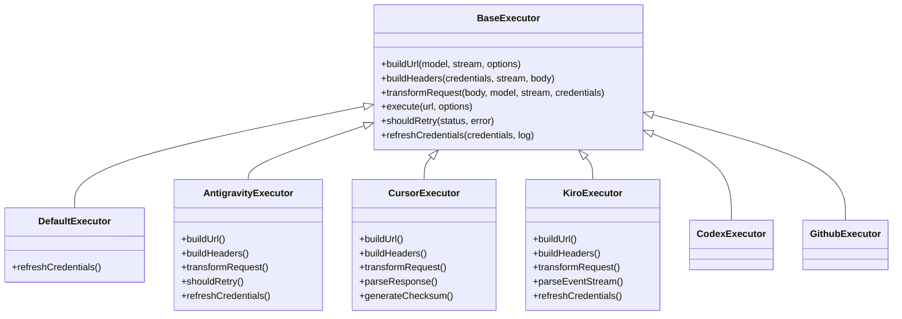

# Dokumentacja bazy kodu OmniRoute

> **Wersja:** v3.8.0
> **Ostatnia aktualizacja:** 2026-06-28
> **Odbiorcy:** Inżynierowie współtworzący OmniRoute lub budujący na nim integracje.
>
> Diagramy architektury wysokiego poziomu i uzasadnienie każdego podsystemu znajdziesz w
> [ARCHITECTURE.md](./ARCHITECTURE.md). Szczegółowe opracowania poszczególnych podsystemów
> (Auto Combo, serwer MCP, serwer A2A, Skills, Memory, Cloud Agents, Resilience,
> Compression, itd.) są w dedykowanych plikach w tym katalogu `docs/`.

Ten plik opisuje **to, co dziś jest w repozytorium**, żeby nowy inżynier
mógł przejść drzewo katalogów, zrozumieć warstwy runtime i wiedzieć, gdzie dodać kod
bez wymyślania nowych modułów.

---

## 1. Stos technologiczny

| Zagadnienie    | Wybór                                                                                                                    |
| -------------- | ------------------------------------------------------------------------------------------------------------------------ |
| Web framework  | **Next.js 16** (App Router, stialone output, brak globalnego middleware)                                                 |
| Język          | **TypeScript 6.0+** — target `ES2022`, `module: esnext`, `moduleResolution: bundler`, `strict: false`                    |
| Runtime        | **Node.js** `>=22.22.2 <23` lub `>=24.0.0 <27` (wymuszane przez `engines` + `SUPPORTED_NODE_RANGE`)                      |
| Baza danych    | **SQLite** przez `better-sqlite3` (singleton, journalowanie WAL)                                                         |
| Desktop        | **Electron 41** + `electron-builder` 26.10 (osobny workspace w `electron/`)                                              |
| Testy          | **Node native test runner** (unit/integration), **Vitest** (MCP, autoCombo, cache), **Playwright** (e2e + protocols-e2e) |
| Build          | Next.js stialone przez `scripts/build/build-next-isolated.mjs`                                                           |
| Lint/format    | ESLint flat config + Prettier (`lint-staged` przez Husky pre-commit)                                                     |
| System modułów | ESM wszędzie (`"type": "module"`)                                                                                        |
| Workspaces     | npm workspace — `open-sse` to jedyny pod-workspace                                                                       |

Aliasy ścieżek (`tsconfig.json`):

- `@/*` → `src/*`
- `@omniroute/open-sse` → `open-sse/index.ts`
- `@omniroute/open-sse/*` → `open-sse/*`

Domyślny port HTTP: **`20128`** (API i dashboard współdzielą ten sam proces). Katalog
danych to zmienna środowiskowa `DATA_DIR`, domyślnie `~/.omniroute/`.

---

## 2. Układ repozytorium

```
OmniRoute/
├── src/                  Aplikacja Next.js (App Router, libs, domain, server, shared)
├── open-sse/             Workspace silnika streamingu (@omniroute/open-sse)
├── electron/             Opakowanie desktopowe (Electron 41 main + preload)
├── bin/                  Punkty wejścia CLI (omniroute, reset-password)
├── tests/                Unit, integration, e2e, protocols-e2e, translator, security, fixtures
├── scripts/              Skrypty build, sync, check, migracji i pomocnicze runtime
├── docs/                 Dokumentacja publiczna (ten katalog)
├── public/               Zasoby statyczne, manifest PWA, service worker
├── config/               Przykłady konfiguracji runtime
├── images/               Zasoby marketingowe / zrzuty ekranu
├── _ideia/, _references/, _mono_repo/, _tasks/   Wewnętrzne notatki / planowanie (nie wydawane)
├── CLAUDE.md             Reguły repo dla Claude Code
├── AGENTS.md             Głębsza referencja architektury dla agentów
├── package.json          v3.8.0, korzeń workspace
└── tsconfig.json         Aliasy ścieżek + główne opcje kompilatora
```

---

## 3. `src/` — Aplikacja Next.js

```
src/
├── app/                  Strony App Router + trasy API
├── lib/                  Biblioteki rdzeniowe (DB, auth, OAuth, skills, memory, …)
├── domain/               Czysta warstwa domenowa (policy, fallback, cost, lockout, …)
├── server/               Moduły tylko serwerowe (authz, cors, auth)
├── shared/               Typy, stałe, walidacja, kontrakty, utils (bezpieczne cross-boundary)
├── mitm/                 Pomocniki proxy MITM do integracji CLI
├── models/               Lokalne metadane modeli / aliasowanie
├── sse/                  Legacy handlery SSE nadal w src/ (nie open-sse/)
├── store/                Magazyny stanu po stronie klienta
├── middleware/           Narzędzia middleware na poziomie trasy (nie globalne middleware Next.js)
├── scripts/              Skrypty w drzewie importowalne przez kod aplikacji
├── types/                Ambient i współdzielone typy TS
├── i18n/                 Pakiety locale
├── instrumentation.ts    Hook instrumentation Next.js
├── instrumentation-node.ts
├── server-init.ts        Bootstrap na poziomie procesu (env, DB, jobs, sync)
└── proxy.ts              Pomocnik bootstrapu proxy najwyższego poziomu
```

### 3.1 `src/app/` — App Router

App Router udostępnia zarówno UI dashboardu, jak i publiczne/zarządcze HTTP API.
Nie ma **globalnego middleware** — przechwytywanie jest per-trasa.

Segmenty najwyższego poziomu w `src/app/`:

| Ścieżka                                                                       | Przeznaczenie                                |
| ----------------------------------------------------------------------------- | -------------------------------------------- |
| `api/`                                                                        | Wszystkie trasy HTTP API (rozbicie poniżej)  |
| `a2a/`                                                                        | A2A JSON-RPC 2.0 endpoint (`POST /a2a`)      |
| `.well-known/agent.json/`                                                     | Dokument discovery A2A Agent Card            |
| `(dashboard)/`                                                                | UI dashboardu (grupa tras, bez prefiksu URL) |
| `auth/`, `login/`, `forgot-password/`, `callback/`                            | Przepływy auth                               |
| `liing/`                                                                      | Marketing/liing page                         |
| `docs/`                                                                       | Wbudowana przeglądarka docs API              |
| `status/`, `maintenance/`, `offline/`                                         | Strony operacyjne                            |
| `privacy/`, `terms/`                                                          | Strony prawne                                |
| `400/`, `401/`, `403/`, `408/`, `429/`, `500/`, `502/`, `503/`                | Statyczne strony błędów                      |
| `error.tsx`, `global-error.tsx`, `not-found.tsx`, `forbidden/`, `loading.tsx` | Granice error/loading frameworka             |
| `layout.tsx`, `page.tsx`, `globals.css`, `manifest.ts`                        | Powłoka root                                 |

#### 3.1.1 `src/app/(dashboard)/dashboard/` — Strony UI

`agents`, `analytics`, `api-manager`, `audit`, `auto-combo`, `batch`, `cache`,
`changelog`, `cli-tools`, `cloud-agents`, `combos`, `compression`, `context`,
`costs`, `endpoint`, `health`, `limits`, `logs`, `memory`, `onboarding`,
`playground`, `providers`, `search-tools`, `settings`, `skills`, `system`,
`translator`, `usage`, `webhooks`, plus root `page.tsx`, `HomePageClient.tsx`,
`BootstrapBanner.tsx`.

#### 3.1.2 `src/app/api/` — Grupy API najwyższego poziomu

```
src/app/api/
├── a2a/{status, tasks}
├── acp/
├── admin/
├── analytics/
├── assess/
├── auth/
├── batches/
├── cache/
├── cli-tools/
├── cloud/{codex-responses-ws}
├── combos/
├── compliance/
├── compression/
├── context/
├── db/, db-backups/
├── evals/
├── fallback/
├── files/
├── health/
├── init/
├── internal/{concurrency}
├── keys/
├── logs/
├── mcp/{audit, sse, status, stream, tools}
├── memory/{health, [id]/, route.ts}
├── model-combo-mappings/
├── models/
├── monitoring/
├── oauth/
├── openapi/
├── policies/
├── pricing/
├── provider-metrics/, provider-models/, provider-nodes/
├── providers/
├── rate-limit/, rate-limits/
├── resilience/
├── restart/, shutdown/
├── search/
├── sessions/
├── settings/
├── skills/{executions, [id], install, marketplace, route.ts, skillssh}
├── storage/
├── sync/, synced-available-models/
├── system/
├── tags/
├── telemetry/
├── token-health/
├── translator/
├── tunnels/
├── services/   Zarządzanie usługami wbudowanymi (9router, cliproxy) — LOCAL_ONLY
├── upstream-proxy/
├── usage/
├── v1/         Publiczne API zgodne z OpenAI
├── v1beta/     Compat w stylu Gemini
├── version-manager/
└── webhooks/
```

#### 3.1.2a `src/app/api/services/` — Zarządzanie Embedded Services

Trasy do instalacji, startu, stopu i monitorowania 9Router oraz CLIProxyAPI.
Wszystkie ścieżki są sklasyfikowane jako **LOCAL_ONLY** (tylko loopback, hard rule #17), bo
mogą wywołać `npm install` i uruchamiać procesy potomne.

```
src/app/api/services/
├── 9router/
│   ├── _lib.ts             helper getOrInitSupervisor()
│   ├── install/route.ts    POST — npm install przez execFile
│   ├── start/route.ts      POST — supervisor.start()
│   ├── stop/route.ts       POST — supervisor.stop()
│   ├── restart/route.ts    POST — supervisor.restart()
│   ├── update/route.ts     POST — npm install nowszej wersji
│   ├── rotate-key/route.ts POST — generuj nowy klucz API + restart
│   ├── status/route.ts     GET  — status live + DB + metadane wersji
│   └── auto-start/route.ts POST — przełącz flagę auto_start
├── cliproxy/
│   ├── _lib.ts             helper getOrInitSupervisor()
│   ├── install/route.ts    POST — npm install
│   ├── start/route.ts      POST — supervisor.start()
│   ├── stop/route.ts       POST — supervisor.stop()
│   ├── restart/route.ts    POST — supervisor.restart()
│   ├── update/route.ts     POST — npm install nowszej wersji
│   ├── status/route.ts     GET  — status live + DB + metadane wersji
│   └── auto-start/route.ts POST — przełącz flagę auto_start
└── [name]/
    └── logs/route.ts       GET  — SSE log tail (współdzielone przez wszystkie usługi)
```

Odpowiednie UI dashboardu:
`src/app/(dashboard)/dashboard/providers/services/` — strona z dwiema zakładkami (CLIProxyAPI + 9Router).
Reverse proxy dla wbudowanego UI 9Router:
`src/app/(dashboard)/dashboard/providers/services/[name]/embed/[...path]/route.ts`

Deep-dive: `docs/frameworks/EMBEDDED-SERVICES.md`

#### 3.1.3 `src/app/api/v1/` — Publiczne API zgodne z OpenAI

```
v1/
├── accounts/[id]/                       lookup konta
├── agents/tasks/[id]/, agents/tasks/    endpointy tasków w stylu A2A
├── api/                                 wewnętrzne helpery API pod v1/api
├── audio/{speech, transcriptions}/      TTS + STT
├── batches/[id]/{cancel}, batches/      OpenAI Batches API
├── chat/completions/                    Chat Completions (główny endpoint)
├── chatgpt-web/                         compat ChatGPT-Web
├── completions/                         Legacy text completions
├── embeddings/                          Embeddings
├── files/[id]/, files/                  Pliki API
├── _helpers/                            Współdzielone helpery tras (bez publicznego URL)
├── images/{edits, generations}/         Generowanie + edycja obrazów
├── issues/                              Endpointy pomocnicze triage
├── management/{proxies}/                Trasy w zakresie management wewnątrz v1
├── messages/{count_tokens}/             Compat messages w stylu Anthropic
├── models/                              Lista modeli (`route.ts`, `catalog.ts`)
├── moderations/                         Moderation
├── music/                               Generowanie muzyki
├── providers/[provider]/                Operacje per-provider
├── quotas/{check}                       Sondy quota
├── registered-keys/                     Admin zarejestrowanych kluczy
├── rerank/                              Reranking
├── responses/[...path]/                 OpenAI Responses API (catch-all)
├── search/                              Wyszukiwanie w sieci
├── videos/                              Generowanie wideo
├── ws/                                  Most WebSocket
└── route.ts                             Hiler indeksu
```

Każdy plik trasy stosuje ten sam wzorzec:

```
Route → CORS preflight → walidacja body Zod → opcjonalny auth
      → egzekwowanie polityki klucza API → delegacja do handlera (open-sse)
```

`v1beta/` to powierzchnia compat w stylu Gemini (cienka warstwa, która tłumaczy do
tego samego pipeline'u `open-sse/handlers/`).

### 3.2 `src/lib/` — Biblioteki rdzeniowe

Zawsze importuj dane, sync, OAuth, skill, memory itd. przez te moduły. Tabela
grupuje rzeczywiste katalogi i istotne pliki najwyższego poziomu.

| Moduł             | Przeznaczenie                                                                                                                                                                                                                                                                                                                                                                                                                                                                                                                                                                                                                                                                                  |
| ----------------- | ---------------------------------------------------------------------------------------------------------------------------------------------------------------------------------------------------------------------------------------------------------------------------------------------------------------------------------------------------------------------------------------------------------------------------------------------------------------------------------------------------------------------------------------------------------------------------------------------------------------------------------------------------------------------------------------------- |
| `a2a/`            | Serwer protokołu A2A: `taskManager.ts`, `streaming.ts`, `taskExecution.ts`, `routingLogger.ts`, `skills/` (6 skilli: cost analysis, health report, provider discovery, quota management, smart routing, list-capabilities)                                                                                                                                                                                                                                                                                                                                                                                                                                                                     |
| `acp/`            | Agent-Control-Protocol: `index.ts`, `manager.ts`, `registry.ts`                                                                                                                                                                                                                                                                                                                                                                                                                                                                                                                                                                                                                                |
| `api/`            | Wewnętrzne helpery API: `requireManagementAuth.ts`, `requireCliToolsAuth.ts`, `errorResponse.ts`                                                                                                                                                                                                                                                                                                                                                                                                                                                                                                                                                                                               |
| `auth/`           | `managementPassword.ts` (reset hasła / hashowanie)                                                                                                                                                                                                                                                                                                                                                                                                                                                                                                                                                                                                                                             |
| `batches/`        | Usługa OpenAI Batches API (`service.ts`)                                                                                                                                                                                                                                                                                                                                                                                                                                                                                                                                                                                                                                                       |
| `catalog/`        | Sync katalogu OpenRouter (`openrouterCatalog.ts`)                                                                                                                                                                                                                                                                                                                                                                                                                                                                                                                                                                                                                                              |
| `cloudAgent/`     | Rejestr cloud agent: `api.ts`, `baseAgent.ts`, `db.ts`, `index.ts`, `registry.ts`, `types.ts`, `agents/{codex, devin, jules}.ts`                                                                                                                                                                                                                                                                                                                                                                                                                                                                                                                                                               |
| `combos/`         | Helpery resolucji combo                                                                                                                                                                                                                                                                                                                                                                                                                                                                                                                                                                                                                                                                        |
| `compliance/`     | Audit + provider audit: `index.ts`, `providerAudit.ts`                                                                                                                                                                                                                                                                                                                                                                                                                                                                                                                                                                                                                                         |
| `config/`         | Klej konfiguracji runtime                                                                                                                                                                                                                                                                                                                                                                                                                                                                                                                                                                                                                                                                      |
| `db/`             | Moduły domenowe SQLite (zob. §3.2.1)                                                                                                                                                                                                                                                                                                                                                                                                                                                                                                                                                                                                                                                           |
| `display/`        | Helpery UI/display używane przez odpowiedzi API                                                                                                                                                                                                                                                                                                                                                                                                                                                                                                                                                                                                                                                |
| `embeddings/`     | Rejestr usług embedding                                                                                                                                                                                                                                                                                                                                                                                                                                                                                                                                                                                                                                                                        |
| `env/`            | Ładowanie env + introspekcja                                                                                                                                                                                                                                                                                                                                                                                                                                                                                                                                                                                                                                                                   |
| `evals/`          | Runtime ewaluacji                                                                                                                                                                                                                                                                                                                                                                                                                                                                                                                                                                                                                                                                              |
| `guardrails/`     | `piiMasker.ts`, `promptInjection.ts`, `visionBridge.ts`, `visionBridgeHelpers.ts`, `registry.ts`, `base.ts`                                                                                                                                                                                                                                                                                                                                                                                                                                                                                                                                                                                    |
| `jobs/`           | Zadania w tle (`autoUpdate.ts`, …)                                                                                                                                                                                                                                                                                                                                                                                                                                                                                                                                                                                                                                                             |
| `memory/`         | Trwała pamięć: `store.ts`, `cache.ts`, `retrieval.ts`, `summarization.ts`, `extraction.ts`, `injection.ts`, `qdrant.ts`, `settings.ts`, `verify.ts`, `schemas.ts`, `types.ts`                                                                                                                                                                                                                                                                                                                                                                                                                                                                                                                  |
| `monitoring/`     | `observability.ts`                                                                                                                                                                                                                                                                                                                                                                                                                                                                                                                                                                                                                                                                             |
| `oauth/`          | Providery OAuth (13): `antigravity`, `claude`, `cline`, `codex`, `cursor`, `gemini`, `github`, `gitlab-duo`, `kilocode`, `kimi-coding`, `kiro`, `qoder`, `windsurf` plus `services/`, `utils/{pkce, server, banner, codexAuthFile, ui}`, `constants/oauth.ts`                                                                                                                                                                                                                                                                                                                                                                                                                                  |
| `plugins/`        | Loader wtyczek (`index.ts`)                                                                                                                                                                                                                                                                                                                                                                                                                                                                                                                                                                                                                                                                    |
| `promptCache/`    | `prefixAnalyzer.ts`, `index.ts`                                                                                                                                                                                                                                                                                                                                                                                                                                                                                                                                                                                                                                                                |
| `providerModels/` | Cykl życia managed models: `modelDiscovery.ts`, `managedModelImport.ts`, `managedAvailableModels.ts`, `cursorAgent.ts`                                                                                                                                                                                                                                                                                                                                                                                                                                                                                                                                                                         |
| `providers/`      | Helpery providerów: `catalog.ts`, `validation.ts`, `imageValidation.ts`, `claudeExtraUsage.ts`, `codexConnectionDefaults.ts`, `codexFastTier.ts`, `webCookieAuth.ts`, `managedAvailableModels.ts`, `requestDefaults.ts`                                                                                                                                                                                                                                                                                                                                                                                                                                                                        |
| `resilience/`     | `settings.ts` — ustawienia circuit breakera, cooldown, lockout                                                                                                                                                                                                                                                                                                                                                                                                                                                                                                                                                                                                                                 |
| `runtime/`        | Wykrywanie feature'ów runtime                                                                                                                                                                                                                                                                                                                                                                                                                                                                                                                                                                                                                                                                  |
| `search/`         | `executeWebSearch.ts`                                                                                                                                                                                                                                                                                                                                                                                                                                                                                                                                                                                                                                                                          |
| `services/`       | Framework usług wbudowanych: `ServiceSupervisor.ts` (generyczny supervisor procesów potomnych z operation lock, ring buffer, health checker), `bootstrap.ts` (process-level registration i auto-start), `registry.ts` (mapa tool → supervisor), `apiKey.ts` (magazyn kluczy AES-256-GCM), `modelSync.ts` (okresowy sync modeli), `ringBuffer.ts` (okrągły bufor logów 5 MB), `healthCheck.ts` (sonda health HTTP), `types.ts`, `embedWsProxy.ts` (proxy WebSocket), `installers/{ninerouter,cliproxy}.ts`. See `docs/frameworks/EMBEDDED-SERVICES.md`                                                                                                                                          |
| `agentSkills/`    | Katalog + generator Agent Skills: `catalog.ts` (getCatalog/getSkillById/filterCatalog/computeCoverage), `generator.ts` (generateAgentSkills → zapisuje `skills/{id}/SKILL.md`), `openapiParser.ts` (wyciąga endpointy REST ze specyfikacji OpenAPI), `cliRegistryParser.ts` (extracts CLI subcommands from bin/cli-registry), `schemas.ts` (Zod: AgentSkillSchema, SkillCoverageSchema, ListQuerySchema, GenerateBodySchema), `types.ts` (AgentSkill, SkillCoverage, SkillMarkdown, GeneratorReport). Konsumowane przez trasy REST (`/api/agent-skills/*`), narzędzia MCP (`omniroute_agent_skills_*`), i A2A skill `list-capabilities`. See [AGENT-SKILLS.md](../frameworks/AGENT-SKILLS.md). |
| `skills/`         | Framework skilli: `registry.ts`, `executor.ts`, `interception.ts`, `injection.ts`, `sibox.ts`, `custom.ts`, `hybrid.ts`, `builtins.ts`, `a2a.ts`, `providerSettings.ts`, `schemas.ts`, `skillssh.ts`, `types.ts`, plus `builtin/browser.ts`                                                                                                                                                                                                                                                                                                                                                                                                                                                    |
| `spend/`          | `batchWriter.ts` (bufor write-behind)                                                                                                                                                                                                                                                                                                                                                                                                                                                                                                                                                                                                                                                          |
| `sync/`           | `bundle.ts`, `tokens.ts` (Cloud Sync)                                                                                                                                                                                                                                                                                                                                                                                                                                                                                                                                                                                                                                                          |
| `system/`         | Helpery systemowe                                                                                                                                                                                                                                                                                                                                                                                                                                                                                                                                                                                                                                                                              |
| `translator/`     | Klej translatora najwyższego poziomu (deleguje do `open-sse/translator/`)                                                                                                                                                                                                                                                                                                                                                                                                                                                                                                                                                                                                                      |
| `usage/`          | Księgowanie użycia: `costCalculator.ts`, `tokenAccounting.ts`, `usageHistory.ts`, `aggregateHistory.ts`, `usageStats.ts`, `callLogs.ts`, `callLogArtifacts.ts`, `fetcher.ts`, `providerLimits.ts`, `migrations.ts`                                                                                                                                                                                                                                                                                                                                                                                                                                                                             |
| `versionManager/` | Auto-update + manifest wersji                                                                                                                                                                                                                                                                                                                                                                                                                                                                                                                                                                                                                                                                  |
| `ws/`             | Most WebSocket                                                                                                                                                                                                                                                                                                                                                                                                                                                                                                                                                                                                                                                                                 |
| `zed-oauth/`      | Przepływ OAuth edytora Zed                                                                                                                                                                                                                                                                                                                                                                                                                                                                                                                                                                                                                                                                     |

Pliki najwyższego poziomu w `src/lib/`:

- `localDb.ts` — wyłącznie warstwa re-export. **Nigdy** nie dodawaj tu logiki.
- `proxyHealth.ts`, `proxyLogger.ts`, `tokenHealthCheck.ts`, `localHealthCheck.ts`
- `oneproxyRotator.ts`, `oneproxySync.ts`
- `apiBridgeServer.ts`, `cacheLayer.ts`, `semanticCache.ts`, `settingsCache.ts`
- `cloudSync.ts`, `initCloudSync.ts`
- `cloudflaredTunnel.ts`, `ngrokTunnel.ts`, `tailscaleTunnel.ts`
- `consoleInterceptor.ts`, `container.ts`, `gracefulShutdown.ts`, `idempotencyLayer.ts`
- `ipUtils.ts`, `logEnv.ts`, `logPayloads.ts`, `logRotation.ts`
- `modelAliasSeed.ts`, `modelCapabilities.ts`, `modelMetadataRegistry.ts`, `modelsDevSync.ts`
- `piiSanitizer.ts`, `pricingSync.ts`
- `apiKeyExposure.ts`, `cacheControlSettings.ts`, `dataPaths.ts`, `toolPolicy.ts`
- `translatorEvents.ts`, `usageDb.ts`, `usageAnalytics.ts`, `webhookDispatcher.ts`

#### 3.2.1 `src/lib/db/`

Singletonowa baza SQLite (`getDbInstance()` w `core.ts`, journalowanie WAL).
**Nigdy nie pisz surowego SQL w trasach ani handlerach** — idź przez te moduły.


> Źródło: [diagrams/db-schema-overview.mmd](../diagrams/db-schema-overview.mmd)

Moduły domenowe (każdy posiada jedną lub więcej tabel): `apiKeys.ts`, `backup.ts`,
`batches.ts`, `cleanup.ts`, `cliToolState.ts`, `combos.ts`,
`commiCodeAuth.ts`, `compression.ts`, `compressionAnalytics.ts`,
`compressionCacheStats.ts`, `compressionCombos.ts`, `compressionScheduler.ts`,
`contextHioffs.ts`, `core.ts`, `creditBalance.ts`, `databaseSettings.ts`,
`detailedLogs.ts`, `domainState.ts`, `encryption.ts`, `evals.ts`, `files.ts`,
`healthCheck.ts`, `jsonMigration.ts`, `migrationRunner.ts`,
`modelComboMappings.ts`, `models.ts`, `oneproxy.ts`, `prompts.ts`,
`providers.ts`, `providerLimits.ts`, `proxies.ts`, `quotaSnapshots.ts`,
`readCache.ts`, `reasoningCache.ts`, `registeredKeys.ts`, `secrets.ts`,
`sessionAccountAffinity.ts`, `settings.ts`, `stateReset.ts`, `stats.ts`,
`syncTokens.ts`, `tierConfig.ts`, `upstreamProxy.ts`, `versionManager.ts`,
`webhooks.ts`.

`migrations/` zawiera 55 wersjonowanych plików `.sql` (idempotentne, transakcyjne) i jest
wykonywany przez `migrationRunner.ts` przy starcie.

Tabele utworzone w migracjach (łącznie 52):

`a`, `account_key_limits`, `api_keys`, `batches`, `call_logs`,
`combo_adaptation_state`, `combos`, `commi_code_auth_sessions`,
`compression_analytics`, `compression_cache_stats`,
`compression_combo_assignments`, `compression_combos`, `context_hioffs`,
`daily_usage_summary`, `db_meta`, `domain_budgets`, `domain_circuit_breakers`,
`domain_cost_history`, `domain_fallback_chains`, `domain_lockout_state`,
`eval_cases`, `eval_runs`, `eval_suites`, `files`, `hourly_usage_summary`,
`key_value`, `mcp_tool_audit`, `memories`, `model_combo_mappings`,
`provider_connections`, `provider_key_limits`, `provider_nodes`,
`proxy_assignments`, `proxy_logs`, `proxy_registry`, `quota_snapshots`,
`reasoning_cache`, `registered_keys`, `request_detail_logs`,
`routing_decisions`, `semantic_cache`, `session_account_affinity`,
`skill_executions`, `skills`, `sync_tokens`, `tier_assignments`,
`tier_config`, `upstream_proxy_config`, `usage_history`, `version_manager`,
`webhooks` (plus wirtualne tabele FTS5 do wyszukiwania w memory).

### 3.3 `src/domain/` — Warstwa domenowa

Czysta logika biznesowa, bez I/O. Importowana przez trasy i handlery.

| Plik                                       | Przeznaczenie                                     |
| ------------------------------------------ | ------------------------------------------------- |
| `policyEngine.ts`                          | Resolver polityki najwyższego poziomu             |
| `fallbackPolicy.ts`                        | Drzewo decyzji fallbacku                          |
| `costRules.ts`                             | Reguły kalkulacji kosztów                         |
| `lockoutPolicy.ts`                         | Decyzje lockout modelu                            |
| `tagRouter.ts`                             | Routing oparty na tagach                          |
| `comboResolver.ts`                         | Resolucja combo z requestu → lista targetów       |
| `connectionModelRules.ts`                  | Filtry modeli per-połączenie                      |
| `modelAvailability.ts`                     | Sprawdzanie dostępności modelu                    |
| `degradation.ts`                           | Przejścia trybu zdegradowanego                    |
| `providerExpiration.ts`                    | Wykrywanie wygasłego konta/klucza                 |
| `quotaCache.ts`                            | Cache'owane decyzje quota                         |
| `responses.ts`, `omnirouteResponseMeta.ts` | Helpery kształtu odpowiedzi                       |
| `configAudit.ts`                           | Audyt zmian konfiguracji                          |
| `assessment/`                              | Ocena modelu (wg RFC, częściowo zaimplementowane) |
| `types.ts`                                 | Współdzielone typy domenowe                       |

### 3.4 `src/server/` — Tylko serwer

Nie może być importowany z komponentów klienckich.

```
server/
├── auth/loginGuard.ts
├── authz/
│   ├── classify.ts        Klasyfikuje trasy jako public vs management
│   ├── assertAuth.ts      Helper asercji
│   ├── context.ts         Kontekst authz per-request
│   ├── headers.ts
│   ├── pipeline.ts        Pipeline authz
│   ├── policies/          Konkretne polityki
│   └── types.ts
└── cors/origins.ts        Allowlista origin CORS
```

### 3.5 `src/shared/` — Bezpieczne do współdzielenia

Podzielone na skupione podkatalogi:

- `constants/` — `providers.ts` (katalog providerów walidowany Zod), `models.ts`,
  `modelSpecs.ts`, `modelCompat.ts`, `pricing.ts`, `cliTools.ts`,
  `cliCompatProviders.ts`, `routingStrategies.ts`, `comboConfigMode.ts`,
  `headers.ts`, `upstreamHeaders.ts` (denylist), `mcpScopes.ts`,
  `errorCodes.ts`, `publicApiRoutes.ts`, `batch.ts`, `batchEndpoints.ts`,
  `bodySize.ts`, `colors.ts`, `appConfig.ts`, `config.ts`,
  `sidebarVisibility.ts`, `visionBridgeDefaults.ts`.
- `validation/` — `schemas.ts` (~80 schematów Zod), `compressionConfigSchemas.ts`,
  `oneproxySchemas.ts`, `providerSchema.ts`, `settingsSchemas.ts`, `helpers.ts`.
- `contracts/` — publiczne kontrakty API dostarczane do npm.
- `types/` — współdzielone typy TS.
- `utils/` — `circuitBreaker.ts`, `apiAuth.ts`, `apiKey.ts`, `apiKeyPolicy.ts`,
  `apiResponse.ts`, `api.ts`, `classify429.ts`, `cliCompat.ts`, `clipboard.ts`,
  `cloud.ts`, `cn.ts`, `cors.ts`, `costEstimator.ts`, `featureFlags.ts`,
  `fetchTimeout.ts`, `formatting.ts`, `inputSanitizer.ts`, `logger.ts`,
  `machine.ts`, `machineId.ts`, `maskEmail.ts`, `modelCatalogSearch.ts`,
  `nodeRuntimeSupport.ts`, `parseApiKeys.ts`, `providerHints.ts`,
  `providerModelAliases.ts`, `rateLimiter.ts`, `releaseNotes.ts`,
  `a11yAudit.ts`, plus hooki/komponenty dashboardu w `services/`, `network/`,
  `middleware/`, `schemas/`, `hooks/`, `components/`.

---

## 4. `open-sse/` — Workspace silnika streamingu

Osobny npm workspace publikowany jako `@omniroute/open-sse`. Odpowiada za
przetwarzanie requestów, executory, translatory, services, transformer i serwer MCP.



| Executor         | Provider                                   | Key Specializations                                                                                                 |
| ---------------- | ------------------------------------------ | ------------------------------------------------------------------------------------------------------------------- |
| `base.ts`        | —                                          | Abstract base: URL building, headers, retry logic, credential refresh                                               |
| `default.ts`     | Claude, Gemini, OpenAI, GLM, Kimi, MiniMax | Generic OAuth token refresh for standard providers                                                                  |
| `antigravity.ts` | Google Cloud Code                          | Project/session ID generation, multi-URL fallback, custom retry parsing from error messages ("reset after 2h7m23s") |
| `cursor.ts`      | Cursor IDE                                 | **Most complex**: SHA-256 checksum auth, Protobuf request encoding, binary EventStream → SSE response parsing       |
| `codex.ts`       | OpenAI Codex                               | Injects system instructions, manages thinking levels, removes unsupported parameters                                |
| `github.ts`      | GitHub Copilot                             | Dual token system (GitHub OAuth + Copilot token), VSCode header mimicking                                           |
| `kiro.ts`        | AWS CodeWhisperer                          | AWS EventStream binary parsing, AMZN event frames, token estimation                                                 |
| `index.ts`       | —                                          | Factory: maps provider name → executor class, with default fallback                                                 |

---

## 5. `electron/` — Opakowanie desktopowe

```
electron/
├── main.js                  Proces main Electron
├── preload.js               Most preload (contextIsolation włączony)
├── types.d.ts
├── package.json             konfiguracja electron-builder, wersja 3.8.0
├── README.md
├── assets/                  Zasoby build (ikony, entitlements, …)
├── node_modules/            Dedykowane node_modules (better-sqlite3, electron-updater)
└── dist-electron/           Wynik build (nie commitowany)
```

Pięć skryptów npm w korzeniu workspace: `electron:dev`, `electron:build`,
`electron:build:{win,mac,linux}`, `electron:smoke:packaged`. Auto-update przez
`electron-updater` wskazujący na feed wydań GitHub.

---

## 6. `bin/` — CLI

```
bin/
├── omniroute.mjs           Główne wejście CLI (Node ESM)
├── reset-password.mjs      Reset hasła management z CLI
├── mcp-server.mjs          Launcher serwera MCP (stdio)
├── nodeRuntimeSupport.mjs  Strażnik wersji Node
└── cli/
    ├── program.mjs         Builder programu Commander
    ├── runtime.mjs         helper withRuntime (server-first/db-fallback)
    ├── output.mjs          Formattery wyjścia (json/jsonl/table/csv)
    ├── i18n.mjs            helper t() z locale
    ├── api.mjs             Helper fetch API
    ├── data-dir.mjs
    ├── encryption.mjs
    ├── sqlite.mjs
    └── commands/
        ├── registry.mjs    Rejestracja komend
        ├── setup.mjs
        ├── doctor.mjs
        ├── providers.mjs
        └── ...             (jeden plik na komendę/grupę)
```

Dwa binaria są wystawione w `package.json` → `bin`:

- `omniroute` → `bin/omniroute.mjs`
- `omniroute-reset-password` → `bin/reset-password.mjs`

---

## 7. `tests/`

| Katalog                                                                        | Typ                                                                                                       |
| ------------------------------------------------------------------------------ | --------------------------------------------------------------------------------------------------------- |
| `tests/unit/`                                                                  | Testy jednostkowe przez Node native test runner (1821 plików, plus `api/`, `auth/`, `authz/` podkatalogi) |
| `tests/integration/`                                                           | Testy cross-module + stan DB                                                                              |
| `tests/e2e/`                                                                   | Playwright UI tests                                                                                       |
| `tests/protocols-e2e/`                                                         | MCP/A2A protocol e2e                                                                                      |
| `tests/translator/`                                                            | Translator-specific tests                                                                                 |
| `tests/security/`                                                              | Security regressions                                                                                      |
| `tests/load/`                                                                  | Load / stress tests                                                                                       |
| `tests/golden-set/`                                                            | Reference outputs for translator regressions                                                              |
| `tests/helpers/`, `tests/fixtures/`, `tests/manual/`, `tests/scratch_test.mjs` | Support                                                                                                   |

Common commands:

| Command                                                  | What it runs                                                     |
| -------------------------------------------------------- | ---------------------------------------------------------------- |
| `npm run test:unit`                                      | All `tests/unit/*.test.ts` via Node test runner (concurrency 10) |
| `npm run test:vitest`                                    | Vitest suite (MCP, autoCombo, cache)                             |
| `npm run test:e2e`                                       | Pakiet UI Playwright                                             |
| `npm run test:protocols:e2e`                             | e2e protokołów MCP + A2A                                         |
| `npm run test:coverage`                                  | Coverage gate (≥60% lines/statements/functions/branches)         |
| `node --import tsx/esm --test tests/unit/<file>.test.ts` | Single file run                                                  |

---

## 8. `scripts/`

Zorganizowane w 6 podkatalogów według przeznaczenia.

- **`scripts/build/`** — `build-next-isolated.mjs`, `prepublish.ts`,
  `prepare-electron-standalone.mjs`, `pack-artifact-policy.ts`,
  `validate-pack-artifact.ts`, `postinstall.mjs`, `postinstallSupport.mjs`,
  `uninstall.mjs`, `bootstrap-env.mjs`, `runtime-env.mjs`,
  `native-binary-compat.mjs`.
- **`scripts/dev/`** — `run-next.mjs`, `run-next-playwright.mjs`,
  `run-standalone.mjs`, `standalone-server-ws.mjs`, `responses-ws-proxy.mjs`,
  `v1-ws-bridge.mjs`, `smoke-electron-packaged.mjs`,
  `run-playwright-tests.mjs`, `run-ecosystem-tests.mjs`,
  `run-protocol-clients-tests.mjs`, `sync-env.mjs`, `healthcheck.mjs`,
  `system-info.mjs`.
- **`scripts/check/`** — `check-cycles.mjs`, `check-docs-sync.mjs`,
  `check-docs-counts-sync.mjs`, `check-env-doc-sync.mjs`,
  `check-deprecated-versions.mjs`, `check-route-validation.mjs`,
  `check-t11-any-budget.mjs`, `check-pr-test-policy.mjs`,
  `check-supported-node-runtime.ts`, `test-report-summary.mjs`.
- **`scripts/docs/`** — `generate-docs-index.mjs`, `gen-provider-reference.ts`.
- **`scripts/i18n/`** — `generate-multilang.mjs`, `run-visual-qa.mjs`,
  `generate-qa-checklist.mjs`, `apply-priority-overrides.mjs`,
  `validate_translation.py`, `check_translations.py`, `i18n_autotranslate.py`,
  `untranslatable-keys.json`.
- **`scripts/ad-hoc/`** — `cursor-tap.cjs`, `sync-cursor-models.mjs`,
  `migrate-env.mjs`, `dbsetup.js`.

---

## 9. Pipeline requestu (podsumowanie)


> Źródło: [diagrams/request-pipeline.mmd](../diagrams/request-pipeline.mmd)

| Route                                         | Methods         | Purpose                                                                               |
| --------------------------------------------- | --------------- | ------------------------------------------------------------------------------------- |
| `/api/provider-models`                        | GET/POST/DELETE | CRUD for custom models per provider                                                   |
| `/api/models/catalog`                         | GET             | Aggregated catalog of all models (chat, embedding, image, custom) grouped by provider |
| `/api/settings/proxy`                         | GET/PUT/DELETE  | Hierarchical outbound proxy configuration (`global/providers/combos/keys`)            |
| `/api/settings/proxy/test`                    | POST            | Validates proxy connectivity and returns public IP/latency                            |
| `/v1/providers/[provider]/chat/completions`   | POST            | Dedicated per-provider chat completions with model validation                         |
| `/v1/providers/[provider]/embeddings`         | POST            | Dedicated per-provider embeddings with model validation                               |
| `/v1/providers/[provider]/images/generations` | POST            | Dedicated per-provider image generation with model validation                         |
| `/api/settings/ip-filter`                     | GET/PUT         | IP allowlist/blocklist management                                                     |
| `/api/settings/thinking-budget`               | GET/PUT         | Reasoning token budget configuration (passthrough/auto/custom/adaptive)               |
| `/api/settings/system-prompt`                 | GET/PUT         | Global system prompt injection for all requests                                       |
| `/api/sessions`                               | GET             | Active session tracking and metrics                                                   |
| `/api/rate-limits`                            | GET             | Per-account rate limit status                                                         |

---

## 5. Key Design Patterns

### 5.1 Hub-and-Spoke Translation

All formats translate through **OpenAI format as the hub**. Adding a new provider only requires writing **one pair** of translators (to/from OpenAI), not N pairs.

### 5.2 Executor Strategy Pattern

Each provider has a dedicated executor class inheriting from `BaseExecutor`. The factory in `executors/index.ts` selects the right one at runtime.

### 5.3 Self-Registering Plugin System

Translator modules register themselves on import via `register()`. Adding a new translator is just creating a file and importing it.

### 5.4 Account Fallback with Exponential Backoff

When a provider returns 429/401/500, the system can switch to the next account, applying exponential cooldowns (1s → 2s → 4s → max 2min).

### 5.5 Combo Model Chains

A "combo" groups multiple `provider/model` strings. If the first fails, fallback to the next automatically.

### 5.6 Stateful Streaming Translation

Response translation maintains state across SSE chunks (thinking block tracking, tool call accumulation, content block indexing) via the `initState()` mechanism.

### 5.7 Usage Safety Buffer

A 2000-token buffer is added to reported usage to prevent clients from hitting context window limits due to overhead from system prompts and format translation.

---

## 6. Supported Formats

| Format                  | Direction       | Identifier         |
| ----------------------- | --------------- | ------------------ |
| OpenAI Chat Completions | source + target | `openai`           |
| OpenAI Responses API    | source + target | `openai-responses` |
| Anthropic Claude        | source + target | `claude`           |
| Google Gemini           | source + target | `gemini`           |
| Antigravity             | source + target | `antigravity`      |
| AWS Kiro                | target only     | `kiro`             |
| Cursor                  | target only     | `cursor`           |

---

## 7. Supported Providers

| Provider                 | Auth Method            | Executor    | Key Notes                                     |
| ------------------------ | ---------------------- | ----------- | --------------------------------------------- |
| Anthropic Claude         | API key or OAuth       | Default     | Uses `x-api-key` header                       |
| Google Gemini            | API key or OAuth       | Default     | Uses `x-goog-api-key` header                  |
| Antigravity              | OAuth                  | Antigravity | Multi-URL fallback, custom retry parsing      |
| OpenAI                   | API key                | Default     | Standard Bearer auth                          |
| Codex                    | OAuth                  | Codex       | Injects system instructions, manages thinking |
| GitHub Copilot           | OAuth + Copilot token  | Github      | Dual token, VSCode header mimicking           |
| Kiro (AWS)               | AWS SSO OIDC or Social | Kiro        | Binary EventStream parsing                    |
| Cursor IDE               | Checksum auth          | Cursor      | Protobuf encoding, SHA-256 checksums          |
| Qwen                     | OAuth                  | Default     | Standard auth                                 |
| Qoder                    | OAuth (Basic + Bearer) | Default     | Dual auth header                              |
| OpenRouter               | API key                | Default     | Standard Bearer auth                          |
| GLM, Kimi, MiniMax       | API key                | Default     | Claude-compatible, use `x-api-key`            |
| `openai-compatible-*`    | API key                | Default     | Dynamic: any OpenAI-compatible endpoint       |
| `anthropic-compatible-*` | API key                | Default     | Dynamic: any Claude-compatible endpoint       |

---

## 8. Data Flow Summary

### Streaming Request

```mermaid
flowchart LR
    A["Client"] --> B["detectFormat()"]
    B --> C["translateRequest()\nsource → OpenAI → target"]
    C --> D["Executor\nbuildUrl + buildHeaders"]
    D --> E["fetch(providerURL)"]
    E --> F["createSSEStream()\nTRANSLATE mode"]
    F --> G["parseSSELine()"]
    G --> H["translateResponse()\ntarget → OpenAI → source"]
    H --> I["extractUsage()\n+ addBuffer"]
    I --> J["formatSSE()"]
    J --> K["Client receives\ntranslated SSE"]
    K --> L["logUsage()\nsaveRequestUsage()"]
```



### Stan runtime resilience (trzy mechanizmy)

| Mechanizm                | Zakres                        | Gdzie                                                                                                             |
| ------------------------ | ----------------------------- | ----------------------------------------------------------------------------------------------------------------- |
| Provider circuit breaker | Cały provider                 | `src/shared/utils/circuitBreaker.ts`, utrwalany w `domain_circuit_breakers`                                       |
| Connection cooldown      | Jedno konto/klucz             | `markAccountUnavailable()` w `src/sse/services/auth.ts`; konsumowany przez `accountFallback.checkFallbackError()` |
| Model lockout            | Provider + connection + model | `open-sse/services/accountFallback.ts`, utrwalany w `domain_lockout_state`                                        |

Zob. [RESILIENCE_GUIDE.md](./RESILIENCE_GUIDE.md) oraz dedykowaną sekcję w
[CLAUDE.md](../../CLAUDE.md).

---

## 10. Jak współtworzyć

### Dodaj nowego providera

1. Zarejestruj w `src/shared/constants/providers.ts` (walidacja Zod przy ładowaniu).
2. Dodaj executor w `open-sse/executors/`, jeśli wymagana jest własna logika
   (rozszerz `BaseExecutor`).
3. Dodaj translator w `open-sse/translator/`, jeśli nie mówi formatem OpenAI.
4. Jeśli OAuth, dodaj konfigurację w `src/lib/oauth/providers/` oraz
   `src/lib/oauth/services/`.
5. Zarejestruj modele w `open-sse/config/providerRegistry.ts` (lub w rejestrze
   specyficznym dla formatu w `open-sse/config/`).
6. Napisz testy w `tests/unit/`.

### Dodaj nową trasę API

1. Utwórz `src/app/api/your-route/route.ts`.
2. Stosuj wzorzec: CORS → walidacja body Zod → auth → delegacja do handlera.
3. Jeśli nowy kształt requestu: dodaj schemat Zod w `src/shared/validation/schemas.ts`.
4. Jeśli tylko management: dodaj ścieżkę do `src/shared/constants/publicApiRoutes.ts`
   (denylist dla publicznej powierzchni API).
5. Dodaj testy w `tests/unit/`.
6. Zaktualizuj `docs/reference/API_REFERENCE.md` oraz `docs/openapi.yaml`.

### Dodaj nowy moduł DB

1. Utwórz `src/lib/db/yourModule.ts` i importuj `getDbInstance()` z `./core.ts`.
2. Eksportuj funkcje CRUD dla swojej domeny.
3. Jeśli nowe tabele: dodaj migrację w `src/lib/db/migrations/`, numerowaną
   sekwencyjnie, idempotentną, transakcyjną.
4. Re-export z `src/lib/localDb.ts` (tylko re-export — **bez logiki**).
5. Dodaj testy w `tests/unit/`.

### Dodaj nowe narzędzie MCP

1. Dodaj definicję narzędzia w `open-sse/mcp-server/tools/` (lub rozszerz
   `open-sse/mcp-server/schemas/tools.ts`).
2. Przypisz odpowiednie scope'y w `src/shared/constants/mcpScopes.ts`.
3. Zarejestruj narzędzie w `open-sse/mcp-server/server.ts`.
4. Dodaj testy w `open-sse/mcp-server/__tests__/`.
5. Zaktualizuj [MCP-SERVER.md](../frameworks/MCP-SERVER.md).

### Dodaj nowy skill A2A

Zob. [A2A-SERVER.md § Adding a New Skill](../frameworks/A2A-SERVER.md). Skille żyją w
`src/lib/a2a/skills/` i są rejestrowane przez task manager A2A.

---

## 11. Konwencje

- **Styl kodu**: wcięcie 2 spacje, podwójne cudzysłowy, szerokość 100 znaków, średniki,
  trailing commas `es5` — egzekwowane przez Prettier via `lint-staged`.
- **Importy**: external → internal (`@/`, `@omniroute/open-sse`) → relative.
- **Nazewnictwo**: pliki `camelCase` lub `kebab-case`, komponenty `PascalCase`,
  stałe `UPPER_SNAKE`.
- **ESLint**: `no-eval`, `no-implied-eval`, `no-new-func` = `error` wszędzie;
  `no-explicit-any` = `warn` w `open-sse/` i `tests/`, error gdzie indziej.
- **TypeScript**: `strict: false` (postawa legacy). Preferuj jawne typy zamiast
  inferencji na granicach między modułami.
- **Baza danych**: nigdy nie pisz surowego SQL w trasach ani handlerach — zawsze idź przez
  moduły `src/lib/db/`. Nigdy nie dodawaj logiki do `src/lib/localDb.ts`.
- **Typowanie encji DB (#3512)**: funkcja, która zapisuje lub czyta kształt wiersza tabeli DB,
  powinna przyjmować/zwracać nazwany interfejs TS odzwierciedlający kolumny tej tabeli
  1:1, a nie `any` ani anonimowy typ inline w miejscu wywołania. Umieść
  interfejs obok funkcji (np. `export interface UsageEntry` w
  `src/lib/usage/usageHistory.ts` nad `saveRequestUsage`), trzymaj poszczególne
  pola opcjonalne/nullable, gdy różni writerzy wypełniają wiersz
  przyrostowo, i preferuj `unknown` zamiast `any` dla pola, którego kształt
  różni się między callerami (udokumentowane na polu, np. `UsageEntry.tokens`
  akceptuje zarówno surowe usage w kształcie providera, jak i znormalizowany kształt). Gdy
  liczba `any` w pliku spadnie w ten sposób do zera, dodaj go do
  allowlisty `check:any-budget:t11` (`scripts/check/check-t11-any-budget.mjs`,
  `maxAny: 0`), żeby nie regresował. To konwencja first-slice — szersze
  sprzątanie „no anonymous `any`” jest iteracyjne w reszcie
  codebase.
- **Błędy**: try/catch ze specyficznymi typami błędów, loguj z kontekstem pino. Nigdy
  nie połykaj błędów w strumieniach SSE; używaj abort signal do cleanup.
- **Bezpieczeństwo**: nigdy nie używaj `eval()` / `new Function()` / implied eval. Waliduj
  wszystkie wejścia Zod. Szyfruj poświadczenia w spoczynku (AES-256-GCM). Trzymaj
  denylist `src/shared/constants/upstreamHeaders.ts` zsynchronizowaną z
  warstwą sanitize/validation.
- **Commity**: Conventional Commits — `feat(scope): subject`. Dozwolone scope'y:
  `db`, `sse`, `oauth`, `dashboard`, `api`, `cli`, `docker`, `ci`, `mcp`,
  `a2a`, `memory`, `skills`.
- **Branche**: prefiksy `feat/`, `fix/`, `refactor/`, `docs/`, `test/`,
  `chore/`. Nigdy nie commituj bezpośrednio do `main`.
- **Husky**: pre-commit uruchamia `lint-staged` + `check:docs-sync` +
  `check:any-budget:t11`; pre-push uruchamia `check:any-budget:t11` + `check:tracked-artifacts` (szybkie bramki; wyklucza `test:unit`).

---

## 12. Twarde reguły (z CLAUDE.md)

1. Nigdy nie commituj sekretów ani poświadczeń.
2. Nigdy nie dodawaj logiki do `src/lib/localDb.ts`.
3. Nigdy nie używaj `eval()` / `new Function()` / implied eval.
4. Nigdy nie commituj bezpośrednio do `main`.
5. Nigdy nie pisz surowego SQL w trasach — zawsze idź przez moduły `src/lib/db/`.
6. Nigdy nie połykaj błędów w strumieniach SSE.
7. Zawsze waliduj wejścia schematami Zod.
8. Zawsze dołączaj testy przy zmianie kodu produkcyjnego.
9. Pokrycie musi pozostać ≥ 60% (statements, lines, functions, branches).

---

## 13. Zobacz też

- [ARCHITECTURE.md](./ARCHITECTURE.md) — architektura wysokiego poziomu i odpowiedzialności
  modułów.
- [API_REFERENCE.md](../reference/API_REFERENCE.md) — referencja publicznego + management API.
- [FEATURES.md](../guides/FEATURES.md) — macierz feature'ów i wyróżniki wersji.
- [RESILIENCE_GUIDE.md](./RESILIENCE_GUIDE.md) — circuit breaker, cooldown,
  deep dive lockout.
- [AUTO-COMBO.md](../routing/AUTO-COMBO.md) — scoring i strategie Auto Combo.
- [MCP-SERVER.md](../frameworks/MCP-SERVER.md) — pełny katalog narzędzi MCP + transporty.
- [A2A-SERVER.md](../frameworks/A2A-SERVER.md) — skille protokołu A2A i discovery.
- [COMPRESSION_GUIDE.md](../compression/COMPRESSION_GUIDE.md) — kompresja RTK + Caveman.
- [CLI-TOOLS.md](../reference/CLI-TOOLS.md) — integracje CLI.
- [ELECTRON_GUIDE.md](../guides/ELECTRON_GUIDE.md) (jeśli obecny), [DOCKER_GUIDE.md](../guides/DOCKER_GUIDE.md), [FLY_IO_DEPLOYMENT_GUIDE.md](../ops/FLY_IO_DEPLOYMENT_GUIDE.md), [VM_DEPLOYMENT_GUIDE.md](../ops/VM_DEPLOYMENT_GUIDE.md), [TERMUX_GUIDE.md](../guides/TERMUX_GUIDE.md), [PWA_GUIDE.md](../guides/PWA_GUIDE.md) — cele wdrożenia.
- [TROUBLESHOOTING.md](../guides/TROUBLESHOOTING.md) — typowe problemy operacyjne.
- [CONTRIBUTING.md](../../CONTRIBUTING.md) — workflow kontrybutora.
- [CLAUDE.md](../../CLAUDE.md) — reguły repo dla Claude Code (źródło prawdy
  dla wielu powyższych konwencji).
- [AGENTS.md](../../AGENTS.md) — głębsza referencja architektury używana przez agentów.
