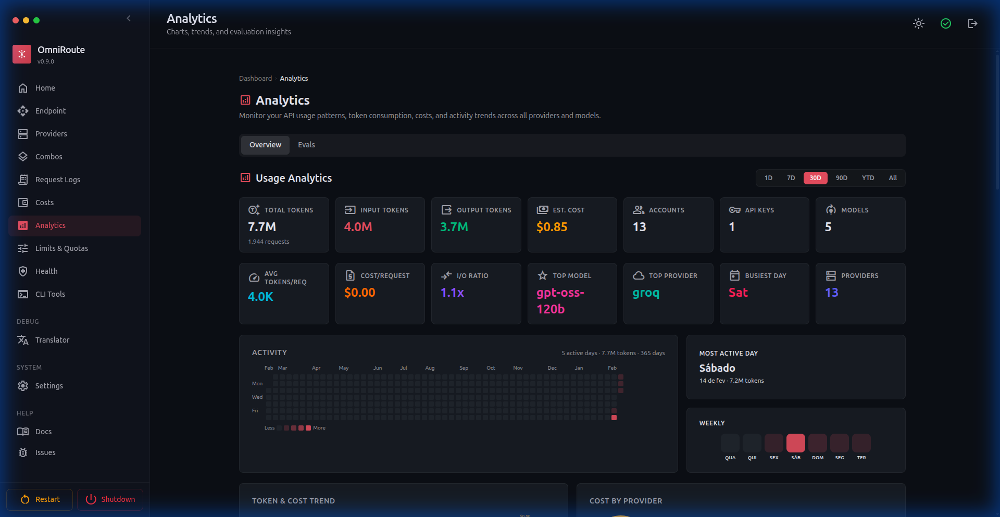
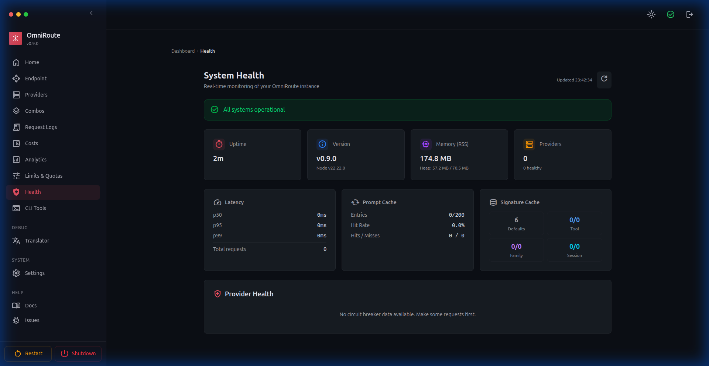
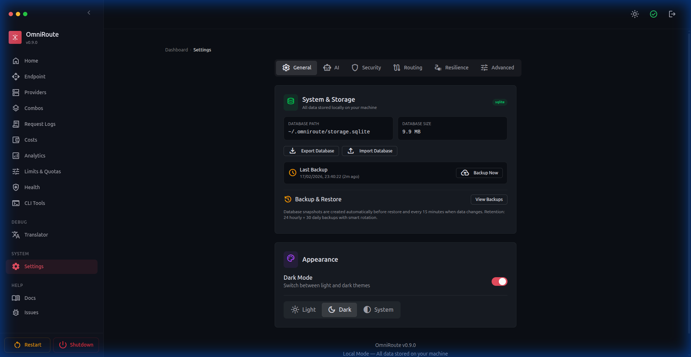

# 🚀 OmniRoute — Бесплатный AI-шлюз (Русский)

🌐 **Языки:** 🇺🇸 [English](../../../README.md) · 🇸🇦 [ar](../ar/README.md) · 🇧🇬 [bg](../bg/README.md) · 🇧🇩 [bn](../bn/README.md) · 🇨🇿 [cs](../cs/README.md) · 🇩🇰 [da](../da/README.md) · 🇩🇪 [de](../de/README.md) · 🇪🇸 [es](../es/README.md) · 🇮🇷 [fa](../fa/README.md) · 🇫🇮 [fi](../fi/README.md) · 🇫🇷 [fr](../fr/README.md) · 🇮🇳 [gu](../gu/README.md) · 🇮🇱 [he](../he/README.md) · 🇮🇳 [hi](../hi/README.md) · 🇭🇺 [hu](../hu/README.md) · 🇮🇩 [id](../id/README.md) · 🇮🇹 [it](../it/README.md) · 🇯🇵 [ja](../ja/README.md) · 🇰🇷 [ko](../ko/README.md) · 🇮🇳 [mr](../mr/README.md) · 🇲🇾 [ms](../ms/README.md) · 🇳🇱 [nl](../nl/README.md) · 🇳🇴 [no](../no/README.md) · 🇵🇭 [phi](../phi/README.md) · 🇵🇱 [pl](../pl/README.md) · 🇵🇹 [pt](../pt/README.md) · 🇧🇷 [pt-BR](../pt-BR/README.md) · 🇷🇴 [ro](../ro/README.md) · 🇷🇺 [ru](../ru/README.md) · 🇸🇰 [sk](../sk/README.md) · 🇸🇪 [sv](../sv/README.md) · 🇰🇪 [sw](../sw/README.md) · 🇮🇳 [ta](../ta/README.md) · 🇮🇳 [te](../te/README.md) · 🇹🇭 [th](../th/README.md) · 🇹🇷 [tr](../tr/README.md) · 🇺🇦 [uk-UA](../uk-UA/README.md) · 🇵🇰 [ur](../ur/README.md) · 🇻🇳 [vi](../vi/README.md) · 🇨🇳 [zh-CN](../zh-CN/README.md) · 🇹🇼 [zh-TW](../zh-TW/README.md)

---

<div align="center">


<br/>

# 🚀 OmniRoute — Бесплатный AI-шлюз

### Код без остановок. Один endpoint — **278 провайдеров**, **90+ бесплатных**.

**Claude Code, Codex, Cursor, Cline, Copilot и Antigravity → бесплатные Claude / GPT / Gemini с автопереключением.**

<br/>

**RTK + Caveman: экономия 15–95% токенов. Лимиты больше не мешают.**

<br/>

**~1.53B учитываемых бесплатных токенов / месяц** — в первый месяц до **~2.15B** с регистрационными бонусами. Живой учёт на `/dashboard/free-tiers`. ([методика →](../../reference/FREE_TIERS.md))

<br/>

[](#-278-ai-провайдеров--90-бесплатных)
[](#-278-ai-провайдеров--90-бесплатных)
[](../../reference/FREE_TIERS.md)
[](#️-экономьте-1595-токенов--автоматически)
[](#-комбо--главная-фича)
[](#-быстрый-старт)

<br/>

### 💬 Сообщество

[](https://discord.gg/U47eFqAXCn)
[](https://t.me/omnirouteOficial)
[](https://chat.whatsapp.com/JI7cDQ1GyaiDHhVBpLxf8b?mode=gi_t)
[](https://chat.whatsapp.com/LTSpdFhXTxjH4R6CCNiKWz)

**Вопросы, советы по провайдерам, roadmap и поддержка → [Discord](https://discord.gg/U47eFqAXCn) · [Telegram](https://t.me/omnirouteOficial) · WhatsApp [🌍 Global](https://chat.whatsapp.com/JI7cDQ1GyaiDHhVBpLxf8b?mode=gi_t) / [🇧🇷 Brasil](https://chat.whatsapp.com/LTSpdFhXTxjH4R6CCNiKWz)**

<br/>

<a href="https://trendshift.io/repositories/23589" target="_blank"></a>

[](https://www.npmjs.com/package/omniroute)
[](../../../LICENSE)
[](https://github.com/diegosouzapw/OmniRoute)

[](https://www.npmjs.com/package/omniroute)

[](https://hub.docker.com/r/diegosouzapw/omniroute)


[](https://omniroute.online)

<br/>

[**🚀 Быстрый старт**](#-быстрый-старт) • [**🎯 Комбо**](#-комбо--главная-фича) • [**🌐 Провайдеры**](#-278-ai-провайдеров--90-бесплатных) • [**🔌 CLI и MCP**](#-полный-cli--a2a-и-mcp) • [**🗜️ Сжатие**](#️-экономьте-1595-токенов--автоматически) • [**🌍 Сайт**](https://omniroute.online)

[💥 Обещание](#-обещание) • [🤔 Зачем](#-зачем-omniroute) • [🏆 Чем отличается](#-чем-omniroute-отличается) • [🤖 Совместимые CLI](#-совместимые-cli-и-агенты) • [🖥️ Где запускать](#️-где-запускается-omniroute--везде) • [🔒 Приватность](#-приватно-и-local-first) • [🎬 В деле](#-omniroute-в-деле) • [📚 Дальше](#-узнать-больше) • [📧 Поддержка](#-поддержка-и-сообщество)

</div>

<br/>

<div align="center">

# 💰 ~1.53B бесплатных токенов / месяц

</div>

> Собирать free-tier вручную — боль: десятки SDK, лимиты и непонятный остаток. OmniRoute сводит **документированные** free-tier **43 пулов / 460+ моделей** в одно честное число и показывает его live на `/dashboard/free-tiers`.
>
> - **~1.53B free tokens / мес** (steady) — в первый месяц до **~2.15B** с signup-кредитами.
> - **Честная математика** — каждый shared pool считается **один раз**. «Если крутить rate limit 24/7» выйдет ~10B — такие цифры мы **не** публикуем.
> - **Отдельно** — навсегда бесплатные провайдеры без cap (SiliconFlow, Z.AI GLM-Flash, Kilo, OpenCode Zen…) и **+$10 OpenRouter** → **+24M/мес** (не раздувают headline).
> - **По моделям**, used/remaining и пометки ToS — прямо в дашборде.

> Методика (дедуп пулов, кредиты, ToS): **[docs/reference/FREE_TIERS.md](../../reference/FREE_TIERS.md)**. Цифры пересматривают примерно раз в две недели — могут и **упасть**, и **вырасти**. CI (`check:docs-counts`) падает, если headline расходится с каталогом.

<br/>

<div align="center">

# 💥 Обещание

</div>

> Один endpoint. **278 провайдеров.** Код не останавливается — OmniRoute сам выбирает самый дешёвый рабочий вариант.

<table>
  <tr>
    <td width="33%" valign="top"><b>🚫 Не упирайтесь в лимиты</b><br/><sub>Авто-fallback по 278 провайдерам за миллисекунды. Квота кончилась — следующий подхватывает, без простоя.</sub></td>
    <td width="33%" valign="top"><b>💸 До 95% токенов</b><br/><sub>RTK + Caveman stacked: 15–95% на сжимаемом (в tool-heavy сессиях в среднем ~89%).</sub></td>
    <td width="33%" valign="top"><b>🆓 Старт с $0</b><br/><sub>90+ free-tier, 40+ free forever (Kiro, Qoder, Pollinations, LongCat…). Карта не нужна.</sub></td>
  </tr>
  <tr>
    <td width="33%" valign="top"><b>🔌 Все инструменты</b><br/><sub>26+ coding agents — Claude Code, Codex, Cursor, Cline, Copilot, Antigravity — один конфиг.</sub></td>
    <td width="33%" valign="top"><b>🧩 Один endpoint</b><br/><sub>OpenAI ↔ Claude ↔ Gemini ↔ Responses API. Укажите <code>/v1</code> — и готово.</sub></td>
    <td width="33%" valign="top"><b>🛡️ Production-grade</b><br/><sub>Circuit breakers, TLS stealth, MCP (104 tools), A2A, memory, guardrails, evals. 25 000+ тестов.</sub></td>
  </tr>
</table>

<br/>

<div align="center">

# 🤔 Зачем OmniRoute?

</div>

> Хватит прыгать между десятью кабинетами, мёртвыми ключами и неожиданными счетами.

| ❌ Боль каждый день | ✅ Как решает OmniRoute |
|---|---|
| 📉 Подписка сгорает неиспользованной | **Выжимаем подписку** — трекинг квоты, тратим до reset |
| 🛑 Rate limit посреди кода | **4-tier auto-fallback** — Subscription → API → Cheap → Free |
| 🔥 Tool-output (`git diff`, логи) жжёт токены | **RTK + Caveman** — 15–95% на сжимаемом |
| 💸 Дорогие API ($20–50/мес за провайдера) | **Cost-optimized routing** — самый выгодный живой вариант |
| 🧰 У каждого IDE свой сетап | **Один endpoint, один дашборд** |
| 🌍 AI заблокирован в регионе | **3-level proxy** + TLS fingerprint stealth |

<div align="center">

```
┌──────────────────────────────────────────────────────────┐
│     Ваш IDE / CLI  (Claude Code, Cursor, Cline…)          │
└─────────────────────────┬────────────────────────────────┘
                          │ http://localhost:20128/v1
                          ▼
┌──────────────────────────────────────────────────────────┐
│              OmniRoute — умный роутер                      │
│  RTK + Caveman · 18 стратегий · circuit breakers          │
│  TLS stealth · MCP · A2A · guardrails                     │
└─────────────────────────┬────────────────────────────────┘
        ┌─────────────┬────┴────────┬─────────────┐
        ▼ Tier 1      ▼ Tier 2      ▼ Tier 3      ▼ Tier 4
     Подписка        API Key       Cheap         Free
   Claude Code,     DeepSeek,     GLM $0.5,     Kiro, Qoder,
   Codex, Copilot   Groq, xAI     MiniMax $0.2  Pollinations
   квота? ───────▶  бюджет? ───▶  бюджет? ───▶  всегда online
```

</div>

<br/>

<div align="center">

# 🎯 Комбо — главная фича

</div>

> **Combo** — цепочка моделей, по которой OmniRoute ходит **сам**. Квота кончилась, провайдер упал, цена взлетела — комбо тихо уходит на следующий шаг. **Именно это делает OmniRoute «неубиваемым».** 🛡️

### ⚡ Без настройки — просто `auto`

Комбо создавать не обязательно. Поставьте модель `auto` (или вариант) — OmniRoute соберёт виртуальное комбо из подключённых провайдеров:

| Model ID | На что оптимизирует |
|---|---|
| `auto` | 🎯 Баланс (LKGP — держится за последний удачный провайдер) |
| `auto/coding` | 🧑‍💻 Качество кода |
| `auto/fast` | ⚡ Минимальная latency |
| `auto/cheap` | 💰 Минимальная цена за токен |
| `auto/offline` | 🔋 Максимум headroom по квоте / rate limit |
| `auto/smart` | 🔭 Качество + 10% exploration |

### 🔀 Или соберите своё — 18 стратегий

| # | Стратегия | Что делает |
|---|---|---|
| 1 | `priority` | Идёт по списку по порядку — выжимает каждый target 🥇 |
| 2 | `fill-first` | Сначала полностью заполняет квоту target |
| 3 | `weighted` | Взвешенный random |
| 4 | `round-robin` | Цикл по targets |
| 5 | `p2c` | Power-of-two-choices load balancing |
| 6 | `least-used` | Наименьшая текущая нагрузка |
| 7 | `random` | Uniform random (с dedupe) |
| 8 | `strict-random` | Random без dedupe 🎲 |
| 9 | `cost-optimized` | Минимум $ за запрос из live pricing 💸 |
| 10 | `headroom` | Больше всего оставшейся квоты |
| 11 | `reset-window` | Чья квота reset ближе |
| 12 | `reset-aware` | Ранг по reset — короткие окна первыми 📊 |
| 13 | `context-relay` | Передача контекста между targets 🧠 |
| 14 | `context-optimized` | Лучший fit под размер контекста |
| 15 | `lkgp` | Last-Known-Good Path — sticky к успеху |
| 16 | `auto` | Live scoring по 12 факторам 🤖 |
| 17 | `fusion` | Панель моделей + judge → один ответ 🧬 |
| 18 | `pipeline` | Цепочка: output шага N → input N+1 🔗 |

<sub>Auto-Combo scoring: **12 факторов** (health, quota, cost, latency, success rate, freshness…). Подробнее: [`docs/routing/AUTO-COMBO.md`](../../routing/AUTO-COMBO.md).</sub>

### ⚖️ Quota-Share — одна подписка на команду ✨

Несколько ключей на **один** upstream-аккаунт? Burst на одном ключе может сжечь 5h/hourly quota на всех. **Quota-Share** честно делит time-based quota между ключами пула (work-conserving: idle-доля отдаётся другим).

| Параметр | Управление |
|---|---|
| ⚖️ **Weight** | Доля ключа, напр. `50 / 30 / 20` |
| 📐 **Dimensions** | `%` · requests · tokens · `$`, окна **5h / 7d / per-model** |
| 🚦 **Policy** | `hard` · `soft` · `burst` |
| 🧱 **Cap** | Жёсткий потолок на ключ |

<sub>📖 [Quota Sharing Engine](../../routing/QUOTA_SHARE.md)</sub>

### 🧱 Три слоя устойчивости

| Слой | Область | Механизм |
|---|---|---|
| 🔌 **Circuit breaker** | Весь провайдер | Перестаёт слать запросы в «падающий» upstream; probe recovery |
| 💤 **Connection cooldown** | Один ключ / аккаунт | Пропускает «горячий» ключ, siblings продолжают |
| 🎯 **Model lockout** | Одна модель | Блокирует только исчерпанную модель, не всю connection |

```
Combo: "always-on"                         strategy: priority
  1. cc/claude-opus-4-7   ← подписка (сначала)
  2. cx/gpt-5.2-codex     ← вторая подписка
  3. glm/glm-4.7          ← cheap ($0.5–0.6/1M)
  4. if/kimi-k2-thinking  ← free forever
Итог: 4 уровня = почти нулевой downtime
```

<sub>📖 [Auto-Combo](../../routing/AUTO-COMBO.md) · [Resilience Guide](../../architecture/RESILIENCE_GUIDE.md)</sub>

<br/>

<div align="center">

# 🏆 Чем OmniRoute отличается

</div>

| Фича | OmniRoute | Другие роутеры |
|---|---|---|
| 🌐 Провайдеры | **278** | 20–100 |
| 🆓 Free | **90+ (40+ forever)** | 1–5 |
| 🔀 Стратегии | **18** | 1–3 |
| 🗜️ Сжатие токенов | **RTK + Caveman (15–95%)** | Нет / 20–40% |
| 🧰 MCP server | **104 tools, 3 transports, 31 scopes** | Редко |
| 🤝 A2A | **6 skills, JSON-RPC 2.0** | Нет |
| 🧠 Memory (FTS5 + vector) | **Да** | Редко |
| 🛡️ Guardrails | **Да** | Редко |
| ☁️ Cloud agents | **Codex, Cursor, Devin, Jules** | Нет |
| 🥷 TLS stealth | **JA3/JA4 via wreq-js** | Нет |
| 🖥️ Платформы | **Web · Desktop · Termux · PWA** | Только web |
| 🌍 i18n | **43 локали** | 0–4 |

<sub>📊 Сравнение с LiteLLM, OpenRouter, Portkey → [`docs/comparison/OMNIROUTE_VS_ALTERNATIVES.md`](../../comparison/OMNIROUTE_VS_ALTERNATIVES.md)</sub>

<br/>

<div align="center">

# ✨ Что нового

</div>

> Highlights **v3.8.20 → v3.8.49**. Полная история: [`CHANGELOG.md`](../../../CHANGELOG.md).

- **🗜️ Compression hardening** — inflation guard по умолчанию, Caveman packs DE/FR/JA + Chinese (文言), RTK filters для Gradle & .NET.
- **💸 Honest flat-rate cost** — subscription/coding-plan в analytics = **$0**; budget/quota/routing по-прежнему оценивают.
- **⚖️ Quota-Share routing** — DRR, concurrency, multi-window buckets, session stickiness.
- **🤖 One-command CLI setup** — `setup-*` для 12+ tools; `omniroute launch` / `launch-codex`.
- **🛰️ Remote mode** — `connect` / `contexts` / `tokens` + OAuth helper для VPS.
- **🧭 Smarter auto** — `auto/<category>:<tier>`, Fusion, task-aware routing, per-request overrides.
- **🗜️ Pluggable compression** — 11 engines + Studios, LLMLingua-2, Ultra, fidelity gate, GCF v3.2.
- **🕵️ MITM decrypt (TPROXY)** — CLI, игнорирующие proxy env; per-SNI CA.
- **💸 Cost telemetry** — `X-OmniRoute-*` headers, cache-HIT savings, per-key USD quotas.
- **🧠 Memory** — opt-in, int8 quantization, `x-omniroute-no-memory`.
- **🛡️ Security** — prompt-injection guard + DuckDuckGo last-resort search.
- **🖼️ Endpoints** — `/v1/ocr`, `/v1/audio/translations`.
- **🤝 Providers & agents** — Cursor Cloud Agent, Grok Build (xAI), Ollama card, Claude Sonnet 5, Zed, Requesty…

<br/>

<div align="center">

# 🤖 Совместимые CLI и агенты

</div>

> Один конфиг — `http://localhost:20128/v1` — и **любой** AI IDE/CLI едет на free & low-cost моделях.

| | | | | | |
|---|---|---|---|---|---|
| [**Claude Code**](https://github.com/anthropics/claude-code) | [**Codex CLI**](https://github.com/openai/codex) | **Cline** | [**Kilo Code**](https://github.com/Kilo-Org/kilocode) | **Roo Code** | **Continue** |
| [**OpenCode**](https://github.com/anomalyco/opencode) | **Copilot CLI** | **Cursor CLI** | **Factory Droid** | **Grok Build** | **OpenClaw** |

<div align="center">
<b>＋ также</b> · Aider · Goose · Hermes · Kiro · Antigravity · Windsurf · AMP · <b>любой OpenAI-compatible tool</b>
</div>

<sub>📖 Setup 33 tools → [`docs/reference/CLI-TOOLS.md`](../../reference/CLI-TOOLS.md) · OpenCode plugin → [`@omniroute/opencode-provider`](https://www.npmjs.com/package/@omniroute/opencode-provider)</sub>

<br/>

<div align="center">

# 🌐 278 AI-провайдеров — 90+ бесплатных

</div>

> Самый полный каталог среди open-source роутеров: **278 провайдеров**, **90+ free-tier**, **40+ free forever**.

### 🆓 Free forever — $0, без карты

| Провайдер | Что даёт |
|---|---|
| **AgentRouter** | GPT-5, Claude, Gemini — $100 free credits |
| **Qoder AI** | Kimi-K2, DeepSeek-R1 — unlimited FREE |
| **Pollinations** | GPT-5, Claude, Llama 4 — без ключа |
| **LongCat** | LongCat-2.0 — 10M one-time (KYC) |
| **Cloudflare AI** | 50+ models — 10K neurons/day |
| **NVIDIA NIM** | 129 models — ~40 RPM free |
| **Cerebras** | Qwen3 235B — 1M tokens/day |
| **Kiro** | Claude Sonnet/Haiku — ~50 credits/mo |

📖 Machine-readable catalog → [`docs/reference/PROVIDER_REFERENCE.md`](../../reference/PROVIDER_REFERENCE.md)

<br/>

<div align="center">

# 🖥️ Где запускается OmniRoute — везде

</div>

| Платформа | Установка | Плюсы |
|---|---|---|
| 📦 **npm (global)** | `npm install -g omniroute` | Одна команда, любая ОС |
| 🐳 **Docker** | `docker run … diegosouzapw/omniroute` | **AMD64 + ARM64** |
| 🖥️ **Desktop (Electron)** | `npm run electron:build` | Окно + tray — Win/macOS/Linux |
| 💪 **ARM** | native `arm64` | Pi, ARM servers, Apple Silicon |
| 📱 **Android (Termux)** | `pkg install nodejs && npx -y omniroute` | На телефоне 24/7, без root |
| 📲 **PWA** | «Add to Home Screen» | Fullscreen, offline |
| 🧩 **OpenCode plugin** | `@omniroute/opencode-provider` | Нативная интеграция |
| 🛠️ **Из исходников** | `npm install && npm run dev` | Хакинг и контрибьют |

<sub>📖 [Docker](../../guides/DOCKER_GUIDE.md) · [Desktop](../../../electron/README.md) · [Termux](../../guides/TERMUX_GUIDE.md) · [PWA](../../guides/PWA_GUIDE.md) · [OpenCode](../../frameworks/OPENCODE.md)</sub>

<br/>

<div align="center">

# 🔒 Приватно и local-first

</div>

> Ваши ключи, ваша машина, ваши данные. OmniRoute — **локальный прокси**, без «звонков домой».

- 🏠 **100% на вашем железе** — npm, Docker, desktop или телефон. Нет cloud-hop OmniRoute.
- 🔐 **Credentials at rest** — API keys и OAuth в **AES-256-GCM**.
- 🚫 **Zero telemetry по умолчанию** — промпты уходят только выбранным провайдерам.
- 🛡️ **Жёсткий gateway** — scoping ключей, IP filter, rate limits, prompt-injection guard, loopback-only process routes.
- 📜 **MIT, fully open-source** — аудируйте построчно, self-host навсегда.

<sub>📖 [Authorization](../../architecture/AUTHZ_GUIDE.md) · [Guardrails](../../security/GUARDRAILS.md) · [Compliance](../../security/COMPLIANCE.md)</sub>

<br/>

<div align="center">

# 🔌 Полный CLI + A2A и MCP

</div>

> Это не «просто сервер» — **CLI-кокит** с **80+ командами** и открытыми agent-протоколами, чтобы AI управлял OmniRoute **сам**.

### ⌨️ Настоящий CLI

```bash
omniroute               # gateway + dashboard (порт 20128)
omniroute chat          # TUI-чат (/model /combo /skill /memory)
omniroute setup         # мастер первого запуска
omniroute doctor        # диагностика провайдеров, портов, native deps
```

### 🛰️ Remote mode — CLI здесь, OmniRoute на VPS

```bash
omniroute connect 192.168.0.15            # пароль → scoped token
omniroute models list                     # ← на REMOTE
omniroute configure codex                 # remote model → local Codex profile
omniroute tokens create --name ci --scope read
omniroute contexts use default            # ← обратно на local
```

Scopes: `read` / `write` / `admin`. Process-spawning routes — только loopback.
<sub>📖 [Remote Mode](../../guides/REMOTE-MODE.md)</sub>

### 🤝 Подключите агента — он управляет шлюзом

| Протокол | Endpoint | Зачем |
|---|---|---|
| 🧰 **MCP (stdio)** | `omniroute --mcp` | Claude Desktop, Cursor, любой MCP client |
| 🌊 **MCP (HTTP)** | `http://localhost:20128/api/mcp/stream` | Remote MCP — **104 tools**, 31 scopes |
| 📡 **MCP (SSE)** | `http://localhost:20128/api/mcp/sse` | Streaming MCP |
| 🤝 **A2A** | `http://localhost:20128/.well-known/agent.json` | Agent-to-agent, JSON-RPC 2.0 + SSE |

```bash
claude mcp add-server omniroute --type http --url http://localhost:20128/api/mcp/stream
```

<sub>📖 [MCP](../../frameworks/MCP-SERVER.md) · [A2A](../../frameworks/A2A-SERVER.md) · [Agent Protocols](../../frameworks/AGENT_PROTOCOLS_GUIDE.md)</sub>

<br/>

<div align="center">

# 🗜️ Экономьте 15–95% токенов — автоматически

</div>

> **Зачем тратить много токенов, если хватает меньшего?** Каждый запрос идёт через compression pipeline **прозрачно** — клиент не меняется. Стек из **11 composable engines** (идеи [RTK](https://github.com/rtk-ai/rtk), [Caveman](https://github.com/JuliusBrussee/caveman), [LLMLingua-2](https://github.com/microsoft/LLMLingua), [Troglodita](https://github.com/leninejunior/troglodita)).

### 🧱 11-engine stack

| # | Engine | Что делает |
|---|---|---|
| 1 | **Session-Dedup** | Убирает повторённый cross-turn контент |
| 2 | **CCR** | Крупные блоки за retrieve-markers, fetch on demand |
| 3 | **RTK** | Умная фильтрация tool-result, dedup, truncation |
| 4 | **Headroom** | Lossless tabular compaction JSON arrays (~30%), GCF v3.2 |
| 5 | **Relevance** | Extractive scoring относительно last user query |
| 6 | **Caveman** | Rule-based prose (~65–75% на output) |
| 7 | **LLMLingua-2** | ML semantic pruning (MobileBERT ONNX), code-safe |
| 8 | **Lite** | Whitespace + image-URL trimming |
| 9 | **Aggressive** | Summarization + progressive aging старых turns |
| 10 | **Ultra** | Heuristic pruning + optional SLM tier |

Код, URL и structured data **всегда** сохраняются byte-perfect.

| Режим | Экономия | Когда |
|---|---|---|
| 🪶 **Lite** | ~15% | Безопасный always-on default |
| 🪨 **Standard (Caveman)** | ~30% | Ежедневный coding |
| ⚡ **Aggressive** | ~50% | Длинные tool-heavy сессии |
| 🔥 **Ultra** | ~75% | Максимум экономии |
| 🧰 **RTK** | 60–90% | Shell / test / build / git output |
| 🔗 **Stacked (RTK → Caveman)** | **78–95%** | Промпты + tool logs |

**Пример — Standard:**

> **До (69 tokens):** _"The reason your React component is re-rendering is likely because you're creating a new object reference on each render cycle…"_
>
> **После (19 tokens):** _"New object ref each render. Inline object prop = new ref = re-render. Wrap in useMemo."_
>
> **Тот же смысл. −72% tokens. Без потери точности.** ✅

- **3-Level Proxy Config** — Configurable proxy at 3 levels: global (all traffic), per-provider (one provider only), and per-connection/key
- **Color-Coded Proxy Badges** — Visual indicators: 🟢 global proxy, 🟡 provider proxy, 🔵 connection proxy, always showing the IP
- **OAuth Token Exchange Through Proxy** — OAuth flow also goes through the proxy, solving `unsupported_country_region_territory`
- **Connection Tests via Proxy** — Connection tests use the configured proxy (no more direct bypass)
- **SOCKS5 Support** — Full SOCKS5 proxy support for outbound routing
- **TLS Fingerprint Spoofing** — Browser-like TLS fingerprint via `wreq-js` to bypass bot detection
- **🔏 CLI Fingerprint Matching** — Reorders headers and body fields to match native CLI binary signatures, drastically reducing account flagging risk. The proxy IP is preserved — you get both stealth **and** IP masking simultaneously

</details>

<details>
<summary><b>🆓 4. "I want to use AI for coding but I have no money"</b></summary>

Not everyone can pay $20–200/month for AI subscriptions. Students, devs from emerging countries, hobbyists, and freelancers need access to quality models at zero cost.

**How OmniRoute solves it:**

- **Ollama Cloud** — Cloud-hosted Ollama models at `api.ollama.com` with free "Light usage" tier; use `ollamacloud/<model>` prefix
- **Free-Only Combos** — Chain `if/kimi-k2-thinking → qw/qwen3-coder-plus` = $0/month with zero downtime
- **NVIDIA NIM Free Access** — ~40 RPM dev-forever free access to 70+ models at build.nvidia.com (transitioning from credits to pure rate limits)
- **Cost Optimized Strategy** — Routing strategy that automatically chooses the cheapest available provider

</details>

<details>
<summary><b>🔒 5. "I need to protect my AI gateway from unauthorized access"</b></summary>

When exposing an AI gateway to the network (LAN, VPS, Docker), anyone with the address can consume the developer's tokens/quota. Without protection, APIs are vulnerable to misuse, prompt injection, and abuse.

**How OmniRoute solves it:**

- **API Key Management** — Generation, rotation, and scoping per provider with a dedicated `/dashboard/api-manager` page
- **Model-Level Permissions** — Restrict API keys to specific models (`openai/*`, wildcard patterns), with Allow All/Restrict toggle
- **API Endpoint Protection** — Require a key for `/v1/models` and block specific providers from the listing
- **Auth Guard + CSRF Protection** — All dashboard routes protected with `withAuth` middleware + CSRF tokens
- **Rate Limiter** — Per-IP rate limiting with configurable windows
- **IP Filtering** — Allowlist/blocklist for access control
- **Prompt Injection Guard** — Sanitization against malicious prompt patterns
- **AES-256-GCM Encryption** — Credentials encrypted at rest

</details>

<details>
<summary><b>🛑 6. "My provider went down and I lost my coding flow"</b></summary>

AI providers can become unstable, return 5xx errors, or hit temporary rate limits. If a dev depends on a single provider, they're interrupted. Without circuit breakers, repeated retries can crash the application.

**How OmniRoute solves it:**

- **Request Queue & Pacing** — Per-connection request buckets smooth bursts before they hit upstream rate caps
- **Connection Cooldown** — A single connection cools down after retryable failures with optional upstream `Retry-After` hints and exponential backoff
- **Provider Circuit Breaker** — The provider only trips after fallback is exhausted and the provider request still fails with provider-wide transient errors; connection-scoped `429` rate limits stay in Connection Cooldown
- **Wait For Cooldown** — The server can wait for the earliest connection cooldown to expire and retry the same client request automatically
- **Anti-Thundering Herd** — Mutex + semaphore protection against concurrent retry storms
- **Combo Fallback Chains** — If the primary provider fails, automatically falls through the chain with no intervention
- **Health Dashboard** — Uptime monitoring, provider circuit breaker states, cooldowns, cache stats, p50/p95/p99 latency

</details>

<details>
<summary><b>🔧 7. "Configuring each AI tool is tedious and repetitive"</b></summary>

**How OmniRoute solves it:**

- **CLI Tools Dashboard** — Dedicated page with one-click setup for Claude Code, Codex CLI, OpenClaw, Kilo Code, Antigravity, Cline
- **GitHub Copilot Config Generator** — Generates `chatLanguageModels.json` for VS Code with bulk model selection
- **Onboarding Wizard** — Guided 4-step setup for first-time users
- **One endpoint, all models** — Configure `http://localhost:20128/v1` once, access 100+ providers

</details>

<details>
<summary><b>🔑 8. "Managing OAuth tokens from multiple providers is hell"</b></summary>

Claude Code, Codex, Copilot — all use OAuth 2.0 with expiring tokens. Developers need to re-authenticate constantly, deal with `client_secret is missing`, `redirect_uri_mismatch`, and failures on remote servers. OAuth on LAN/VPS is particularly problematic.

**How OmniRoute solves it:**

- **Auto Token Refresh** — OAuth tokens refresh in background before expiration
- **OAuth 2.0 (PKCE) Built-in** — Automatic flow for Claude Code, Codex, Copilot, Kiro, Qwen, Qoder
- **Multi-Account OAuth** — Multiple accounts per provider via JWT/ID token extraction
- **OAuth LAN/Remote Fix** — Private IP detection for `redirect_uri` + manual URL mode for remote servers
- **OAuth Behind Nginx** — Uses `window.location.origin` for reverse proxy compatibility
- **Remote OAuth Guide** — Step-by-step guide for Google Cloud credentials on VPS/Docker

</details>

<details>
<summary><b>📊 9. "I don't know how much I'm spending or where"</b></summary>

Developers use multiple paid providers but have no unified view of spending. Each provider has its own billing dashboard, but there's no consolidated view. Unexpected costs can pile up.

**How OmniRoute solves it:**

- **Cost Analytics Dashboard** — Per-token cost tracking and budget management per provider
- **Budget Limits per Tier** — Spending ceiling per tier that triggers automatic fallback
- **Per-Model Pricing Configuration** — Configurable prices per model
- **Usage Statistics Per API Key** — Request count and last-used timestamp per key
- **Analytics Dashboard** — Stat cards, model usage chart, provider table with success rates and latency

</details>

<details>
<summary><b>🐛 10. "I can't diagnose errors and problems in AI calls"</b></summary>

When a call fails, the dev doesn't know if it was a rate limit, expired token, wrong format, or provider error. Fragmented logs across different terminals. Without observability, debugging is trial-and-error.

**How OmniRoute solves it:**

- **Unified Logs Dashboard** — 4 tabs: Request Logs, Proxy Logs, Audit Logs, Console
- **Console Log Viewer** — Real-time terminal-style viewer with color-coded levels, auto-scroll, search, filter
- **SQLite Summary Logs** — Request and proxy log indexes stay queryable across restarts without loading large payload blobs into SQLite
- **Translator Playground** — 4 debugging modes: Playground (format translation), Chat Tester (round-trip), Test Bench (batch), Live Monitor (real-time)
- **Request Telemetry** — p50/p95/p99 latency + X-Request-Id tracing
- **File-Based Detail Artifacts** — App logs rotate by size, retention days, and archive count; detailed request/response payloads live in `DATA_DIR/call_logs/` and rotate independently of SQLite summaries
- **System Info Report** — `npm run system-info` generates `system-info.txt` with your full environment (Node version, OmniRoute version, OS, CLI tools, Docker/PM2 status). Attach it when reporting issues for instant triage.

</details>

<details>
<summary><b>🏗️ 11. "Deploying and maintaining the gateway is complex"</b></summary>

Installing, configuring, and maintaining an AI proxy across different environments (local, VPS, Docker, cloud) is labor-intensive. Problems like hardcoded paths, `EACCES` on directories, port conflicts, and cross-platform builds add friction.

**How OmniRoute solves it:**

- **npm global install** — `npm install -g omniroute && omniroute` — done
- **Docker Multi-Platform** — AMD64 + ARM64 native (Apple Silicon, AWS Graviton, Raspberry Pi)
- **Docker Compose Profiles** — `base` (no CLI tools) and `cli` (with Claude Code, Codex, OpenClaw)
- **Electron Desktop App** — Native app for Windows/macOS/Linux with system tray, auto-start, offline mode
- **Split-Port Mode** — API and Dashboard on separate ports for advanced scenarios (reverse proxy, container networking)
- **Cloud Sync** — Config synchronization across devices via Cloudflare Workers
- **DB Backups** — Automatic backup, restore, export and import of all settings, with `DISABLE_SQLITE_AUTO_BACKUP` for externally managed backups

</details>

<details>
<summary><b>🌍 12. "The interface is English-only and my team doesn't speak English"</b></summary>

Teams in non-English-speaking countries, especially in Latin America, Asia, and Europe, struggle with English-only interfaces. Language barriers reduce adoption and increase configuration errors.

**How OmniRoute solves it:**

- **Dashboard i18n — 30 Languages** — All 500+ keys translated including Arabic, Bulgarian, Danish, German, Spanish, Finnish, French, Hebrew, Hindi, Hungarian, Indonesian, Italian, Japanese, Korean, Malay, Dutch, Norwegian, Polish, Portuguese (PT/BR), Romanian, Russian, Slovak, Swedish, Thai, Ukrainian, Vietnamese, Chinese, Filipino, English
- **RTL Support** — Right-to-left support for Arabic and Hebrew
- **Multi-Language READMEs** — 30 complete documentation translations
- **Language Selector** — Globe icon in header for real-time switching

</details>

<details>
<summary><b>🔄 13. "I need more than chat — I need embeddings, images, audio"</b></summary>

AI isn't just chat completion. Devs need to generate images, transcribe audio, create embeddings for RAG, rerank documents, and moderate content. Each API has a different endpoint and format.

**How OmniRoute solves it:**

- **Embeddings** — `/v1/embeddings` with 6 providers and 9+ models
- **Image Generation** — `/v1/images/generations` with 10 providers and 20+ models (OpenAI, xAI, Together, Fireworks, Nebius, Hyperbolic, NanoBanana, Antigravity, SD WebUI, ComfyUI)
- **Text-to-Video** — `/v1/videos/generations` — ComfyUI (AnimateDiff, SVD) and SD WebUI
- **Text-to-Music** — `/v1/music/generations` — ComfyUI (Stable Audio Open, MusicGen)
- **Audio Transcription** — `/v1/audio/transcriptions` — Whisper + Nvidia NIM, HuggingFace, Qwen3
- **Text-to-Speech** — `/v1/audio/speech` — ElevenLabs, Nvidia NIM, HuggingFace, Coqui, Tortoise, Qwen3, **Inworld**, **Cartesia**, **PlayHT**, + existing providers
- **Moderations** — `/v1/moderations` — Content safety checks
- **Reranking** — `/v1/rerank` — Document relevance reranking
- **Responses API** — Full `/v1/responses` support for Codex

</details>

<details>
<summary><b>🧪 14. "I have no way to test and compare quality across models"</b></summary>

Developers want to know which model is best for their use case — code, translation, reasoning — but comparing manually is slow. No integrated eval tools exist.

**How OmniRoute solves it:**

- **LLM Evaluations** — Golden set testing with 10 pre-loaded cases covering greetings, math, geography, code generation, JSON compliance, translation, markdown, safety refusal
- **4 Match Strategies** — `exact`, `contains`, `regex`, `custom` (JS function)
- **Translator Playground Test Bench** — Batch testing with multiple inputs and expected outputs, cross-provider comparison
- **Chat Tester** — Full round-trip with visual response rendering
- **Live Monitor** — Real-time stream of all requests flowing through the proxy

</details>

<details>
<summary><b>📈 15. "I need to scale without losing performance"</b></summary>

As request volume grows, without caching the same questions generate duplicate costs. Without idempotency, duplicate requests waste processing. Per-provider rate limits must be respected.

**How OmniRoute solves it:**

- **Semantic Cache** — Two-tier cache (signature + semantic) reduces cost and latency
- **Request Idempotency** — 5s deduplication window for identical requests
- **Rate Limit Detection** — Per-provider RPM, min gap, and max concurrent tracking
- **Request Queue & Pacing** — Configurable queue, pacing, and concurrency defaults in Settings → Resilience
- **API Key Validation Cache** — 3-tier cache for production performance
- **Health Dashboard with Telemetry** — p50/p95/p99 latency, cache stats, uptime

</details>

<details>
<summary><b>🤖 16. "I want to control model behavior globally"</b></summary>

Developers who want all responses in a specific language, with a specific tone, or want to limit reasoning tokens. Configuring this in every tool/request is impractical.

**How OmniRoute solves it:**

- **System Prompt Injection** — Global prompt applied to all requests
- **Thinking Budget Validation** — Reasoning token allocation control per request (passthrough, auto, custom, adaptive)
- **9 Routing Strategies** — Global strategies that determine how requests are distributed
- **Wildcard Router** — `provider/*` patterns route dynamically to any provider
- **Combo Enable/Disable Toggle** — Toggle combos directly from the dashboard
- **Manual Combo Ordering** — Drag combo cards by handle and persist the order in SQLite
- **Provider Toggle** — Enable/disable all connections for a provider with one click
- **Blocked Providers** — Exclude specific providers from `/v1/models` listing

</details>

<details>
<summary><b>🧰 17. "I need MCP tools as first-class product capabilities"</b></summary>

Many AI gateways expose MCP only as a hidden implementation detail. Teams need a visible, manageable operation layer.

**How OmniRoute solves it:**

- MCP appears in the dashboard navigation and endpoint protocol tab
- Dedicated MCP management page with process, tools, scopes, and audit
- Built-in quick-start for `omniroute --mcp` and client onboarding

</details>

<details>
<summary><b>🧠 18. "I need A2A orchestration with sync + stream task paths"</b></summary>

Agent workflows need both direct replies and long-running streamed execution with lifecycle control.

**How OmniRoute solves it:**

- A2A JSON-RPC endpoint (`POST /a2a`) with `message/send` and `message/stream`
- SSE streaming with terminal state propagation
- Task lifecycle APIs for `tasks/get` and `tasks/cancel`

</details>

<details>
<summary><b>🛰️ 19. "I need real MCP process health, not guessed status"</b></summary>

Operational teams need to know if MCP is actually alive, not just whether an API is reachable.

**How OmniRoute solves it:**

- Runtime heartbeat file with PID, timestamps, transport, tool count, and scope mode
- MCP status API combining heartbeat + recent activity
- UI status cards for process/uptime/heartbeat freshness

</details>

<details>
<summary><b>📋 20. "I need auditable MCP tool execution"</b></summary>

When tools mutate config or trigger ops actions, teams need forensic traceability.

**How OmniRoute solves it:**

- SQLite-backed audit logging for MCP tool calls
- Filters by tool, success/failure, API key, and pagination
- Dashboard audit table + stats endpoints for automation

</details>

<details>
<summary><b>🔐 21. "I need scoped MCP permissions per integration"</b></summary>

Different clients should have least-privilege access to tool categories.

**How OmniRoute solves it:**

- 10 granular MCP scopes for controlled tool access
- Scope enforcement and visibility in MCP management UI
- Safe default posture for operational tooling

</details>

<details>
<summary><b>⚙️ 22. "I need operational controls without redeploying"</b></summary>

Teams need quick runtime changes during incidents or cost events.

**How OmniRoute solves it:**

- Switch combo activation directly from MCP dashboard
- Tune queue, cooldown, breaker, and wait settings from the dedicated Resilience page
- Review live provider breaker state from the Health dashboard

</details>

<details>
<summary><b>🔄 23. "I need live A2A task lifecycle visibility and cancellation"</b></summary>

Without lifecycle visibility, task incidents become hard to triage.

**How OmniRoute solves it:**

- Task listing/filtering by state/skill with pagination
- Drill-down on task metadata, events, and artifacts
- Task cancellation endpoint and UI action with confirmation

</details>

<details>
<summary><b>🌊 24. "I need active stream metrics for A2A load"</b></summary>

Streaming workflows require operational insight into concurrency and live connections.

**How OmniRoute solves it:**

- Active stream counters integrated into A2A status
- Last task timestamp and per-state counts
- A2A dashboard cards for real-time ops monitoring

</details>

<details>
<summary><b>🪪 25. "I need standard agent discovery for clients"</b></summary>

External clients and orchestrators need machine-readable metadata for onboarding.

**How OmniRoute solves it:**

- Agent Card exposed at `/.well-known/agent.json`
- Capabilities and skills shown in management UI
- A2A status API includes discovery metadata for automation

</details>

<details>
<summary><b>🧭 26. "I need protocol discoverability in the product UX"</b></summary>

If users cannot discover protocol surfaces, adoption and support quality drop.

**How OmniRoute solves it:**

- Consolidated **Endpoints** page with tabs for Proxy, MCP, A2A, and API Endpoints
- Inline service status toggles (Online/Offline) for MCP and A2A
- Links from overview to dedicated management tabs

</details>

<details>
<summary><b>🧪 27. "I need end-to-end protocol validation with real clients"</b></summary>

Mock tests are not enough to validate protocol compatibility before release.

**How OmniRoute solves it:**

- E2E suite that boots app and uses real MCP SDK client transport
- A2A client tests for discovery, send, stream, get, and cancel flows
- Cross-check assertions against MCP audit and A2A tasks APIs

</details>

<details>
<summary><b>📡 28. "I need unified observability across all interfaces"</b></summary>

Splitting observability by protocol creates blind spots and longer MTTR.

**How OmniRoute solves it:**

- Unified dashboards/logs/analytics in one product
- Health + audit + request telemetry across OpenAI, MCP, and A2A layers
- Operational APIs for status and automation

</details>

<details>
<summary><b>💼 29. "I need one runtime for proxy + tools + agent orchestration"</b></summary>

Running many separate services increases operational cost and failure modes.

**How OmniRoute solves it:**

- OpenAI-compatible proxy, MCP server, and A2A server in one stack
- Shared auth, resilience, data store, and observability
- Consistent policy model across all interaction surfaces

</details>

<details>
<summary><b>🚀 30. "I need to ship agentic workflows without glue-code sprawl"</b></summary>

Teams lose velocity when stitching multiple ad-hoc services and scripts.

**How OmniRoute solves it:**

- Unified endpoint strategy for clients and agents
- Built-in protocol management UIs and smoke validation paths
- Production-ready foundations (security, logging, resilience, backup)

</details>

<details>
<summary><b>📚 31. "My long sessions crash with 'context_length_exceeded' limits"</b></summary>

During deep debugging, long histories with tool results quickly exceed provider token windows, causing failed requests and orphaned context.

**How OmniRoute solves it:**

- **Proactive Context Compression** — Evaluates token budgets before the request hits upstream and proactively prunes old conversation history with a smart binary-search mechanism.
- **Structural Integrity Guards** — Automatically tracks explicit `tool_use` definitions and ensures that if a tool input is truncated, its corresponding `tool_result` is also safely removed, preventing API validation errors.
- **Multi-Layer Dropping** — Progressively drops system messages, regular messages, and finally enforces strict length limits without breaking conversational logic.

</details>

### Example Playbooks (Integrated Use Cases)

**Playbook A: Maximize paid subscription + cheap backup**

```txt
combined = 1 − (1 − RTK) × (1 − Caveman_input)
average  = 1 − (1 − 0.80) × (1 − 0.46) = 89.2%
range    = 78.4 – 94.6%
```

Precedence (high → low): header `x-omniroute-compression` › combo override › named profile › adaptive › panel default › off.

📖 [`COMPRESSION_GUIDE.md`](../../compression/COMPRESSION_GUIDE.md) · [`RTK_COMPRESSION.md`](../../compression/RTK_COMPRESSION.md) · [`COMPRESSION_ENGINES.md`](../../compression/COMPRESSION_ENGINES.md)

<br/>

<div align="center">

# ⚡ Быстрый старт

</div>

**1) Установка и запуск**

```bash
npm install -g omniroute
omniroute
```

> 💡 Видите `npm warn ERESOLVE` / peer-dep? [Это безвредно](../../getting-started/TROUBLESHOOTING.md#npm-install-warnings-eresolve--peer--deprecated).

Dashboard: `http://localhost:20128` · API: `http://localhost:20128/v1`.

**2) Подключите FREE-провайдера (без signup)**

Dashboard → **Providers** → **Kiro AI** (free Claude, ~50 credits/mo) или **OpenCode Free** (без auth) → готово.

**3) Направьте coding tool**

```txt
Base URL: http://localhost:20128/v1
API Key:  [Dashboard → Endpoints]
Model:    auto            (zero-config smart routing — или любой provider/model)
```

**4) Проверка**

```bash
curl http://localhost:20128/v1/models -H "Authorization: Bearer YOUR_KEY"
```

Должны появиться подключённые модели. 🎉 Дальше пишите код — OmniRoute сам роутит и делает fallback.

Если клиент **не умеет** custom headers — tokenized aliases:

```txt
OpenAI catalog:   http://localhost:20128/vscode/YOUR_KEY/
OpenAI models:    http://localhost:20128/vscode/YOUR_KEY/models
OpenAI chat:      http://localhost:20128/vscode/YOUR_KEY/chat/completions
OpenAI responses: http://localhost:20128/vscode/YOUR_KEY/responses
Ollama chat:      http://localhost:20128/vscode/YOUR_KEY/api/chat
Ollama tags:      http://localhost:20128/vscode/YOUR_KEY/api/tags
```

Предпочтительно: `Authorization: Bearer ...`.

<br/>

## 📦 Другие способы — Docker, source, pnpm, Arch

**🐳 Docker**

```bash
docker run -d --name omniroute --restart unless-stopped --stop-timeout 40 \
  -p 127.0.0.1:20128:20128 -v omniroute-data:/app/data diegosouzapw/omniroute:latest
```

**🛠️ Из исходников**

```bash
cp .env.example .env && npm install
PORT=20128 npm run dev
```

**📦 pnpm**

```bash
pnpm add -g omniroute@latest --allow-build=better-sqlite3 --allow-build=@swc/core && omniroute
```

**🐧 Arch Linux (AUR)**

```bash
yay -S omniroute-bin && systemctl --user enable --now omniroute.service
```

**🔧 Nix (Flake)**

```bash
nix develop
npm run dev
# или: devbox run npm run dev
```

📖 [Docker Guide](../../guides/DOCKER_GUIDE.md) — Compose, Caddy HTTPS, Cloudflare tunnels.

### Полезные флаги CLI

| Команда | Описание |
|---|---|
| `omniroute` | Сервер (`PORT=20128`, API + dashboard) |
| `omniroute --port 3000` | Порт 3000 |
| `omniroute --mcp` | MCP server (stdio) |
| `omniroute --no-open` | Не открывать браузер |
| `omniroute --help` | Справка |

Split-port:

```bash
PORT=20128 DASHBOARD_PORT=20129 omniroute
# API:       http://localhost:20128/v1
# Dashboard: http://localhost:20129
```

### Удаление

| Команда | Действие |
|---|---|
| `npm run uninstall` | Убирает app, **сохраняет** `~/.omniroute` |
| `npm run uninstall:full` | Удаляет app **и** все ключи/БД |
| `npm uninstall -g omniroute` | Глобальный npm uninstall |

### Старт с $0 — Free Stack

| Шаг | Действие | Что открывается |
|---|---|---|
| 1 | Подключить **Kiro** (AWS Builder ID OAuth) | Claude Sonnet / Haiku |
| 2 | Подключить **Qoder** (Google OAuth) | kimi-k2-thinking, qwen3-coder-plus… |
| 3 | Подключить **Qwen** (Device Code) | qwen3-coder-plus/flash… |
| 4 | `/dashboard/combos` → шаблон **Free Stack ($0)** | Round-robin free-провайдеров |

IDE/CLI: `http://localhost:20128/v1` · API Key: любая строка (если `REQUIRE_API_KEY=false`).

> **Дополнительно free:** Groq (30 RPM), NVIDIA NIM (~40 RPM), Cerebras (1M tok/day), LongCat, Cloudflare Workers AI (10K Neurons/day).

<br/>

<div align="center">

# 🎬 OmniRoute в деле

</div>

<div align="center">
<table>
  <tr>
    <td align="center" width="280">
      <a href="https://www.youtube.com/watch?v=Rxdc36yUyOQ"></a><br/>
      <b>🇧🇷 Português</b><br/><sub>Полный гайд</sub>
    </td>
    <td align="center" width="280">
      <a href="https://www.youtube.com/watch?v=CMzyOiUyEVc"></a><br/>
      <b>🇺🇸 English</b><br/><sub>Complete walkthrough</sub>
    </td>
    <td align="center" width="280">
      <a href="https://www.youtube.com/watch?v=il_5Ii6v4-Y"></a><br/>
      <b>🇷🇺 Русский</b><br/><sub>Полное руководство</sub>
    </td>
  </tr>
</table>
</div>

> 🎬 **Сняли видео про OmniRoute?** Откройте [issue](https://github.com/diegosouzapw/OmniRoute/issues/new) или [discussion](https://github.com/diegosouzapw/OmniRoute/discussions) — добавим в этот раздел.

<br/>

<div align="center">

# 📚 Узнать больше

1. Open Dashboard → `Providers` and connect at least one provider (OAuth or API key).
2. Open Dashboard → `Endpoints` and create an API key.
3. (Optional) Open Dashboard → `Combos` and set your fallback chain.

### 3) Point your coding tool to OmniRoute

```txt
Base URL: http://localhost:20128/v1
API Key:  [copy from Endpoint page]
Model:    if/kimi-k2-thinking (or any provider/model prefix)
```

### 4) Enable and validate protocols (v2.0)

**MCP (for tool-driven operations):**

```bash
omniroute --mcp
```

Then connect your MCP client over `stdio` and test tools like:

- `omniroute_get_health`
- `omniroute_list_combos`

**A2A (for agent-to-agent workflows):**

```bash
curl http://localhost:20128/.well-known/agent.json
```

```bash
curl -X POST http://localhost:20128/a2a \
  -H 'content-type: application/json' \
  -d '{"jsonrpc":"2.0","id":"quickstart","method":"message/send","params":{"skill":"quota-management","messages":[{"role":"user","content":"Give me a short quota summary."}]}}'
```

### 5) Validate everything end-to-end (recommended)

```bash
npm run test:protocols:e2e
```

This suite validates real MCP and A2A client flows against a running app.

### Alternative: run from source

```bash
cp .env.example .env
npm install
PORT=20128 DASHBOARD_PORT=20129 NEXT_PUBLIC_BASE_URL=http://localhost:20129 npm run dev
```

<details>
<summary><b>💰 Цены и zero-cost stack</b></summary>

<br/>

| Tier | Примеры | Стоимость |
|---|---|---|
| 💳 **Subscription** | Claude Code Pro / Codex / Copilot | $10–200/мес |
| 🔑 **API Key (free tiers)** | NVIDIA NIM, Cerebras, Groq | **Free** |
| 💰 **Cheap** | GLM ~$0.5/1M · MiniMax ~$0.2–0.3/1M | Копейки |
| 🆓 **Free forever** | Kiro, Qoder, Qwen, Pollinations, LongCat | **$0** |

do_build() {
	# Determine target CPU arch for node-gyp
	local _gyp_arch
	case "$XBPS_TARGET_MACHINE" in
		aarch64*) _gyp_arch=arm64 ;;
		armv7*|armv6*) _gyp_arch=arm ;;
		i686*) _gyp_arch=ia32 ;;
		*) _gyp_arch=x64 ;;
	esac

	# 1) Install all deps – skip scripts (no network in do_build, native modules
	#    compiled separately below; better-sqlite3 is serverExternalPackage so
	#    Next.js does not execute it during next build)
	NODE_ENV=development npm ci --ignore-scripts

	# 2) Build the Next.js standalone bundle
	npm run build

	# 3) Copy static assets into standalone
	cp -r .next/static .next/standalone/.next/static
	[ -d public ] && cp -r public .next/standalone/public || true

	# 4) Compile better-sqlite3 native binding for the target architecture.
	#    Use node-gyp directly so CC/CXX from xbps-src cross-toolchain are used
	#    without npm altering them.
	local _node_gyp=/usr/lib/node_modules/npm/node_modules/node-gyp/bin/node-gyp.js
	(cd node_modules/better-sqlite3 && node "$_node_gyp" rebuild --arch="$_gyp_arch")

	# 5) Place the compiled binding into the standalone bundle
	local _bs3_release=.next/standalone/node_modules/better-sqlite3/build/Release
	mkdir -p "$_bs3_release"
	cp node_modules/better-sqlite3/build/Release/better_sqlite3.node "$_bs3_release/"

	# 6) Remove arch-specific sharp bundles – upstream sets images.unoptimized=true
	#    so sharp is not used at runtime; x64 .so files would break aarch64 strip
	rm -rf .next/standalone/node_modules/@img

	# 7) Copy pino runtime deps omitted by Next.js static analysis:
	#    pino-abstract-transport – required by pino's worker thread
	#    split2 – dep of pino-abstract-transport
	#    process-warning – dep of pino itself
	for _mod in pino-abstract-transport split2 process-warning; do
		cp -r "node_modules/$_mod" .next/standalone/node_modules/
	done
}

do_check() {
	npm run test:unit
}

do_install() {
	vmkdir usr/lib/omniroute/.next

	vcopy .next/standalone/. usr/lib/omniroute/.next/standalone

	# Prevent removal of empty Next.js app router dirs by the post-install hook
	for _d in \
		.next/standalone/.next/server/app/dashboard \
		.next/standalone/.next/server/app/dashboard/settings \
		.next/standalone/.next/server/app/dashboard/providers; do
		touch "${DESTDIR}/usr/lib/omniroute/${_d}/.keep"
	done

	cat > "${WRKDIR}/omniroute" <<'EOF'
#!/bin/sh
export PORT="${PORT:-20128}"
export DATA_DIR="${DATA_DIR:-${XDG_DATA_HOME:-${HOME}/.local/share}/omniroute}"
export APP_LOG_TO_FILE="${APP_LOG_TO_FILE:-false}"
mkdir -p "${DATA_DIR}"
exec node /usr/lib/omniroute/.next/standalone/server.js "$@"
EOF
	vbin "${WRKDIR}/omniroute"
}

post_install() {
	vlicense LICENSE
}
```

</details>

---

## 🐳 Docker

OmniRoute is available as a public Docker image on [Docker Hub](https://hub.docker.com/r/diegosouzapw/omniroute).

**Quick run:**

```bash
docker run -d \
  --name omniroute \
  --restart unless-stopped \
  --stop-timeout 40 \
  -p 20128:20128 \
  -v omniroute-data:/app/data \
  diegosouzapw/omniroute:latest
```

**With environment file:**

```bash
# Copy and edit .env first
cp .env.example .env

docker run -d \
  --name omniroute \
  --restart unless-stopped \
  --stop-timeout 40 \
  --env-file .env \
  -p 20128:20128 \
  -v omniroute-data:/app/data \
  diegosouzapw/omniroute:latest
```

**Using Docker Compose:**

```bash
# Base profile (no CLI tools)
docker compose --profile base up -d

# CLI profile (Claude Code, Codex, OpenClaw built-in)
docker compose --profile cli up -d
```

Dashboard support for Docker deployments now includes a one-click **Cloudflare Quick Tunnel** on `Dashboard → Endpoints`. The first enable downloads `cloudflared` only when needed, starts a temporary tunnel to your current `/v1` endpoint, and shows the generated `https://*.trycloudflare.com/v1` URL directly below your normal public URL.

Notes:

- Quick Tunnel URLs are temporary and change after every restart.
- Quick Tunnels are not auto-restored after an OmniRoute or container restart. Re-enable them from the dashboard when needed.
- Managed install currently supports Linux, macOS, and Windows on `x64` / `arm64`.
- Managed Quick Tunnels default to HTTP/2 transport to avoid noisy QUIC UDP buffer warnings in constrained container environments. Set `CLOUDFLARED_PROTOCOL=quic` or `auto` if you want a different transport.
- Docker images bundle system CA roots and pass them to managed `cloudflared`, which avoids TLS trust failures when the tunnel bootstraps inside the container.
- SQLite runs in WAL mode. `docker stop` should be allowed to finish so OmniRoute can checkpoint the latest changes back into `storage.sqlite`.
- The bundled Compose files already set a 40s stop grace period. If you run the image directly, keep `--stop-timeout 40` (or similar) so manual stops do not cut off shutdown cleanup.
- Set `CLOUDFLARED_BIN=/absolute/path/to/cloudflared` if you want OmniRoute to use an existing binary instead of downloading one.

**Using Docker Compose with Caddy (HTTPS Auto-TLS):**

OmniRoute can be securely exposed using Caddy's automatic SSL provisioning. Ensure your domain's DNS A record points to your server's IP.

```yaml
services:
  omniroute:
    image: diegosouzapw/omniroute:latest
    container_name: omniroute
    restart: unless-stopped
    volumes:
      - omniroute-data:/app/data
    environment:
      - PORT=20128
      - NEXT_PUBLIC_BASE_URL=https://your-domain.com

  caddy:
    image: caddy:latest
    container_name: caddy
    restart: unless-stopped
    ports:
      - "80:80"
      - "443:443"
    command: caddy reverse-proxy --from https://your-domain.com --to http://omniroute:20128

volumes:
  omniroute-data:
```

| Image                    | Tag      | Size   | Description           |
| ------------------------ | -------- | ------ | --------------------- |
| `diegosouzapw/omniroute` | `latest` | ~250MB | Latest stable release |
| `diegosouzapw/omniroute` | `3.6.2`  | ~250MB | Current version       |

---

## 🖥️ Desktop App — Offline & Always-On

> 🆕 **NEW!** OmniRoute is now available as a **native desktop application** for Windows, macOS, and Linux.

Run OmniRoute as a standalone desktop app — no terminal, no browser, no internet required for local models. The Electron-based app includes:

- 🖥️ **Native Window** — Dedicated app window with system tray integration
- 🔄 **Auto-Start** — Launch OmniRoute on system login
- 🔔 **Native Notifications** — Get alerts for quota exhaustion or provider issues
- ⚡ **One-Click Install** — NSIS (Windows), DMG (macOS), AppImage (Linux)
- 🌐 **Offline Mode** — Works fully offline with bundled server

### Быстрый старт

```bash
# Development mode
npm run electron:dev

# Build for your platform
npm run electron:build         # Current platform
npm run electron:build:win     # Windows (.exe)
npm run electron:build:mac     # macOS (.dmg) — x64 & arm64
npm run electron:build:linux   # Linux (.AppImage)
```

### System Tray

When minimized, OmniRoute lives in your system tray with quick actions:

- Open dashboard
- Change server port
- Quit application

📖 Full documentation: [`electron/README.md`](electron/README.md)

---

## 💰 Pricing at a Glance

| Tier                | Provider                    | Cost                      | Quota Reset      | Best For                          |
| ------------------- | --------------------------- | ------------------------- | ---------------- | --------------------------------- |
| **💳 SUBSCRIPTION** | Claude Code (Pro)           | $20/mo                    | 5h + weekly      | Already subscribed                |
|                     | Codex (Plus/Pro)            | $20-200/mo                | 5h + weekly      | OpenAI users                      |
|                     | GitHub Copilot              | $10-19/mo                 | Monthly          | GitHub users                      |
| **🔑 API KEY**      | NVIDIA NIM                  | **FREE** (dev forever)    | ~40 RPM          | 70+ open models                   |
|                     | Cerebras                    | **FREE** (1M tok/day)     | 60K TPM / 30 RPM | World's fastest                   |
|                     | Groq                        | **FREE** (30 RPM)         | 14.4K RPD        | Ultra-fast Llama/Gemma            |
|                     | DeepSeek V3.2               | $0.27/$1.10 per 1M        | None             | Best price/quality reasoning      |
|                     | xAI Grok-4 Fast             | **$0.20/$0.50 per 1M** 🆕 | None             | Fastest + tool calling, ultralow  |
|                     | xAI Grok-4 (standard)       | $0.20/$1.50 per 1M 🆕     | None             | Reasoning flagship from xAI       |
|                     | Mistral                     | Free trial + paid         | Rate limited     | European AI                       |
|                     | OpenRouter                  | Pay-per-use               | None             | 100+ models aggr.                 |
| **💰 CHEAP**        | GLM-5 (via Z.AI) 🆕         | $0.5/1M                   | Daily 10AM       | 128K output, newest flagship      |
|                     | GLM-4.7                     | $0.6/1M                   | Daily 10AM       | Budget backup                     |
|                     | MiniMax M2.5 🆕             | $0.3/1M input             | 5-hour rolling   | Reasoning + agentic tasks         |
|                     | MiniMax M2.1                | $0.2/1M                   | 5-hour rolling   | Cheapest option                   |
|                     | Kimi K2.5 (Moonshot API) 🆕 | Pay-per-use               | None             | Direct Moonshot API access        |
|                     | Kimi K2                     | $9/mo flat                | 10M tokens/mo    | Predictable cost                  |
| **🆓 FREE**         | Qoder                       | **$0**                    | Unlimited        | 5 models unlimited                |
|                     | Qwen                        | **$0**                    | Unlimited        | 4 models unlimited                |
|                     | Kiro                        | **$0**                    | Unlimited        | Claude Sonnet/Haiku (AWS Builder) |
|                     | LongCat Flash-Lite 🆕       | **$0** (50M tok/day 🔥)   | 1 RPS            | Largest free quota on Earth       |
|                     | Pollinations AI 🆕          | **$0** (no key needed)    | 1 req/15s        | GPT-5, Claude, DeepSeek, Llama 4  |
|                     | Cloudflare Workers AI 🆕    | **$0** (10K Neurons/day)  | ~150 resp/day    | 50+ models, global edge           |
|                     | Scaleway AI 🆕              | **$0** (1M tokens total)  | Rate limited     | EU/GDPR, Qwen3 235B, Llama 70B    |

> 🆕 **New models added (Mar 2026):** Grok-4 Fast family at $0.20/$0.50/M (benchmarked at 1143ms — 30% faster than Gemini 2.5 Flash), GLM-5 via Z.AI with 128K output, MiniMax M2.5 reasoning, DeepSeek V3.2 updated pricing, Kimi K2.5 via Moonshot direct API.

**💡 $0 Combo Stack — The Complete Free Setup:**

```
# 🆓 Ultimate Free Stack 2026 — 11 Providers, $0 Forever
Kiro (kr/)             → Claude Sonnet/Haiku UNLIMITED
Qoder (if/)            → kimi-k2-thinking, qwen3-coder-plus, deepseek-r1 UNLIMITED
LongCat Lite (lc/)     → LongCat-Flash-Lite — 50M tokens/day 🔥
Pollinations (pol/)    → GPT-5, Claude, DeepSeek, Llama 4 — no key needed
Qwen (qw/)             → qwen3-coder-plus, qwen3-coder-flash, qwen3-coder-next UNLIMITED
Gemini (gemini/)       → Gemini 2.5 Flash — 1,500 req/day free API key
Cloudflare AI (cf/)    → Llama 70B, Gemma 3, Mistral — 10K Neurons/day
Scaleway (scw/)        → Qwen3 235B, Llama 70B — 1M free tokens (EU)
Groq (groq/)           → Llama/Gemma ultra-fast — 14.4K req/day
NVIDIA NIM (nvidia/)   → 70+ open models — 40 RPM forever
Cerebras (cerebras/)   → Llama/Qwen world-fastest — 1M tok/day
```

**Zero cost. Never stops coding.** Configure this as one OmniRoute combo and all fallbacks happen automatically — no manual switching ever.

---

---

## 🆓 Free Models — What You Actually Get

> All models below are **100% free with zero credit card required**. OmniRoute auto-routes between them when one quota runs out — combine them all for an unbreakable $0 combo.

### 🔵 CLAUDE MODELS (via Kiro — AWS Builder ID)

| Model               | Prefix | Limit         | Rate Limit            |
| ------------------- | ------ | ------------- | --------------------- |
| `claude-sonnet-4.5` | `kr/`  | **Unlimited** | No reported daily cap |
| `claude-haiku-4.5`  | `kr/`  | **Unlimited** | No reported daily cap |
| `claude-opus-4.6`   | `kr/`  | **Unlimited** | Latest Opus via Kiro  |

### 🟢 QODER MODELS (Free PAT via qodercli)

| Model              | Prefix | Limit         | Rate Limit      |
| ------------------ | ------ | ------------- | --------------- |
| `kimi-k2-thinking` | `if/`  | **Unlimited** | No reported cap |
| `qwen3-coder-plus` | `if/`  | **Unlimited** | No reported cap |
| `deepseek-r1`      | `if/`  | **Unlimited** | No reported cap |
| `minimax-m2.1`     | `if/`  | **Unlimited** | No reported cap |
| `kimi-k2`          | `if/`  | **Unlimited** | No reported cap |

> Recommended connection method: **Personal Access Token + `qodercli`**. Browser OAuth is
> experimental and disabled by default unless `QODER_OAUTH_*` environment variables are configured.

### 🟡 QWEN MODELS (Device Code Auth)

| Model               | Prefix | Limit         | Rate Limit          |
| ------------------- | ------ | ------------- | ------------------- |
| `qwen3-coder-plus`  | `qw/`  | **Unlimited** | No reported cap     |
| `qwen3-coder-flash` | `qw/`  | **Unlimited** | No reported cap     |
| `qwen3-coder-next`  | `qw/`  | **Unlimited** | No reported cap     |
| `vision-model`      | `qw/`  | **Unlimited** | Multimodal (images) |

### ⚫ NVIDIA NIM (Free API Key — build.nvidia.com)

| Tier       | Daily Limit  | Rate Limit  | Notes                                                  |
| ---------- | ------------ | ----------- | ------------------------------------------------------ |
| Free (Dev) | No token cap | **~40 RPM** | 70+ models; transitioning to pure rate limits mid-2025 |

Popular free models: `moonshotai/kimi-k2.5` (Kimi K2.5), `z-ai/glm4.7` (GLM 4.7), `deepseek-ai/deepseek-v3.2` (DeepSeek V3.2), `nvidia/llama-3.3-70b-instruct`, `deepseek/deepseek-r1`

### ⚪ CEREBRAS (Free API Key — inference.cerebras.ai)

| Tier | Daily Limit       | Rate Limit       | Notes                                       |
| ---- | ----------------- | ---------------- | ------------------------------------------- |
| Free | **1M tokens/day** | 60K TPM / 30 RPM | World's fastest LLM inference; resets daily |

Available free: `llama-3.3-70b`, `llama-3.1-8b`, `deepseek-r1-distill-llama-70b`

### 🔴 GROQ (Free API Key — console.groq.com)

| Tier | Daily Limit   | Rate Limit       | Notes                                     |
| ---- | ------------- | ---------------- | ----------------------------------------- |
| Free | **14.4K RPD** | 30 RPM per model | No credit card; 429 on limit, not charged |

Available free: `llama-3.3-70b-versatile`, `gemma2-9b-it`, `mixtral-8x7b`, `whisper-large-v3`

### 🔴 LONGCAT AI (Free API Key — longcat.chat) 🆕

| Model                         | Prefix | Daily Free Quota  | Notes                   |
| ----------------------------- | ------ | ----------------- | ----------------------- |
| `LongCat-Flash-Lite`          | `lc/`  | **50M tokens** 💥 | Largest free quota ever |
| `LongCat-Flash-Chat`          | `lc/`  | 500K tokens       | Multi-turn chat         |
| `LongCat-Flash-Thinking`      | `lc/`  | 500K tokens       | Reasoning / CoT         |
| `LongCat-Flash-Thinking-2601` | `lc/`  | 500K tokens       | Jan 2026 version        |
| `LongCat-Flash-Omni-2603`     | `lc/`  | 500K tokens       | Multimodal              |

> 100% free while in public beta. Sign up at [longcat.chat](https://longcat.chat) with email or phone. Resets daily 00:00 UTC.

### 🟢 POLLINATIONS AI (No API Key Required) 🆕

| Model      | Prefix | Rate Limit | Provider Behind    |
| ---------- | ------ | ---------- | ------------------ |
| `openai`   | `pol/` | 1 req/15s  | GPT-5              |
| `claude`   | `pol/` | 1 req/15s  | Anthropic Claude   |
| `gemini`   | `pol/` | 1 req/15s  | Google Gemini      |
| `deepseek` | `pol/` | 1 req/15s  | DeepSeek V3        |
| `llama`    | `pol/` | 1 req/15s  | Meta Llama 4 Scout |
| `mistral`  | `pol/` | 1 req/15s  | Mistral AI         |

> ✨ **Zero friction:** No signup, no API key. Add the Pollinations provider with an empty key field and it works immediately.

### 🟠 CLOUDFLARE WORKERS AI (Free API Key — cloudflare.com) 🆕

| Tier | Daily Neurons | Equivalent Usage                        | Notes                   |
| ---- | ------------- | --------------------------------------- | ----------------------- |
| Free | **10,000**    | ~150 LLM resp / 500s audio / 15K embeds | Global edge, 50+ models |

Popular free models: `@cf/meta/llama-3.3-70b-instruct`, `@cf/google/gemma-3-12b-it`, `@cf/openai/whisper-large-v3-turbo` (free audio!), `@cf/qwen/qwen2.5-coder-15b-instruct`

> Requires API Token + Account ID from [dash.cloudflare.com](https://dash.cloudflare.com). Store Account ID in provider settings.

### 🟣 SCALEWAY AI (1M Free Tokens — scaleway.com) 🆕

| Tier | Free Quota    | Location     | Notes                               |
| ---- | ------------- | ------------ | ----------------------------------- |
| Free | **1M tokens** | 🇫🇷 Paris, EU | No credit card needed within limits |

Available free: `qwen3-235b-a22b-instruct-2507` (Qwen3 235B!), `llama-3.1-70b-instruct`, `mistral-small-3.2-24b-instruct-2506`, `deepseek-v3-0324`

> EU/GDPR compliant. Get API key at [console.scaleway.com](https://console.scaleway.com).

> **💡 The Ultimate Free Stack (11 Providers, $0 Forever):**
>
> ```
> Kiro (kr/)             → Claude Sonnet/Haiku UNLIMITED
> Qoder (if/)            → kimi-k2-thinking, qwen3-coder-plus, deepseek-r1 UNLIMITED
> LongCat Lite (lc/)     → LongCat-Flash-Lite — 50M tokens/day 🔥
> Pollinations (pol/)    → GPT-5, Claude, DeepSeek, Llama 4 — no key needed
> Qwen (qw/)             → qwen3-coder models UNLIMITED
> Gemini (gemini/)       → Gemini 2.5 Flash — 1,500 req/day free
> Cloudflare AI (cf/)    → 50+ models — 10K Neurons/day
> Scaleway (scw/)        → Qwen3 235B, Llama 70B — 1M free tokens (EU)
> Groq (groq/)           → Llama/Gemma — 14.4K req/day ultra-fast
> NVIDIA NIM (nvidia/)   → 70+ open models — 40 RPM forever
> Cerebras (cerebras/)   → Llama/Qwen world-fastest — 1M tok/day
> ```

## 🎙️ Free Transcription Combo

> Transcribe any audio/video for **$0** — Deepgram leads with $200 free, AssemblyAI $50 fallback, Groq Whisper as unlimited emergency backup.

| Provider          | Free Credits           | Best Model                                   | Rate Limit                   |
| ----------------- | ---------------------- | -------------------------------------------- | ---------------------------- |
| 🟢 **Deepgram**   | **$200 free** (signup) | `nova-3` — best accuracy, 30+ languages      | No RPM limit on free credits |
| 🔵 **AssemblyAI** | **$50 free** (signup)  | `universal-3-pro` — chapters, sentiment, PII | No RPM limit on free credits |
| 🔴 **Groq**       | **Free forever**       | `whisper-large-v3` — OpenAI Whisper          | 30 RPM (rate limited)        |

**Suggested combo in `/dashboard/combos`:**

```
Name: free-transcription
Strategy: Priority
Nodes:
  [1] deepgram/nova-3          → uses $200 free first
  [2] assemblyai/universal-3-pro → fallback when Deepgram credits run out
  [3] groq/whisper-large-v3    → free forever, emergency fallback
```

Then in `/dashboard/media` → **Transcription** tab: upload any audio or video file → select your combo endpoint → get transcription in supported formats.

## 💡 Key Features

OmniRoute v3.6 is built as an operational platform, not just a relay proxy.

### 🆕 New — v3.6.x Highlights (Apr 2026)

| Feature                            | What It Does                                                                                                                                      |
| ---------------------------------- | ------------------------------------------------------------------------------------------------------------------------------------------------- |
| 🌐 **V1 WebSocket Bridge**         | OpenAI-compatible WebSocket traffic upgraded and proxied via `/v1/ws` — full streaming over WS with session auth (API key or session cookie)      |
| 🔑 **Sync Tokens & Config Bundle** | Issue/revoke sync tokens for config sync endpoints. Config bundles versioned with ETag for bandwidth-efficient polling                            |
| 🧠 **GLM Thinking (glmt) Preset**  | GLM Thinking registered first-class: 65 536 max tokens, 24 576 thinking budget, 900s timeout, usage sync & pricing — Claude-compatible API        |
| 🔢 **Hybrid Token Counting**       | Uses provider-side `/messages/count_tokens` when available; falls back to estimation — accurate usage tracking without guessing                   |
| 🌱 **Model Alias Auto-Seed**       | 30+ cross-proxy dialect aliases normalised at startup — no more routing mismatches                                                                |
| 🛡️ **Safe Outbound Fetch**         | All provider validation and model discovery go through a guarded fetch layer blocking private/local URLs with retry, timeout, and SSRF protection |
| ⏳ **Wait For Cooldown**           | Server-side chat retries when every candidate connection is cooling down; configurable `enabled`, `maxRetries`, and `maxRetryWaitSec`             |
| 🔍 **Runtime Env Validation**      | Startup validates all env vars with Zod schemas — clear errors for missing secrets, invalid URLs, or wrong types                                  |
| 📋 **Compliance Audit Expansion**  | Structured audit logs with pagination, request context, auth events, provider CRUD events, and SSRF-blocked validation logging                    |
| 🔐 **TPS Log Metric**              | Log details modal shows Tokens Per Second (TPS) — quick performance at-a-glance for every request                                                 |
| 🗑️ **Uninstall / Full Uninstall**  | `npm run uninstall` keeps data, `npm run uninstall:full` removes everything — clean removal for all install methods                               |
| 🔧 **OAuth Env Repair**            | One-click "Repair env" action for OAuth providers restores missing env vars and fixes broken auth state                                           |
| 🔒 **Graceful Electron Shutdown**  | Electron `before-quit` shuts down Next.js gracefully, preventing SQLite WAL database locks on desktop close                                       |
| 👁️ **Model Visibility Toggle**     | Per-model visibility toggle (👁 icon) with search filter and active-count badge (`N/M active`) on provider pages                                   |
| 📧 **Email Privacy Masking**       | OAuth account emails masked (`di*****@g****.com`), full address visible on hover                                                                  |
| 🔗 **Context Relay Strategy**      | Combo strategy preserving session continuity via structured handoff summaries when accounts rotate mid-conversation                               |
| 🛡️ **Proxy Hardening**             | Token health check, API key validation, and undici dispatcher all honor proxy config                                                              |
| ⚠️ **Node.js 24 Login Warning**    | Login page proactively detects incompatible Node.js versions and shows a clear warning banner                                                     |
| 📎 **Gemini PDF Attachments**      | PDF attachments correctly routed to Gemini via `inline_data` and generic base64 detection                                                         |
| 🔒 **CodeQL Security Hardening**   | Resolved SSRF, insecure randomness, polynomial ReDoS, and incomplete URL sanitization alerts                                                      |

### 🆕 New — ClawRouter-Inspired Improvements (Mar 2026)

| Feature                              | What It Does                                                                                |
| ------------------------------------ | ------------------------------------------------------------------------------------------- |
| ⚡ **Grok-4 Fast Family**            | xAI models at $0.20/$0.50/M — benchmarked 1143ms (30% faster than Gemini 2.5 Flash)         |
| 🧠 **GLM-5 via Z.AI**                | 128K output context, $0.5/1M — newest flagship from the GLM family                          |
| 🔮 **MiniMax M2.5**                  | Reasoning + agentic tasks at $0.30/1M — significant upgrade from M2.1                       |
| 🎯 **toolCalling Flag per Model**    | Per-model `toolCalling: true/false` in registry — AutoCombo skips non-tool-capable models   |
| 🌍 **Multilingual Intent Detection** | PT/ZH/ES/AR keywords in AutoCombo scoring — better model selection for non-English content  |
| 📊 **Benchmark-Driven Fallbacks**    | Real p95 latency from live requests feeds combo scoring — AutoCombo learns from actual data |
| 🔁 **Request Deduplication**         | Content-hash based dedup window — multi-agent safe, prevents duplicate charges              |
| 🔌 **Pluggable RouterStrategy**      | Extensible `RouterStrategy` interface — add custom routing logic as plugins                 |

### 🚀 Previous v2.0.9+ — Playground, CLI Fingerprints & ACP

| Feature                                 | What It Does                                                                                                                                                                                                                            |
| --------------------------------------- | --------------------------------------------------------------------------------------------------------------------------------------------------------------------------------------------------------------------------------------- |
| 🎮 **Model Playground**                 | Dashboard page to test any model directly — provider/model/endpoint selectors, Monaco Editor, streaming, abort, timing                                                                                                                  |
| 🔏 **CLI Fingerprint Matching**         | Per-provider header/body ordering to match native CLI signatures — toggle per provider in Settings > Security. **Your proxy IP is preserved**                                                                                           |
| 🤖 **ACP Agents Dashboard**             | Debug › Agents page — grid of 14 agents with install status, version, custom agent form for any CLI tool. **OpenCode** users get a "Download opencode.json" button that auto-generates a ready-to-use config with all available models. |
| 🔧 **Custom Model `apiFormat` Routing** | Custom models with `apiFormat: "responses"` now correctly route to the Responses API translator                                                                                                                                         |
| 🏢 **Codex Workspace Isolation**        | Multiple Codex workspaces per email — OAuth correctly separates connections by workspace ID                                                                                                                                             |
| 🔄 **Electron Auto-Update**             | Desktop app checks for updates + auto-install on restart                                                                                                                                                                                |

### 🤖 Agent & Protocol Operations (v2.0)

| Feature                               | What It Does                                                                                                                           |
| ------------------------------------- | -------------------------------------------------------------------------------------------------------------------------------------- |
| 🔧 **MCP Server (25 tools)**          | IDE/agent tools via 3 transports: stdio, SSE (`/api/mcp/sse`), Streamable HTTP (`/api/mcp/stream`). 18 core + 3 memory + 4 skill tools |
| 🤝 **A2A Server (JSON-RPC + SSE)**    | Agent-to-agent task execution with sync and streaming flows                                                                            |
| 🧭 **Consolidated Endpoints Page**    | Tabbed management page with Endpoint Proxy, MCP, A2A, and API Endpoints tabs                                                           |
| 🎚️ **Service Enable/Disable Toggles** | ON/OFF switches for MCP and A2A with settings persistence (default: OFF)                                                               |
| 🛰️ **MCP Runtime Heartbeat**          | Real process status (pid, uptime, heartbeat age, transport, scope mode)                                                                |
| 📋 **MCP Audit Trail**                | Filterable audit logs with success/failure and key attribution                                                                         |
| 🔐 **MCP Scope Enforcement**          | 10 granular scope permissions for controlled tool access                                                                               |
| 📡 **A2A Task Lifecycle Management**  | List/filter tasks, inspect events/artifacts, cancel running tasks                                                                      |
| 📋 **Agent Card Discovery**           | `/.well-known/agent.json` for client auto-discovery                                                                                    |
| 🧪 **Protocol E2E Test Harness**      | Real MCP SDK + A2A client flows in `test:protocols:e2e`                                                                                |
| ⚙️ **Operational Controls**           | Switch combos, tune resilience settings, and review breaker state from dedicated Health and Settings surfaces                          |

### 🧠 Routing & Intelligence

| Feature                            | What It Does                                                             |
| ---------------------------------- | ------------------------------------------------------------------------ |
| 🎯 **Smart 4-Tier Fallback**       | Auto-route: Subscription → API Key → Cheap → Free                        |
| 📊 **Real-Time Quota Tracking**    | Live token count + reset countdown per provider                          |
| 🔄 **Format Translation**          | OpenAI ↔ Claude ↔ Gemini ↔ Responses with schema-safe conversions        |
| 👥 **Multi-Account Support**       | Multiple accounts per provider with intelligent selection                |
| 🔄 **Auto Token Refresh**          | OAuth tokens refresh automatically with retry                            |
| 🎨 **Custom Combos**               | 13 balancing strategies + fallback chain control                         |
| 🔗 **Context Relay**               | Session continuity handoffs when account rotation happens mid-session    |
| 🌐 **Wildcard Router**             | `provider/*` dynamic routing                                             |
| 🧠 **Thinking Budget Controls**    | Passthrough, auto, custom, and adaptive reasoning limits                 |
| 🔀 **Model Aliases**               | Built-in + custom model aliasing and migration safety                    |
| ⚡ **Background Degradation**      | Route low-priority background tasks to cheaper models                    |
| 🧪 **Task-Aware Smart Routing**    | Auto-select model by content type (coding/vision/analysis/summarization) |
| 🔄 **A2A Agent Workflows**         | Deterministic FSM orchestrator for stateful multi-step agent executions  |
| 🔀 **Adaptive Routing**            | Dynamic strategy override based on token volume and prompt complexity    |
| 🎲 **Provider Diversity**          | Shannon entropy scoring balancing auto-combo traffic distribution        |
| 💬 **System Prompt Injection**     | Global behavior controls applied consistently                            |
| 📄 **Responses API Compatibility** | Full `/v1/responses` support for Codex and advanced agentic workflows    |

### 🎵 Multi-Modal APIs

| Feature                    | What It Does                                                                                                                                                               |
| -------------------------- | -------------------------------------------------------------------------------------------------------------------------------------------------------------------------- |
| 🖼️ **Image Generation**    | `/v1/images/generations` with cloud and local backends                                                                                                                     |
| 📐 **Embeddings**          | `/v1/embeddings` for search and RAG pipelines                                                                                                                              |
| 🎤 **Audio Transcription** | `/v1/audio/transcriptions` — 7 providers (Deepgram Nova 3, AssemblyAI, Groq Whisper, HuggingFace, ElevenLabs, OpenAI, Azure), auto-language detection, MP4/MP3/WAV support |
| 🔊 **Text-to-Speech**      | `/v1/audio/speech` — 10 providers (ElevenLabs, OpenAI, Deepgram, Cartesia, PlayHT, HuggingFace, Nvidia NIM, Inworld, Coqui, Tortoise) with correct error messages          |
| 🎬 **Video Generation**    | `/v1/videos/generations` (ComfyUI + SD WebUI workflows)                                                                                                                    |
| 🎵 **Music Generation**    | `/v1/music/generations` (ComfyUI workflows)                                                                                                                                |
| 🛡️ **Moderations**         | `/v1/moderations` safety checks                                                                                                                                            |
| 🔀 **Reranking**           | `/v1/rerank` for relevance scoring                                                                                                                                         |
| 🔍 **Web Search** 🆕       | `/v1/search` — 5 providers (Serper, Brave, Perplexity, Exa, Tavily), 6,500+ free/month, auto-failover, cache                                                               |

### 🛡️ Resilience, Security & Governance

| Feature                             | What It Does                                                                                            |
| ----------------------------------- | ------------------------------------------------------------------------------------------------------- |
| 🔌 **Provider Circuit Breakers**    | Provider-wide trip/recover after fallback exhaustion with configurable thresholds                       |
| 🔒 **Daily Quota Lock** 🆕          | Detects exhaustion signals and locks routing for the specific model until midnight                      |
| 🎯 **Endpoint-Aware Models**        | Custom models declare supported endpoints + API format                                                  |
| 🛡️ **Anti-Thundering Herd**         | Mutex + semaphore protections on retry/rate events                                                      |
| 🧠 **Semantic + Signature Cache**   | Cost/latency reduction with two cache layers                                                            |
| ⚡ **Request Idempotency**          | Duplicate protection window                                                                             |
| 🔒 **TLS Fingerprint Spoofing**     | Browser-like TLS fingerprint — **reduces bot detection and account flagging**                           |
| 🔏 **CLI Fingerprint Matching**     | Matches native CLI request signatures — **reduces ban risk while preserving proxy IP**                  |
| 🌐 **IP Filtering**                 | Allowlist/blocklist control for exposed deployments                                                     |
| 🚦 **Request Queue & Pacing**       | Configurable per-connection request buckets for RPM, spacing, concurrency, and max wait                 |
| 📉 **Graceful Degradation**         | Multi-layer capability fallbacks protecting core gateway operations                                     |
| 📜 **Config Audit Trail**           | Diff-based change tracking preventing operational drift with simple rollbacks                           |
| ⏳ **Provider Health Sync**         | Proactive token expiration monitoring triggering alerts before authorization failures                   |
| ❄️ **Connection Cooldown**          | Retryable 408/429/5xx failures cool down a single connection with optional upstream hints               |
| 🚪 **Auto-Disable Banned Accounts** | Permanently blocked token accounts can be disabled automatically                                        |
| 🔑 **API Key Management + Scoping** | Secure key issuance/rotation and model/provider controls                                                |
| 👁️ **Scoped API Key Reveal** 🆕     | Opt-in recovery of API keys via `ALLOW_API_KEY_REVEAL`                                                  |
| 🛡️ **Protected `/models`**          | Optional auth gating and provider hiding for model catalog                                              |
| 🛡️ **Safe Outbound Fetch** 🆕       | Guarded fetch for provider calls — blocks private/local URLs, retries, SSRF protection                  |
| ⏳ **Wait For Cooldown** 🆕         | Auto-retry chat after connection cooldowns; configurable `enabled`, `maxRetries`, and `maxRetryWaitSec` |
| 🔍 **Runtime Env Validation** 🆕    | Zod-based env schema validation at startup with actionable error messages                               |
| 📋 **Compliance Audit v2** 🆕       | Pagination, request context, auth events, provider CRUD, and SSRF-blocked logging                       |

### 📊 Observability & Analytics

| Feature                          | What It Does                                          |
| -------------------------------- | ----------------------------------------------------- |
| 📝 **Request + Proxy Logging**   | Full request/response and proxy logging               |
| 📉 **Streamed Detailed Logs**    | Reconstructs SSE payload streams cleanly into the UI  |
| 🏷️ **Real-Time Model Badges** 🆕 | Live model status and daily quota countdown timers    |
| 📋 **Unified Logs Dashboard**    | Request, proxy, audit, and console views in one page  |
| 🔍 **Request Telemetry**         | p50/p95/p99 latency and request tracing               |
| 🏥 **Health Dashboard**          | Uptime, breaker states, lockouts, cache stats         |
| 💰 **Cost Tracking**             | Budget controls and per-model pricing visibility      |
| 📈 **Analytics Visualizations**  | Model/provider usage insights and trend views         |
| 🧪 **Evaluation Framework**      | Golden set testing with configurable match strategies |
| 📡 **Live Diagnostics** 🆕       | Semantic cache bypass for accurate combo live testing |
| 🔐 **TPS Log Metric** 🆕         | Tokens Per Second badge in log details modal          |

### ☁️ Deployment & Platform

| Feature                        | What It Does                                                          |
| ------------------------------ | --------------------------------------------------------------------- |
| 🌐 **Deploy Anywhere**         | Localhost, VPS, Docker, Cloud environments                            |
| 🚇 **Cloudflare Tunnel** 🆕    | One-click Quick Tunnel integration from the dashboard                 |
| 🔑 **API Key Model Filtering** | Native /v1/models response filtered via assigned Bearer context roles |
| ⚡ **Smart Cache Bypass**      | Configurable TTL heuristics and forced refetch controls               |
| 🔄 **Backup/Restore**          | Export/import and disaster recovery flows                             |
| 🧙 **Onboarding Wizard**       | First-run guided setup                                                |
| 🔧 **CLI Tools Dashboard**     | One-click setup for popular coding tools                              |
| 🎮 **Model Playground**        | Test any provider/model/endpoint from the dashboard                   |
| 🔏 **CLI Fingerprint Toggle**  | Per-provider fingerprint matching in Settings > Security              |
| 🌐 **i18n (30 languages)**     | Full dashboard + docs language support with RTL coverage              |
| 🧹 **Clear All Models**        | One-click model list clearing in provider details                     |
| 👁️ **Sidebar Controls** 🆕     | Hide components and integrations from Appearance Settings             |
| 📋 **Issue Templates**         | Standardized GitHub templates for bugs and features                   |
| 📂 **Custom Data Directory**   | `DATA_DIR` override for storage location                              |
| 🌐 **V1 WebSocket Bridge** 🆕  | OpenAI-compatible WebSocket traffic proxied via `/v1/ws`              |
| 🔑 **Sync Tokens & Bundle** 🆕 | Config sync tokens + versioned bundle endpoint with ETag support      |

### Feature Deep Dive

#### Smart fallback with practical cost control

```txt
Combo: "maximize-claude"
  1. cc/claude-opus-4-7
  2. glm/glm-4.7
  3. if/kimi-k2-thinking
```

**Playbook B — zero-cost coding:**

```txt
Combo: "free-forever"
  1. if/kimi-k2-thinking
  2. qw/qwen3-coder-plus
```

> 💡 «Cost» в дашборде — **tracker экономии**, не счёт OmniRoute. OmniRoute вам **не** выставляет счета.

📖 Free catalog → [`docs/reference/FREE_TIERS.md`](../../reference/FREE_TIERS.md)

</details>

<details>
<summary><b>🌍 Геоблоки — 3-level proxy + stealth</b></summary>

<br/>

🇷🇺 🇨🇳 🇮🇷 и другие restricted regions? **Proxy на 3 уровнях** (global / per-provider / per-connection): API, OAuth, connection tests, token refresh, model sync.

- **Protocols:** HTTP/HTTPS, SOCKS5, auth proxies
- **TLS fingerprint spoofing** (`wreq-js`), CLI fingerprint matching
- OAuth через proxy — лечит `unsupported_country_region_territory`

📖 [`docs/ops/PROXY_GUIDE.md`](../../ops/PROXY_GUIDE.md)

</details>

<details>
<summary><b>✨ Возможности (кратко)</b></summary>

<br/>

**Routing:** 18 стратегий · task-aware · thinking budget · wildcards · system prompt injection.  
**Compatibility:** OpenAI ↔ Claude ↔ Gemini ↔ Responses · OAuth PKCE auto-refresh · multi-account · Batch + Files API.  
**Protocols:** MCP (104 tools) · A2A · ACP · cloud agents.  
**Quality/ops:** Evals · guardrails (PII, injection) · health · p50/p95/p99 · webhooks · audit.  
**Media:** embeddings, images, video, music, STT/TTS, OCR, moderations, rerank.

</details>

<details>
<summary><b>📖 Env, FAQ</b></summary>

<br/>

| Variable | Default | Назначение |
|---|---|---|
| `PORT` | `20128` | API + dashboard |
| `REQUIRE_API_KEY` | `false` | Требовать API key на `/v1` |
| `DATA_DIR` | `~/.omniroute` | БД и конфиги |
| `REQUEST_TIMEOUT_MS` | `600000` | Базовый timeout |
| `STREAM_IDLE_TIMEOUT_MS` | inherits | Idle gap SSE |

**OmniRoute берёт деньги?** Нет — open-source на вашей машине. Платите только платным провайдерам.  
**Free правда unlimited?** Часто да (Qoder, Pollinations…). Kiro — free, но ~50 credits/mo. Комбо из нескольких free = zero-cost устойчивость.  
**Сжатие портит качество?** Сжимается **input**; code/URL/JSON protected.  
**Регион заблокирован?** Proxy + stealth.

📖 [User Guide](../../guides/USER_GUIDE.md) · [API](../../reference/API_REFERENCE.md) · [Environment](../../reference/ENVIRONMENT.md)

</details>

<details>
<summary><b>🐛 Troubleshooting</b></summary>

<br/>

| Проблема | Быстрый фикс |
|---|---|
| "Language model did not provide messages" | Квота провайдера → combo fallback |
| 429 rate limit | Цепочка: `cc/claude → glm/glm-4.7 → if/kimi-k2-thinking` |
| OAuth expired | Auto-refresh; иначе Providers → re-auth |
| `unsupported_country_region_territory` | Settings → Proxy |
| Docker SQLite lock | `--stop-timeout 40` |
| Node runtime | Node `>=22.0.0 <23` или `>=24.0.0 <27` |

🐛 **Баг?** `npm run system-info` → приложите `system-info.txt` к issue.  
📖 [`TROUBLESHOOTING.md`](../../guides/TROUBLESHOOTING.md)

</details>

<details>
<summary><b>📸 Скриншоты дашборда</b></summary>

<br/>

| Page | Screenshot | Page | Screenshot |
|---|---|---|---|
| Providers |  | Combos |  |
| Analytics |  | Health |  |
| Translator |  | Settings |  |
| CLI Tools |  | Usage Logs |  |

</details>

<br/>

<div align="center">

# 📧 Поддержка и сообщество

> 💬 Ссылки Discord / Telegram / WhatsApp — [в шапке README](#-сообщество).

- 🌍 **Сайт:** [omniroute.online](https://omniroute.online)
- 🐙 **GitHub:** [github.com/diegosouzapw/OmniRoute](https://github.com/diegosouzapw/OmniRoute)
- 🐛 **Issues:** [сообщить о баге](https://github.com/diegosouzapw/OmniRoute/issues) (с `npm run system-info`)
- 🤝 **Contributing:** [CONTRIBUTING.md](../../../CONTRIBUTING.md) или label `good first issue`

</div>

---

## 📖 Setup Guide

### Protocol Setup (MCP + A2A)

<details>
<summary><b>🧩 MCP Setup (Model Context Protocol)</b></summary>

Start MCP transport in stdio mode:

```bash
omniroute --mcp
```

Recommended validation flow:

1. Connect your MCP client over stdio.
2. Run `omniroute_get_health`.
3. Run `omniroute_list_combos`.
4. Open `/dashboard/mcp` to confirm heartbeat, activity, and audit.

Useful APIs for automation:

- `GET /api/mcp/status`
- `GET /api/mcp/tools`
- `GET /api/mcp/audit`
- `GET /api/mcp/audit/stats`

</details>

<details>
<summary><b>🤝 A2A Setup (Agent2Agent)</b></summary>

Discover the agent:

```bash
curl http://localhost:20128/.well-known/agent.json
```

Send a task:

```bash
curl -X POST http://localhost:20128/a2a \
  -H 'content-type: application/json' \
  -d '{"jsonrpc":"2.0","id":"setup-a2a","method":"message/send","params":{"skill":"quota-management","messages":[{"role":"user","content":"Summarize quota status."}]}}'
```

Manage lifecycle:

- `GET /api/a2a/status`
- `GET /api/a2a/tasks`
- `GET /api/a2a/tasks/:id`
- `POST /api/a2a/tasks/:id/cancel`

Operational UI:

- `/dashboard/a2a` for task/state/stream observability and smoke actions

</details>

<details>
<summary><b>🧪 End-to-end protocol validation</b></summary>

Validate both protocols with real clients:

```bash
npm run test:protocols:e2e
```

This verifies:

- MCP SDK client connect/list/call
- A2A discovery/send/stream/get/cancel
- Cross-check data in MCP audit and A2A task management APIs

</details>

<details>
<summary><b>💳 Subscription Providers</b></summary>

### Claude Code (Pro/Max)

```bash
Dashboard → Providers → Connect Claude Code
→ OAuth login → Auto token refresh
→ 5-hour + weekly quota tracking

Models:
  cc/claude-opus-4-7
  cc/claude-sonnet-4-5-20250929
  cc/claude-haiku-4-5-20251001
```

**Pro Tip:** Use Opus for complex tasks, Sonnet for speed. OmniRoute tracks quota per model!

### OpenAI Codex (Plus/Pro)

```bash
Dashboard → Providers → Connect Codex
→ OAuth login (port 1455)
→ 5-hour + weekly reset

Models:
  cx/gpt-5.2-codex
  cx/gpt-5.1-codex-max
```

#### Codex Account Limit Management (5h + Weekly)

Each Codex account now has policy toggles in `Dashboard -> Providers`:

- `5h` (ON/OFF): enforce the 5-hour window threshold policy.
- `Weekly` (ON/OFF): enforce the weekly window threshold policy.
- Threshold behavior: when an enabled window reaches >=90% usage, that account is skipped.
- Rotation behavior: OmniRoute routes to the next eligible Codex account automatically.
- Reset behavior: when the provider `resetAt` time passes, the account becomes eligible again automatically.

Scenarios:

- `5h ON` + `Weekly ON`: account is skipped when either window reaches threshold.
- `5h OFF` + `Weekly ON`: only weekly usage can block the account.
- `5h ON` + `Weekly OFF`: only 5-hour usage can block the account.
- `resetAt` passed: account re-enters rotation automatically (no manual re-enable).

### GitHub Copilot

```bash
Dashboard → Providers → Connect GitHub
→ OAuth via GitHub
→ Monthly reset (1st of month)

Models:
  gh/gpt-5
  gh/claude-4.5-sonnet
  gh/gemini-3.1-pro-preview
```

</details>

<details>
<summary><b>🔑 API Key Providers</b></summary>

### NVIDIA NIM (FREE developer access — 70+ models)

1. Sign up: [build.nvidia.com](https://build.nvidia.com)
2. Get free API key (1000 inference credits included)
3. Dashboard → Add Provider → NVIDIA NIM:
   - API Key: `nvapi-your-key`

**Models:** `nvidia/llama-3.3-70b-instruct`, `nvidia/mistral-7b-instruct`, and 50+ more

**Pro Tip:** OpenAI-compatible API — works seamlessly with OmniRoute's format translation!

### DeepSeek

1. Sign up: [platform.deepseek.com](https://platform.deepseek.com)
2. Get API key
3. Dashboard → Add Provider → DeepSeek

**Models:** `deepseek/deepseek-chat`, `deepseek/deepseek-coder`

### Groq (Free Tier Available!)

1. Sign up: [console.groq.com](https://console.groq.com)
2. Get API key (free tier included)
3. Dashboard → Add Provider → Groq

**Models:** `groq/llama-3.3-70b`, `groq/mixtral-8x7b`

**Pro Tip:** Ultra-fast inference — best for real-time coding!

### OpenRouter (100+ Models)

1. Sign up: [openrouter.ai](https://openrouter.ai)
2. Get API key
3. Dashboard → Add Provider → OpenRouter

**Models:** Access 100+ models from all major providers through a single API key.

**Dashboard behavior:** OpenRouter models are managed from **Available Models**. Manual add, import, and auto-sync all update the same list.

</details>

<details>
<summary><b>💰 Cheap Providers (Backup)</b></summary>

### GLM-4.7 (Daily reset, $0.6/1M)

1. Sign up: [Zhipu AI](https://open.bigmodel.cn/)
2. Get API key from Coding Plan
3. Dashboard → Add API Key:
   - Provider: `glm`
   - API Key: `your-key`

**Use:** `glm/glm-4.7`

**Pro Tip:** Coding Plan offers 3× quota at 1/7 cost! Reset daily 10:00 AM.

### MiniMax M2.1 (5h reset, $0.20/1M)

1. Sign up: [MiniMax](https://www.minimax.io/)
2. Get API key
3. Dashboard → Add API Key

**Use:** `minimax/MiniMax-M2.1`

**Pro Tip:** Cheapest option for long context (1M tokens)!

### Kimi K2 ($9/month flat)

1. Subscribe: [Moonshot AI](https://platform.moonshot.ai/)
2. Get API key
3. Dashboard → Add API Key

**Use:** `kimi/kimi-latest`

**Pro Tip:** Fixed $9/month for 10M tokens = $0.90/1M effective cost!

</details>

<details>
<summary><b>🆓 FREE Providers (Emergency Backup)</b></summary>

### Qoder (5 FREE models via OAuth)

```bash
Dashboard → Connect Qoder
→ Qoder OAuth login
→ Unlimited usage

Models:
  if/kimi-k2-thinking
  if/qwen3-coder-plus
  if/glm-4.7
  if/minimax-m2
  if/deepseek-r1
```

### Qwen (4 FREE models via Device Code)

```bash
Dashboard → Connect Qwen
→ Device code authorization
→ Unlimited usage

Models:
  qw/qwen3-coder-plus
  qw/qwen3-coder-flash
```

### Kiro (Claude FREE)

```bash
Dashboard → Connect Kiro
→ AWS Builder ID or Google/GitHub
→ Unlimited usage

Models:
  kr/claude-sonnet-4.5
  kr/claude-haiku-4.5
```

</details>

<details>
<summary><b>🎨 Create Combos</b></summary>

### Example 1: Maximize Subscription → Cheap Backup

```
Dashboard → Combos → Create New

Name: premium-coding
Models:
  1. cc/claude-opus-4-7 (Subscription primary)
  2. glm/glm-4.7 (Cheap backup, $0.6/1M)
  3. minimax/MiniMax-M2.1 (Cheapest fallback, $0.20/1M)

Use in CLI: premium-coding
```

### Example 2: Free-Only (Zero Cost)

```
Name: free-combo
Models:
  1. if/kimi-k2-thinking (unlimited)
  2. qw/qwen3-coder-plus (unlimited)

Cost: $0 forever!
```

</details>

<details>
<summary><b>🔧 CLI Integration</b></summary>

### Cursor IDE

```
Settings → Models → Advanced:
  OpenAI API Base URL: http://localhost:20128/v1
  OpenAI API Key: [from OmniRoute dashboard]
  Model: cc/claude-opus-4-7
```

### Claude Code

Use the **CLI Tools** page in the dashboard for one-click configuration, or edit `~/.claude/settings.json` manually.

### Codex CLI

```bash
export OPENAI_BASE_URL="http://localhost:20128"
export OPENAI_API_KEY="your-omniroute-api-key"

codex "your prompt"
```

### OpenClaw

**Option 1 — Dashboard (recommended):**

```
Dashboard → CLI Tools → OpenClaw → Select Model → Apply
```

**Option 2 — Manual:** Edit `~/.openclaw/openclaw.json`:

```json
{
  "models": {
    "providers": {
      "omniroute": {
        "baseUrl": "http://127.0.0.1:20128/v1",
        "apiKey": "sk_omniroute",
        "api": "openai-completions"
      }
    }
  }
}
```

> **Note:** OpenClaw only works with local OmniRoute. Use `127.0.0.1` instead of `localhost` to avoid IPv6 resolution issues.

### Cline / Continue / RooCode

```
Settings → API Configuration:
  Provider: OpenAI Compatible
  Base URL: http://localhost:20128/v1
  API Key: [from OmniRoute dashboard]
  Model: if/kimi-k2-thinking
```

### OpenCode

**Step 1:** Add OmniRoute as a custom provider:

```bash
opencode
/connect
# Select "Other" → Enter ID: "omniroute" → Enter your OmniRoute API key
```

**Step 2:** Create/edit `opencode.json` in your project root:

```json
{
  "$schema": "https://opencode.ai/config.json",
  "provider": {
    "omniroute": {
      "npm": "@ai-sdk/openai-compatible",
      "name": "OmniRoute",
      "options": {
        "baseURL": "http://localhost:20128/v1"
      },
      "models": {
        "cc/claude-sonnet-4-20250514": { "name": "Claude Sonnet 4" },
        "gg/gemini-2.5-pro": { "name": "Gemini 2.5 Pro" },
        "if/kimi-k2-thinking": { "name": "Kimi K2 (Free)" }
      }
    }
  }
}
```

**Step 3:** Select the model in OpenCode:

```bash
/models
# Select any OmniRoute model from the list
```

> **Tip:** Add any model available in your OmniRoute `/v1/models` endpoint to the `models` section. Use the format `provider/model-id` from your OmniRoute dashboard.

</details>

---

<div align="center">

## 📖 Документация

</div>

### 📘 Старт

| Документ | О чём |
|---|---|
| [User Guide](../../guides/USER_GUIDE.md) | Провайдеры, комбо, CLI, deploy |
| [Setup Guide](../../guides/SETUP_GUIDE.md) | Установка, CLI tools, protocols, timeouts |
| [CLI Tools](../../reference/CLI-TOOLS.md) | Claude Code, Codex, Cursor, Cline… |
| [Remote Mode](../../guides/REMOTE-MODE.md) | CLI с ноутбука → OmniRoute на VPS |
| [Quick Start](../../../README.md#-quick-start) | EN root: install → connect → point |

### 🔧 Ops

| Документ | О чём |
|---|---|
| [Docker Guide](../../guides/DOCKER_GUIDE.md) | Run, Compose, Caddy, tunnels |
| [Podman](../../../contrib/podman/README.md) | Quadlet, SELinux |
| [VM Deployment](../../ops/VM_DEPLOYMENT_GUIDE.md) | VM + nginx + Cloudflare |
| [Termux](../../guides/TERMUX_GUIDE.md) | Android |
| [Environment](../../reference/ENVIRONMENT.md) | Полный `.env` reference |

### 🧠 Архитектура и фичи

| Документ | О чём |
|---|---|
| [Architecture](../../architecture/ARCHITECTURE.md) | Система и data flow |
| [Compression Guide](../../compression/COMPRESSION_GUIDE.md) | Pipeline сжатия |
| [Resilience Guide](../../architecture/RESILIENCE_GUIDE.md) | Breakers, cooldown, queue |
| [Auto-Combo](../../routing/AUTO-COMBO.md) | Scoring и self-heal |
| [Proxy Guide](../../ops/PROXY_GUIDE.md) | 3-level proxy |
| [Free Tiers](../../reference/FREE_TIERS.md) | Free catalog |

### 🤖 Протоколы и API

| Документ | О чём |
|---|---|
| [API Reference](../../reference/API_REFERENCE.md) | Все endpoints |
| [MCP Server](../../frameworks/MCP-SERVER.md) | Tools, transports |
| [A2A Server](../../frameworks/A2A-SERVER.md) | Skills, streaming |

### 📋 Проект

**Cloud sync errors**

- Verify `BASE_URL` points to your running instance
- Verify `CLOUD_URL` points to your expected cloud endpoint
- Keep `NEXT_PUBLIC_*` values aligned with server-side values

**First login not working**

- Check `INITIAL_PASSWORD` in `.env`
- If unset, fallback password is `123456`

**No request logs**

- `call_logs` in SQLite stores summary metadata for the Request Logs table and analytics views
- Detailed request/response payloads are written to `DATA_DIR/call_logs/` as one JSON artifact per request
- Enable pipeline capture from Dashboard → Logs → Request Logs if you need detailed per-stage payloads
- `Export Logs` reads the artifact files on demand, while `Export All` includes the `call_logs/` directory alongside `storage.sqlite`
- Set `APP_LOG_TO_FILE=true` if you also want application console logs in `logs/application/app.log`
- Adjust `APP_LOG_MAX_FILE_SIZE`, `APP_LOG_RETENTION_DAYS`, `APP_LOG_MAX_FILES`, and `CALL_LOG_MAX_ENTRIES` as needed

**Connection test shows "Invalid" for OpenAI-compatible providers**

- Many providers don't expose a `/models` endpoint
- OmniRoute v1.0.6+ includes fallback validation via chat completions
- Ensure base URL includes `/v1` suffix

### 🔐 OAuth on a Remote Server

<a name="oauth-on-a-remote-server"></a>
<a name="oauth-em-servidor-remoto"></a>

> **⚠️ Important for users running OmniRoute on a VPS, Docker, or any remote server**

The OAuth credentials bundled in OmniRoute are registered **for `localhost` only**. When you access OmniRoute on a remote server (e.g. `https://omniroute.myserver.com`), Google rejects the authentication with:

```
Error 400: redirect_uri_mismatch
```

#### Solution: Configure your own OAuth credentials

You need to create an **OAuth 2.0 Client ID** in Google Cloud Console with your server's URI.

#### Step-by-step

**1. Open Google Cloud Console**

Go to: [https://console.cloud.google.com/apis/credentials](https://console.cloud.google.com/apis/credentials)

**2. Create a new OAuth 2.0 Client ID**

- Click **"+ Create Credentials"** → **"OAuth client ID"**
- Application type: **"Web application"**
- Name: anything you like (e.g. `OmniRoute Remote`)

**3. Add Authorized Redirect URIs**

In the **"Authorized redirect URIs"** field, add:

```
https://your-server.com/callback
```

> Replace `your-server.com` with your server's domain or IP (include the port if needed, e.g. `http://45.33.32.156:20128/callback`).

**4. Save and copy the credentials**

After creating, Google will show the **Client ID** and **Client Secret**.

**5. Set environment variables**

In your `.env` (or Docker environment variables):

```bash
# For Antigravity:
ANTIGRAVITY_OAUTH_CLIENT_ID=your-client-id.apps.googleusercontent.com
ANTIGRAVITY_OAUTH_CLIENT_SECRET=GOCSPX-your-secret

GEMINI_OAUTH_CLIENT_ID=your-client-id.apps.googleusercontent.com
GEMINI_OAUTH_CLIENT_SECRET=GOCSPX-your-secret
```

**6. Restart OmniRoute**

```bash
# npm:
npm run dev

# Docker:
docker restart omniroute
```

**7. Try connecting again**

Google will now redirect correctly to `https://your-server.com/callback`.

---

<div align="center">

## 👥 Как внести вклад

</div>

1. Fork репозитория
2. Ветка: `git checkout -b docs/ru-readme-full-translation`
3. Commit: `git commit -m "docs(i18n): full Russian README rewrite"`
4. Push и **Pull Request** в upstream

---

## 🛠️ Tech Stack

<details>
<summary><b>Click to expand tech stack details</b></summary>

- **Runtime**: Node.js 18–22 LTS (⚠️ Node.js 24+ is **not supported** — `better-sqlite3` native binaries are incompatible)
- **Language**: TypeScript 5.9 — **100% TypeScript** across `src/` and `open-sse/` (zero `any` in core modules since v2.0)
- **Framework**: Next.js 16 + React 19 + Tailwind CSS 4
- **Database**: better-sqlite3 (SQLite) + LowDB (JSON legacy) — domain state, proxy logs, MCP audit, routing decisions, memory, skills
- **Schemas**: Zod (MCP tool I/O validation, API contracts)
- **Protocols**: MCP (stdio/HTTP) + A2A v0.3 (JSON-RPC 2.0 + SSE)
- **Streaming**: Server-Sent Events (SSE)
- **Auth**: OAuth 2.0 (PKCE) + JWT + API Keys + MCP Scoped Authorization
- **Testing**: Node.js test runner + Vitest (900+ tests including unit, integration, E2E)
- **CI/CD**: GitHub Actions (auto npm publish + Docker Hub on release)
- **Website**: [omniroute.online](https://omniroute.online)
- **Package**: [npmjs.com/package/omniroute](https://www.npmjs.com/package/omniroute)
- **Docker**: [hub.docker.com/r/diegosouzapw/omniroute](https://hub.docker.com/r/diegosouzapw/omniroute)
- **Resilience**: Circuit breaker, exponential backoff, anti-thundering herd, TLS spoofing, auto-combo self-healing

</details>

---

## Документация

| Document                                                              | Description                                         |
| --------------------------------------------------------------------- | --------------------------------------------------- |
| [User Guide](docs/guides/USER_GUIDE.md)                               | Providers, combos, CLI integration, deployment      |
| [API Reference](docs/reference/API_REFERENCE.md)                      | All endpoints with examples                         |
| [MCP Server](open-sse/mcp-server/README.md)                           | 25 MCP tools, IDE configs, Python/TS/Go clients     |
| [A2A Server](src/lib/a2a/README.md)                                   | JSON-RPC 2.0 protocol, skills, streaming, task mgmt |
| [Auto-Combo Engine](docs/routing/AUTO-COMBO.md)                       | 6-factor scoring, mode packs, self-healing          |
| [Context Relay](docs/features/context-relay.md)                       | Session handoff strategy for account rotation       |
| [Troubleshooting](docs/guides/TROUBLESHOOTING.md)                     | Common problems and solutions                       |
| [Architecture](docs/architecture/ARCHITECTURE.md)                     | System architecture and internals                   |
| [Codebase Documentation](docs/architecture/CODEBASE_DOCUMENTATION.md) | Beginner-friendly codebase walkthrough              |
| [Uninstall Guide](docs/guides/UNINSTALL.md)                           | Clean removal for all install methods               |
| [Environment Config](docs/reference/ENVIRONMENT.md)                   | Complete `.env` variables and references            |
| [Contributing](CONTRIBUTING.md)                                       | Development setup and guidelines                    |
| [OpenAPI Spec](docs/reference/openapi.yaml)                           | OpenAPI 3.0 specification                           |
| [Security Policy](SECURITY.md)                                        | Vulnerability reporting and security practices      |
| [VM Deployment](docs/ops/VM_DEPLOYMENT_GUIDE.md)                      | Complete guide: VM + nginx + Cloudflare setup       |
| [Features Gallery](docs/guides/FEATURES.md)                           | Visual dashboard tour with screenshots              |
| [Release Checklist](docs/ops/RELEASE_CHECKLIST.md)                    | Pre-release validation steps                        |

---

## 🗺️ Roadmap

OmniRoute has **218+ features planned** across multiple development phases. Here are the key areas:

| Category                      | Planned Features | Highlights                                                                                            |
| ----------------------------- | ---------------- | ----------------------------------------------------------------------------------------------------- |
| 🧠 **Routing & Intelligence** | 25+              | Lowest-latency routing, tag-based routing, quota preflight, quota-aware P2C, step-based combo routing |
| 🔒 **Security & Compliance**  | 20+              | SSRF hardening, credential cloaking, rate-limit per endpoint, management key scoping                  |
| 📊 **Observability**          | 15+              | OpenTelemetry integration, real-time quota monitoring, combo target health, cost tracking per model   |
| 🔄 **Provider Integrations**  | 20+              | Dynamic model registry, connection cooldowns, multi-account Codex, Copilot quota parsing              |
| ⚡ **Performance**            | 15+              | Dual cache layer, prompt cache, response cache, streaming keepalive, batch API                        |
| 🌐 **Ecosystem**              | 10+              | WebSocket API, config hot-reload, distributed config store, commercial mode                           |

### 🔜 Coming Soon

- 🔗 **OpenCode Integration** — Native provider support for the OpenCode AI coding IDE
- 🔗 **TRAE Integration** — Full support for the TRAE AI development framework
- 📦 **Batch API** — Asynchronous batch processing for bulk requests
- 🎯 **Tag-Based Routing** — Route requests based on custom tags and metadata
- 💰 **Lowest-Cost Strategy** — Automatically select the cheapest available provider

> 📝 Full feature specifications available in [`docs/new-features/`](docs/new-features/) (217 detailed specs)

---

## 👥 Contributors

[](https://github.com/diegosouzapw/OmniRoute/graphs/contributors)

---

<div align="center">

## 📊 Star History

<a href="https://www.star-history.com/?repos=diegosouzapw%2Fomniroute&type=date&legend=top-left">
 <picture>
   <source media="(prefers-color-scheme: dark)" srcset="https://api.star-history.com/chart?repos=diegosouzapw/omniroute&type=date&theme=dark&legend=top-left" />
   <source media="(prefers-color-scheme: light)" srcset="https://api.star-history.com/chart?repos=diegosouzapw/omniroute&type=date&legend=top-left" />
   
 </picture>
</a>

<br/><br/>

**Сделано с ❤️ open-source сообществом · MIT License · [omniroute.online](https://omniroute.online)**

⭐ Если OmniRoute помог сэкономить — поставьте star репозиторию.

</div>
