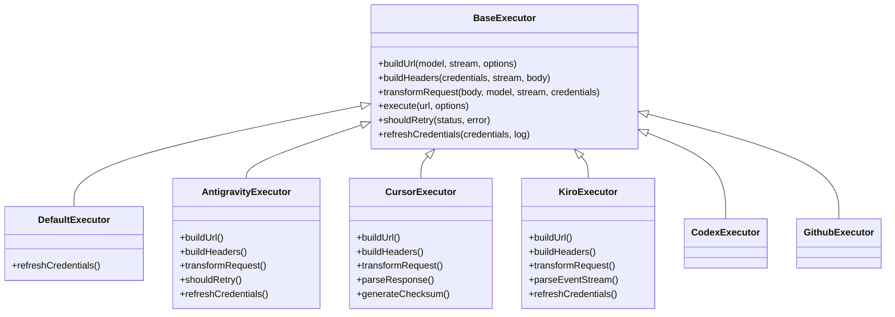

# OmniRoute 代码库文档（中文 (简体)）

🌐 **Languages:** 🇺🇸 [English](../../../../docs/CODEBASE_DOCUMENTATION.md) · 🇸🇦 [ar](../../ar/docs/CODEBASE_DOCUMENTATION.md) · 🇧🇬 [bg](../../bg/docs/CODEBASE_DOCUMENTATION.md) · 🇧🇩 [bn](../../bn/docs/CODEBASE_DOCUMENTATION.md) · 🇨🇿 [cs](../../cs/docs/CODEBASE_DOCUMENTATION.md) · 🇩🇰 [da](../../da/docs/CODEBASE_DOCUMENTATION.md) · 🇩🇪 [de](../../de/docs/CODEBASE_DOCUMENTATION.md) · 🇪🇸 [es](../../es/docs/CODEBASE_DOCUMENTATION.md) · 🇮🇷 [fa](../../fa/docs/CODEBASE_DOCUMENTATION.md) · 🇫🇮 [fi](../../fi/docs/CODEBASE_DOCUMENTATION.md) · 🇫🇷 [fr](../../fr/docs/CODEBASE_DOCUMENTATION.md) · 🇮🇳 [gu](../../gu/docs/CODEBASE_DOCUMENTATION.md) · 🇮🇱 [he](../../he/docs/CODEBASE_DOCUMENTATION.md) · 🇮🇳 [hi](../../hi/docs/CODEBASE_DOCUMENTATION.md) · 🇭🇺 [hu](../../hu/docs/CODEBASE_DOCUMENTATION.md) · 🇮🇩 [id](../../id/docs/CODEBASE_DOCUMENTATION.md) · 🇮🇹 [it](../../it/docs/CODEBASE_DOCUMENTATION.md) · 🇯🇵 [ja](../../ja/docs/CODEBASE_DOCUMENTATION.md) · 🇰🇷 [ko](../../ko/docs/CODEBASE_DOCUMENTATION.md) · 🇮🇳 [mr](../../mr/docs/CODEBASE_DOCUMENTATION.md) · 🇲🇾 [ms](../../ms/docs/CODEBASE_DOCUMENTATION.md) · 🇳🇱 [nl](../../nl/docs/CODEBASE_DOCUMENTATION.md) · 🇳🇴 [no](../../no/docs/CODEBASE_DOCUMENTATION.md) · 🇵🇭 [phi](../../phi/docs/CODEBASE_DOCUMENTATION.md) · 🇵🇱 [pl](../../pl/docs/CODEBASE_DOCUMENTATION.md) · 🇵🇹 [pt](../../pt/docs/CODEBASE_DOCUMENTATION.md) · 🇧🇷 [pt-BR](../../pt-BR/docs/CODEBASE_DOCUMENTATION.md) · 🇷🇴 [ro](../../ro/docs/CODEBASE_DOCUMENTATION.md) · 🇷🇺 [ru](../../ru/docs/CODEBASE_DOCUMENTATION.md) · 🇸🇰 [sk](../../sk/docs/CODEBASE_DOCUMENTATION.md) · 🇸🇪 [sv](../../sv/docs/CODEBASE_DOCUMENTATION.md) · 🇰🇪 [sw](../../sw/docs/CODEBASE_DOCUMENTATION.md) · 🇮🇳 [ta](../../ta/docs/CODEBASE_DOCUMENTATION.md) · 🇮🇳 [te](../../te/docs/CODEBASE_DOCUMENTATION.md) · 🇹🇭 [th](../../th/docs/CODEBASE_DOCUMENTATION.md) · 🇹🇷 [tr](../../tr/docs/CODEBASE_DOCUMENTATION.md) · 🇺🇦 [uk-UA](../../uk-UA/docs/CODEBASE_DOCUMENTATION.md) · `... [other locales]`

---

> OmniRoute 代码库工程参考文档，面向贡献者和集成开发者。

---

## 1. 技术栈

| 关注领域   | 技术选型                                                                                                               |
| ---------- | ---------------------------------------------------------------------------------------------------------------------- |
| Web 框架   | **Next.js 16**（App Router，独立输出，无全局中间件）                                                                   |
| 语言       | **TypeScript 6.0+** — 目标 `ES2022`，`module: esnext`，`moduleResolution: bundler`，`strict: false`                    |
| 运行时     | **Node.js** `>=22.22.2 <23` 或 `>=24.0.0 <27`（通过 `engines` + `SUPPORTED_NODE_RANGE` 强制）                          |
| 数据库     | **SQLite**，基于 `better-sqlite3`（单例，WAL 日志模式）                                                                |
| 桌面端     | **Electron 41** + `electron-builder` 26.10（独立工作空间 `electron/`）                                                 |
| 测试       | **Node 原生测试运行器**（单元/集成）、**Vitest**（MCP、autoCombo、缓存）、**Playwright**（端到端 + 协议端到端）        |
| 构建       | Next.js 独立模式，通过 `scripts/build/build-next-isolated.mjs`                                                         |
| 代码检查   | ESLint flat 配置 + Prettier（Husky pre-commit 触发 `lint-staged`）                                                     |
| 模块系统   | 全局 ESM（`"type": "module"`）                                                                                         |
| 工作空间   | npm workspace — `open-sse` 是唯一的子工作空间                                                                          |

路径别名（`tsconfig.json`）：

- `@/*` → `src/*`
- `@omniroute/open-sse` → `open-sse/index.ts`
- `@omniroute/open-sse/*` → `open-sse/*`

默认 HTTP 端口：**`20128`**（API 和仪表盘共享同一进程）。数据目录由 `DATA_DIR` 环境变量指定，默认为 `~/.omniroute/`。

---

## 2. 仓库布局

```
OmniRoute/
├── src/                  Next.js 应用（App Router、库、领域层、服务端、共享模块）
├── open-sse/             流式传输引擎工作空间（@omniroute/open-sse）
├── electron/             桌面端封装（Electron 41 主进程 + preload）
├── bin/                  CLI 入口点（omniroute、reset-password）
├── tests/                单元、集成、端到端、协议端到端、翻译器、安全、测试夹具
├── scripts/              构建、同步、检查、迁移及运行时辅助脚本
├── docs/                 公开文档（本目录）
├── public/               静态资源、PWA manifest、Service Worker
├── config/               运行时配置示例
├── images/               市场/截图资源
├── _ideia/, _references/, _mono_repo/, _tasks/   内部草稿/规划（不发布）
├── CLAUDE.md             面向 Claude Code 的仓库规则
├── AGENTS.md             面向 Agent 的深层架构参考
├── package.json          v3.8.0，工作空间根目录
└── tsconfig.json         路径别名 + 核心编译选项
```

---

## 3. `src/` — Next.js 应用

```
src/
├── app/                  App Router 页面 + API 路由
├── lib/                  核心库（DB、auth、OAuth、技能、记忆系统等）
├── domain/               纯领域层（策略、容灾、成本、锁定等）
├── server/               服务端专用模块（authz、cors、auth）
├── shared/               类型、常量、校验、契约、工具（跨边界安全）
├── mitm/                 面向 CLI 集成的中间人代理辅助工具
├── models/               本地模型元数据/别名
├── sse/                  仍在 src/ 下的旧版 SSE 处理器（非 open-sse/）
├── store/                客户端状态存储
├── middleware/           路由级中间件工具（非 Next.js 全局中间件）
├── scripts/              可被应用代码导入的树内脚本
├── types/                环境类型和共享 TS 类型
├── i18n/                 语言包
├── instrumentation.ts    Next.js instrumentation 钩子
├── instrumentation-node.ts
├── server-init.ts        进程级引导（环境变量、DB、任务、同步）
└── proxy.ts              顶层代理引导辅助
```

### 3.1 `src/app/` — App Router

App Router 同时暴露仪表盘 UI 和公开/管理 HTTP API。**不存在全局中间件** — 拦截在路由级别完成。

`src/app/` 下的顶层段：

| 路径                                                                           | 用途                              |
| ------------------------------------------------------------------------------ | --------------------------------- |
| `api/`                                                                         | 所有 HTTP API 路由（详见下文分解）|
| `a2a/`                                                                         | A2A JSON-RPC 2.0 端点（`POST /a2a`）|
| `.well-known/agent.json/`                                                      | A2A Agent Card 发现文档           |
| `(dashboard)/`                                                                 | 仪表盘 UI（路由组，无 URL 前缀）  |
| `auth/`、`login/`、`forgot-password/`、`callback/`                             | 认证流程                          |
| `landing/`                                                                     | 市场/落地页                       |
| `docs/`                                                                        | 嵌入式 API 文档查看器             |
| `status/`、`maintenance/`、`offline/`                                          | 运维页面                          |
| `privacy/`、`terms/`                                                           | 法律页面                          |
| `400/`、`401/`、`403/`、`408/`、`429/`、`500/`、`502/`、`503/`                  | 静态错误页面                      |
| `error.tsx`、`global-error.tsx`、`not-found.tsx`、`forbidden/`、`loading.tsx`  | 框架错误/加载边界                 |
| `layout.tsx`、`page.tsx`、`globals.css`、`manifest.ts`                         | 根外壳                            |

#### 3.1.1 `src/app/(dashboard)/dashboard/` — UI 页面

`agents`、`analytics`、`api-manager`、`audit`、`auto-combo`、`batch`、`cache`、
`changelog`、`cli-tools`、`cloud-agents`、`combos`、`compression`、`context`、
`costs`、`endpoint`、`health`、`limits`、`logs`、`memory`、`onboarding`、
`playground`、`providers`、`search-tools`、`settings`、`skills`、`system`、
`translator`、`usage`、`webhooks`，外加根目录 `page.tsx`、`HomePageClient.tsx`、
`BootstrapBanner.tsx`。

#### 3.1.2 `src/app/api/` — 顶层 API 分组

```
src/app/api/
├── a2a/{status, tasks}
├── acp/
├── admin/
├── analytics/
├── assess/
├── auth/
├── batches/
├── cache/
├── cli-tools/
├── cloud/{codex-responses-ws}
├── combos/
├── compliance/
├── compression/
├── context/
├── db/, db-backups/
├── evals/
├── fallback/
├── files/
├── health/
├── init/
├── internal/{concurrency}
├── keys/
├── logs/
├── mcp/{audit, sse, status, stream, tools}
├── memory/{health, [id]/, route.ts}
├── model-combo-mappings/
├── models/
├── monitoring/
├── oauth/
├── openapi/
├── policies/
├── pricing/
├── provider-metrics/, provider-models/, provider-nodes/
├── providers/
├── rate-limit/, rate-limits/
├── resilience/
├── restart/, shutdown/
├── search/
├── sessions/
├── settings/
├── skills/{executions, [id], install, marketplace, route.ts, skillssh}
├── storage/
├── sync/, synced-available-models/
├── system/
├── tags/
├── telemetry/
├── token-health/
├── translator/
├── tunnels/
├── services/   嵌入式服务管理（9router、cliproxy）— LOCAL_ONLY
├── upstream-proxy/
├── usage/
├── v1/         OpenAI 兼容公开 API
├── v1beta/     Gemini 风格兼容
├── version-manager/
└── webhooks/
```

#### 3.1.2a `src/app/api/services/` — 嵌入式服务管理

用于安装、启动、停止和监控 9Router 与 CLIProxyAPI 的路由。
所有路径均分类为 **LOCAL_ONLY**（仅 loopback，硬规则 #17），因为它们可能调用 `npm install` 并生成子进程。

```
src/app/api/services/
├── 9router/
│   ├── _lib.ts             getOrInitSupervisor() 辅助函数
│   ├── install/route.ts    POST — 通过 execFile 执行 npm install
│   ├── start/route.ts      POST — supervisor.start()
│   ├── stop/route.ts       POST — supervisor.stop()
│   ├── restart/route.ts    POST — supervisor.restart()
│   ├── update/route.ts     POST — npm install 更新版本
│   ├── rotate-key/route.ts POST — 生成新的 API Key 并重启
│   ├── status/route.ts     GET  — 实时 + DB 状态 + 版本元数据
│   └── auto-start/route.ts POST — 切换 auto_start 标志
├── cliproxy/
│   ├── _lib.ts             getOrInitSupervisor() 辅助函数
│   ├── install/route.ts    POST — npm install
│   ├── start/route.ts      POST — supervisor.start()
│   ├── stop/route.ts       POST — supervisor.stop()
│   ├── restart/route.ts    POST — supervisor.restart()
│   ├── update/route.ts     POST — npm install 更新版本
│   ├── status/route.ts     GET  — 实时 + DB 状态 + 版本元数据
│   └── auto-start/route.ts POST — 切换 auto_start 标志
└── [name]/
    └── logs/route.ts       GET  — SSE 日志尾部（所有服务共享）
```

对应仪表盘 UI：
`src/app/(dashboard)/dashboard/providers/services/` — 双标签页（CLIProxyAPI + 9Router）。
9Router 嵌入式 UI 的反向代理：
`src/app/(dashboard)/dashboard/providers/services/[name]/embed/[...path]/route.ts`

深入阅读：`docs/frameworks/EMBEDDED-SERVICES.md`

#### 3.1.3 `src/app/api/v1/` — OpenAI 兼容公开 API

```
v1/
├── accounts/[id]/                       账户查询
├── agents/tasks/[id]/, agents/tasks/    A2A 风格的任务端点
├── api/                                 v1/api 下暴露的内部 API 辅助工具
├── audio/{speech, transcriptions}/      TTS + STT
├── batches/[id]/{cancel}, batches/      OpenAI Batches API
├── chat/completions/                    对话补全（主要端点）
├── chatgpt-web/                         ChatGPT-Web 兼容
├── completions/                         旧版文本补全
├── embeddings/                          嵌入
├── files/[id]/, files/                  Files API
├── _helpers/                            共享路由辅助工具（无公开 URL）
├── images/{edits, generations}/         图像生成 + 编辑
├── issues/                              诊断辅助端点
├── management/{proxies}/                v1 内的管理权限域路由
├── messages/{count_tokens}/             Anthropic 风格消息兼容
├── models/                              模型列表（`route.ts`、`catalog.ts`）
├── moderations/                         内容审核
├── music/                               音乐生成
├── providers/[provider]/                按服务商操作
├── quotas/{check}                       配额探测
├── registered-keys/                     注册 Key 管理
├── rerank/                              重排序
├── responses/[...path]/                 OpenAI Responses API（通配路由）
├── search/                              网页搜索
├── videos/                              视频生成
├── ws/                                  WebSocket 桥接
└── route.ts                             索引处理器
```

每个路由文件遵循相同模式：

```
路由 → CORS 预检 → Zod 请求体验证 → 可选认证
     → API Key 策略执行 → 处理器委托（open-sse）
```

`v1beta/` 是 Gemini 风格兼容层（一个薄封装，翻译后进入相同的 `open-sse/handlers/` 管道）。

### 3.2 `src/lib/` — 核心库

始终通过这些模块导入数据、同步、OAuth、技能、记忆等。下表按实际目录和重要顶层文件分组。

| 模块                  | 用途                                                                                                                                                                                                                                                                                                                                                                                                                                                                                                                                                                                                                                                                          |
| --------------------- | ----------------------------------------------------------------------------------------------------------------------------------------------------------------------------------------------------------------------------------------------------------------------------------------------------------------------------------------------------------------------------------------------------------------------------------------------------------------------------------------------------------------------------------------------------------------------------------------------------------------------------------------------------------------------------- |
| `a2a/`                | A2A 协议服务器：`taskManager.ts`、`streaming.ts`、`taskExecution.ts`、`routingLogger.ts`、`skills/`（6 个技能：成本分析、健康报告、服务商发现、配额管理、智能路由、列出能力）                                                                                                                                                                                                                                                                                                                                                                                                                                                                                                  |
| `acp/`                | Agent-Control-Protocol：`index.ts`、`manager.ts`、`registry.ts`                                                                                                                                                                                                                                                                                                                                                                                                                                                                                                                                                                                                                |
| `api/`                | 内部 API 辅助工具：`requireManagementAuth.ts`、`requireCliToolsAuth.ts`、`errorResponse.ts`                                                                                                                                                                                                                                                                                                                                                                                                                                                                                                                                                                                    |
| `auth/`               | `managementPassword.ts`（密码重置/哈希）                                                                                                                                                                                                                                                                                                                                                                                                                                                                                                                                                                                                                                       |
| `batches/`            | OpenAI Batches API 服务（`service.ts`）                                                                                                                                                                                                                                                                                                                                                                                                                                                                                                                                                                                                                                         |
| `catalog/`            | OpenRouter 目录同步（`openrouterCatalog.ts`）                                                                                                                                                                                                                                                                                                                                                                                                                                                                                                                                                                                                                                   |
| `cloudAgent/`         | 云代理注册表：`api.ts`、`baseAgent.ts`、`db.ts`、`index.ts`、`registry.ts`、`types.ts`、`agents/{codex, devin, jules}.ts`                                                                                                                                                                                                                                                                                                                                                                                                                                                                                                                                                       |
| `combos/`             | Combo 解析辅助工具                                                                                                                                                                                                                                                                                                                                                                                                                                                                                                                                                                                                                                                             |
| `compliance/`         | 审计 + 服务商审计：`index.ts`、`providerAudit.ts`                                                                                                                                                                                                                                                                                                                                                                                                                                                                                                                                                                                                                               |
| `config/`             | 运行时配置粘合层                                                                                                                                                                                                                                                                                                                                                                                                                                                                                                                                                                                                                                                               |
| `db/`                 | SQLite 领域模块（见 §3.2.1）                                                                                                                                                                                                                                                                                                                                                                                                                                                                                                                                                                                                                                                   |
| `display/`            | API 响应使用的 UI/展示辅助工具                                                                                                                                                                                                                                                                                                                                                                                                                                                                                                                                                                                                                                                  |
| `embeddings/`         | 嵌入服务注册表                                                                                                                                                                                                                                                                                                                                                                                                                                                                                                                                                                                                                                                                 |
| `env/`                | 环境变量加载 + 自检                                                                                                                                                                                                                                                                                                                                                                                                                                                                                                                                                                                                                                                            |
| `evals/`              | 评估框架运行时                                                                                                                                                                                                                                                                                                                                                                                                                                                                                                                                                                                                                                                                 |
| `guardrails/`         | `piiMasker.ts`、`promptInjection.ts`、`visionBridge.ts`、`visionBridgeHelpers.ts`、`registry.ts`、`base.ts`                                                                                                                                                                                                                                                                                                                                                                                                                                                                                                                                                                    |
| `jobs/`               | 后台任务（`autoUpdate.ts` 等）                                                                                                                                                                                                                                                                                                                                                                                                                                                                                                                                                                                                                                                  |
| `memory/`             | 持久化记忆：`store.ts`、`cache.ts`、`retrieval.ts`、`summarization.ts`、`extraction.ts`、`injection.ts`、`qdrant.ts`、`settings.ts`、`verify.ts`、`schemas.ts`、`types.ts`                                                                                                                                                                                                                                                                                                                                                                                                                                                                                                      |
| `monitoring/`         | `observability.ts`                                                                                                                                                                                                                                                                                                                                                                                                                                                                                                                                                                                                                                                              |
| `oauth/`              | OAuth 服务商（14 个）：`antigravity`、`claude`、`cline`、`codex`、`cursor`、`gemini`、`github`、`gitlab-duo`、`kilocode`、`kimi-coding`、`kiro`、`qoder`、`qwen`、`windsurf`，以及 `services/`、`utils/{pkce, server, banner, codexAuthFile, ui}`、`constants/oauth.ts`                                                                                                                                                                                                                                                                                                                                                                                                         |
| `plugins/`            | 插件加载器（`index.ts`）                                                                                                                                                                                                                                                                                                                                                                                                                                                                                                                                                                                                                                                        |
| `promptCache/`        | `prefixAnalyzer.ts`、`index.ts`                                                                                                                                                                                                                                                                                                                                                                                                                                                                                                                                                                                                                                                 |
| `providerModels/`     | 托管模型生命周期：`modelDiscovery.ts`、`managedModelImport.ts`、`managedAvailableModels.ts`、`cursorAgent.ts`                                                                                                                                                                                                                                                                                                                                                                                                                                                                                                                                                                   |
| `providers/`          | 服务商辅助工具：`catalog.ts`、`validation.ts`、`imageValidation.ts`、`claudeExtraUsage.ts`、`codexConnectionDefaults.ts`、`codexFastTier.ts`、`webCookieAuth.ts`、`managedAvailableModels.ts`、`requestDefaults.ts`                                                                                                                                                                                                                                                                                                                                                                                                                                                              |
| `resilience/`         | `settings.ts` — 熔断器、冷却、锁定的设置                                                                                                                                                                                                                                                                                                                                                                                                                                                                                                                                                                                                                                        |
| `runtime/`            | 运行时特性检测                                                                                                                                                                                                                                                                                                                                                                                                                                                                                                                                                                                                                                                                 |
| `search/`             | `executeWebSearch.ts`                                                                                                                                                                                                                                                                                                                                                                                                                                                                                                                                                                                                                                                           |
| `services/`           | 嵌入式服务框架：`ServiceSupervisor.ts`（通用子进程管理器，带操作锁、环形缓冲区、健康检查器）、`bootstrap.ts`（进程级注册和自动启动）、`registry.ts`（工具 → 管理器映射）、`apiKey.ts`（AES-256-GCM Key 存储）、`modelSync.ts`（定期模型同步）、`ringBuffer.ts`（5 MB 环形日志缓冲）、`healthCheck.ts`（HTTP 健康探测）、`types.ts`、`embedWsProxy.ts`（WebSocket 代理）、`installers/{ninerouter,cliproxy}.ts`。详见 `docs/frameworks/EMBEDDED-SERVICES.md`                                                                                                                                                                                        |
| `agentSkills/`        | Agent Skills 目录 + 生成器：`catalog.ts`（getCatalog/getSkillById/filterCatalog/computeCoverage）、`generator.ts`（generateAgentSkills → 写入 `skills/{id}/SKILL.md`）、`openapiParser.ts`（从 OpenAPI 规范提取 REST 端点）、`cliRegistryParser.ts`（从 bin/cli-registry 提取 CLI 子命令）、`schemas.ts`（Zod：AgentSkillSchema、SkillCoverageSchema、ListQuerySchema、GenerateBodySchema）、`types.ts`（AgentSkill、SkillCoverage、SkillMarkdown、GeneratorReport）。被 REST 路由（`/api/agent-skills/*`）、MCP 工具（`omniroute_agent_skills_*`）和 A2A 技能 `list-capabilities` 消费。参见 [AGENT-SKILLS.md](../frameworks/AGENT-SKILLS.md)。 |
| `skills/`             | 技能框架：`registry.ts`、`executor.ts`、`interception.ts`、`injection.ts`、`sandbox.ts`、`custom.ts`、`hybrid.ts`、`builtins.ts`、`a2a.ts`、`providerSettings.ts`、`schemas.ts`、`skillssh.ts`、`types.ts`，以及 `builtin/browser.ts`                                                                                                                                                                                                                                                                                                                                                                                                                                           |
| `spend/`              | `batchWriter.ts`（写后缓冲）                                                                                                                                                                                                                                                                                                                                                                                                                                                                                                                                                                                                                                                     |
| `sync/`               | `bundle.ts`、`tokens.ts`（云同步）                                                                                                                                                                                                                                                                                                                                                                                                                                                                                                                                                                                                                                               |
| `system/`             | 系统级辅助工具                                                                                                                                                                                                                                                                                                                                                                                                                                                                                                                                                                                                                                                                 |
| `translator/`         | 顶层翻译器粘合层（委托到 `open-sse/translator/`）                                                                                                                                                                                                                                                                                                                                                                                                                                                                                                                                                                                                                                 |
| `usage/`              | 用量核算：`costCalculator.ts`、`tokenAccounting.ts`、`usageHistory.ts`、`aggregateHistory.ts`、`usageStats.ts`、`callLogs.ts`、`callLogArtifacts.ts`、`fetcher.ts`、`providerLimits.ts`、`migrations.ts`                                                                                                                                                                                                                                                                                                                                                                                                                                                                           |
| `versionManager/`     | 自动更新 + 版本清单                                                                                                                                                                                                                                                                                                                                                                                                                                                                                                                                                                                                                                                             |
| `ws/`                 | WebSocket 桥接                                                                                                                                                                                                                                                                                                                                                                                                                                                                                                                                                                                                                                                                  |
| `zed-oauth/`          | Zed 编辑器 OAuth 流程                                                                                                                                                                                                                                                                                                                                                                                                                                                                                                                                                                                                                                                           |

`src/lib/` 中的顶层文件：

- `localDb.ts` — 仅作重新导出层。**切勿**在此添加逻辑。
- `proxyHealth.ts`、`proxyLogger.ts`、`tokenHealthCheck.ts`、`localHealthCheck.ts`
- `oneproxyRotator.ts`、`oneproxySync.ts`
- `apiBridgeServer.ts`、`cacheLayer.ts`、`semanticCache.ts`、`settingsCache.ts`
- `cloudSync.ts`、`initCloudSync.ts`
- `cloudflaredTunnel.ts`、`ngrokTunnel.ts`、`tailscaleTunnel.ts`
- `consoleInterceptor.ts`、`container.ts`、`gracefulShutdown.ts`、`idempotencyLayer.ts`
- `ipUtils.ts`、`logEnv.ts`、`logPayloads.ts`、`logRotation.ts`
- `modelAliasSeed.ts`、`modelCapabilities.ts`、`modelMetadataRegistry.ts`、`modelsDevSync.ts`
- `piiSanitizer.ts`、`pricingSync.ts`
- `apiKeyExposure.ts`、`cacheControlSettings.ts`、`dataPaths.ts`、`toolPolicy.ts`
- `translatorEvents.ts`、`usageDb.ts`、`usageAnalytics.ts`、`webhookDispatcher.ts`

#### 3.2.1 `src/lib/db/`

单例 SQLite 数据库（`core.ts` 中的 `getDbInstance()`，WAL 日志模式）。
**切勿在路由或处理器中直接写 SQL** — 应通过这些模块访问。


> 来源：[diagrams/db-schema-overview.mmd](../diagrams/db-schema-overview.mmd)

领域模块（每个模块拥有一张或多张表）：`apiKeys.ts`、`backup.ts`、
`batches.ts`、`cleanup.ts`、`cliToolState.ts`、`combos.ts`、
`commandCodeAuth.ts`、`compression.ts`、`compressionAnalytics.ts`、
`compressionCacheStats.ts`、`compressionCombos.ts`、`compressionScheduler.ts`、
`contextHandoffs.ts`、`core.ts`、`creditBalance.ts`、`databaseSettings.ts`、
`detailedLogs.ts`、`domainState.ts`、`encryption.ts`、`evals.ts`、`files.ts`、
`healthCheck.ts`、`jsonMigration.ts`、`migrationRunner.ts`、
`modelComboMappings.ts`、`models.ts`、`oneproxy.ts`、`prompts.ts`、
`providers.ts`、`providerLimits.ts`、`proxies.ts`、`quotaSnapshots.ts`、
`readCache.ts`、`reasoningCache.ts`、`registeredKeys.ts`、`secrets.ts`、
`sessionAccountAffinity.ts`、`settings.ts`、`stateReset.ts`、`stats.ts`、
`syncTokens.ts`、`tierConfig.ts`、`upstreamProxy.ts`、`versionManager.ts`、
`webhooks.ts`。

`migrations/` 包含 55 个带版本号的 `.sql` 文件（幂等、事务性），由 `migrationRunner.ts` 在启动时执行。

所有迁移中创建的表（52 张总计）：

`a`、`account_key_limits`、`api_keys`、`batches`、`call_logs`、
`combo_adaptation_state`、`combos`、`command_code_auth_sessions`、
`compression_analytics`、`compression_cache_stats`、
`compression_combo_assignments`、`compression_combos`、`context_handoffs`、
`daily_usage_summary`、`db_meta`、`domain_budgets`、`domain_circuit_breakers`、
`domain_cost_history`、`domain_fallback_chains`、`domain_lockout_state`、
`eval_cases`、`eval_runs`、`eval_suites`、`files`、`hourly_usage_summary`、
`key_value`、`mcp_tool_audit`、`memories`、`model_combo_mappings`、
`provider_connections`、`provider_key_limits`、`provider_nodes`、
`proxy_assignments`、`proxy_logs`、`proxy_registry`、`quota_snapshots`、
`reasoning_cache`、`registered_keys`、`request_detail_logs`、
`routing_decisions`、`semantic_cache`、`session_account_affinity`、
`skill_executions`、`skills`、`sync_tokens`、`tier_assignments`、
`tier_config`、`upstream_proxy_config`、`usage_history`、`version_manager`、
`webhooks`（以及用于记忆搜索的 FTS5 虚拟表）。

### 3.3 `src/domain/` — 领域层

纯业务逻辑，无 I/O。被路由和处理器导入。

| 文件                                         | 用途                              |
| -------------------------------------------- | --------------------------------- |
| `policyEngine.ts`                            | 顶层策略解析器                    |
| `fallbackPolicy.ts`                          | 容灾决策树                        |
| `costRules.ts`                               | 成本计算规则                      |
| `lockoutPolicy.ts`                           | 模型锁定决策                      |
| `tagRouter.ts`                               | 基于标签的路由                    |
| `comboResolver.ts`                           | Combo 解析（请求 → 目标列表）     |
| `connectionModelRules.ts`                    | 按连接过滤模型                    |
| `modelAvailability.ts`                       | 模型可用性检查                    |
| `degradation.ts`                             | 降级模式切换                      |
| `providerExpiration.ts`                      | 过期账户/Key 检测                 |
| `quotaCache.ts`                              | 缓存配额决策                      |
| `responses.ts`、`omnirouteResponseMeta.ts`   | 响应格式辅助工具                  |
| `configAudit.ts`                             | 配置变更审计                      |
| `assessment/`                                | 模型评估（按 RFC，部分实现）      |
| `types.ts`                                   | 共享领域类型                      |

### 3.4 `src/server/` — 服务端专用

不可从客户端组件导入。

```
server/
├── auth/loginGuard.ts
├── authz/
│   ├── classify.ts        将路由分类为公开 vs 管理
│   ├── assertAuth.ts      断言辅助工具
│   ├── context.ts         按请求的 authz 上下文
│   ├── headers.ts
│   ├── pipeline.ts        Authz 管道
│   ├── policies/          具体策略
│   └── types.ts
└── cors/origins.ts        CORS 来源白名单
```

### 3.5 `src/shared/` — 安全共享模块

划分为聚焦的子目录：

- `constants/` — `providers.ts`（经 Zod 校验的服务商目录）、`models.ts`、
  `modelSpecs.ts`、`modelCompat.ts`、`pricing.ts`、`cliTools.ts`、
  `cliCompatProviders.ts`、`routingStrategies.ts`、`comboConfigMode.ts`、
  `headers.ts`、`upstreamHeaders.ts`（拒绝名单）、`mcpScopes.ts`、
  `errorCodes.ts`、`publicApiRoutes.ts`、`batch.ts`、`batchEndpoints.ts`、
  `bodySize.ts`、`colors.ts`、`appConfig.ts`、`config.ts`、
  `sidebarVisibility.ts`、`visionBridgeDefaults.ts`。
- `validation/` — `schemas.ts`（约 80 个 Zod Schema）、`compressionConfigSchemas.ts`、
  `oneproxySchemas.ts`、`providerSchema.ts`、`settingsSchemas.ts`、`helpers.ts`。
- `contracts/` — 发布到 npm 的公开 API 契约。
- `types/` — 共享 TS 类型。
- `utils/` — `circuitBreaker.ts`、`apiAuth.ts`、`apiKey.ts`、`apiKeyPolicy.ts`、
  `apiResponse.ts`、`api.ts`、`classify429.ts`、`cliCompat.ts`、`clipboard.ts`、
  `cloud.ts`、`cn.ts`、`cors.ts`、`costEstimator.ts`、`featureFlags.ts`、
  `fetchTimeout.ts`、`formatting.ts`、`inputSanitizer.ts`、`logger.ts`、
  `machine.ts`、`machineId.ts`、`maskEmail.ts`、`modelCatalogSearch.ts`、
  `nodeRuntimeSupport.ts`、`parseApiKeys.ts`、`providerHints.ts`、
  `providerModelAliases.ts`、`rateLimiter.ts`、`releaseNotes.ts`、
  `a11yAudit.ts`，以及 `services/`、`network/`、
  `middleware/`、`schemas/`、`hooks/`、`components/` 下的仪表盘钩子/组件。

---

## 4. `open-sse/` — 流式传输引擎工作空间

独立的 npm workspace，发布为 `@omniroute/open-sse`。负责请求处理、执行器、翻译器、服务、转换器和 MCP 服务器。



| Executor         | Provider                                   | Key Specializations                                                                                                 |
| ---------------- | ------------------------------------------ | ------------------------------------------------------------------------------------------------------------------- |
| `base.ts`        | —                                          | Abstract base: URL building, headers, retry logic, credential refresh                                               |
| `default.ts`     | Claude, Gemini, OpenAI, GLM, Kimi, MiniMax | Generic OAuth token refresh for standard providers                                                                  |
| `antigravity.ts` | Google Cloud Code                          | Project/session ID generation, multi-URL fallback, custom retry parsing from error messages ("reset after 2h7m23s") |
| `cursor.ts`      | Cursor IDE                                 | **Most complex**: SHA-256 checksum auth, Protobuf request encoding, binary EventStream → SSE response parsing       |
| `codex.ts`       | OpenAI Codex                               | Injects system instructions, manages thinking levels, removes unsupported parameters                                |
| `github.ts`      | GitHub Copilot                             | Dual token system (GitHub OAuth + Copilot token), VSCode header mimicking                                           |
| `kiro.ts`        | AWS CodeWhisperer                          | AWS EventStream binary parsing, AMZN event frames, token estimation                                                 |
| `index.ts`       | —                                          | Factory: maps provider name → executor class, with default fallback                                                 |

---

## 5. `electron/` — 桌面端封装

```
electron/
├── main.js                  Electron 主进程
├── preload.js               Preload 桥接（contextIsolation 已启用）
├── types.d.ts
├── package.json             electron-builder 配置，版本 3.8.0
├── README.md
├── assets/                  构建资源（图标、权限声明等）
├── node_modules/            专用 node_modules（better-sqlite3、electron-updater）
└── dist-electron/           构建输出（不提交）
```

工作空间根目录下五个 npm 脚本：`electron:dev`、`electron:build`、
`electron:build:{win,mac,linux}`、`electron:smoke:packaged`。自动更新通过
`electron-updater` 指向 GitHub Release 源实现。

---

## 6. `bin/` — CLI

```
bin/
├── omniroute.mjs           主 CLI 入口（Node ESM）
├── reset-password.mjs      通过 CLI 重置管理密码
├── mcp-server.mjs          MCP 服务器启动器（stdio）
├── nodeRuntimeSupport.mjs  Node 版本守卫
└── cli/
    ├── program.mjs         Commander 程序构建器
    ├── runtime.mjs         withRuntime 辅助（优先服务器/回退到 DB）
    ├── output.mjs          输出格式化器（json/jsonl/table/csv）
    ├── i18n.mjs            t() 辅助，带语言包
    ├── api.mjs             API fetch 辅助
    ├── data-dir.mjs
    ├── encryption.mjs
    ├── sqlite.mjs
    └── commands/
        ├── registry.mjs    命令注册
        ├── setup.mjs
        ├── doctor.mjs
        ├── providers.mjs
        └── ...             每个命令/组一个文件
```

`package.json` → `bin` 中暴露两个二进制文件：

- `omniroute` → `bin/omniroute.mjs`
- `omniroute-reset-password` → `bin/reset-password.mjs`

---

## 7. `tests/`

| 目录                                                                             | 类型                                                         |
| -------------------------------------------------------------------------------- | ------------------------------------------------------------ |
| `tests/unit/`                                                                    | Node 原生测试运行器的单元测试（1821 个文件，含 `api/`、`auth/`、`authz/` 子目录）|
| `tests/integration/`                                                             | 跨模块 + DB 状态测试                                         |
| `tests/e2e/`                                                                     | Playwright UI 测试                                           |
| `tests/protocols-e2e/`                                                           | MCP/A2A 协议端到端                                           |
| `tests/translator/`                                                              | 翻译器专用测试                                               |
| `tests/security/`                                                                | 安全回归测试                                                 |
| `tests/load/`                                                                    | 负载 / 压力测试                                              |
| `tests/golden-set/`                                                              | 翻译器回归参考输出                                           |
| `tests/helpers/`、`tests/fixtures/`、`tests/manual/`、`tests/scratch_test.mjs`   | 支撑                                                         |

常用命令：

| 命令                                                      | 运行内容                                                       |
| --------------------------------------------------------- | -------------------------------------------------------------- |
| `npm run test:unit`                                       | `tests/unit/*.test.ts` 全部（Node 测试运行器，并发 10）        |
| `npm run test:vitest`                                     | Vitest 套件（MCP、autoCombo、缓存）                            |
| `npm run test:e2e`                                        | Playwright UI 套件                                             |
| `npm run test:protocols:e2e`                              | MCP + A2A 协议端到端                                           |
| `npm run test:coverage`                                   | 覆盖率门槛（行/语句/函数/分支 ≥ 60%）                          |
| `node --import tsx/esm --test tests/unit/<file>.test.ts`  | 单文件运行                                                     |

---

## 8. `scripts/`

按用途分为 6 个子文件夹。

- **`scripts/build/`** — `build-next-isolated.mjs`、`prepublish.ts`、
  `prepare-electron-standalone.mjs`、`pack-artifact-policy.ts`、
  `validate-pack-artifact.ts`、`postinstall.mjs`、`postinstallSupport.mjs`、
  `uninstall.mjs`、`bootstrap-env.mjs`、`runtime-env.mjs`、
  `native-binary-compat.mjs`。
- **`scripts/dev/`** — `run-next.mjs`、`run-next-playwright.mjs`、
  `run-standalone.mjs`、`standalone-server-ws.mjs`、`responses-ws-proxy.mjs`、
  `v1-ws-bridge.mjs`、`smoke-electron-packaged.mjs`、
  `run-playwright-tests.mjs`、`run-ecosystem-tests.mjs`、
  `run-protocol-clients-tests.mjs`、`sync-env.mjs`、`healthcheck.mjs`、
  `system-info.mjs`。
- **`scripts/check/`** — `check-cycles.mjs`、`check-docs-sync.mjs`、
  `check-docs-counts-sync.mjs`、`check-env-doc-sync.mjs`、
  `check-deprecated-versions.mjs`、`check-route-validation.mjs`、
  `check-t11-any-budget.mjs`、`check-pr-test-policy.mjs`、
  `check-supported-node-runtime.ts`、`test-report-summary.mjs`。
- **`scripts/docs/`** — `generate-docs-index.mjs`、`gen-provider-reference.ts`。
- **`scripts/i18n/`** — `generate-multilang.mjs`、`run-visual-qa.mjs`、
  `generate-qa-checklist.mjs`、`apply-priority-overrides.mjs`、
  `validate_translation.py`、`check_translations.py`、`i18n_autotranslate.py`、
  `untranslatable-keys.json`。
- **`scripts/ad-hoc/`** — `cursor-tap.cjs`、`sync-cursor-models.mjs`、
  `migrate-env.mjs`、`dbsetup.js`。

---

## 9. 请求管道（摘要）


> 来源：[diagrams/request-pipeline.mmd](../diagrams/request-pipeline.mmd)

| Route                                         | Methods         | Purpose                                                                               |
| --------------------------------------------- | --------------- | ------------------------------------------------------------------------------------- |
| `/api/provider-models`                        | GET/POST/DELETE | CRUD for custom models per provider                                                   |
| `/api/models/catalog`                         | GET             | Aggregated catalog of all models (chat, embedding, image, custom) grouped by provider |
| `/api/settings/proxy`                         | GET/PUT/DELETE  | Hierarchical outbound proxy configuration (`global/providers/combos/keys`)            |
| `/api/settings/proxy/test`                    | POST            | Validates proxy connectivity and returns public IP/latency                            |
| `/v1/providers/[provider]/chat/completions`   | POST            | Dedicated per-provider chat completions with model validation                         |
| `/v1/providers/[provider]/embeddings`         | POST            | Dedicated per-provider embeddings with model validation                               |
| `/v1/providers/[provider]/images/generations` | POST            | Dedicated per-provider image generation with model validation                         |
| `/api/settings/ip-filter`                     | GET/PUT         | IP allowlist/blocklist management                                                     |
| `/api/settings/thinking-budget`               | GET/PUT         | Reasoning token budget configuration (passthrough/auto/custom/adaptive)               |
| `/api/settings/system-prompt`                 | GET/PUT         | Global system prompt injection for all requests                                       |
| `/api/sessions`                               | GET             | Active session tracking and metrics                                                   |
| `/api/rate-limits`                            | GET             | Per-account rate limit status                                                         |

---

## 5. Key Design Patterns

### 5.1 Hub-and-Spoke Translation

All formats translate through **OpenAI format as the hub**. Adding a new provider only requires writing **one pair** of translators (to/from OpenAI), not N pairs.

### 5.2 Executor Strategy Pattern

Each provider has a dedicated executor class inheriting from `BaseExecutor`. The factory in `executors/index.ts` selects the right one at runtime.

### 5.3 Self-Registering Plugin System

Translator modules register themselves on import via `register()`. Adding a new translator is just creating a file and importing it.

### 5.4 Account Fallback with Exponential Backoff

When a provider returns 429/401/500, the system can switch to the next account, applying exponential cooldowns (1s → 2s → 4s → max 2min).

### 5.5 Combo Model Chains

A "combo" groups multiple `provider/model` strings. If the first fails, fallback to the next automatically.

### 5.6 Stateful Streaming Translation

Response translation maintains state across SSE chunks (thinking block tracking, tool call accumulation, content block indexing) via the `initState()` mechanism.

### 5.7 Usage Safety Buffer

A 2000-token buffer is added to reported usage to prevent clients from hitting context window limits due to overhead from system prompts and format translation.

---

## 6. Supported Formats

| Format                  | Direction       | Identifier         |
| ----------------------- | --------------- | ------------------ |
| OpenAI Chat Completions | source + target | `openai`           |
| OpenAI Responses API    | source + target | `openai-responses` |
| Anthropic Claude        | source + target | `claude`           |
| Google Gemini           | source + target | `gemini`           |
| Antigravity             | source + target | `antigravity`      |
| AWS Kiro                | target only     | `kiro`             |
| Cursor                  | target only     | `cursor`           |

---

## 7. Supported Providers

| Provider                 | Auth Method            | Executor    | Key Notes                                     |
| ------------------------ | ---------------------- | ----------- | --------------------------------------------- |
| Anthropic Claude         | API key or OAuth       | Default     | Uses `x-api-key` header                       |
| Google Gemini            | API key or OAuth       | Default     | Uses `x-goog-api-key` header                  |
| Antigravity              | OAuth                  | Antigravity | Multi-URL fallback, custom retry parsing      |
| OpenAI                   | API key                | Default     | Standard Bearer auth                          |
| Codex                    | OAuth                  | Codex       | Injects system instructions, manages thinking |
| GitHub Copilot           | OAuth + Copilot token  | Github      | Dual token, VSCode header mimicking           |
| Kiro (AWS)               | AWS SSO OIDC or Social | Kiro        | Binary EventStream parsing                    |
| Cursor IDE               | Checksum auth          | Cursor      | Protobuf encoding, SHA-256 checksums          |
| Qwen                     | OAuth                  | Default     | Standard auth                                 |
| Qoder                    | OAuth (Basic + Bearer) | Default     | Dual auth header                              |
| OpenRouter               | API key                | Default     | Standard Bearer auth                          |
| GLM, Kimi, MiniMax       | API key                | Default     | Claude-compatible, use `x-api-key`            |
| `openai-compatible-*`    | API key                | Default     | Dynamic: any OpenAI-compatible endpoint       |
| `anthropic-compatible-*` | API key                | Default     | Dynamic: any Claude-compatible endpoint       |

---

## 8. Data Flow Summary

### Streaming Request

```mermaid
flowchart LR
    A["Client"] --> B["detectFormat()"]
    B --> C["translateRequest()\nsource → OpenAI → target"]
    C --> D["Executor\nbuildUrl + buildHeaders"]
    D --> E["fetch(providerURL)"]
    E --> F["createSSEStream()\nTRANSLATE mode"]
    F --> G["parseSSELine()"]
    G --> H["translateResponse()\ntarget → OpenAI → source"]
    H --> I["extractUsage()\n+ addBuffer"]
    I --> J["formatSSE()"]
    J --> K["Client receives\ntranslated SSE"]
    K --> L["logUsage()\nsaveRequestUsage()"]
```



### 容灾运行时状态（三种机制）

| 机制           | 范围               | 位置                                                                                               |
| -------------- | ------------------ | -------------------------------------------------------------------------------------------------- |
| 服务商熔断器   | 整个服务商         | `src/shared/utils/circuitBreaker.ts`，持久化于 `domain_circuit_breakers`                           |
| 连接冷却       | 单个账户/Key       | `src/sse/services/auth.ts` 中的 `markAccountUnavailable()`；由 `accountFallback.checkFallbackError()` 消费 |
| 模型锁定       | 服务商 + 连接 + 模型| `open-sse/services/accountFallback.ts`，持久化于 `domain_lockout_state`                             |

参见 [RESILIENCE_GUIDE.md](./RESILIENCE_GUIDE.md) 和 [CLAUDE.md](../../CLAUDE.md) 中的专门章节。

---

## 10. 贡献指南

### 添加新服务商

1. 在 `src/shared/constants/providers.ts` 中注册（加载时 Zod 校验）。
2. 若需自定义逻辑，在 `open-sse/executors/` 中添加执行器（扩展 `BaseExecutor`）。
3. 若不使用 OpenAI 格式，在 `open-sse/translator/` 中添加翻译器。
4. 若基于 OAuth，在 `src/lib/oauth/providers/` 和 `src/lib/oauth/services/` 下添加配置。
5. 在 `open-sse/config/providerRegistry.ts`（或 `open-sse/config/` 下按格式的注册表）中注册模型。
6. 在 `tests/unit/` 下编写测试。

### 添加新 API 路由

1. 创建 `src/app/api/your-route/route.ts`。
2. 遵循模式：CORS → Zod 请求体验证 → 认证 → 处理器委托。
3. 若是新请求格式：在 `src/shared/validation/schemas.ts` 中添加 Zod Schema。
4. 仅管理端点：将路径添加到 `src/shared/constants/publicApiRoutes.ts`（公开 API 层拒绝名单）。
5. 在 `tests/unit/` 下添加测试。
6. 更新 `docs/reference/API_REFERENCE.md` 和 `docs/openapi.yaml`。

### 添加新 DB 模块

1. 创建 `src/lib/db/yourModule.ts`，从 `./core.ts` 导入 `getDbInstance()`。
2. 导出你领域的 CRUD 函数。
3. 若需新表：在 `src/lib/db/migrations/` 下添加迁移文件，按序编号，幂等、事务性。
4. 从 `src/lib/localDb.ts` 重新导出（仅限重新导出 — **无逻辑**）。
5. 在 `tests/unit/` 下添加测试。

### 添加新 MCP 工具

1. 在 `open-sse/mcp-server/tools/` 下添加工具定义（或扩展 `open-sse/mcp-server/schemas/tools.ts`）。
2. 在 `src/shared/constants/mcpScopes.ts` 中分配适当的权限域。
3. 在 `open-sse/mcp-server/server.ts` 中注册该工具。
4. 在 `open-sse/mcp-server/__tests__/` 下添加测试。
5. 更新 [MCP-SERVER.md](../frameworks/MCP-SERVER.md)。

### 添加新 A2A 技能

参见 [A2A-SERVER.md § 添加新技能](../frameworks/A2A-SERVER.md)。技能位于 `src/lib/a2a/skills/`，通过 A2A 任务管理器注册。

---

## 11. 约定

- **代码风格**：2 空格缩进，双引号，100 字符宽度，强制分号，
  `es5` 尾逗号 — 由 Prettier 通过 `lint-staged` 强制执行。
- **导入**：外部 → 内部（`@/`、`@omniroute/open-sse`）→ 相对路径。
- **命名**：文件 `camelCase` 或 `kebab-case`，组件 `PascalCase`，
  常量 `UPPER_SNAKE`。
- **ESLint**：`no-eval`、`no-implied-eval`、`no-new-func` = 全局 `error`；
  `no-explicit-any` = `open-sse/` 和 `tests/` 中 `warn`，其他位置 `error`。
- **TypeScript**：`strict: false`（历史遗留）。跨模块边界优先显式类型而非类型推断。
- **数据库**：切勿在路由或处理器中直接写 SQL — 始终通过 `src/lib/db/` 模块。切勿向 `src/lib/localDb.ts` 添加逻辑。
- **错误处理**：try/catch 使用具体错误类型，以 pino 上下文记录日志。切勿在 SSE 流中静默吞噬错误；使用 abort signal 进行清理。
- **安全**：切勿使用 `eval()` / `new Function()` / 隐式 eval。所有输入以 Zod 校验。凭据使用 AES-256-GCM 静态加密。保持 `src/shared/constants/upstreamHeaders.ts` 拒绝名单与清洗/校验层对齐。
- **提交**：Conventional Commits — `feat(scope): subject`。允许的 scope：`db`、`sse`、`oauth`、`dashboard`、`api`、`cli`、`docker`、`ci`、`mcp`、`a2a`、`memory`、`skills`。
- **分支**：前缀 `feat/`、`fix/`、`refactor/`、`docs/`、`test/`、
  `chore/`。切勿直接提交到 `main`。
- **Husky**：pre-commit 运行 `lint-staged` + `check:docs-sync` + `check:any-budget:t11`；pre-push 运行 `check:any-budget:t11` + `check:tracked-artifacts`（快速门禁；不含 `test:unit`）。

---

## 12. 硬规则（来自 CLAUDE.md）

1. 切勿提交机密或凭据。
2. 切勿向 `src/lib/localDb.ts` 添加逻辑。
3. 切勿使用 `eval()` / `new Function()` / 隐式 eval。
4. 切勿直接提交到 `main`。
5. 切勿在路由中直接写 SQL — 始终通过 `src/lib/db/` 模块。
6. 切勿在 SSE 流中静默吞噬错误。
7. 始终以 Zod Schema 校验输入。
8. 修改生产代码时始终包含测试。
9. 覆盖率必须保持 ≥ 60%（语句、行、函数、分支）。

---

## 13. 参见

- [ARCHITECTURE.md](./ARCHITECTURE.md) — 高层架构及模块职责。
- [API_REFERENCE.md](../reference/API_REFERENCE.md) — 公开 + 管理 API 参考。
- [FEATURES.md](../guides/FEATURES.md) — 功能矩阵及版本亮点。
- [RESILIENCE_GUIDE.md](./RESILIENCE_GUIDE.md) — 熔断器、冷却、锁定深入解析。
- [AUTO-COMBO.md](../routing/AUTO-COMBO.md) — Auto Combo 评分与策略。
- [MCP-SERVER.md](../frameworks/MCP-SERVER.md) — 完整 MCP 工具目录 + 传输。
- [A2A-SERVER.md](../frameworks/A2A-SERVER.md) — A2A 协议技能与发现。
- [COMPRESSION_GUIDE.md](../compression/COMPRESSION_GUIDE.md) — RTK + Caveman 压缩。
- [CLI-TOOLS.md](../reference/CLI-TOOLS.md) — CLI 集成。
- [ELECTRON_GUIDE.md](../guides/ELECTRON_GUIDE.md)（如果存在）、[DOCKER_GUIDE.md](../guides/DOCKER_GUIDE.md)、[FLY_IO_DEPLOYMENT_GUIDE.md](../ops/FLY_IO_DEPLOYMENT_GUIDE.md)、[VM_DEPLOYMENT_GUIDE.md](../ops/VM_DEPLOYMENT_GUIDE.md)、[TERMUX_GUIDE.md](../guides/TERMUX_GUIDE.md)、[PWA_GUIDE.md](../guides/PWA_GUIDE.md) — 部署目标。
- [TROUBLESHOOTING.md](../guides/TROUBLESHOOTING.md) — 常见运维问题。
- [CONTRIBUTING.md](../../CONTRIBUTING.md) — 贡献者工作流。
- [CLAUDE.md](../../CLAUDE.md) — 面向 Claude Code 的仓库规则（上述约定的权威来源）。
- [AGENTS.md](../../AGENTS.md) — 面向 Agent 的深层架构参考。
