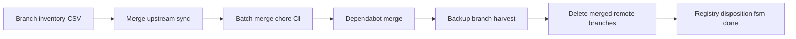

# Wave 15 — agentapi-plusplus merge execution — 2026-06-17

**Predecessor:** [wave14-gateway-ssot-2026-06-17.md](./wave14-gateway-ssot-2026-06-17.md)  
**Canonical owner:** `KooshaPari/agentapi-plusplus`  
**Supersedes:** archived `KooshaPari/agentapi`

## Branch taxonomy (34 branches)

| Class | Branches | Action |
|-------|----------|--------|
| upstream sync | `sync/upstream-v0.12.2`, `fix/pull-request-target` | Merge to `main` first after CI |
| backup | `backup/20260426-*` (2) | Diff vs main; cherry-pick unique or delete |
| governance chore | 21× `chore/*`, `ci/*` (2026-06-08 batch) | Batch-merge if green |
| docs | `docs/agentapi-plusplus-sladge-*` (2) | Merge or fold into `docs/` |
| dependabot | 5 npm branches | Merge security updates |
| complete-sync | 1 | Review as superset candidate |

## Merge sequence

1. Tracking issue `agentapi-plusplus#1` — branch inventory table
2. PR wave A: `sync/upstream-v0.12.2` → `main`
3. PR wave B: batch `chore/*` by theme (ci, lint, governance)
4. PR wave C: dependabot merges
5. PR wave D: delete stale remote branches post-merge
6. Harvest archived `agentapi`: unique commits → cherry-pick
7. Registry: `agentapi` disposition `done`; `agentapi-plusplus` `done` when branches ≤ 5

## Spec unification

- Add root `SPEC.md` using WorkPackage shape from `agileplus-spec-harmonizer`
- Link from [GATEWAY_MERGE_DAG.md](../rationalization/GATEWAY_MERGE_DAG.md)
- Document OAuth providers, Amp routing, SDK embedding

## Verification

- CI green on `main`
- No org manifest points at archived `agentapi`
- Branch count before/after recorded below

| Metric | Before | After |
|--------|--------|-------|
| Remote branches | 34 | TBD |
| Upstream tag sync | — | TBD |

## PR tracker

| PR | Repo | Status |
|----|------|--------|
| TBD | agentapi-plusplus | pending |
