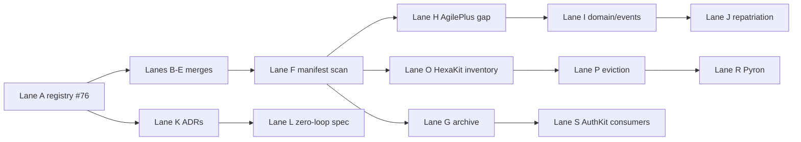

# Ecosystem DAG — Parallel Lanes

> Companion to [`ZERO_LOOP_ECOSYSTEM_PLAN.md`](./ZERO_LOOP_ECOSYSTEM_PLAN.md).  
> **20-wide recipe** for agent/human execution. Lanes marked **blocked** have explicit upstream deps.

---

## Legend

| Symbol | Meaning |
|--------|---------|
| **G** | Gate — must complete before dependents |
| **P** | Parallel — can run concurrently |
| **B** | Blocked until upstream lane green |
| **NB** | Non-blocker — document or defer without blocking DELETE |

---

## Lane table

| Lane | ID | Owner repo | Work package | Deps | Blocker? |
|------|----|------------|--------------|------|----------|
| A | L0-G | phenotype-registry | Merge PR #76 (BOUNDARY_OWNERS, LANGUAGE_STACK, rationalization docs) | — | **G** |
| B | L1-P | PhenoObservability | Merge #157; archive Metron post-merge | A | P |
| C | L1-P | phenokits-commons | Merge #3; publish governance bootstrap doc | A | P |
| D | L1-P | phenotype-tooling | Merge #155; link absorption manifest | A | P |
| E | L1-P | Agentora | Merge #79 (PhenoProc waves 1–6) | A | P |
| F | L2-G | phenotype-registry | Consumer manifest scan (RATIONALIZATION_EXECUTION method) | B,C,D,E | **G** |
| G | L2-P | fleet | Archive wave: PhenoProc, Metron, ObservabilityKit per gate | F | P |
| H | L3-P | AgilePlus | Clone + gap analysis vs Agentora `agileplus-*` staging | F | P |
| I | L3-P | AgilePlus | Port `agileplus-domain`, `agileplus-events`; register workspace | H | B→H |
| J | L3-P | AgilePlus | Repatriation PR from Agentora staging | I | B→I |
| K | L3-P | phenotype-registry | ADR-004/005/006 merged with #76 | A | P |
| L | L3-P | AgilePlus | `agileplus specify`: zero-loop-session-protocol | K | P |
| M | L3-P | phenotype-registry | Session retro: `docs/sessions/` gap-port-2026-06 | L | P |
| N | L3-P | phenokits-commons | `governance-template-fleet-defaults` spec + README | C | P |
| O | L4-P | HexaKit | Inventory domain crates for eviction list | G | P |
| P | L4-NB | HexaKit | Evict domain members; keep `templates/hexagon/**` | O | NB |
| Q | L4-NB | phenotype-rust-sdk | Package layout ADR draft | P | NB |
| R | L5-B | Pyron | Repoint Settly/Stashly/pheno → post-HexaKit paths | P | **B** |
| S | L5-B | Tracera, thegent | Repoint AuthKit → python-sdk | G | **B** |
| T | L5-NB | phenotype-registry | ECOSYSTEM_MAP cluster refresh PR | G | NB |

---

## Dependency graph (lanes)

---

## Per-lane acceptance criteria

### Lane A (gate)

- [ ] `BOUNDARY_OWNERS.md`, `LANGUAGE_STACK.md`, `docs/rationalization/*`, `docs/adr/ADR-004..006` on `main`
- [ ] `ECOSYSTEM_MAP.md` links to rationalization plan

### Lane F (gate)

- [ ] Updated verdict table in `RATIONALIZATION_EXECUTION.md` for PhenoProc, Metron, ObservabilityKit
- [ ] Explicit **BLOCKED** list with repo + dependent manifest path

### Lane J (AgilePlus repatriation)

- [ ] No `agileplus-*` core crates remain in Agentora workspace members (integration hooks OK)
- [ ] `cargo check` green in AgilePlus workspace
- [ ] `agileplus validate` runs against phenokits templates

### Lane P (HexaKit eviction)

- [ ] Domain crates removed from workspace `members`
- [ ] Template paths preserved under `templates/hexagon/`
- [ ] No external consumer broken (manifest scan re-run)

---

## Session assignment (agent routing)

When spawning work, assign **one lane per session** with this entry packet:

1. This lane row (ID, deps, acceptance)
2. `BOUNDARY_OWNERS.md` relevant section
3. AgilePlus spec slug (if exists)
4. `docs/sessions/YYYYMMDD-<slug>/` folder (create if missing)
5. Open PR URLs for the owner repo

**Anti-pattern:** One session owning lanes A + E + J + P without merge gates — causes summarize loops.

---

## Non-blocker backlog (explicit NB lanes)

These improve the ecosystem but do **not** block PhenoProc DELETE or archive wave:

| Item | Lane | Owner |
|------|------|-------|
| Cmdra inner `[workspace]` refactor | NB | Agentora |
| `phenotype-*` → HexaKit git deps in Agentora | NB | Agentora |
| Full PhenoProc subgraph `cargo check` | NB | Agentora |
| TestingKit boundary split doc | NB | registry + python-sdk |
| ResilienceKit Python impl | NB | python-sdk |
| Conft runtime PLAN | NB | Conft |
