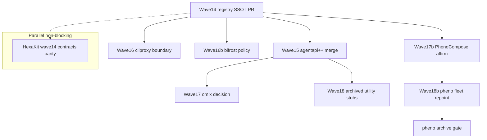

# Gateway Merge DAG — Parallel Lanes (Wave 14–19)

> Extension of [`ECOSYSTEM_DAG.md`](./ECOSYSTEM_DAG.md) for gateway / multi-repo merge rationalization.  
> **Authority:** [ADR-ECO-007-gateway-merge-superset](../adrs/ADR-ECO-007-gateway-merge-superset.md)

---

## Legend

| Symbol | Meaning |
|--------|---------|
| **G** | Gate — blocks downstream lanes |
| **P** | Parallel — safe to run concurrently |
| **NB** | Non-blocker — registry/docs only |

---

## Lane table

| Wave | Lane ID | Owner repo | Work package | Deps | Blocker? |
|------|---------|------------|--------------|------|----------|
| 14a | W14-G | phenotype-registry | ADR-ECO-007, ECOSYSTEM_MAP/DOMAIN_ROLES fix, disposition + chokepoints | — | **G** |
| 15 | W15-P | agentapi-plusplus | Branch inventory, upstream sync merge, prune ≤5 branches | W14-G | P |
| 16 | W16-P | cliproxyapi-plusplus | Boundary Option B; branch prune; vibeproxy redirect | W14-G | P |
| 16b | W16b-NB | bifrost | Vendor sync policy + VENDOR_PATCHES.md | W14-G | NB |
| 17 | W17-P | phenotype-omlx | FINISH vs DROP decision + ADR appendix execution | W14-G | P |
| 17b | W17b-P | PhenoCompose | BOUNDARY_OWNERS affirm; pheno dep repoint | W14-G | P |
| 18 | W18-NB | phenotype-registry | `projects/*.json` archived redirects | W14-G | NB |
| 18b | W18b-G | fleet | pheno fleet manifest scan + per-consumer repoint PRs | W17b-P | **G** |
| 19 | W19-NB | phenotype-journeys | phenotype-e2e-base absorption | W14-G | NB |

### Parallel (non-blocking)

| Lane | Owner | Work package |
|------|-------|--------------|
| H14 | HexaKit + role owners | Decompose phenoShared staging → DOMAIN_ROLES owners (ADR-ECO-014) |

---

## Dependency graph

---

## Per-lane acceptance

### W14-G (gate)

- [ ] `ADR-ECO-007-gateway-merge-superset.md` on `main`
- [ ] ECOSYSTEM_MAP: OmniRoute canonical; agentapi++ not in archive list; BytePort/Settly archived rows consistent
- [ ] DOMAIN_ROLES: `route`, `cli_proxy`, `inference` roles present
- [ ] `disposition-index.json`: gateway repo rows with `fsm`
- [ ] `chokepoints.json`: `pheno_fleet_blockers` metadata

### W15 (agentapi++)

- [ ] Branch inventory CSV committed
- [ ] `sync/upstream-v0.12.2` merged to `main`
- [ ] Remote branches ≤ 5
- [ ] `SPEC.md` at repo root (Wave 15 ledger)

### W18b-G (pheno fleet)

- [x] Tracera W18b fleet gate — [#632](https://github.com/KooshaPari/Tracera/pull/632) merged
- [x] AgilePlus manifest repoint — [#763](https://github.com/KooshaPari/AgilePlus/pull/763) merged
- [x] PhenoPlugins manifest repoint — [#104](https://github.com/KooshaPari/PhenoPlugins/pull/104) merged
- [x] HexaKit H14 pin repoint — [#267](https://github.com/KooshaPari/HexaKit/pull/267) merged
- [ ] Agentora consumer repoint — [#88](https://github.com/KooshaPari/Agentora/pull/88) partial until merge
- [ ] Org scan: 0 external `KooshaPari/pheno` refs (excl. Tracera)
- [ ] PhenoCompose repointed per-crate to role owners (not phenoShared terminal)
- [ ] `gh repo archive KooshaPari/pheno` after gate

---

## Related

- [wave14-gateway-ssot-2026-06-17.md](../operations/wave14-gateway-ssot-2026-06-17.md)
- [wave15-agentapi-merge-execution-2026-06-17.md](../operations/wave15-agentapi-merge-execution-2026-06-17.md)
- [GATEWAY_BOUNDARY_AUDIT.md](../operations/GATEWAY_BOUNDARY_AUDIT.md)
