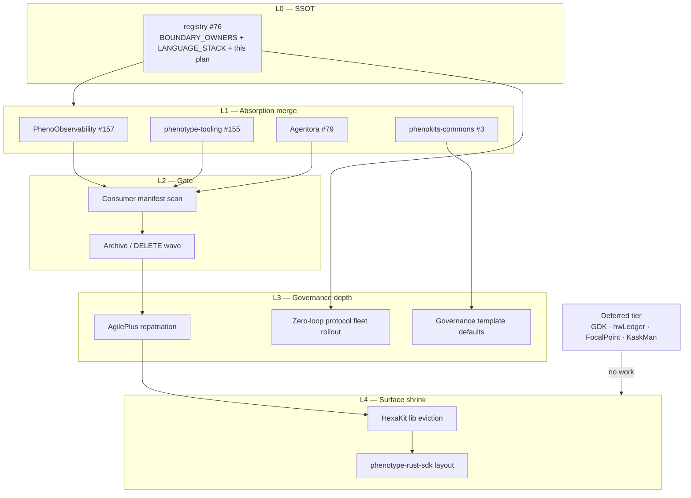

# Zero-Loop Ecosystem Rationalization Plan

> **Status:** Living execution plan (breadth + depth).  
> **North star:** Agent and human sessions that ship correct boundary work in **one pass** — zero rediscovery loops, zero wrong-owner ports, zero “where does this live?” churn.  
> **SSOT chain:** `BOUNDARY_OWNERS.md` → this plan → AgilePlus spec → session artifacts → PR.

---

## 1. North star and metrics

### What “zero-loop” means

| Loop type | Symptom | Prevention |
|-----------|---------|------------|
| **Boundary** | Port runtime lib to HexaKit or agent crate to wrong repo | Read `BOUNDARY_OWNERS.md` before any copy |
| **Staging** | Treat absorber staging tree as canonical | `ABSORPTION_MANIFEST.md` + ADR-004 |
| **Split-target** | Bulk port then open sibling PRs late | Name split owners in `03_DAG_WBS.md` *before* robocopy |
| **Build** | Stub `Cargo.toml` missing deps post-port | Workspace policy + `cargo check` subset in DAG |
| **Context** | Summarize mid-task, lose file/PR state | AgilePlus spec ID + session folder = resumable packet |
| **Scope** | “Do all” interpreted as unbounded | DAG leaves: blockers vs non-blockers explicit |

### Success metrics (dogfood baseline: PhenoProc gap port, 2026-06-17)

| Metric | Baseline session | Target |
|--------|------------------|--------|
| Boundary mis-placements before correction | agileplus-* in Agentora | **0** (owner named pre-port) |
| User clarification rounds | 3+ (“proc”, “do all”, summarize) | **≤1** |
| Split-target PRs opened after bulk commit | 2 (tooling, phenokits) | **0** (pre-declared in DAG) |
| Post-port `cargo check` surprises | bifrost-routing, forgecode-core | **0** (manifest lists check targets) |
| Resumability without transcript | Poor after summarize | **Session packet sufficient** |

---

## 2. Capability map (breadth)

Three layers from `BOUNDARY_OWNERS.md`, plus **governance plane** and **agent plane**:

```text
┌─────────────────────────────────────────────────────────────────┐
│ GOVERNANCE PLANE (spec → ship)                                  │
│  AgilePlus          spec lifecycle, triage, validate, .agileplus│
│  phenokits-commons  templates, per-language configs, scaffolds  │
│  phenotype-org-gov  org CI policy, reusable workflows           │
│  phenotype-registry boundary SSOT, DAG, ADRs, ecosystem index   │
├─────────────────────────────────────────────────────────────────┤
│ SCAFFOLD          HexaKit (.template.* only — NOT lib warehouse)│
├─────────────────────────────────────────────────────────────────┤
│ DOMAIN SDK        phenotype-{python,go,rust}-sdk optional modules │
├─────────────────────────────────────────────────────────────────┤
│ DOMAIN WORKSPACE  Agentora, PhenoObservability, Settly, Conft,  │
│                   phenoXddLib, phenotype-journeys, phenotype-   │
│                   tooling (ops/bench/absorption)                │
├─────────────────────────────────────────────────────────────────┤
│ AGENT PLANE       Agentora runtime, phenoagent, proc plane     │
│                   (does NOT own agileplus core crates)          │
└─────────────────────────────────────────────────────────────────┘
```

### Boundary owners — extended matrix

| Capability | Canonical owner | Staging / wrong homes | Split or absorb from |
|------------|-----------------|----------------------|----------------------|
| Spec-driven dev | **AgilePlus** | Agentora `agileplus-*` | PhenoProc agileplus crates |
| Governance templates | **phenokits-commons** `governance/` | Per-repo PhenoProc copies | `phenotype-governance/templates` |
| Router monitor | **phenotype-tooling** `absorption/` | Agentora `phenotype-router-monitor` | PhenoProc root + crate |
| Metrics (`metrickit`) | **PhenoObservability** | HexaKit/Metron | Metron repo |
| Tracing scaffold | **PhenoObservability** | HexaKit/Traceon | Traceon repo |
| Python obs facade | **phenotype-python-sdk** | ObservabilityKit, PO subtree | ObservabilityKit |
| Agent + proc runtime | **Agentora** | PhenoProc, PhenoAgent | ~98% file absorption done |
| Process plane (Python) | **Agentora** `agents/phenoagent/python/` | PhenoProc `pheno-*` | 16 packages |
| Shared Rust infra (`phenotype-*`) | **HexaKit** (canonical) / **rust-sdk** (target) | Agentora `crates/phenotype-*` staged | Audit copies only |
| Config (Rust) | **Settly** | HexaKit `crates/settly` | archived Settly |
| Config (TS) | **Conft** | — | implement PLAN |
| Testing plane | **Split** (SDK / XddLib / journeys / commons) | TestingKit monolith | HOLD delete |
| Internal ops / bench | **phenotype-tooling** | helios*, BytePort, PolicyStack | absorption wave |
| Deferred schizo | **NONE** until fleet complete | GDK, hwLedger, FocalPoint, KaskMan | `LANGUAGE_STACK.md` |

---

## 3. Master DAG (critical path)

See [`ECOSYSTEM_DAG.md`](./ECOSYSTEM_DAG.md) for full 20-lane parallel recipe.



**Merge order:** `registry #76` → parallel `#157`, `#3`, `#155` → `#79` (largest) → manifest scan → archive.

---

## 4. Phases (depth)

### Phase 0 — Unblock merges (P0)

| WP | AgilePlus spec slug | Deliverable |
|----|---------------------|-------------|
| 0.1 | `merge-boundary-owners-ssot` | Merge [registry #76](https://github.com/KooshaPari/phenotype-registry/pull/76) |
| 0.2 | `absorption-pr-merge-wave` | Merge #157, #3, #155, #79 |
| 0.3 | `consumer-manifest-scan` | `gh api search/code` per `RATIONALIZATION_EXECUTION.md`; update verdict table |

### Phase 1 — AgilePlus boundary (P0 governance)

| WP | Action |
|----|--------|
| 1.1 | Repatriate `agileplus-{triage,telemetry,sync,subcmds}` from Agentora staging → **AgilePlus** |
| 1.2 | Port missing siblings: `agileplus-domain`, `agileplus-events` |
| 1.3 | Register full agileplus workspace; `cargo check` subgraph green |
| 1.4 | Wire `agileplus validate` → phenokits `governance/phenoproc-*` |
| 1.5 | Dogfood spec: `ecosystem-gap-port-retro-2026-06` |

**ADR:** [ADR-005](../adr/ADR-005-agileplus-governance-boundary.md)

### Phase 2 — Zero-loop session protocol (P0 meta)

| WP | Action |
|----|--------|
| 2.1 | Fleet-adopt [`SESSION_ARTIFACT_PROTOCOL.md`](./SESSION_ARTIFACT_PROTOCOL.md) |
| 2.2 | Agent entry packet: boundaries + open PRs + DAG + manifest |
| 2.3 | Every absorption PR links AgilePlus spec + session folder |

**ADR:** [ADR-006](../adr/ADR-006-zero-loop-agent-session.md)

### Phase 3 — Governance fleet rollout (P1)

| WP | Owner repo | Work |
|----|------------|------|
| 3.1 | phenokits-commons | Document `governance/phenoproc-*` as default bootstrap |
| 3.2 | HexaKit | `.template.*` → thin pointers to phenokits (no duplicate trees) |
| 3.3 | phenotype-org-governance | Reusable workflows for tooling / policystack consumers |
| 3.4 | phenotype-registry | Refresh `ECOSYSTEM_MAP.md` clusters D/I/H |

**Spec:** `governance-template-fleet-defaults`

### Phase 4 — Archive + surface shrink (P1–P2)

Execute `RATIONALIZATION_EXECUTION.md` with **5-check DELETE gate** (`BOUNDARY_OWNERS.md`).

| Repo | Gate after |
|------|------------|
| PhenoProc | #79 + scan green |
| Metron | #157 merged |
| ObservabilityKit | PO subtree removed + SDK repoint |
| PhenoKits | #3 merged |

Then **HexaKit P0:** evict domain workspace members; `templates/hexagon/**` only.

### Phase 5 — Rust SDK + chokepoints (P2–P3)

| WP | Action |
|----|--------|
| 5.1 | `phenotype-rust-sdk` package layout ADR |
| 5.2 | Repoint Pyron (Settly/Stashly/pheno) — blocked until HexaKit paths stable |
| 5.3 | AuthKit consumers: Tracera, thegent → python-sdk |
| 5.4 | Agentora: `phenotype-*` path deps → HexaKit git deps |
| 5.5 | Cmdra inner-workspace refactor |

---

## 5. Open PR fleet (2026-06-17)

| PR | Repo | Role in DAG |
|----|------|-------------|
| [#76](https://github.com/KooshaPari/phenotype-registry/pull/76) | phenotype-registry | L0 SSOT — **merge first** |
| [#157](https://github.com/KooshaPari/PhenoObservability/pull/157) | PhenoObservability | Metron → metrickit |
| [#3](https://github.com/KooshaPari/phenokits-commons/pull/3) | phenokits-commons | PhenoKits + governance port |
| [#155](https://github.com/KooshaPari/phenotype-tooling/pull/155) | phenotype-tooling | router-monitor absorption |
| [#79](https://github.com/KooshaPari/Agentora/pull/79) | Agentora | PhenoProc waves 1–6 (~98%) |

---

## 6. PhenoProc absorption status (depth)

| Wave | Content | Status |
|------|---------|--------|
| 1–4 | 16 Python `pheno-*` packages | ✅ in Agentora |
| 5 | Cmdra, agileplus-*, bifrost, forgecode, Go CLI | ✅ staged |
| 6 | 66 crates, root modules, libs/obs, ADRs | ✅ pushed #79 |
| Split | router-monitor → tooling #155 | ✅ |
| Split | governance templates → phenokits #3 | ✅ |
| Workspace | bifrost-routing, forgecode-core check | ✅ |
| Non-blocker | Cmdra workspace, agileplus siblings, HexaKit dep repoint | ⏳ Phase 1/5 |

**DELETE PhenoProc:** HOLD until sibling PRs merge + consumer manifest scan (not more file copies).

---

## 7. AgilePlus spec catalog (create in AgilePlus)

| Spec slug | Phase | Purpose |
|-----------|-------|---------|
| `merge-boundary-owners-ssot` | 0 | Track registry #76 |
| `absorption-pr-merge-wave` | 0 | Fleet merge checklist |
| `consumer-manifest-scan-phenoproc` | 0 | Unblock DELETE gate |
| `ecosystem-gap-port-retro-2026-06` | 1 | Dogfood this session’s loops |
| `agileplus-repatriation-from-agentora` | 1 | Boundary correction |
| `zero-loop-session-protocol` | 2 | Fleet rollout |
| `governance-template-fleet-defaults` | 3 | phenokits → HexaKit → new repo |
| `hexakit-domain-crate-eviction` | 4 | P0 surface shrink |
| `phenotype-rust-sdk-layout` | 5 | Optional domain modules |

---

## 8. ADR index

| ADR | Title |
|-----|-------|
| [ADR-004](../adr/ADR-004-absorption-staging-vs-canonical.md) | Absorption staging vs canonical owner |
| [ADR-005](../adr/ADR-005-agileplus-governance-boundary.md) | AgilePlus owns spec-driven polyrepo governance |
| [ADR-006](../adr/ADR-006-zero-loop-agent-session.md) | Zero-loop agent session contract |

---

## 9. Non-goals (explicit)

- **GDK, hwLedger, FocalPoint, KaskMan** — deferred schizo tier (`LANGUAGE_STACK.md`)
- Full HexaKit lib eviction before absorption PRs merge
- PhenoProc DELETE before 5-check gate passes
- Duplicating governance templates in every absorber repo

---

## References

- `BOUNDARY_OWNERS.md` — capability SSOT
- `LANGUAGE_STACK.md` — core / edge / deferred
- `RATIONALIZATION_EXECUTION.md` — merge order + archive shortlist
- `ECOSYSTEM_MAP.md` — repo index
- [`ECOSYSTEM_DAG.md`](./ECOSYSTEM_DAG.md) — 20-lane parallel recipe
- [`SESSION_ARTIFACT_PROTOCOL.md`](./SESSION_ARTIFACT_PROTOCOL.md) — session folder contract
