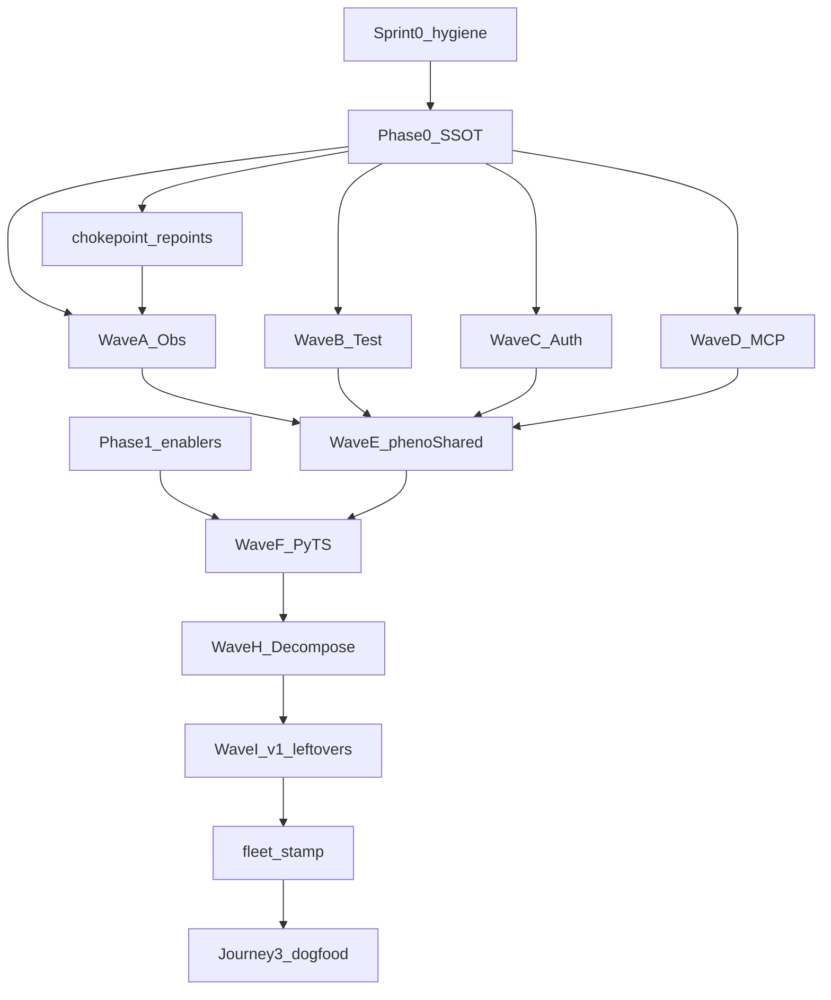

# DAG / WBS — Ecosystem Disposition Wave

**Session:** `20260617-ecosystem-disposition-wave`  
**Active repos:** ~144 (track weekly)  
**Charter:** [boundary-shaping.md](../../rationalization/boundary-shaping.md)

---

## Phase DAG

---

## Parallel groups

| Group | WPs | Gate |
|-------|-----|------|
| **G0** | Session package, ADRs, disposition-index, ZERO_SHOT | none |
| **G1** | RATIONALIZATION_EXECUTION v2, plan v1 banner | G0 |
| **G2** | Chokepoint repoints (Pyron, PhenoObservability, thegent, …) | G1 |
| **G3** | hexakit init P1–P2, runbook, harness-api | G0 |
| **G4** | Waves A–D | G2 |
| **G5** | Wave E | G4 partial |
| **G6** | Waves F–H | G5 |

---

## Sprint 1 lanes (current)

| Lane | Repo | Branch | Harness |
|------|------|--------|---------|
| L0 | phenotype-registry | `feat/eco-phase0-session-dag` | cursor-agent |
| L1 | HexaKit | `feat/eco-phase0-runbook` | forge |
| L2 | chokepoints | per-dependent | forge pipeline |

**Merge order:** L0 → L1 → L2 (chokepoints parallel after L0 merge)

---

## Wave → disposition_ids

| Wave | IDs (DISPOSITION §3) | Target |
|------|----------------------|--------|
| A | 22,26,35,39,48,49 | PhenoObservability |
| B | 4,10–12,40,41 | TestingKit |
| C | 2,15,34 | Authvault |
| D | 28,23,46 | PhenoMCP, ResilienceKit |
| E | 3,5,8–9,13,16–18,21,24–25,27,32–33,36,38,42–43 | phenoShared |
| F | python/TS §4–5 | domain stubs |
| H | 1,6–7,14,19–20,29,37,45–47,51–57 | decompose repos |

See [registry/disposition-index.json](../../../registry/disposition-index.json).
