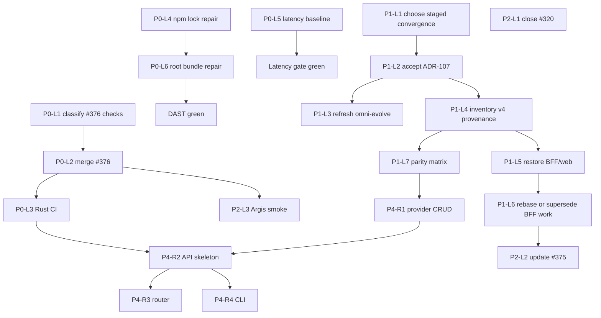

# OmniRoute Proc-2 WBS / PERT / DAG — 2026-07-17

**Extends:** `plans/2026-06-25-omni-evolve-dag.md`  
**Method:** AgilePlus enumerate → classify → prioritize → trace → verify  
**Legend:** `[ ]` pending · `[/]` active · `[x]` done · `[~]` blocked ·
`[!]` decision

## PERT phase map

```text
P0 Absorb stability ──► P1 Architecture truth ──► P3 Product/Rust work
       │                        │
       └──► P2 Hygiene ─────────┘
```

Critical path:

```text
P0-L1 → P0-L2 → P1-L1 → P1-L2 → P1-L5 → P4-R1
```

## P0 — Absorb stability

| ID | Work | Dependency | State |
|---|---|---|---|
| P0-L1 | Classify PR #376 latency and DAST failures | — | `[x]` |
| P0-L2 | Merge PR #376 under documented RC waiver | P0-L1 | `[x]` |
| P0-L3 | Add Linux `cargo check --workspace` CI gate | P0-L2 | `[x]` PR #377; execution infra blocked |
| P0-L4 | Repair root npm lock drift that blocks DAST | — | `[x]` install passes in #380 run |
| P0-L5 | Baseline or repair REST latency workflow | — | `[ ]` |
| P0-L6 | Repair root Next.js bundle preconditions for DAST startup | P0-L4 | `[/]` MDX fixed; petals import remains |

## P1 — Architecture truth

| ID | Work | Dependency | State |
|---|---|---|---|
| P1-L1 | Select maximum-feature long-term topology | — | `[x]` |
| P1-L2 | Accept ADR-107 staged v4-to-Rust convergence | P1-L1 | `[x]` |
| P1-L3 | Refresh omni-evolve snapshot and add convergence stream | P1-L2 | `[ ]` |
| P1-L4 | Inventory and verify the last coherent v4 commit range | P1-L2 | `[x]` |
| P1-L5 | Restore BFF/web without reverting Rust or Argis absorbs | P1-L4 | `[/]` PR #380 merge-ready under RC-A9 waiver |
| P1-L6 | Rebase or supersede #339, #340, and PR #375 | P1-L5 | `[ ]` |
| P1-L7 | Publish v4-to-Rust feature-parity matrix and owners | P1-L4 | `[ ]` |

## P2 — Hygiene (parallel)

| ID | Work | Dependency | State |
|---|---|---|---|
| P2-L1 | Verify and close stale issue #320 | — | `[x]` |
| P2-L2 | Add blocked-by-restoration status to PR #375 | P1-L2 | `[x]` |
| P2-L3 | Smoke-test absorbed `extensions/argis` entrypoints | P0-L2 | `[x]` targeted infra smoke |
| P2-L4 | Configure OmniRoute project/epic and GitHub sync in AgilePlus | — | `[ ]` |
| P2-L5 | Repair Argis GraphQL duplication and Bifrost API drift (#379) | P2-L3 | `[ ]` |

## P3 — Ready backlog

| Stream | Issue / leaf | Effort | Dependency |
|---|---|---:|---|
| CI | #336 Bun download cache | 0.5 d | none |
| Tooling | #341 Oxc migration matrix | 2 d | none |
| Tooling | #319 TS7/Bun completion | 3 d | none |
| Release | #343 publication boundaries | 1 d | #322 partial |
| Docs | #366 Phenodocs readiness | 2 d | #322 identity |
| Product | #322 Phenotype readiness epic | ongoing | owner decisions |

## P4 — Rust workspace evolution

| ID | Work | Effort | Dependency |
|---|---|---:|---|
| P4-R1 | Implement provider repository CRUD | 1 d | P1-L7 |
| P4-R2 | Add API skeleton and health route | 1 d | P4-R1 |
| P4-R3 | Delegate router to core registry | 2 d | P4-R2 |
| P4-R4 | Implement CLI `serve` and `migrate` commands | 2 d | P4-R2 |
| P4-R5 | Add Linux Rust CI matrix | 0.5 d | P0-L2 |

## DAG



## Next-two queue

1. **P1-L5:** land the bounded v4 compatibility recovery PR.
2. **P1-L7:** publish the first v4-to-Rust capability-parity matrix.

## Update rule

Every proc cycle must update node state, evidence links, dependencies, and
release criteria. New work is appended as a PR-sized leaf; existing IDs are
never repurposed.
