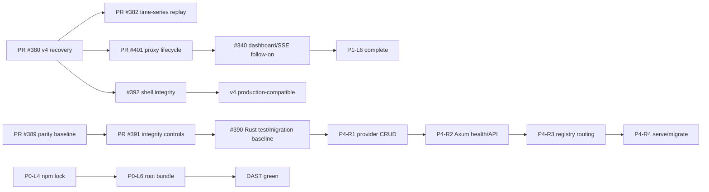

# TIC — Tactical Integration Cockpit

- **Program:** OmniRoute staged convergence
- **ADR:** ADR-107
- **Control set:** WBS / PERT / DAG / RC / parity matrix
- **Updated:** 2026-07-19
- **Overall delivery:** `████░░░░░░` 43% (12/28 tracked leaves complete)

## Executive radar

| Signal | State | Evidence / next gate |
|---|---|---|
| v4 recovery | 🟢 Complete | PR #380 merged |
| BFF time-series replay | 🟢 Complete | PR #382 merged |
| v4-to-Rust parity baseline | 🟢 Complete | PR #389 merged |
| Proxy lifecycle replay | 🟡 Review | PR #401; 67 BFF tests and typecheck pass; human review/CI disposition pending |
| Integrity control update | 🟡 Review | PR #391 |
| Root bundle / DAST | 🔴 Blocked | P0-L6; root Next.js bundle preconditions |
| Rust test / migration baseline | 🔴 Blocked | Issue #390; blocks P4-R1 through P4-R4 |
| v4 production shell boundary | 🔴 Blocked | Issue #392; auth/origin/tRPC/KBridge/package integration |

## Stream progress

| Stream | Progress | Done | Active | Blocked / queued |
|---|---:|---:|---:|---:|
| P0 — absorb stability | `█████░░░░░` 50% | 4 | 1 | 3 |
| P1 — architecture truth | `███████░░░` 71% | 5 | 1 | 1 |
| P2 — hygiene | `██████░░░░` 60% | 3 | 0 | 2 |
| P4 — Rust evolution | `░░░░░░░░░░` 0% | 0 | 0 | 8 |
| Release controls | `█████░░░░░` 55% | 6 | 3 partial | 2 blocked |

Percentages count completed leaves only. Active and waived work does not count
as complete.

## Critical-path DAG

## Tactical queue

1. **Land PR #401** after scoped review and non-regression CI disposition.
2. **Land PR #391** so #390/#392 become canonical gates.
3. **Resolve #390** before starting provider persistence.
4. Continue #340 with dashboard/SSE characterization.
5. Run #392 shell-integrity work in parallel where it does not conflict.

## Release-control bars

| Control | Progress | State |
|---|---:|---|
| RC-A1…A9 recovery controls | `███████░░░` 67% pass | 6 pass, 3 partial |
| RC-A10 Rust integrity | `░░░░░░░░░░` 0% | Blocked by #390 |
| RC-A11 v4 shell integrity | `░░░░░░░░░░` 0% | Blocked by #392 |

## Rust toolchain rule

Rust build and CI evidence uses the LLVM bundled with the pinned `rustc`
toolchain. Homebrew/system LLVM is not the baseline because it commonly lags
or differs from rustc's LLVM. If a crate explicitly links system LLVM, CI must
report both versions and test that integration separately.

## Update contract

- Update this cockpit whenever a tracked PR merges, a blocker changes state,
  or the critical path changes.
- 🟢 means acceptance evidence is merged.
- 🟡 means active/review with a bounded completion gate.
- 🔴 means a confirmed blocker prevents downstream work.
- Source details remain in
  `2026-07-17-proc2-wbs-pert-dag.md`,
  `2026-07-18-v4-rust-feature-parity-matrix.md`, and
  `RC-2026-07-17-A.md`; this cockpit summarizes but does not replace them.
