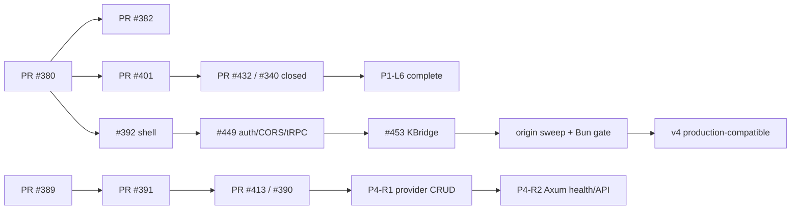

# TIC — Tactical Integration Cockpit

- **Program:** OmniRoute staged convergence
- **ADR:** ADR-107
- **Control set:** WBS / PERT / DAG / RC / parity matrix
- **Updated:** 2026-07-23
- **Overall delivery:** `██████░░░░` 61% (17/28 tracked leaves complete)

## Executive radar

| Signal | State | Evidence / next gate |
|---|---|---|
| v4 recovery | 🟢 Complete | PR #380 merged |
| BFF time-series replay | 🟢 Complete | PR #382 merged |
| v4-to-Rust parity baseline | 🟢 Complete | PR #389 merged |
| Proxy + dashboard/SSE (#340) | 🟢 Complete | #401 + #432 merged; #340 closed |
| Integrity controls | 🟢 Complete | PR #391 merged |
| Electrobun desktop gate | 🟢 Complete | PR #433 merged (Electron smoke path-filtered) |
| v4 shell integrity (#392) | 🟡 Landing | #449 auth/CORS/tRPC + #453 KBridge merged; origin sweep + Bun gate PR open |
| Rust test / migration baseline | 🟢 Complete | PR #413 / #390 |
| P4-R1 provider CRUD | 🟡 Active | PR opened |
| Root bundle / DAST | 🔴 Blocked | P0-L6; root Next.js bundle preconditions |

## Stream progress

| Stream | Progress | Done | Active | Blocked / queued |
|---|---:|---:|---:|---:|
| P0 — absorb stability | `███████░░░` 70% | 6 | 1 | 2 |
| P1 — architecture truth | `█████████░` 86% | 6 | 0 | 1 |
| P2 — hygiene | `██████░░░░` 60% | 3 | 0 | 2 |
| P4 — Rust evolution | `█░░░░░░░░░` 12% | 0 | 1 | 7 |
| Release controls | `███████░░░` 70% | 8 | 2 partial | 1 blocked |

## Critical-path DAG

## Tactical queue

1. Land origin-sweep / Bun-gate PR; close #392.
2. Land P4-R1 ProviderRepo CRUD.
3. Start P4-R2 Axum health/API skeleton.
4. Keep P0-L6 root bundle / DAST on parallel hygiene.

## Release-control bars

| Control | Progress | State |
|---|---:|---|
| RC-A1…A9 recovery controls | `████████░░` 80% | mostly pass |
| RC-A10 Rust integrity | `████████░░` 80% | #413 landed |
| RC-A11 v4 shell integrity | `███████░░░` 70% | #449/#453 landed; sweep pending |

## Rust toolchain rule

Rust build and CI evidence uses the LLVM bundled with the pinned `rustc`
toolchain. Homebrew/system LLVM is not the baseline because it commonly lags
or differs from rustc's LLVM. If a crate explicitly links system LLVM, CI must
report both versions and test that integration separately.
