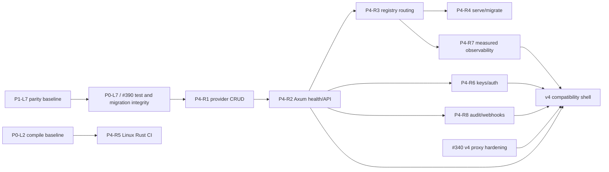

# v4-to-Rust Feature-Parity Matrix

- **ADR:** ADR-107 staged convergence
- **WBS:** P1-L7 → P4-R1…P4-R8
- **Evidence cutoff:** `main` at `63842030c` (PR #389), plus #390/#392 audits
- **Status:** Initial owner/dependency baseline with verified integrity preconditions

## Decision boundary

The restored Svelte/Hono stack remains the compatibility shell while Rust
capabilities become real behind stable contracts. A page, schema, empty array,
echo response, or `unavailable` response is not runtime parity. Rust parity
requires an exercised API path backed by a real adapter or repository.

Status legend:

- **Live** — exercised implementation exists.
- **Partial** — useful implementation exists but is not wired end to end.
- **Contract** — types, UI, schema, or honesty-first placeholder only.
- **Scaffold** — crate/module compiles but contains no production behavior.
- **Absent** — no canonical implementation found.

## Capability matrix

| ID | Capability | Restored v4 state and evidence | Rust state and evidence | Target owner | Next acceptance gate |
|---|---|---|---|---|---|
| CAP-01 | OpenAI-compatible request and streaming gateway | **Live/partial.** `apps/bff/src/routes/proxy.ts` streams to `OMNIROUTE_UPSTREAM`; canonical provider execution still lives outside the restored BFF. | **Contract/scaffold.** Wire types exist in `omniroute-core`; `omniroute-api`, `omniroute-providers`, `omniroute-router`, and `omniroute-bifrost` are scaffolds. | `omniroute-api` + `omniroute-providers` + `omniroute-router` | One OpenAI-compatible chat request streams through Axum, router, and a provider adapter with cancellation and error mapping tests. |
| CAP-02 | Provider configuration and CRUD | **Contract.** `/api/dashboard/providers` returns an empty list and POST echoes validated input in `apps/bff/src/routes/dashboard.ts`; web UI exists. | **Partial.** Provider schema exists, but `omniroute-storage/src/provider.rs` is a constructor-only scaffold. | `omniroute-storage` (P4-R1), then `omniroute-api` | Repository create/get/list/update/delete tests pass against in-memory SQLite; API contract tests expose them without fabricated success. |
| CAP-03 | Combos, fallback, and routing policy | **Contract.** Combo UI and schema exist; combo POST fails honestly with `no-combo-store`. | **Partial.** Core combo/routing types and `ComboRepo` CRUD exist; `omniroute-router` is a scaffold. | `omniroute-router` + `omniroute-storage` | Router resolves an enabled combo from `ComboRepo`, executes ordered fallback, and records the selected provider. |
| CAP-04 | API keys and request authentication | **Partial, integrity-blocked.** BFF middleware protects production routes with a static API key, but browser dashboard calls rely on cookies and cannot satisfy that gate; dashboard key CRUD remains `no-key-store`. #392 owns the shell mismatch. | **Partial.** Core key/auth types and `ApiKeyRepo` get/list/insert/revoke operations exist; no API wiring exists. | v4 BFF for #392; then `omniroute-api` + `omniroute-storage` | Establish one tested browser/server trust boundary without exposing `BFF_API_KEY`; then pass Rust scope, expiry, and revocation tests. |
| CAP-05 | Login, sessions, profile, and SSO | **Contract/proxy, integrity-blocked.** `/api/auth` is forwarded upstream, but login/callback and subsequent cookie authorization are not a coherent production contract; session and SSO dashboard surfaces are placeholders. | **Contract.** Users/sessions tables and auth domain types exist; repositories and handlers are absent. | v4 BFF for #392; then `omniroute-api` + `omniroute-storage` | Login, callback, and dashboard authorization pass through one documented production model; no local endpoint reports success without durable state. |
| CAP-06 | Request logs, usage, cost, and observability | **Contract.** Overview and time-series routes return `no-runtime-aggregation`; usage/cost lists are empty. | **Partial.** `RequestLogRepo` inserts and queries logs; usage repository is ping-only and no aggregation API exists. | `omniroute-storage` + `omniroute-api` | Request execution writes one log; p50/p95/p99, usage, model, and provider rollups derive from stored data with fixed-clock tests. |
| CAP-07 | Audit, config history, and webhooks | **Contract.** Audit/webhook lists are empty and export returns `no-audit-export-store`. | **Partial/contract.** Tables exist; audit and webhook repositories are ping-only. | `omniroute-storage` + `omniroute-api` | CRUD/audit repositories and bounded export stream pass persistence, authorization, and redaction tests. |
| CAP-08 | Compression | **Contract.** Dashboard stats are unavailable and A/B output is synthetic. | **Contract/scaffold.** Core compression types exist; `omniroute-compression` has placeholder tests only. | `omniroute-compression` + `omniroute-api` | A deterministic compressor implementation publishes measured bytes/quality and is callable through the API. |
| CAP-09 | MCP, A2A, skills, and memory | **Contract.** Restored dashboard routes return empty collections. | **Contract/scaffold.** MCP domain types exist; `omniroute-mcp` is a scaffold; no canonical Rust A2A/skills/memory runtime was found. | `omniroute-mcp` + `omniroute-api` | MCP health and one audited tool call work end to end; A2A/skills/memory receive separate keep/defer/remove decisions. |
| CAP-10 | BFF proxy and KBridge lifecycle | **Live but bounded debt.** PR #401 replays HTTP abort, timeout, hop-by-hop header, and streaming coverage under #340; dashboard/SSE characterization remains. #392 tracks KBridge inflight ordering, deadlines, cancellation, and Windows transport. | **Absent.** Axum API is not implemented, so no Rust ingress lifecycle exists. | v4 BFF for #340/#392; `omniroute-api` for convergence | Land #401, complete dashboard/SSE characterization, and prove KBridge race/deadline behavior before replacing ingress. |
| CAP-11 | Health, diagnostics, and operations API | **Partial.** BFF `/health` is live; diagnostics and runtime metrics are honest placeholders. | **Scaffold.** `omniroute-api` has no router or health endpoint. | `omniroute-api` (P4-R2) | `/healthz` reports process and storage readiness without requiring providers; diagnostics expose only measured fields. |
| CAP-12 | CLI lifecycle and migrations | **Partial.** Existing JavaScript CLI/release surface remains the operational baseline, but root bundle preconditions still break cross-platform and DAST jobs. | **Scaffold.** Rust CLI only initializes tracing and logs a scaffold message. | `omniroute-cli` (P4-R4) | `serve` and `migrate` commands have help, exit-code, temp-database, and graceful-shutdown tests on Linux. |
| CAP-13 | Persistence, schema, and encryption | **Delegated.** Restored BFF intentionally owns no durable store. | **Partial, integrity-blocked.** Pool, schema bootstrap, migrations, crypto, combo/key/request-log repositories exist, but #390 tracks migration ownership, path creation, version typing, and `call_logs`/`request_logs` compatibility defects. | `omniroute-storage` | Resolve #390; then require CRUD/aggregation tests and idempotent empty/prior-version migrations for every repository. |
| CAP-14 | Svelte dashboard and desktop shell | **UI/contract shell, integrity-blocked.** `apps/web` contains 37 dashboard pages, but many consume placeholders; hard-coded browser origins/CORS and package-workspace isolation block normal remote/TLS release integration (#392). | **Not a Rust migration target.** Rust should provide stable APIs, not replace the Svelte presentation layer. | `apps/web` + `apps/bff` compatibility owners | Use one validated same-origin/configured transport, remove fabricated tRPC success, and enforce package build gates before classifying pages live. |

## Ownership and sequencing

| Work package | Primary owner | Depends on | PERT estimate (O/M/P) |
|---|---|---|---:|
| P4-R1 provider repository CRUD | `omniroute-storage` | P0-L7 / #390 integrity baseline | 0.5 / 1 / 2 d |
| P4-R2 Axum skeleton and health | `omniroute-api` | P4-R1 interface | 0.5 / 1 / 2 d |
| P4-R3 router delegates to registry | `omniroute-router`, `omniroute-providers` | P4-R1, P4-R2 | 1 / 2 / 4 d |
| P4-R4 CLI `serve` and `migrate` | `omniroute-cli` | P4-R2, storage migrations | 1 / 2 / 3 d |
| P4-R5 Linux Rust CI matrix | repository CI owner | P0-L2 compile baseline | 0.25 / 0.5 / 1 d |
| P4-R6 keys/auth API | `omniroute-api`, `omniroute-storage` | P4-R2 | 1 / 2 / 4 d |
| P4-R7 measured observability | `omniroute-storage`, `omniroute-api` | P4-R3 | 1 / 3 / 5 d |
| P4-R8 audit/webhook persistence | `omniroute-storage`, `omniroute-api` | P4-R2 | 1 / 2 / 4 d |

Expected duration uses `(O + 4M + P) / 6`; the critical initial path through
the first operational CLI is approximately 6.3 engineering days:

## Release-control rules

1. Do not mark a capability parity-complete from types, tables, UI, or
   placeholder responses alone.
2. Keep the restored BFF route honest until its Rust dependency is measured and
   contract-tested.
3. Cut over one capability at a time behind the compatibility shell; retain a
   one-PR rollback path.
4. Treat `backend-rust` or other historical Rust trees as provenance only until
   an ADR names them canonical; current ownership is under
   `crates/omniroute-rs`.
5. Update this matrix and RC-A7 in the same PR that changes a capability state.
6. Treat `cargo check` as compilation evidence only. P4 implementation work
   requires passing workspace tests and the #390 migration compatibility gates.
7. Do not call the compatibility shell production-ready until #392 closes its
   browser auth, origin, tRPC honesty, KBridge, and package-build boundaries.

## Historical Rust disposition

The removed `backend-rust` tree is provenance, not a second implementation.
Its quota bucket/tracker model is a port candidate because the canonical core
has no quota module. Its `call_logs` contract conflicts with the canonical
`request_logs` schema and therefore requires the explicit #390 migration
decision before persistence work expands.
